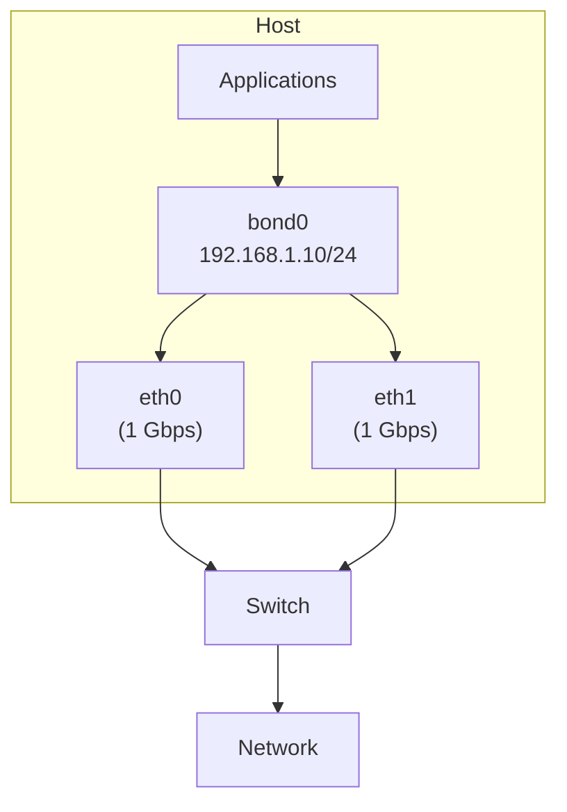
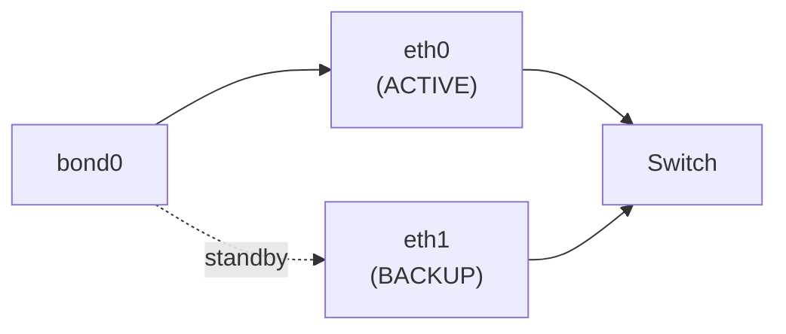
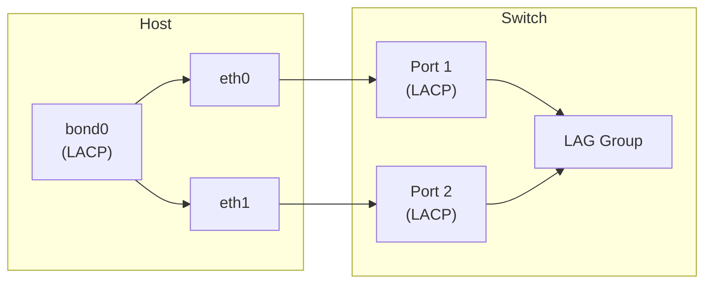
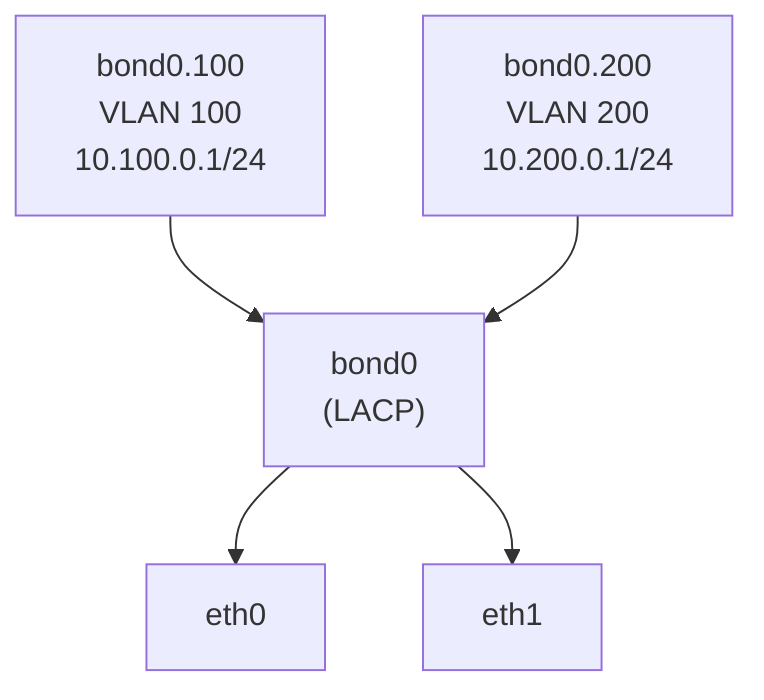

# Linux Bonding

> Combining multiple network interfaces into a single logical interface for redundancy and throughput

---

## 🎯 What is Bonding?

Linux **bonding** (also called NIC teaming or link aggregation) combines two or more physical NICs into a single virtual interface called a **bond**. This provides:

- **Redundancy** — if one link fails, traffic continues on the other(s)
- **Increased throughput** — aggregate bandwidth of multiple links
- **Load balancing** — distribute traffic across links



## 🔧 Bonding Modes

| Mode | Name | Description | Requires Switch Support |
|------|------|-------------|------------------------|
| 0 | balance-rr | Round-robin packet distribution | No (but may cause issues) |
| 1 | active-backup | Only one slave active, failover on failure | No |
| 2 | balance-xor | XOR hash on MAC addresses | No |
| 3 | broadcast | Transmit on all slaves | No |
| 4 | 802.3ad (LACP) | IEEE standard link aggregation | **Yes** |
| 5 | balance-tlb | Adaptive transmit load balancing | No |
| 6 | balance-alb | Adaptive load balancing (TX + RX) | No |

### Mode 0: balance-rr (Round-Robin)

```
Packet 1 → eth0
Packet 2 → eth1
Packet 3 → eth0
Packet 4 → eth1
...
```

- Packets go out alternating interfaces
- Can cause out-of-order delivery (bad for TCP)
- Simple but rarely used in production

### Mode 1: active-backup



- Only one NIC carries traffic at a time
- If active fails, backup takes over
- **Most common for simple redundancy**
- No switch configuration needed
- One MAC address visible to the switch

### Mode 2: balance-xor

```
Hash = (source MAC XOR dest MAC) % slave_count
```

- Deterministic: same src/dst pair always uses same link
- Good distribution if many peers
- Can use `xmit_hash_policy` to hash on L3/L4

### Mode 3: broadcast

- Every packet sent on ALL slave interfaces
- Use case: fault tolerance where every frame must arrive
- Doubles/triples bandwidth usage

### Mode 4: 802.3ad (LACP)



- Industry standard (IEEE 802.3ad / 802.1AX)
- **Requires switch to support and configure LACP**
- Negotiates link aggregation via LACPDU frames
- Best for production environments
- True aggregated bandwidth

**LACP parameters:**

| Parameter | Description | Values |
|-----------|-------------|--------|
| `lacp_rate` | LACPDU transmit rate | `slow` (30s) / `fast` (1s) |
| `ad_select` | Aggregator selection | `stable` / `bandwidth` / `count` |
| `xmit_hash_policy` | TX hashing algorithm | `layer2` / `layer2+3` / `layer3+4` |

### Mode 5: balance-tlb (Transmit Load Balancing)

- TX: distributed based on current load per slave
- RX: goes through the current primary slave
- No switch support needed
- Adapts dynamically as load changes

### Mode 6: balance-alb (Adaptive Load Balancing)

- Same as mode 5, plus RX load balancing
- Uses ARP negotiation to balance incoming traffic
- Intercepts ARP replies and rewrites MAC addresses
- **Best mode when no switch config is possible**

## 📦 Configuration

### Using `ip` and `modprobe`

```bash
# Load bonding module
sudo modprobe bonding

# Create bond interface
sudo ip link add bond0 type bond mode 802.3ad

# Set bonding options
sudo ip link set bond0 type bond miimon 100
sudo ip link set bond0 type bond lacp_rate fast
sudo ip link set bond0 type bond xmit_hash_policy layer3+4

# Add slaves
sudo ip link set eth0 down
sudo ip link set eth1 down
sudo ip link set eth0 master bond0
sudo ip link set eth1 master bond0

# Bring everything up
sudo ip link set bond0 up
sudo ip link set eth0 up
sudo ip link set eth1 up

# Assign IP
sudo ip addr add 192.168.1.10/24 dev bond0
sudo ip route add default via 192.168.1.1 dev bond0
```

### Using NetworkManager (nmcli)

```bash
# Create bond
nmcli connection add type bond con-name bond0 ifname bond0 \
    bond.options "mode=802.3ad,miimon=100,lacp_rate=fast,xmit_hash_policy=layer3+4"

# Add slaves
nmcli connection add type ethernet con-name bond0-eth0 ifname eth0 master bond0
nmcli connection add type ethernet con-name bond0-eth1 ifname eth1 master bond0

# Set IP
nmcli connection modify bond0 ipv4.addresses 192.168.1.10/24
nmcli connection modify bond0 ipv4.gateway 192.168.1.1
nmcli connection modify bond0 ipv4.method manual

# Activate
nmcli connection up bond0
```

### Persistent config (RHEL/CentOS - ifcfg)

```bash
# /etc/sysconfig/network-scripts/ifcfg-bond0
DEVICE=bond0
TYPE=Bond
BONDING_MASTER=yes
IPADDR=192.168.1.10
PREFIX=24
GATEWAY=192.168.1.1
ONBOOT=yes
BONDING_OPTS="mode=802.3ad miimon=100 lacp_rate=fast xmit_hash_policy=layer3+4"

# /etc/sysconfig/network-scripts/ifcfg-eth0
DEVICE=eth0
TYPE=Ethernet
ONBOOT=yes
MASTER=bond0
SLAVE=yes

# /etc/sysconfig/network-scripts/ifcfg-eth1
DEVICE=eth1
TYPE=Ethernet
ONBOOT=yes
MASTER=bond0
SLAVE=yes
```

### Persistent config (Netplan - Ubuntu)

```yaml
# /etc/netplan/01-bonding.yaml
network:
  version: 2
  ethernets:
    eth0: {}
    eth1: {}
  bonds:
    bond0:
      interfaces: [eth0, eth1]
      addresses: [192.168.1.10/24]
      routes:
        - to: default
          via: 192.168.1.1
      parameters:
        mode: 802.3ad
        mii-monitor-interval: 100
        lacp-rate: fast
        transmit-hash-policy: layer3+4
```

## 🔍 Monitoring and Troubleshooting

### Bond status

```bash
# Full bond status
cat /proc/net/bonding/bond0

# Output includes:
# - Bonding Mode
# - MII Status for each slave
# - Link Failure Count
# - LACP info (mode 4)
```

Example output:

```
Ethernet Channel Bonding Driver: v5.x

Bonding Mode: IEEE 802.3ad Dynamic link aggregation
Transmit Hash Policy: layer3+4 (1)
MII Status: up
MII Polling Interval (ms): 100
LACP active: on
LACP rate: fast

Slave Interface: eth0
MII Status: up
Speed: 10000 Mbps
Duplex: full
Link Failure Count: 0
802.3ad info
    LACP rate: fast
    Aggregator ID: 1

Slave Interface: eth1
MII Status: up
Speed: 10000 Mbps
Duplex: full
Link Failure Count: 0
802.3ad info
    LACP rate: fast
    Aggregator ID: 1
```

### Useful commands

```bash
# Quick status
ip link show bond0

# Check which slave is active (mode 1)
cat /sys/class/net/bond0/bonding/active_slave

# List slaves
cat /sys/class/net/bond0/bonding/slaves

# Check bonding mode
cat /sys/class/net/bond0/bonding/mode

# Force failover (mode 1)
echo eth1 > /sys/class/net/bond0/bonding/active_slave

# Remove a slave
echo -eth0 > /sys/class/net/bond0/bonding/slaves

# Add a slave back
echo +eth0 > /sys/class/net/bond0/bonding/slaves
```

### MII monitoring vs ARP monitoring

| Method | How it works | When to use |
|--------|-------------|-------------|
| `miimon` | Checks link layer status (up/down) | Default, works for most cases |
| `arp_interval` + `arp_ip_target` | Sends ARP probes to verify L3 reachability | When link stays up but path is broken |

```bash
# ARP monitoring (catches more failure scenarios)
sudo ip link set bond0 type bond arp_interval 200
sudo ip link set bond0 type bond arp_ip_target 192.168.1.1
```

## 🏗️ Bonding with VLANs

Bonding and VLANs work together naturally — create VLAN interfaces on top of the bond:

```bash
# Bond first, then VLANs on top
sudo ip link add link bond0 name bond0.100 type vlan id 100
sudo ip link add link bond0 name bond0.200 type vlan id 200
sudo ip addr add 10.100.0.1/24 dev bond0.100
sudo ip addr add 10.200.0.1/24 dev bond0.200
```



## ⚡ Hash Policy Deep Dive

For modes 2, 4, and 5, the `xmit_hash_policy` determines how traffic is distributed:

| Policy | Hash Input | Best For |
|--------|-----------|----------|
| `layer2` | src/dst MAC | Few peers, L2 only |
| `layer2+3` | src/dst MAC + src/dst IP | Mixed workloads |
| `layer3+4` | src/dst IP + src/dst port | Many connections to same peer |
| `encap2+3` | Inner src/dst MAC + IP (tunneled traffic) | VXLAN, GRE environments |
| `encap3+4` | Inner src/dst IP + port (tunneled traffic) | VXLAN, GRE environments |

**Important:** Both sides (host and switch) must use compatible hash policies, or traffic may be unevenly distributed.

## 🔗 Related Topics

- [VLANs](vlans.md) — Virtual LANs, trunking, access ports
- [Virtual Switches](../04-vm-networking/virtual-switches.md) — OVS bonding support
- [Overlay Networks](../03-container-networking/overlay-networks.md) — VXLAN over bonded links
