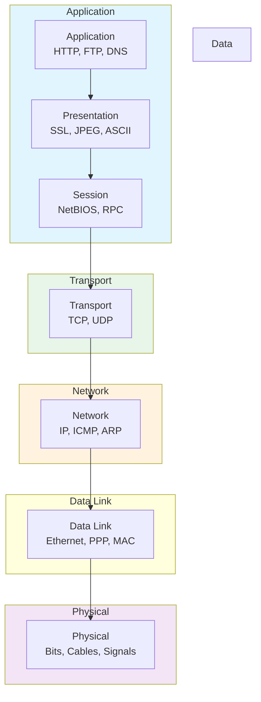

# OSI vs TCP/IP Model

> Understanding the layered architecture of network communications

---

## 🎯 Purpose

The OSI (Open Systems Interconnection) and TCP/IP models provide conceptual frameworks for understanding how network communication works. They divide complex networking functions into manageable layers, each with specific responsibilities.

## 📊 Comparison: OSI vs TCP/IP

| Layer | OSI Model | TCP/IP Model | Protocol Examples | Responsibility |
|-------|-----------|--------------|------------------|----------------|
| **7** | Application | Application | HTTP, HTTPS, FTP, SMTP, DNS, SSH | User interfaces, network services |
| **6** | Presentation | Application | SSL/TLS, JPEG, MPEG, ASCII | Data translation, encryption, compression |
| **5** | Session | Application | NetBIOS, RPC, SIP | Connection establishment, maintenance, termination |
| **4** | Transport | Transport | TCP, UDP, SCTP, DCCP | End-to-end communication, error recovery, flow control |
| **3** | Network | Internet | IP (IPv4/IPv6), ICMP, ARP, RIP, OSPF, BGP | Logical addressing, routing, packet forwarding |
| **2** | Data Link | Link | Ethernet, PPP, HDLC, VLAN, MAC | Physical addressing (MAC), error detection, framing |
| **1** | Physical | Link | Ethernet (physical), DSL, ISDN, Fiber | Raw bit transmission, physical connection |

## 🏗️ OSI Model: 7 Layers

### Layer 7: Application
- **Purpose**: Provides network services to end-user applications
- **Examples**: HTTP, FTP, SMTP, DNS, SSH
- **Data Unit**: Data

### Layer 6: Presentation
- **Purpose**: Translates data between application and network formats
- **Functions**: Encryption, compression, data conversion
- **Examples**: SSL/TLS, JPEG, MPEG, ASCII, Unicode

### Layer 5: Session
- **Purpose**: Manages connections between computers
- **Functions**: Establishes, manages, terminates sessions
- **Examples**: NetBIOS, RPC, SIP, PPTP

### Layer 4: Transport
- **Purpose**: Provides reliable or unreliable data transfer
- **Protocols**:
  - **TCP**: Connection-oriented, reliable, ordered delivery
  - **UDP**: Connectionless, unreliable, low overhead
- **Functions**: Segmentation, error recovery, flow control, multiplexing
- **Data Unit**: Segment (TCP) / Datagram (UDP)

### Layer 3: Network
- **Purpose**: Provides logical addressing and routing
- **Protocols**: IP (IPv4/IPv6), ICMP, IGMP, ARP, RARP
- **Functions**: Logical addressing, routing, packet forwarding
- **Data Unit**: Packet

### Layer 2: Data Link
- **Purpose**: Provides physical addressing and error detection
- **Sub-layers**:
  - **LLC**: Logical Link Control (802.2)
  - **MAC**: Media Access Control (802.3, 802.11)
- **Protocols**: Ethernet, PPP, HDLC, VLAN, MAC
- **Functions**: Framing, physical addressing (MAC), error detection
- **Data Unit**: Frame

### Layer 1: Physical
- **Purpose**: Transmits raw bits over physical medium
- **Standards**: Ethernet (physical layer), DSL, ISDN, Fiber, Wi-Fi (physical)
- **Functions**: Bit synchronization, modulation, transmission
- **Data Unit**: Bits

## 🌐 TCP/IP Model: 4 Layers

### Application Layer (Layers 5-7 combined)
- Combines OSI's Application, Presentation, and Session layers
- **Protocols**: HTTP, FTP, SMTP, DNS, SSH, Telnet
- **Data Unit**: Data / Message

### Transport Layer
- Same as OSI Layer 4
- **Protocols**: TCP, UDP
- **Data Unit**: Segment / Datagram

### Internet Layer
- Corresponds to OSI Layer 3 (Network)
- **Protocols**: IP, ICMP, ARP, RARP
- **Data Unit**: Packet

### Link Layer (Network Interface)
- Combines OSI's Data Link and Physical layers
- **Protocols**: Ethernet, PPP, HDLC
- **Data Unit**: Frame / Bits

## 🔄 Encapsulation & Decapsulation

### Encapsulation (Down the Stack)
```
Application Data
    ↓ (Application Header)
Message
    ↓ (Transport Header - Ports, Seq/Ack)
Segment
    ↓ (Network Header - IP Addresses)
Packet
    ↓ (Data Link Header - MAC Addresses, Trailer - FCS)
Frame
    ↓ (Physical Layer - Bits)
Bits on the Wire
```

### Decapsulation (Up the Stack)
Each layer removes its header and passes the rest up to the next layer.

## 🖼️ Layered Stack Diagram



## 📦 PDU (Protocol Data Unit) at Each Layer

| Layer | OSI Term | TCP/IP Term | Description |
|-------|----------|-------------|-------------|
| Application | Data | Message/Data | User data, application protocols |
| Transport | Segment | Segment/Datagram | Port numbers, sequence numbers |
| Network | Packet | Packet | Source/Destination IP addresses |
| Data Link | Frame | Frame | Source/Destination MAC addresses, FCS |
| Physical | Bits | Bits | Raw binary data on the wire |

## 🎯 Key Takeaways

1. **OSI Model**: 7 layers, theoretical, used for teaching
2. **TCP/IP Model**: 4 layers, practical, used in real networks
3. **Both use encapsulation** to add headers at each layer
4. **TCP/IP is the actual implementation** used on the Internet
5. **Layering enables modularity** - each layer can evolve independently

## 🔗 Further Reading

- [RFC 1122: Requirements for Internet Hosts](https://tools.ietf.org/html/rfc1122)
- [RFC 793: TCP Specification](https://tools.ietf.org/html/rfc793)
- [RFC 768: UDP Specification](https://tools.ietf.org/html/rfc768)
- [RFC 791: IP Specification](https://tools.ietf.org/html/rfc791)
- [OSI Model Wikipedia](https://en.wikipedia.org/wiki/OSI_model)
- [TCP/IP Model Wikipedia](https://en.wikipedia.org/wiki/Internet_protocol_suite)
