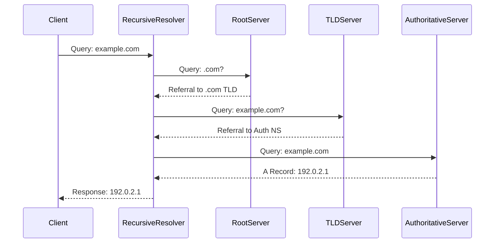
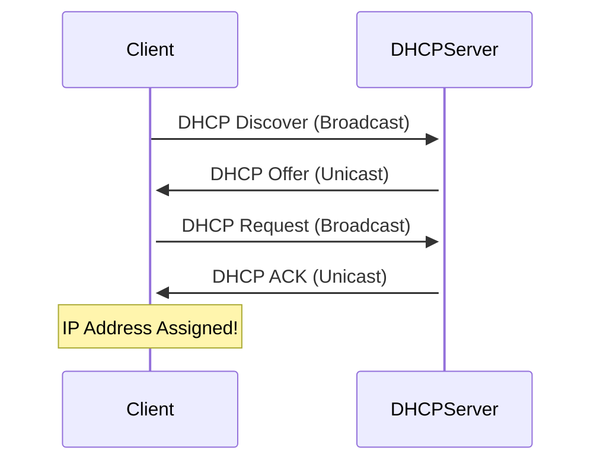

# Network Protocols

> Essential protocols that power the Internet and local networks

---

## 🎯 Purpose

Network protocols are standardized rules and conventions that enable devices to communicate across networks. This guide covers the most important protocols at each layer of the networking stack.

## 🌐 Application Layer Protocols

### HTTP/HTTPS (Hypertext Transfer Protocol)

| Feature | HTTP | HTTPS |
|---------|------|-------|
| Port | 80 | 443 |
| Security | None | TLS/SSL |
| Use | Web browsing | Secure web browsing |

**HTTP Request Methods:**
- `GET`: Retrieve data
- `POST`: Send data
- `PUT`: Update/replace data
- `DELETE`: Remove data
- `PATCH`: Partial update
- `HEAD`: Get headers only
- `OPTIONS`: Get supported methods

**HTTP/1.1 vs HTTP/2 vs HTTP/3:**

| Version | Year | Key Features |
|---------|------|--------------|
| HTTP/1.1 | 1997 | Persistent connections, chunked transfer |
| HTTP/2 | 2015 | Multiplexing, header compression, binary protocol |
| HTTP/3 | 2022 | QUIC transport (UDP), built-in encryption |

### DNS (Domain Name System)

**Purpose**: Translates domain names to IP addresses

**Port**: 53 (TCP for zone transfers, UDP for queries)

**Record Types:**

| Type | Name | Purpose | Example |
|------|------|---------|---------|
| A | Address | IPv4 address | `example.com → 192.0.2.1` |
| AAAA | IPv6 Address | IPv6 address | `example.com → 2001:db8::1` |
| CNAME | Canonical Name | Alias | `www → example.com` |
| MX | Mail Exchange | Email server | `example.com → mail.example.com` |
| NS | Name Server | Authoritative DNS server | `example.com → ns1.example.com` |
| TXT | Text | Arbitrary text | `example.com → "v=spf1 ..."` |
| SOA | Start of Authority | Zone info | Administrative data |
| PTR | Pointer | Reverse lookup | `192.0.2.1 → example.com` |
| SRV | Service | Service discovery | `_sip._tcp.example.com` |

**DNS Query Process:**
```
1. Local cache check
2. Recursive resolver (ISP's DNS server)
3. Root name servers (.)
4. TLD name servers (.com, .net, .org)
5. Authoritative name servers (example.com)
6. Response returned to client
```



### DHCP (Dynamic Host Configuration Protocol)

**Purpose**: Automatically assigns IP addresses and network configuration

**Port**: 67 (server), 68 (client) - UDP

**DHCP Message Types (DORA Process):**
```
1. Discover: Client broadcasts to find DHCP server
2. Offer: Server responds with available IP
3. Request: Client requests offered IP
4. Acknowledge: Server confirms and finalizes lease
```



**DHCP Options:**

| Option | Description | Example |
|--------|-------------|---------|
| 1 | Subnet Mask | 255.255.255.0 |
| 3 | Router/Gateway | 192.168.1.1 |
| 6 | DNS Servers | 8.8.8.8, 8.8.4.4 |
| 12 | Hostname | my-pc |
| 15 | Domain Name | example.com |
| 51 | Lease Time | 86400 (24 hours) |
| 53 | Message Type | Discover/Offer/Request/ACK |

### SMTP, POP3, IMAP (Email Protocols)

| Protocol | Port | Purpose | Transport |
|----------|------|---------|-----------|
| SMTP | 25/587/465 | Send email | TCP |
| POP3 | 110/995 | Retrieve email (download) | TCP |
| IMAP | 143/993 | Retrieve email (sync) | TCP |

### FTP/SFTP (File Transfer)

| Protocol | Port | Security | Description |
|----------|------|----------|-------------|
| FTP | 20 (data), 21 (control) | None | Traditional file transfer |
| SFTP | 22 | SSH | Secure file transfer over SSH |
| FTPS | 990 | TLS/SSL | FTP with SSL/TLS |

## 🚀 Transport Layer Protocols

### TCP (Transmission Control Protocol)

**Port**: Dynamic (source), well-known (destination)

**Features:**
- Connection-oriented (3-way handshake)
- Reliable delivery (acknowledgments, retransmissions)
- Ordered delivery (sequence numbers)
- Flow control (window size)
- Congestion control (slow start, congestion avoidance)

**TCP Header (20-60 bytes):**
```
 0                   15 16                              31
 +-------------------+---+---------------+----------------+
 |     Source Port   |   |  Destination   |                |
 +-------------------+   |     Port      |                |
 |                   |   +---------------+                |
 |     Sequence      |                                   |
 +-------------------+                                   |
 |     Number        |                                   |
 +-------------------+-------------------+---------------+
 |    Acknowledgment |                                   |
 +-------------------+   Number          |               |
 |                   |                   |               |
 +-------------------+-------------------+---+-----------+
 |   Data  |Reserved|   |    Window     |               |
 |  Offset|         |   |      Size     |               |
 +-------------------+-------------------+---+-----------+
 |    Checksum       |       Urgent Pointer             |
 +-------------------+-----------------------------------+
 |     Options (if any)                               |
 +---------------------------------------------------+
```

**3-Way Handshake:**
```
Client                          Server
  SYN (Seq=X)  -------------------->
                SYN-ACK (Seq=Y, Ack=X+1) <--------
  ACK (Ack=Y+1)  -------------------->
```

**Connection Termination (4-way):**
```
Client                          Server
  FIN (Seq=X)  -------------------->
                ACK (Ack=X+1) <----------------------
                FIN (Seq=Y)  -------------------->
  ACK (Ack=Y+1)  -------------------->
```

### UDP (User Datagram Protocol)

**Port**: Dynamic (source), well-known (destination)

**Features:**
- Connectionless
- Unreliable (no acknowledgments)
- No ordering
- Low overhead (8-byte header)
- Fast

**UDP Header (8 bytes):**
```
 0      7 8     15 16    23 24    31
 +--------+--------+--------+--------+
 |     Source Port    |   Destination Port   |
 +--------+--------+--------+--------+
 |     Length         |    Checksum          |
 +--------+--------+--------+--------+
```

**Use Cases:**
- DNS queries
- VoIP (voice/video calls)
- Online gaming
- DHCP
- SNMP
- QUIC (HTTP/3)

## 🌍 Network Layer Protocols

### IP (Internet Protocol)

**Versions**: IPv4 (32-bit), IPv6 (128-bit)

**IPv4 Header (20-60 bytes, typically 20):**
```
 0                   15 16                              31
 +-------------------+---+---------------+----------------+
 |     Version       | IHL|   Type of     |    Total       |
 |       4          |   |   Service     |     Length     |
 +-------------------+---+---------------+----------------+
 |       Identification      | Flags |    Fragment Offset|
 +-----------------------------------+---+----------------+
 |    Time to Live   |    Protocol     |  Header Checksum |
 +-------------------+-----------------+----------------+
 |         Source IP Address                          |
 +---------------------------------------------------+
 |       Destination IP Address                       |
 +---------------------------------------------------+
 |     Options (if IHL > 5)           |   Padding    |
 +---------------------------------------------------+
```

**IPv4 vs IPv6:**

| Feature | IPv4 | IPv6 |
|---------|------|------|
| Address Size | 32 bits | 128 bits |
| Address Format | Dotted decimal | Hexadecimal colon-separated |
| Header Size | 20-60 bytes | 40 bytes (fixed) |
| Fragmentation | Router & sender | Sender only |
| Broadcast | Supported | Not supported (use multicast) |
| ARP | Required | Not needed (NDP) |

### ICMP (Internet Control Message Protocol)

**Purpose**: Diagnostic and control messages

**Types:**

| Type | Code | Description |
|------|------|-------------|
| 0 | 0 | Echo Reply (ping response) |
| 3 | 0-15 | Destination Unreachable |
| 4 | 0 | Source Quench |
| 5 | 0-3 | Redirect |
| 8 | 0 | Echo Request (ping) |
| 11 | 0-1 | Time Exceeded (TTL expired) |

**Common Commands:**
```bash
# Ping a host
ping example.com

# Trace route (Windows)
tracert example.com

# Trace route (Linux/Mac)
traceroute example.com
```

### ARP (Address Resolution Protocol)

**Purpose**: Maps IP addresses to MAC addresses

**Process:**
1. Host checks ARP cache
2. If not found, broadcasts ARP request: "Who has IP X? Tell Y"
3. Target responds with ARP reply: "I am X, my MAC is Z"
4. Requester updates ARP cache

```bash
# View ARP cache
arp -a  # Windows
arp -n  # Linux/Mac
```

## 🔗 Data Link Layer Protocols

### Ethernet (IEEE 802.3)

**MAC Address**: 48-bit (6 bytes) unique identifier
- Format: `XX:XX:XX:XX:XX:XX` or `XX-XX-XX-XX-XX-XX`
- OUI (first 3 bytes): Manufacturer identifier
- NIC (last 3 bytes): Device identifier

**Ethernet Frame:**
```
+----------------+----------------+------------+----------------+---------+------------+
| Preamble (7B)  | SFD (1B)       | Dest MAC   | Source MAC    | Type/   | Data (46-   |
|                |                | (6B)       | (6B)          | Length | 1500B)     |
+----------------+----------------+------------+----------------+---------+------------+
| (Sync)         | (Start Frame)  |            |                | (2B)    |            |
+----------------+----------------+------------+----------------+---------+------------+
| FCS (4B - Frame Check Sequence)                     |
+---------------------------------------------------+
```

**Ethernet Types:**

| Type (hex) | Protocol |
|------------|----------|
| 0x0800 | IPv4 |
| 0x86DD | IPv6 |
| 0x0806 | ARP |
| 0x8035 | RARP |
| 0x8100 | VLAN Tagging (802.1Q) |

### VLAN (Virtual LAN - IEEE 802.1Q)

**Purpose**: Create logical network segments on a single physical network

**VLAN Tag (4 bytes inserted after Source MAC):**
```
+--------+--------+----+--------+--------+
| TPID   | Priority| CFI| VLAN ID| Type   |
| (2B)   | (3 bits)|(1b)|(12 bits)| (2B)   |
+--------+--------+----+--------+--------+
```

## 🔍 Protocol Summary Table

| Layer | Protocol | Port | Transport | Purpose |
|-------|----------|------|-----------|---------|
| Application | HTTP | 80 | TCP | Web browsing |
| Application | HTTPS | 443 | TCP | Secure web |
| Application | DNS | 53 | UDP/TCP | Name resolution |
| Application | DHCP | 67/68 | UDP | IP assignment |
| Application | SMTP | 25/587 | TCP | Email sending |
| Application | POP3 | 110/995 | TCP | Email retrieval |
| Application | IMAP | 143/993 | TCP | Email sync |
| Application | FTP | 20/21 | TCP | File transfer |
| Application | SFTP | 22 | TCP | Secure file transfer |
| Transport | TCP | - | - | Reliable transport |
| Transport | UDP | - | - | Fast transport |
| Network | IP | - | - | Addressing & routing |
| Network | ICMP | - | - | Diagnostic messages |
| Network | ARP | - | - | IP to MAC mapping |
| Data Link | Ethernet | - | - | Local network framing |
| Data Link | VLAN | - | - | Virtual LANs |

## 🎯 Key Takeaways

1. **HTTP/HTTPS** power the web (port 80/443)
2. **DNS** translates names to IPs (port 53)
3. **DHCP** auto-configures network settings (ports 67/68)
4. **TCP** = reliable, connection-oriented (handshakes, acknowledgments)
5. **UDP** = fast, connectionless (no handshakes)
6. **IP** = addressing and routing (best effort delivery)
7. **ARP** = finds MAC addresses for IPs
8. **Ethernet** = local network communication (MAC addresses)

## 🔗 Further Reading

- [IANA Protocol Numbers](https://www.iana.org/assignments/protocol-numbers/protocol-numbers.xhtml)
- [IANA Port Numbers](https://www.iana.org/assignments/service-names-port-numbers/service-names-port-numbers.xhtml)
- [RFC 793: TCP](https://tools.ietf.org/html/rfc793)
- [RFC 768: UDP](https://tools.ietf.org/html/rfc768)
- [RFC 791: IP](https://tools.ietf.org/html/rfc791)
- [RFC 1034/1035: DNS](https://tools.ietf.org/html/rfc1034)
- [RFC 2131: DHCP](https://tools.ietf.org/html/rfc2131)
