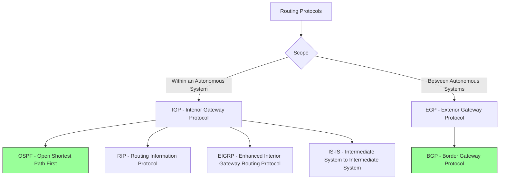
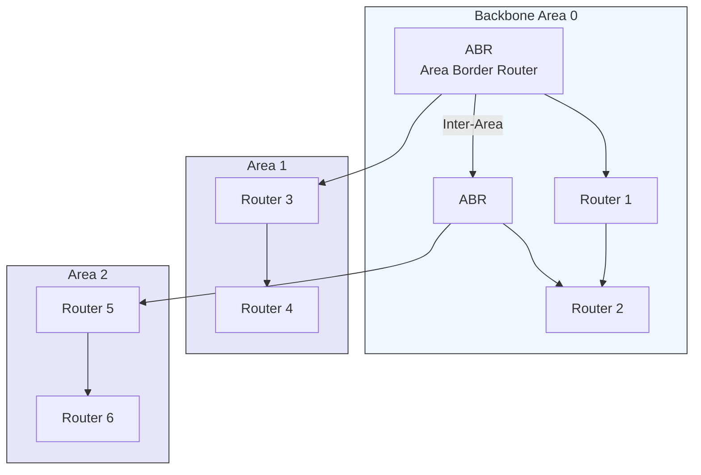
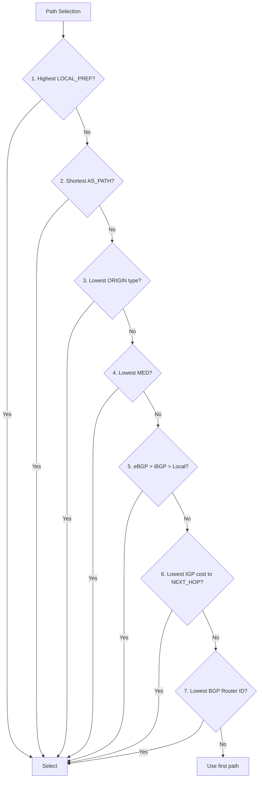
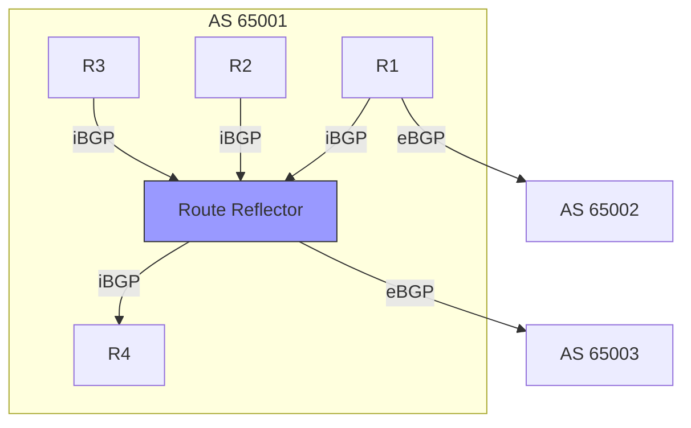
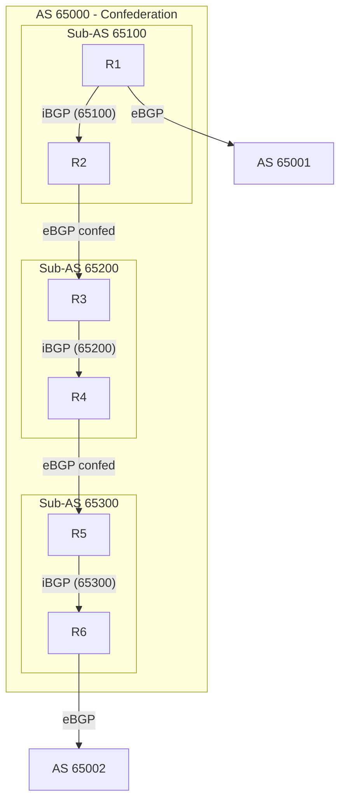
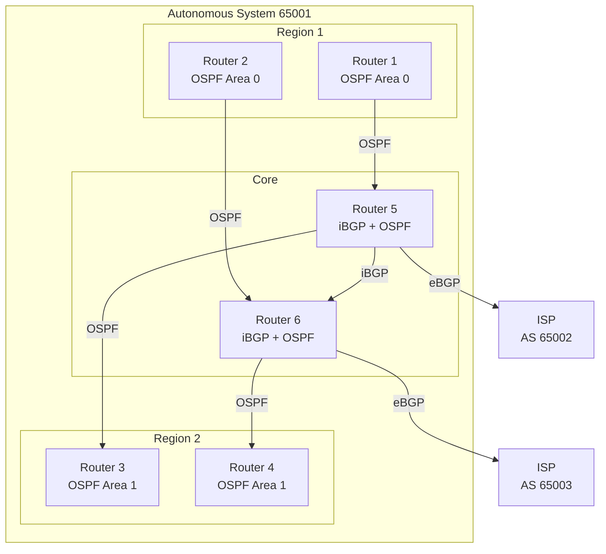

# Routing Protocols: OSPF & BGP

> **Purpose**: Understand how OSPF (interior gateway protocol) and BGP (exterior gateway protocol) enable IP packet routing across networks, from local area networks to the global Internet.

---

## 📋 Overview

**Routing protocols** are the backbone of IP networking, determining the best path for packets to travel from source to destination. They exchange routing information between routers, allowing the network to dynamically adapt to topology changes, failures, and new connections.

### Routing Protocol Classification



### Key Concepts

| Concept | Description |
|---------|-------------|
| **Autonomous System (AS)** | A network or collection of networks under a single administrative domain (e.g., an ISP, a corporation) |
| **AS Number (ASN)** | A unique identifier for an AS (16-bit: 1-65535, 32-bit: 1-4294967295) |
| **Routing Table** | Database of routes (destination + next hop + metric) |
| **Forwarding Table** | Optimized subset of routing table used for packet forwarding |
| **Metric** | Cost associated with a route (lower = better) |
| **Convergence** | Time for all routers to agree on the network topology |
| **Hello Protocol** | Mechanism for neighbors to discover and maintain adjacencies |
| **Link-State** | Routers share full topology information (OSPF, IS-IS) |
| **Distance-Vector** | Routers share only their view of the network (RIP, BGP) |
| **Path-Vector** | Enhanced distance-vector with full path information (BGP) |

### IGP vs EGP Comparison

| Feature | IGP (OSPF, RIP, EIGRP) | EGP (BGP) |
|---------|------------------------|-----------|
| **Scope** | Within a single AS | Between ASes |
| **Purpose** | Find best path within AS | Connect different ASes |
| **Algorithm** | Link-state or Distance-vector | Path-vector |
| **Convergence** | Seconds to minutes | Minutes |
| **Scale** | Hundreds to thousands of routers | Internet-scale (millions) |
| **Routing Updates** | Periodic or triggered | Incremental |
| **Metric** | Cost, hop count, bandwidth | Path attributes (not just metric) |
| **Complexity** | Medium | High |

---

## 🎯 OSPF (Open Shortest Path First)

**OSPF** (RFC 2328, RFC 5340 for OSPFv3) is a **link-state** Interior Gateway Protocol that uses Dijkstra's algorithm to calculate the shortest path tree for IP routing.

### OSPF Characteristics

| Feature | Description |
|---------|-------------|
| **Protocol** | IGP (Interior Gateway Protocol) |
| **Algorithm** | Dijkstra's Shortest Path First (SPF) |
| **Transport** | IP protocol 89 (direct IP encapsulation) |
| **Metric** | Cost (based on link bandwidth) |
| **Convergence** | Seconds to minutes |
| **Hierarchy** | Area-based (backbone + regular areas) |
| **Authentication** | Plain text, MD5, SHA (OSPFv3 uses IPsec) |
| **Version** | OSPFv2 (IPv4), OSPFv3 (IPv6) |

### OSPF Areas

**Areas** are logical groupings of routers that share the same link-state database, reducing routing table size and update traffic.



**Area Types**:

| Type | Description | Use Case |
|------|-------------|----------|
| **Backbone (Area 0)** | Required, connects all other areas | Core of OSPF network |
| **Standard** | Regular area, summarizes routes to backbone | Branch offices, departments |
| **Stub** | No external routes, default route from ABR | Small networks with one exit |
| **Totally Stubby** | No external routes, no summary routes | Very small networks |
| **NSSA** | Can import external routes, but doesn't advertise them | Merging with non-OSPF networks |
| **Totally NSSA** | NSSA + Totally Stubby characteristics | Very small NSSA |

**Area Border Router (ABR)**:
- Connects two or more areas
- Maintains separate link-state databases for each area
- Summarizes routes between areas
- Injects default route into stub areas

**Autonomous System Boundary Router (ASBR)**:
- Connects OSPF to external networks (other ASes or non-OSPF)
- Injects external routes into OSPF
- Uses external route type 1 or 2

### OSPF Packet Types

| Type | Name | Purpose | Description |
|------|------|---------|-------------|
| 1 | Hello | Neighbor Discovery | Establish and maintain adjacencies |
| 2 | Database Description (DBD) | Database Exchange | Summarize link-state database |
| 3 | Link-State Request (LSR) | Database Request | Request specific link-state records |
| 4 | Link-State Update (LSU) | Database Update | Contain actual link-state advertisements |
| 5 | Link-State Acknowledgment (LSAck) | Reliable Delivery | Acknowledge receipt of LSUs |

### Link-State Advertisements (LSAs)

LSAs are the building blocks of OSPF's link-state database. Each LSA describes a part of the network topology.

| LSA Type | Name | Description | Flooding Scope |
|----------|------|-------------|----------------|
| 1 | Router LSA | Advertises router's directly connected links | Area |
| 2 | Network LSA | Advertises multi-access networks (Ethernet) | Area |
| 3 | Summary LSA (Type 3) | Advertises inter-area routes | Area |
| 4 | Summary ASBR LSA (Type 4) | Advertises ASBR location | Area |
| 5 | External LSA (Type 5) | Advertises routes from outside OSPF | AS (except stub areas) |
| 7 | NSSA External LSA (Type 7) | External routes in NSSA | NSSA area |

**LSA Type 1 (Router LSA)**:
```
+----------------+----------------+----------------+
| LS Age         | Options       | LS Type        |
+----------------+----------------+----------------+
| Link State ID  | Advertising Router |
+----------------+----------------+----------------+
| LS Sequence Number | LS Checksum  | Length        |
+----------------+----------------+----------------+
| Number of Links | Link 1 Type | Link 1 ID    | Link 1 Data |
|                | Link 2 Type | Link 2 ID    | Link 2 Data |
|                | ...         | ...          | ...       |
+----------------+----------------+----------------+
```

**Link Types in Router LSA**:
- **Type 1**: Point-to-point connection to another router
- **Type 2**: Connection to a transit network
- **Type 3**: Connection to a stub network
- **Type 4**: Virtual link

### OSPF Neighbor States

Routers form **adjacencies** through a series of states:

```mermaid
stateDiagram-v2
    [*] --> Down: No Hellos received
    Down --> Attempt: Hello received, but bidirectional not established
    Attempt --> Init: Bidirectional communication established
    Init --> 2-Way: Router sees itself in neighbor's Hello
    
    2-Way --> ExStart: Master/Slave negotiation
    ExStart --> Exchange: DBD packets exchanged
    Exchange --> Loading: LSR/LSU packets exchanged
    Loading --> Full: All LSAs exchanged and synchronized
    
    Full --> 2-Way: Adjacency lost
    
    state Full {
        [*] --> Adjacency Established
    }
```

**Designated Router (DR) & Backup Designated Router (BDR)**:
- On multi-access networks (Ethernet), one router is elected as DR, another as BDR
- All other routers form adjacencies only with DR and BDR
- Reduces LSA flooding on multi-access networks
- DR election based on router priority (highest wins), then router ID

### OSPF Network Types

| Network Type | Description | DR/BDR | Hello Interval | Dead Interval |
|--------------|-------------|-------|----------------|---------------|
| **Broadcast** | Ethernet, multi-access | Yes | 10s | 40s |
| **Point-to-Point** | Serial links, direct connections | No | 10s | 40s |
| **Non-Broadcast** | Frame Relay, ATM, X.25 | Yes | 30s | 120s |
| **Point-to-Multipoint** | Hub-and-spoke, NBMA | No | 30s | 120s |

### OSPF Metric Calculation

**Cost = Reference Bandwidth / Interface Bandwidth**

```
Default Reference Bandwidth = 100 Mbps

Examples:
- 100 Mbps Ethernet: Cost = 100 / 100 = 1
- 1 Gbps Ethernet: Cost = 100 / 1000 = 0.1 (rounded to 1)
- 10 Gbps Ethernet: Cost = 100 / 10000 = 0.01 (rounded to 1)
- T1 (1.544 Mbps): Cost = 100 / 1.544 ≈ 65
```

**Custom Reference Bandwidth**:
```
Reference Bandwidth = 10 Gbps
- 100 Mbps: Cost = 10000 / 100 = 100
- 1 Gbps: Cost = 10000 / 1000 = 10
- 10 Gbps: Cost = 10000 / 10000 = 1
```

### OSPF Configuration Examples

**Cisco IOS**:
```bash
# Enable OSPF
router ospf 1

# Configure network participation
 network 10.0.0.0 0.255.255.255 area 0
 network 192.168.1.0 0.0.0.255 area 1

# Configure router ID
 router-id 1.1.1.1

# Configure reference bandwidth
 auto-cost reference-bandwidth 10000

# Configure area authentication
 area 0 authentication message-digest
 area 1 authentication

# Configure interface settings
 interface GigabitEthernet0/0
  ip ospf hello-interval 5
  ip ospf dead-interval 20
  ip ospf priority 100
  ip ospf cost 10
```

**Juniper JunOS**:
```bash
# Configure OSPF
protocols {
    ospf {
        area 0.0.0.0 {
            interface ge-0/0/0.0;
            interface lo0.0 {
                passive;
            }
        }
        area 0.0.0.1 {
            interface ge-0/0/1.0;
        }
        reference-bandwidth 10g;
        router-id 1.1.1.1;
    }
}
```

**Linux (FRR)**:
```bash
# Install FRR
sudo apt install frr

# Configure OSPF
vtysh
 configure terminal
  router ospf
   router-id 1.1.1.1
   network 10.0.0.0/8 area 0
   network 192.168.1.0/24 area 1
   auto-cost reference-bandwidth 10000
   area 0 authentication message-digest
  exit
  exit
 write
```

### OSPFv3 (IPv6)

**OSPFv3** (RFC 5340) extends OSPFv2 for IPv6:

| Feature | OSPFv2 | OSPFv3 |
|---------|--------|--------|
| **IP Version** | IPv4 | IPv6 |
| **LSA Types** | 1-5, 7 | 1-5, 7-11 |
| **Authentication** | In protocol | Uses IPsec |
| **Address Semantics** | IPv4 addresses | IPv6 addresses |
| **Link-Local Addresses** | Not used | Used for neighbor discovery |

**OSPFv3 Configuration (Linux FRR)**:
```bash
vtysh
 configure terminal
  ipv6 router ospf6
   router-id 1.1.1.1
   interface eth0 area 0.0.0.0
   interface eth1 area 0.0.0.1
  exit
  exit
 write
```

---

## 🌐 BGP (Border Gateway Protocol)

**BGP** (RFC 4271) is the **path-vector** protocol that makes the Internet work. It's the only EGP (Exterior Gateway Protocol) in wide use today, connecting different Autonomous Systems (ASes).

### BGP Characteristics

| Feature | Description |
|---------|-------------|
| **Protocol** | EGP (Exterior Gateway Protocol) |
| **Algorithm** | Path-vector (enhanced distance-vector) |
| **Transport** | TCP port 179 |
| **Metric** | Path attributes (not a single metric) |
| **Convergence** | Minutes |
| **Scope** | Internet-scale (between ASes) |
| **Version** | BGP-4 (RFC 4271) |
| **Message Types** | OPEN, UPDATE, NOTIFICATION, KEEPALIVE |

### BGP Terminology

| Term | Description |
|------|-------------|
| **Autonomous System (AS)** | Network under single administration |
| **AS Number (ASN)** | Unique identifier for an AS (16-bit or 32-bit) |
| **BGP Speaker** | Router running BGP |
| **BGP Session** | TCP connection between BGP speakers |
| **Peer/Neighbor** | BGP speaker with established session |
| **eBGP** | External BGP (between different ASes) |
| **iBGP** | Internal BGP (within same AS) |
| **Route Reflector** | Router that reflects BGP routes to other iBGP peers |
| **Confederation** | Group of ASes appearing as one AS to external peers |
| **Prefix** | Network address (IPv4 or IPv6) being advertised |
| **Path Attributes** | Properties of a route (AS_PATH, NEXT_HOP, etc.) |

### AS Number Ranges

| Range | Description | Use |
|-------|-------------|-----|
| 0 | Reserved | Not used |
| 1-64495 | Public 16-bit ASNs | Historical |
| 64496-64511 | Reserved | Documentation (RFC 5398) |
| 64512-65534 | Private 16-bit ASNs | Internal use (RFC 6996) |
| 65535 | Reserved | Not used |
| 65536-4200000000 | Public 32-bit ASNs | Modern (RFC 4893) |
| 4200000001-4294967294 | Private 32-bit ASNs | Internal use (RFC 6996) |
| 4294967295 | Reserved | Not used |

### BGP Message Types

| Type | Name | Purpose | Description |
|------|------|---------|-------------|
| 1 | OPEN | Session Establishment | Negotiate BGP session parameters |
| 2 | UPDATE | Route Advertisement | Advertise/withdraw routes |
| 3 | NOTIFICATION | Error Notification | Report errors and close session |
| 4 | KEEPALIVE | Session Maintenance | Keep session alive |
| 5 | ROUTE-REFRESH | Route Refresh | Request re-advertisement of routes |

**OPEN Message**:
```
+----------------+----------------+----------------+
| Marker (16)    | Length (2)     | Type (1)       |
+----------------+----------------+----------------+
| Version (1)    | My AS (2)      | Hold Time (2)  |
+----------------+----------------+----------------+
| BGP Identifier (4) | Optional Parameters Length (1) |
+----------------+----------------+----------------+
| Optional Parameters (variable) |
+----------------+----------------+----------------+
```

**UPDATE Message**:
```
+----------------+----------------+----------------+
| Marker (16)    | Length (2)     | Type (2)       |
+----------------+----------------+----------------+
| Withdrawn Routes Length (2) | Withdrawn Routes (variable) |
+----------------+----------------+----------------+
| Total Path Attribute Length (2) | Path Attributes (variable) |
+----------------+----------------+----------------+
| Network Layer Reachability Information (variable) |
+----------------+----------------+----------------+
```

### BGP Path Attributes

Path attributes are the key to BGP's path selection process. They're categorized as:

| Category | Attribute | Mandatory | Transitive | Description |
|----------|-----------|-----------|------------|-------------|
| **Well-known Mandatory** | ORIGIN | Yes | Yes | Origin of the route (IGP, EGP, INCOMPLETE) |
| **Well-known Mandatory** | AS_PATH | Yes | Yes | List of ASes the route has traversed |
| **Well-known Mandatory** | NEXT_HOP | Yes | Yes | Next hop to reach the destination |
| **Well-known Discretionary** | LOCAL_PREF | No | No | Local preference within an AS |
| **Well-known Discretionary** | ATOMIC_AGGREGATE | No | Yes | Route was aggregated |
| **Optional Transitive** | AGGREGATOR | No | Yes | Router that performed aggregation |
| **Optional Transitive** | COMMUNITIES | No | Yes | Route grouping for policy |
| **Optional Non-transitive** | MULTI_EXIT_DISC | No | No | Preference for multiple exit points |
| **Optional Non-transitive** | ORIGINATOR_ID | No | No | Route Reflector originator |
| **Optional Non-transitive** | CLUSTER_LIST | No | No | Route Reflector cluster path |

### BGP Path Selection Algorithm

BGP uses a **deterministic** path selection algorithm. The router evaluates paths in this order:



**ORIGIN Types (preferred to least preferred)**:
1. **IGP** - Route originated from IGP (OSPF, IS-IS, etc.) within the AS
2. **EGP** - Route originated from EGP (historical, rarely used)
3. **INCOMPLETE** - Route originated from another protocol (static, connected, etc.)

### eBGP vs iBGP

| Feature | eBGP | iBGP |
|---------|------|------|
| **Scope** | Between different ASes | Within same AS |
| **Next Hop** | Changed to peer's IP | Preserved from eBGP peer |
| **TTL** | 1 (directly connected) | 255 (can be multi-hop) |
| **Full Mesh** | Not required | Required (or use route reflectors) |
| **Route Reflectors** | Not used | Used to reduce peering |
| **Policy Control** | Yes | Yes |

**iBGP Full Mesh Requirement**:
- All iBGP routers must be fully meshed
- OR use **Route Reflectors** to reduce peering requirements
- Each router receives all external routes from all other iBGP routers



### BGP Route Reflectors

**Route Reflectors (RR)** break the iBGP full mesh requirement:

| Role | Description |
|------|-------------|
| **Route Reflector** | Receives routes from clients, reflects to all clients and non-clients |
| **Client** | Sends routes to RR, receives routes from RR |
| **Non-Client** | Sends routes to RR, receives routes from RR, maintains full mesh with other non-clients |

**Route Reflector Configuration (Cisco)**:
```bash
router bgp 65001
 neighbor 192.168.1.1 remote-as 65001
 neighbor 192.168.1.1 update-source Loopback0
 neighbor 192.168.1.2 remote-as 65001
 neighbor 192.168.1.2 update-source Loopback0
 neighbor 192.168.1.3 remote-as 65001
 neighbor 192.168.1.3 update-source Loopback0
 
 ! Configure as Route Reflector
 neighbor 192.168.1.2 route-reflector-client
 neighbor 192.168.1.3 route-reflector-client
```

### BGP Confederations

**Confederations** allow splitting an AS into sub-ASes to reduce iBGP peering:



**Confederation Configuration (Cisco)**:
```bash
router bgp 65000
 bgp confederation identifier 65000
 bgp confederation peers 65100 65200 65300
 
 neighbor 192.168.1.1 remote-as 65100
 neighbor 192.168.1.2 remote-as 65200
 neighbor 192.168.1.3 remote-as 65300
```

### BGP Communities

**Communities** (RFC 1997) are tags applied to routes for policy-based routing and filtering.

**Well-known Communities**:
- `NO_EXPORT` - Don't advertise to external peers
- `NO_ADVERTISE` - Don't advertise to any peer
- `NO_EXPORT_SUBCONFED` - Don't advertise outside sub-confederation

**Extended Communities** (RFC 4360):
- `target:AS:value` - Used for VPNs (e.g., VRF route import/export)
- `origin:AS:value` - Route origin
- `site-of-origin:AS:value` - Route source

**Community Configuration (Cisco)**:
```bash
! Set community on route
route-map SET_COMMUNITY permit 10
 set community 65001:100 additive

! Match community in route-map
route-map FILTER_COMMUNITY permit 10
 match community 65001:100

! Apply to neighbor
neighbor 192.168.1.1 send-community both
neighbor 192.168.1.1 route-map SET_COMMUNITY out
```

### BGP Configuration Examples

**Cisco IOS**:
```bash
router bgp 65001
 bgp router-id 1.1.1.1
 bgp log-neighbor-changes
 
 ! eBGP neighbor
 neighbor 203.0.113.1 remote-as 65002
 neighbor 203.0.113.1 ebgp-multihop 2
 neighbor 203.0.113.1 update-source Loopback0
 neighbor 203.0.113.1 password mypassword
 
 ! iBGP neighbor
 neighbor 192.168.1.1 remote-as 65001
 neighbor 192.168.1.1 update-source Loopback0
 
 ! Advertise networks
 network 10.0.0.0 mask 255.255.0.0
 network 192.168.0.0 mask 255.255.0.0
 
 ! Aggregate routes
 aggregate-address 10.0.0.0 255.0.0.0 summary-only
 
 ! Route filtering
 neighbor 203.0.113.1 route-map OUTBOUND out
 neighbor 192.168.1.1 route-map INBOUND in
 
 ! Timers
 neighbor 203.0.113.1 timers 30 90
```

**Juniper JunOS**:
```bash
protocols {
    bgp {
        group ebgp-peers {
            type external;
            peer-as 65002;
            neighbor 203.0.113.1 {
                local-address 1.1.1.1;
                auth-key "mypassword";
                hold-time 90;
            }
        }
        group ibgp-peers {
            type internal;
            local-address 1.1.1.1;
            neighbor 192.168.1.1;
            neighbor 192.168.1.2;
        }
    }
}

policy-options {
    policy-statement OUTBOUND {
        term 1 {
            from protocol direct;
            then accept;
        }
    }
}
```

**Linux (FRR)**:
```bash
vtysh
 configure terminal
  router bgp 65001
   bgp router-id 1.1.1.1
   timers bgp 30 90
   
   ! eBGP neighbor
   neighbor 203.0.113.1 remote-as 65002
   neighbor 203.0.113.1 password mypassword
   neighbor 203.0.113.1 ebgp-multihop 2
   
   ! iBGP neighbor
   neighbor 192.168.1.1 remote-as 65001
   neighbor 192.168.1.1 update-source 1.1.1.1
   
   ! Advertise networks
   network 10.0.0.0/16
   network 192.168.0.0/16
   
   ! Route Reflector
   neighbor 192.168.1.2 remote-as 65001
   neighbor 192.168.1.2 route-reflector-client
   
   exit
  exit
 write
```

### BGP for IPv6

**BGP for IPv6** uses the same protocol (BGP-4) with MP-BGP (Multiprotocol BGP) extensions (RFC 4760).

| Address Family | Description |
|----------------|-------------|
| IPv4 Unicast | Standard IPv4 routing |
| IPv6 Unicast | IPv6 routing |
| IPv4 Multicast | IPv4 multicast routing |
| IPv6 Multicast | IPv6 multicast routing |
| L2VPN VPN | Layer 2 VPN (EVPN) |
| L3VPN Unicast | Layer 3 VPN (MPLS VPN) |

**IPv6 BGP Configuration (Cisco)**:
```bash
router bgp 65001
 ! IPv4 address family
 address-family ipv4 unicast
  network 10.0.0.0 mask 255.255.0.0
  neighbor 203.0.113.1 activate
 exit-address-family
 
 ! IPv6 address family
 address-family ipv6 unicast
  network 2001:DB8::/32
  neighbor 2001:DB8:1::1 activate
 exit-address-family
```

### BGP Troubleshooting

**Common BGP Issues**:

| Issue | Symptom | Possible Cause | Solution |
|-------|---------|----------------|----------|
| **Session Down** | No BGP session | Authentication mismatch, wrong ASN, network unreachable | Check configs, test connectivity |
| **No Routes** | No routes received | Route filtering, missing network statements | Check route-maps, prefix-lists |
| **Routes Not Advertised** | Routes not sent | Network statement missing, suppress-map | Add network, check route-maps |
| **Route Flap** | Routes oscillating | Unstable network, configuration error | Check IGP, increase timers |
| **AS Path Loops** | Routes with own AS in path | Missing AS_PATH filtering | Use route-maps to filter |

**Troubleshooting Commands (Cisco)**:
```bash
# Check BGP summary
show ip bgp summary
show bgp ipv6 unicast summary

# Check BGP neighbors
show ip bgp neighbors
show bgp ipv6 unicast neighbors

# Check BGP table
show ip bgp
show bgp ipv6 unicast

# Check BGP route for specific prefix
show ip bgp 10.0.0.0
show bgp ipv6 unicast 2001:DB8::/32

# Check BGP attributes
show ip bgp 10.0.0.0 | include AS_PATH\|NEXT_HOP\|LOCAL_PREF\|MED

# Clear BGP session
clear ip bgp *
clear ip bgp 203.0.113.1

# Debug BGP
debug ip bgp updates
debug ip bgp keepalives
```

**Troubleshooting Commands (Linux FRR)**:
```bash
vtysh
show ip bgp summary
show ip bgp neighbors
show ip bgp
show ip bgp 10.0.0.0
clear ip bgp *
terminal monitor
debug bgp updates
```

---

## 🔄 OSPF vs BGP: When to Use Each

### Decision Matrix

| Scenario | OSPF | BGP | Why |
|----------|------|-----|-----|
| **Within a single AS** | ✅ Yes | ⚠️ iBGP only | OSPF is simpler for IGP |
| **Between ASes** | ❌ No | ✅ Yes | BGP is designed for inter-AS routing |
| **Large enterprise network** | ✅ Yes | ⚠️ iBGP with RRs | OSPF scales well within AS |
| **Internet peering** | ❌ No | ✅ Yes | BGP is the Internet's routing protocol |
| **Multi-vendor network** | ✅ Yes | ✅ Yes | Both are well-supported |
| **Traffic engineering** | ⚠️ Limited | ✅ Yes | BGP has rich path attributes |
| **Policy-based routing** | ⚠️ Limited | ✅ Yes | BGP supports extensive policy control |
| **Fast convergence** | ✅ Yes | ❌ Slower | OSPF converges in seconds |
| **Hierarchical design** | ✅ Yes | ⚠️ With Confederations/RRs | OSPF has built-in hierarchy |
| **VPN/MPLS** | ❌ No | ✅ Yes | BGP is used for MPLS VPNs |

### Hybrid Deployments

Many networks use **both OSPF and BGP**:



**Typical Deployment**:
- **IGP (OSPF/IS-IS)**: Used within the AS for internal routing
- **iBGP**: Used to distribute external routes to all routers in the AS
- **eBGP**: Used to connect to external networks (other ASes, ISPs)

---

## 📊 Performance Comparison

### Convergence Time

| Protocol | Convergence Time | Factors |
|----------|------------------|---------|
| **OSPF** | Seconds to minutes | Network size, SPF calculation frequency |
| **BGP** | Minutes | Path selection, UPDATE propagation |
| **EIGRP** | Seconds | DUAL algorithm, bounded updates |
| **IS-IS** | Seconds | Similar to OSPF, faster SPF |

### Scalability

| Protocol | Max Routers | Max Routes | Network Types |
|----------|--------------|------------|---------------|
| **OSPF** | Thousands | Millions | Broadcast, P2P, NBMA, P2MP |
| **BGP** | Hundreds (iBGP full mesh) | Millions | P2P (typically) |
| **EIGRP** | Thousands | Thousands | Broadcast, P2P, NBMA |
| **IS-IS** | Thousands | Millions | P2P, Broadcast |

### Memory Usage

| Protocol | LSA/Route Storage | Memory per Route |
|----------|------------------|-------------------|
| **OSPF** | Full link-state database | ~100-200 bytes per LSA |
| **BGP** | Route table only | ~200-400 bytes per route |
| **EIGRP** | Topology table | ~100-300 bytes per route |
| **IS-IS** | Link-state database | ~100-200 bytes per LSA |

### CPU Usage

| Protocol | CPU Intensive Operations | Impact |
|----------|---------------------------|--------|
| **OSPF** | SPF calculation | High during topology changes |
| **BGP** | Path selection, UPDATE processing | Moderate, depends on route count |
| **EIGRP** | DUAL calculation | High during topology changes |
| **IS-IS** | SPF calculation | High during topology changes |

---

## 🛡️ Security Best Practices

### OSPF Security

✅ **Use Authentication**:
- Plain text: Weak, but better than nothing
- MD5: Stronger, but vulnerable to replay attacks
- SHA: Stronger than MD5 (OSPFv2)
- IPsec: Strongest (OSPFv3)

**Cisco Authentication**:
```bash
! Area authentication
area 0 authentication message-digest

! Interface authentication
interface GigabitEthernet0/0
 ip ospf message-digest-key 1 md5 mypassword
```

✅ **Filter LSA Flooding**:
- Use area filters to prevent unnecessary LSAs
- Summarize routes at ABRs

✅ **Control Redistribution**:
- Filter external routes entering OSPF
- Use route-maps for controlled redistribution

### BGP Security

✅ **Use MD5 Authentication**:
```bash
neighbor 203.0.113.1 password mypassword
```

✅ **Filter Routes**:
- Use prefix-lists to filter incoming/outgoing routes
- Use route-maps for complex filtering

✅ **Use Route Reflectors Securely**:
- Place RRs in secure locations
- Limit RR clients

✅ **Use BGP Communities for Security**:
- Tag routes for filtering
- Use NO_EXPORT for sensitive routes

✅ **RPKI/ROA Validation**:
- Deploy Resource Public Key Infrastructure
- Validate route origins with ROAs
- Prevent BGP hijacking

**RPKI Configuration (Cisco)**:
```bash
router bgp 65001
 bgp bestpath origin-as allow invalid
 ! OR for strict validation
 bgp bestpath origin-as valid
```

✅ **BGPsec**:
- Cryptographically sign BGP UPDATE messages
- Prevent path manipulation attacks
- Requires router support

---

## 📚 Further Reading

### RFCs and Standards

| RFC | Title | Protocol | Year |
|-----|-------|----------|------|
| [RFC 2328](https://tools.ietf.org/html/rfc2328) | OSPF Version 2 | OSPFv2 | 1998 |
| [RFC 5340](https://tools.ietf.org/html/rfc5340) | OSPF for IPv6 | OSPFv3 | 2008 |
| [RFC 4271](https://tools.ietf.org/html/rfc4271) | BGP-4 | BGP | 2006 |
| [RFC 4456](https://tools.ietf.org/html/rfc4456) | BGP Route Reflection | BGP | 2006 |
| [RFC 4360](https://tools.ietf.org/html/rfc4360) | BGP Extended Communities | BGP | 2006 |
| [RFC 4760](https://tools.ietf.org/html/rfc4760) | MP-BGP Extensions | BGP | 2007 |
| [RFC 1997](https://tools.ietf.org/html/rfc1997) | BGP Communities Attribute | BGP | 1996 |
| [RFC 6996](https://tools.ietf.org/html/rfc6996) | AS Reservation for Private Use | BGP | 2013 |

### Books

- **"OSPF: Anatomy of an Internet Routing Protocol"** by John T. Moy
- **"BGP"** by Iljitsch van Beijnum
- **"TCP/IP Routing Volume I"** by Jeff Doyle (OSPF)
- **"TCP/IP Routing Volume II"** by Jeff Doyle (BGP)
- **"Internet Routing Architectures"** by Bassam Halabi (BGP)
- **"Routing in the Internet"** by Christian Huitema

### Courses

- [OSPF Fundamentals](https://www.udemy.com/course/ospf/) - Udemy
- [BGP Fundamentals](https://www.udemy.com/course/bgp/) - Udemy
- [CCNP ENCOR - OSPF & BGP](https://www.cisco.com/c/en/us/training-events/training-certifications/certifications/professional/ccnp-enterprise.html) - Cisco
- [Juniper OSPF & BGP](https://www.juniper.net/us/en/training/certification/) - Juniper Networks
- [BGP for the Masses](https://www.nanog.org/meetings/nanog28/presentations/mikael.abrahamsson.pdf) - NANOG Presentation

### Communities and Forums

- [NANOG Mailing List](https://mailman.nanog.org/mailman/listinfo/nanog) - Network operators group
- [IETF Routing Area](https://datatracker.ietf.org/wg/rtg/) - Routing protocol development
- [r/networking on Reddit](https://www.reddit.com/r/networking/) - Networking discussions
- [Server Fault - OSPF](https://serverfault.com/questions/tagged/ospf) - OSPF Q&A
- [Server Fault - BGP](https://serverfault.com/questions/tagged/bgp) - BGP Q&A
- [Stack Overflow - BGP](https://stackoverflow.com/questions/tagged/bgp) - BGP Q&A

### Tools

- **Quagga/FRR**: Open-source routing suite with OSPF & BGP
- **GNS3**: Network simulator for testing routing protocols
- **EVE-NG**: Network emulator for routing labs
- **BIRD**: Open-source BGP/OSPF routing daemon
- **ExaBGP**: BGP daemon for testing
- **GoBGP**: BGP implementation in Go

---

## 📝 Summary

### Key Takeaways

1. **OSPF** is the **Interior Gateway Protocol** of choice for most enterprise and ISP networks:
   - Link-state protocol with fast convergence
   - Hierarchical design with areas
   - Uses Dijkstra's SPF algorithm
   - Works well within a single AS

2. **BGP** is the **Exterior Gateway Protocol** that powers the Internet:
   - Path-vector protocol connecting different ASes
   - Uses TCP port 179 for reliable transport
   - Rich path attributes for policy control
   - Scales to Internet-sized networks

3. **When to use each**:
   - Use **OSPF** for internal routing within an AS
   - Use **BGP** for inter-AS routing and external connections
   - Use **both** in large networks (OSPF for IGP, iBGP for external route distribution)

4. **Security matters**: Always authenticate routing protocol sessions and validate routes

5. **Performance considerations**: OSPF converges faster but BGP scales better for Internet routing

### Quick Reference

| Task | OSPF | BGP |
|------|------|-----|
| **Configure neighbor** | `ip ospf hello-interval` | `neighbor IP remote-as ASN` |
| **Advertise network** | `network IP mask area` | `network IP mask` |
| **Check routes** | `show ip ospf database` | `show ip bgp` |
| **Check neighbors** | `show ip ospf neighbor` | `show ip bgp neighbors` |
| **Debug** | `debug ip ospf adj` | `debug ip bgp updates` |

**Remember**: OSPF tells routers **how to get there**, BGP tells the Internet **where to go**. Together, they power the global network infrastructure.
