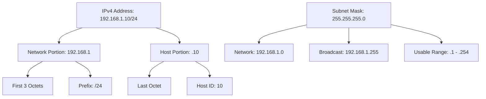

# Subnetting & CIDR

> Mastering IP address division and network segmentation

---

## 🎯 Purpose

Subnetting divides a large network into smaller, more manageable subnetworks (subnets). This improves:
- **Performance**: Reduced broadcast traffic
- **Security**: Network isolation
- **Organization**: Logical grouping of devices
- **Efficiency**: Better IP address utilization

## 📐 IP Address Structure

### IPv4 Address Format
```
32 bits = 4 octets (8 bits each)
Example: 192.168.1.1
         ┌──────┬──────┬──────┬──────┐
         │ 192  │ 168  │  1   │  1   │
         └──────┴──────┴──────┴──────┘
           Octet 1  Octet 2  Octet 3  Octet 4
```

### IP Address Classes (Historical)

| Class | Range | Default Subnet Mask | Use |
|-------|-------|---------------------|-----|
| A | 1.0.0.0 - 126.255.255.255 | 255.0.0.0 (/8) | Large networks |
| B | 128.0.0.0 - 191.255.255.255 | 255.255.0.0 (/16) | Medium networks |
| C | 192.0.0.0 - 223.255.255.255 | 255.255.255.0 (/24) | Small networks |
| D | 224.0.0.0 - 239.255.255.255 | N/A | Multicast |
| E | 240.0.0.0 - 255.255.255.255 | N/A | Experimental |

> ⚠️ **Note**: Classful addressing is obsolete; CIDR (Classless Inter-Domain Routing) is used today.

## 🔢 Binary & Subnet Masks

### Binary Basics
```
Decimal:  0   1   2   3   4   5   6   7   8   9  10  11  12  13  14  15
Binary:   0000 0001 0010 0011 0100 0101 0110 0111 1000 1001 1010 1011 1100 1101 1110 1111

Octet Values:
0   = 00000000
255 = 11111111
128 = 10000000
64  = 01000000
32  = 00100000
16  = 00010000
8   = 00001000
```

### Subnet Mask Examples
```
/8   = 255.0.0.0      = 11111111.00000000.00000000.00000000
/16  = 255.255.0.0    = 11111111.11111111.00000000.00000000
/24  = 255.255.255.0  = 11111111.11111111.11111111.00000000
/25  = 255.255.255.128 = 11111111.11111111.11111111.10000000
/26  = 255.255.255.192 = 11111111.11111111.11111111.11000000
```

## 📊 CIDR Notation

CIDR (Classless Inter-Domain Routing) replaces classful addressing with a prefix length.

```
Format: IP_Address/Prefix_Length
Example: 192.168.1.0/24

Prefix Length = Number of network bits (left to right)
/24 = First 24 bits are network, last 8 bits are host
```

### CIDR to Subnet Mask Conversion

| Prefix | Subnet Mask | Hosts per Subnet |
|--------|-------------|-------------------|
| /30 | 255.255.255.252 | 2 (point-to-point links) |
| /29 | 255.255.255.248 | 6 |
| /28 | 255.255.255.240 | 14 |
| /27 | 255.255.255.224 | 30 |
| /26 | 255.255.255.192 | 62 |
| /25 | 255.255.255.128 | 126 |
| /24 | 255.255.255.0 | 254 |
| /23 | 255.255.254.0 | 510 |
| /22 | 255.255.252.0 | 1,022 |
| /21 | 255.255.248.0 | 2,046 |
| /20 | 255.255.240.0 | 4,094 |

> 💡 **Formula**: `2^(32 - prefix) - 2 = usable hosts` (subtract 2 for network and broadcast addresses)

## ✂️ Subnetting Step-by-Step

### Example: Divide 192.168.1.0/24 into 4 subnets

**Step 1: Determine subnet bits needed**
- Need 4 subnets → 2^2 = 4 → Need 2 additional subnet bits
- Original: /24 → New prefix: /26 (24 + 2)

**Step 2: Calculate new subnet mask**
- /26 = 255.255.255.192

**Step 3: Calculate subnet increment**
- Host bits: 32 - 26 = 6 → 2^6 = 64
- Subnet increment: 64

**Step 4: List subnets**
| Subnet | Network Address | First Usable | Last Usable | Broadcast |
|--------|-----------------|--------------|-------------|-----------|
| 1 | 192.168.1.0/26 | 192.168.1.1 | 192.168.1.62 | 192.168.1.63 |
| 2 | 192.168.1.64/26 | 192.168.1.65 | 192.168.1.126 | 192.168.1.127 |
| 3 | 192.168.1.128/26 | 192.168.1.129 | 192.168.1.190 | 192.168.1.191 |
| 4 | 192.168.1.192/26 | 192.168.1.193 | 192.168.1.254 | 192.168.1.255 |

### Binary View of Subnetting
```
Original: 192.168.1.0/24 = 11000000.10101000.00000001.00000000
New:      192.168.1.0/26 = 11000000.10101000.00000001.00000000

Subnet bits (26):          11000000.10101000.00000001.00
Host bits (6):                                           000000

Subnet 1: 000000 = 0   → 192.168.1.0
Subnet 2: 010000 = 64  → 192.168.1.64
Subnet 3: 100000 = 128 → 192.168.1.128
Subnet 4: 110000 = 192 → 192.168.1.192
```

## 🔄 Variable Length Subnet Masking (VLSM)

VLSM allows using different subnet masks within the same network.

### Example: VLSM Design
```
Network: 192.168.1.0/24

Requirements:
- 1 subnet with 60 hosts (Department A)
- 1 subnet with 30 hosts (Department B)
- 1 subnet with 10 hosts (Department C)
- 1 subnet with 5 hosts (Department D)

Solution:
1. Department A: /26 (62 hosts) → 192.168.1.0/26
2. Department B: /27 (30 hosts) → 192.168.1.64/27
3. Department C: /28 (14 hosts) → 192.168.1.96/28
4. Department D: /29 (6 hosts) → 192.168.1.112/29
```

## 🧮 Subnet Calculator

### Quick Reference Formulas

```
Number of Subnets = 2^s (where s = number of subnet bits)
Hosts per Subnet = 2^h - 2 (where h = number of host bits)
Total Addresses = 2^h (including network and broadcast)

Subnet Size = 256 - subnet_mask_last_octet
Subnet Increment = Subnet Size
```

### Common Subnet Sizes

| Requirement | Prefix | Mask | Hosts | Subnet Increment |
|-------------|--------|------|-------|-------------------|
| 2 hosts | /30 | 252 | 2 | 4 |
| 6 hosts | /29 | 248 | 6 | 8 |
| 14 hosts | /28 | 240 | 14 | 16 |
| 30 hosts | /27 | 224 | 30 | 32 |
| 62 hosts | /26 | 192 | 62 | 64 |
| 126 hosts | /25 | 128 | 126 | 128 |
| 254 hosts | /24 | 0 | 254 | 256 |

## 🖼️ IP Address Breakdown Diagram



## 🎯 Key Takeaways

1. **Subnetting divides networks** into smaller segments
2. **CIDR notation** (e.g., /24) indicates network bits
3. **Formula**: `2^n - 2` = usable hosts (n = host bits)
4. **VLSM** allows different subnet sizes in one network
5. **Network address**: All host bits = 0
6. **Broadcast address**: All host bits = 1

## 🧩 Practice Problems

1. What is the network address for 192.168.5.20/26?
2. How many usable hosts in a /28 subnet?
3. Divide 10.0.0.0/24 into 8 equal subnets. What are the network addresses?
4. What subnet mask is /20 in decimal?
5. If you need 100 usable hosts per subnet, what's the smallest subnet mask?

## 🔗 Further Reading

- [RFC 4632: CIDR Notation](https://tools.ietf.org/html/rfc4632)
- [RFC 1878: Variable Length Subnet Table](https://tools.ietf.org/html/rfc1878)
- [Subnetting Practice](https://www.subnettingpractice.com/)
- [CIDR Calculator](https://www.calculator.net/ip-subnet-calculator.html)

## 💡 Interactive: Subnet Calculator

```html
<!-- Simple subnet calculator - can be enhanced with JavaScript -->
<div id="subnet-calculator">
    <label>IP Address: <input type="text" placeholder="192.168.1.0"></label>
    <label>Prefix: <input type="text" placeholder="24"></label>
    <button>Calculate</button>
    <div id="result"></div>
</div>
```
