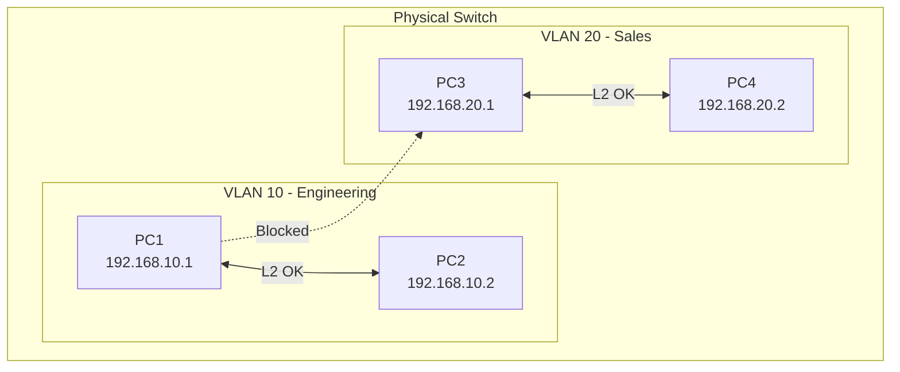
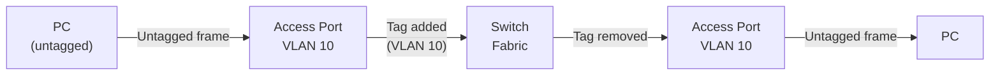
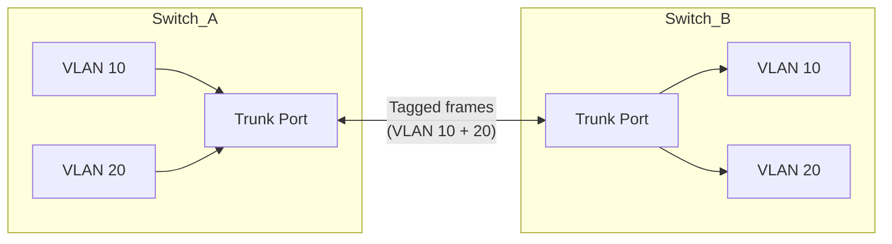
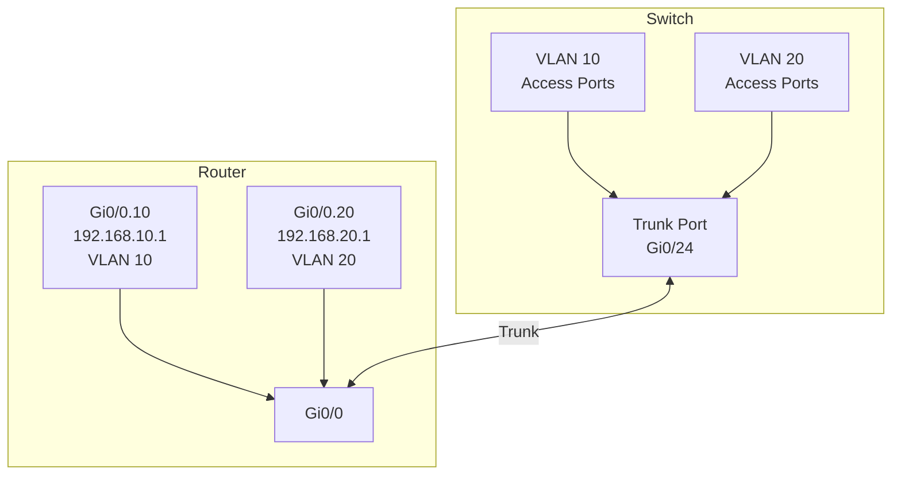
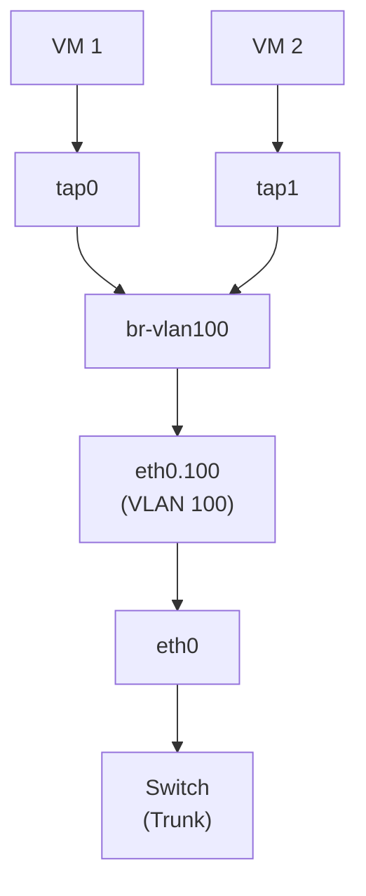
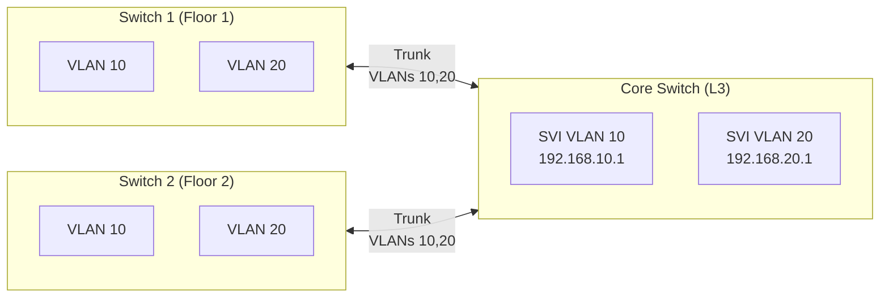

# VLANs (Virtual LANs)

> Logical network segmentation at Layer 2 — access ports, trunk ports, and 802.1Q tagging

---

## 🎯 What is a VLAN?

A **VLAN** (Virtual LAN) divides a single physical switch into multiple isolated broadcast domains. Devices in the same VLAN can communicate at Layer 2 as if they were on the same physical network, even if they're on different switches. Devices in different VLANs need a router to communicate.



**Why VLANs matter:**

- **Security** — isolate sensitive traffic (management, finance, guest)
- **Broadcast control** — limit broadcast domain size
- **Flexibility** — group users logically, not physically
- **Cost** — one physical switch acts as many logical switches

## 🏷️ IEEE 802.1Q — VLAN Tagging

802.1Q inserts a 4-byte tag into the Ethernet frame between the source MAC and the EtherType field:

```
Standard Ethernet Frame:
┌──────────┬──────────┬───────────┬─────────┬─────┐
│ Dst MAC  │ Src MAC  │ EtherType │ Payload │ FCS │
│  (6B)    │  (6B)    │   (2B)    │         │(4B) │
└──────────┴──────────┴───────────┴─────────┴─────┘

802.1Q Tagged Frame:
┌──────────┬──────────┬──────────────────┬───────────┬─────────┬─────┐
│ Dst MAC  │ Src MAC  │   802.1Q Tag     │ EtherType │ Payload │ FCS │
│  (6B)    │  (6B)    │     (4B)         │   (2B)    │         │(4B) │
└──────────┴──────────┴──────────────────┴───────────┴─────────┴─────┘
```

### 802.1Q Tag Structure (4 bytes)

| Field | Bits | Description |
|-------|------|-------------|
| TPID | 16 | Tag Protocol Identifier — always `0x8100` |
| PCP | 3 | Priority Code Point (QoS, 0-7) |
| DEI | 1 | Drop Eligible Indicator |
| VID | 12 | **VLAN ID** (0-4095) |

**VLAN ID ranges:**

| Range | Usage |
|-------|-------|
| 0 | Reserved (priority tagging only) |
| 1 | Default VLAN (native) |
| 2-1001 | Normal range |
| 1002-1005 | Reserved (Token Ring, FDDI) |
| 1006-4094 | Extended range |
| 4095 | Reserved |

## 🔌 Port Types

This is the most critical concept — understanding how switch ports handle VLAN tags.

### Access Port

An **access port** belongs to exactly **one VLAN**. It connects to end devices (PCs, servers, printers) that don't understand VLAN tags.



**Behavior:**
- **Ingress**: receives untagged frames, adds the VLAN tag internally
- **Egress**: strips the VLAN tag, sends untagged frames to the device
- The end device has no idea it's on a VLAN

```
# Cisco IOS
interface GigabitEthernet0/1
  switchport mode access
  switchport access vlan 10

# Linux
ip link add link eth0 name eth0.10 type vlan id 10
```

### Trunk Port

A **trunk port** carries traffic for **multiple VLANs** simultaneously. It connects switches to other switches, routers, or hypervisors.



**Behavior:**
- **Ingress**: receives tagged frames, reads the VLAN ID to forward correctly
- **Egress**: sends frames with 802.1Q tags intact
- The **native VLAN** is sent untagged (default: VLAN 1)

```
# Cisco IOS
interface GigabitEthernet0/24
  switchport mode trunk
  switchport trunk allowed vlan 10,20,30
  switchport trunk native vlan 99

# Linux — create tagged interfaces
ip link add link eth0 name eth0.10 type vlan id 10
ip link add link eth0 name eth0.20 type vlan id 20
```

### Hybrid/General Port (some vendors)

Some switches support ports that are both access and trunk — they have one untagged VLAN and multiple tagged VLANs. Not all vendors support this.

### Summary: Access vs Trunk

| Feature | Access Port | Trunk Port |
|---------|------------|------------|
| VLANs carried | 1 | Multiple |
| Frames sent | Untagged | Tagged (except native) |
| Connects to | End devices | Switches, routers, hypervisors |
| 802.1Q tag | Stripped on egress | Preserved |
| Native VLAN | N/A (is the access VLAN) | Untagged VLAN on trunk |

## 🌐 Native VLAN

The **native VLAN** is the VLAN whose traffic is sent **untagged** on a trunk port. By default, this is VLAN 1.

**Security concern:** If native VLANs don't match on both sides of a trunk, frames can "hop" into the wrong VLAN (VLAN hopping attack).

**Best practice:**
- Change native VLAN from default (VLAN 1) to an unused VLAN
- Match native VLAN on both sides of every trunk
- Or tag all VLANs (no native):

```
# Cisco — tag native VLAN too
vlan dot1q tag native
```

## 🖥️ Inter-VLAN Routing

Devices in different VLANs need a **router** (or Layer 3 switch) to communicate.

### Router-on-a-Stick

One physical router interface with sub-interfaces, connected to a trunk port:



```
# Cisco Router
interface GigabitEthernet0/0.10
  encapsulation dot1q 10
  ip address 192.168.10.1 255.255.255.0

interface GigabitEthernet0/0.20
  encapsulation dot1q 20
  ip address 192.168.20.1 255.255.255.0
```

### Layer 3 Switch (SVI)

Modern switches can route between VLANs internally using SVIs (Switch Virtual Interfaces):

```
# Cisco L3 Switch
ip routing

interface vlan 10
  ip address 192.168.10.1 255.255.255.0

interface vlan 20
  ip address 192.168.20.1 255.255.255.0
```

## 🐧 VLANs on Linux

### Creating VLAN interfaces

```bash
# Load 8021q module
sudo modprobe 8021q

# Create VLAN interface
sudo ip link add link eth0 name eth0.100 type vlan id 100
sudo ip link set eth0.100 up
sudo ip addr add 10.100.0.1/24 dev eth0.100

# Verify
ip -d link show eth0.100
cat /proc/net/vlan/config
```

### VLAN with bridge (for VMs)

```bash
# Create VLAN interface
sudo ip link add link eth0 name eth0.100 type vlan id 100
sudo ip link set eth0.100 up

# Create bridge for that VLAN
sudo ip link add br-vlan100 type bridge
sudo ip link set eth0.100 master br-vlan100
sudo ip link set br-vlan100 up

# Attach VM TAP interfaces to the bridge
sudo ip link set tap0 master br-vlan100
```



### NetworkManager (nmcli)

```bash
# Create VLAN
nmcli connection add type vlan con-name vlan100 dev eth0 id 100

# Set IP
nmcli connection modify vlan100 ipv4.addresses 10.100.0.1/24
nmcli connection modify vlan100 ipv4.method manual
nmcli connection up vlan100
```

### Netplan (Ubuntu)

```yaml
network:
  version: 2
  ethernets:
    eth0: {}
  vlans:
    eth0.100:
      id: 100
      link: eth0
      addresses: [10.100.0.1/24]
    eth0.200:
      id: 200
      link: eth0
      addresses: [10.200.0.1/24]
```

## 🔒 VLAN Security

### VLAN Hopping Attacks

**Attack 1: Switch Spoofing**
Attacker configures their NIC to send DTP (Dynamic Trunking Protocol) frames, tricking the switch into creating a trunk:

```
Prevention:
- Disable DTP on all access ports
- Explicitly set port mode

# Cisco
interface Gi0/1
  switchport mode access          ! never trunk
  switchport nonegotiate          ! disable DTP
```

**Attack 2: Double Tagging**
Attacker sends a frame with two 802.1Q tags. The first tag matches the native VLAN and is stripped, the inner tag reaches the target VLAN:

```
Attacker → [Native VLAN tag][Target VLAN tag][Payload]
Switch strips outer tag → [Target VLAN tag][Payload] → reaches target VLAN
```

```
Prevention:
- Don't use VLAN 1 as native
- Tag native VLAN on trunks
- Use a dedicated, unused native VLAN
```

### Best Practices

| Practice | Why |
|----------|-----|
| Change native VLAN from 1 | Prevents double-tagging attacks |
| Disable unused ports | Prevents unauthorized access |
| Set unused ports to a "parking" VLAN | Isolate accidental connections |
| Use private VLANs for isolation | Even within same VLAN |
| Prune VLANs on trunks | Only allow needed VLANs per trunk |
| Disable DTP | Prevent trunk negotiation attacks |

## 🏗️ VLAN Design Patterns

### Small Office

```
VLAN 10  — Staff (data)
VLAN 20  — VoIP
VLAN 30  — Guest (isolated, internet only)
VLAN 99  — Management
VLAN 999 — Native (unused, security)
```

### Data Center

```
VLAN 100-199  — Server farms
VLAN 200-299  — Storage (iSCSI, NFS)
VLAN 300-399  — Management / IPMI
VLAN 400-499  — VM migration (vMotion)
VLAN 500-599  — Tenant isolation
VLAN 999      — Native (unused)
```

### Multi-switch spanning



## 🆚 VLANs vs Other Segmentation

| Technology | Layer | Scope | Scale | Use Case |
|-----------|-------|-------|-------|----------|
| **VLAN** | L2 | Single L2 domain | 4094 max | Campus, data center |
| **VXLAN** | L2 over L3 | Across L3 boundaries | 16M+ | Cloud, multi-DC |
| **VRF** | L3 | Routing table isolation | Per device | Multi-tenant routing |
| **Firewall zones** | L3-L7 | Policy-based | N/A | Security segmentation |

## 🔗 Related Topics

- [Linux Bonding](linux-bonding.md) — VLANs on bonded interfaces
- [Overlay Networks](../03-container-networking/overlay-networks.md) — VXLAN extends VLANs across L3
- [Virtual Switches](../04-vm-networking/virtual-switches.md) — OVS VLAN handling
- [Docker Networking](../03-container-networking/docker-networking.md) — Container VLAN integration
