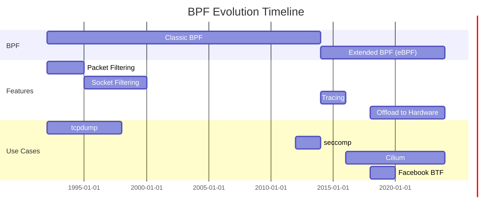

# eBPF (Extended Berkeley Packet Filter)

> Revolutionizing Linux observability, networking, and security with in-kernel virtual machine

---

## 🎯 Purpose

eBPF is a Linux kernel technology that allows **safe execution of user-defined programs** inside the kernel without modifying kernel source code or loading kernel modules.

**Key Capabilities:**
- **Packet filtering & processing** (original use case)
- **Observability & monitoring** (tracing, profiling)
- **Networking** (load balancing, firewalling)
- **Security** (runtime security, auditing)
- **Performance analysis** (perf events, counters)

## 🐧 Evolution of BPF



### Classic BPF (cBPF)
- Introduced in **1992** for packet filtering
- Used by `tcpdump`, `socket filters`
- Limited to **~50 instructions**
- No loops, no function calls
- Only for networking

### Extended BPF (eBPF)
- Major redesign starting **2014**
- **64-bit registers** (vs 32-bit)
- **Unlimited instructions** (subject to verifier)
- **JIT compilation** to native machine code
- **Multiple attach points** (not just networking)
- **Safe to run** (verified before execution)

## 🏗️ eBPF Architecture

```
┌─────────────────────────────────────────────────────────────┐
│                        User Space                              │
├─────────────────────────────────────────────────────────────┤
│  eBPF Applications                                           │
│  ┌─────────────┐  ┌─────────────┐  ┌───────────────────┐  │
│  │  bcc/bpftool │  │  BPF Compiler│  │  Userspace Tools  │  │
│  │  (Clang/LLVM)│  │    (LLVM)    │  │  (bpftrace, etc.) │  │
│  └─────────────┘  └─────────────┘  └───────────────────┘  │
├─────────────────────────────────────────────────────────────┤
│  System Call (bpf())                                         │
└─────────────────────────────────────────────────────────────┘
                         △
                         │ Load Program
                         ▼
┌─────────────────────────────────────────────────────────────┐
│                       Kernel Space                              │
├─────────────────────────────────────────────────────────────┤
│  ┌───────────────────────────────────────────────────────┐  │
│  │                    eBPF Verifier                          │  │
│  │  - Safety checks                                         │  │
│  │  - Loop bounds verification                              │  │
│  │  - Memory access validation                              │  │
│  │  - Register usage tracking                                │  │
│  └───────────────────────────────────────────────────────┘  │
├─────────────────────────────────────────────────────────────┤
│  ┌───────────────────────────────────────────────────────┐  │
│  │                    JIT Compiler                           │  │
│  │  - Compiles to native machine code                      │  │
│  │  - Optimized for specific architecture                   │  │
│  └───────────────────────────────────────────────────────┘  │
├─────────────────────────────────────────────────────────────┤
│  ┌───────────────────────────────────────────────────────┐  │
│  │                    eBPF Programs                          │  │
│  │  - Attached to hooks (kprobes, tracepoints, etc.)       │  │
│  │  - Executed on events                                     │  │
│  └───────────────────────────────────────────────────────┘  │
├─────────────────────────────────────────────────────────────┤
│  Kernel Functions & Data Structures                         │
└─────────────────────────────────────────────────────────────┘
```

## 🔌 eBPF Hook Points (Attach Types)

### Networking Hooks

| Hook Type | Description | Use Cases |
|-----------|-------------|-----------|
| **XDP** (eXpress Data Path) | Early packet processing (before kernel) | DDoS protection, load balancing, filtering |
| **TC** (Traffic Control) | Packet processing in network stack | QoS, policing, redirecting |
| **Socket Filter** | Filter packets at socket level | Custom socket filters |
| **Socket Options** | Modify socket behavior | Congestion control, keepalive |
| **cGroup SKB** | Packet processing in cgroups | Container networking, bandwidth control |

### Tracing & Observability Hooks

| Hook Type | Description | Use Cases |
|-----------|-------------|-----------|
| **kprobe** | Kernel function entry | Function tracing, performance analysis |
| **kretprobe** | Kernel function return | Return value tracing |
| **tracepoint** | Static tracepoints in kernel | Event-based tracing |
| **uprobe** | User space function entry | Application tracing |
| **uretprobe** | User space function return | Application return tracing |
| **perf_event** | Performance monitoring | Profiling, counters |

### Other Hooks

| Hook Type | Description | Use Cases |
|-----------|-------------|-----------|
| **LSM** (Linux Security Module) | Security policy enforcement | Custom security policies |
| **fentry/fexit** | Function entry/exit (newer) | More efficient tracing |
| **fmod_ret** | Function return with modification | Modify return values |

## 📝 eBPF Program Types

### Socket Filter (BPF_PROG_TYPE_SOCKET_FILTER)
- **Attach Point**: Socket receive path
- **Purpose**: Filter incoming packets
- **Return**: Accept (0) or drop (non-zero)
- **Example**: Custom packet filtering

### XDP (BPF_PROG_TYPE_XDP)
- **Attach Point**: Network driver (early in RX path)
- **Purpose**: Process packets before kernel networking
- **Actions**: XDP_PASS, XDP_DROP, XDP_TX, XDP_REDIRECT, XDP_ABORTED
- **Performance**: ~14-20 Mpps (million packets per second)

**XDP Processing Path:**
```
NIC RX
  ▼
Driver RX Queue
  ▼
XDP Program (eBPF)
  ├─► XDP_PASS → Kernel Network Stack
  ├─► XDP_DROP → Drop Packet
  ├─► XDP_TX → Transmit back out
  ├─► XDP_REDIRECT → Send to another port
  └─► XDP_ABORTED → Error
  ▼
Kernel Network Stack (if XDP_PASS)
```

**Example XDP Program (C):**
```c
#include <linux/bpf.h>
#include <bpf/bpf_helpers.h>
#include <bpf/bpf_endian.h>

SEC("xdp")
int xdp_drop(struct xdp_md *ctx) {
    // Get packet data
    void *data = (void *)(long)ctx->data;
    void *data_end = (void *)(long)ctx->data_end;
    
    // Parse Ethernet header
    struct ethhdr *eth = data;
    if ((void *)(eth + 1) > data_end)
        return XDP_PASS;
    
    // Drop all packets with Ethernet type 0x8888
    if (eth->h_proto == bpf_htons(0x8888)) {
        return XDP_DROP;
    }
    
    return XDP_PASS;
}

char _license[] SEC("license") = "GPL";
```

### TC (Traffic Control)
- **Attach Point**: Network stack (ingress/egress)
- **Purpose**: Modify, filter, redirect packets
- **Example**: Load balancing, QoS marking

**TC Hook Points:**
- `TC_INGRESS`: Incoming packets
- `TC_EGRESS`: Outgoing packets
- `TC_CUSTOM`: Custom classification

### kprobe / kretprobe
- **Attach Point**: Kernel function entry/exit
- **Purpose**: Trace function calls, measure latency
- **Example**: Performance profiling

**Example kprobe Program:**
```c
#include <linux/bpf.h>
#include <bpf/bpf_helpers.h>
#include <bpf/bpf_tracing.h>

// Define a map to store timestamps
struct {
    __uint(type, BPF_MAP_TYPE_HASH);
    __uint(max_entries, 10000);
    __type(key, u64);  // PID
    __type(value, u64); // Timestamp
} start_time SEC(".maps");

// Function to trace
SEC("kprobe/sys_nanosleep")
int BPF_KPROBE(sys_nanosleep_entry, struct timespec *req, struct timespec *rem) {
    u64 pid = bpf_get_current_pid_tgid();
    u64 ts = bpf_ktime_get_ns();
    bpf_map_update_elem(&start_time, &pid, &ts, BPF_ANY);
    return 0;
}

SEC("kretprobe/sys_nanosleep")
int BPF_KRETPROBE(sys_nanosleep_exit) {
    u64 pid = bpf_get_current_pid_tgid();
    u64 *start_ts = bpf_map_lookup_elem(&start_time, &pid);
    if (start_ts) {
        u64 duration = bpf_ktime_get_ns() - *start_ts;
        bpf_printk("nanosleep latency: %llu ns", duration);
        bpf_map_delete_elem(&start_time, &pid);
    }
    return 0;
}

char _license[] SEC("license") = "GPL";
```

## 🗃️ eBPF Maps

Maps are the **primary data structure** for storing and retrieving data between eBPF programs and user space.

### Map Types

| Map Type | Description | Use Cases |
|----------|-------------|-----------|
| **BPF_MAP_TYPE_HASH** | Hash table | Counters, statistics, key-value storage |
| **BPF_MAP_TYPE_ARRAY** | Fixed-size array | Direct index access, small data |
| **BPF_MAP_TYPE_PROG_ARRAY** | Array of eBPF programs | Program dispatch tables |
| **BPF_MAP_TYPE_PERF_EVENT_ARRAY** | Perf event array | Perf buffer output |
| **BPF_MAP_TYPE_PERCPU_HASH** | Per-CPU hash table | Per-CPU counters |
| **BPF_MAP_TYPE_PERCPU_ARRAY** | Per-CPU array | Per-CPU data |
| **BPF_MAP_TYPE_RINGBUF** | Ring buffer | Event streaming |
| **BPF_MAP_TYPE_STACK_TRACE** | Stack trace storage | Stack trace collection |
| **BPF_MAP_TYPE_CGROUP_ARRAY** | Cgroup array | Cgroup-specific data |
| **BPF_MAP_TYPE_LRU_HASH** | LRU hash table | Cached data with LRU eviction |
| **BPF_MAP_TYPE_LRU_PERCPU_HASH** | Per-CPU LRU hash | Per-CPU cached data |

### Map Operations

```c
// Create/update element
bpf_map_update_elem(map, &key, &value, BPF_ANY);

// Lookup element
void *value = bpf_map_lookup_elem(map, &key);

// Delete element
bpf_map_delete_elem(map, &key);

// Lookup and delete
void *value = bpf_map_lookup_and_delete_elem(map, &key);
```

### Example: Hash Map for Packet Counting

```c
struct {
    __uint(type, BPF_MAP_TYPE_HASH);
    __uint(max_entries, 256);
    __type(key, u32);   // Protocol number
    __type(value, u64); // Packet count
} proto_count SEC(".maps");

SEC("xdp")
int count_protocols(struct xdp_md *ctx) {
    void *data = (void *)(long)ctx->data;
    void *data_end = (void *)(long)ctx->data_end;
    
    // Parse Ethernet + IP headers
    struct ethhdr *eth = data;
    if ((void *)(eth + 1) > data_end)
        return XDP_PASS;
    
    if (eth->h_proto != bpf_htons(ETH_P_IP))
        return XDP_PASS;
    
    struct iphdr *ip = data + sizeof(*eth);
    if ((void *)(ip + 1) > data_end)
        return XDP_PASS;
    
    // Increment counter for this protocol
    u32 proto = ip->protocol;
    u64 *count = bpf_map_lookup_elem(&proto_count, &proto);
    u64 new_count = count ? *count + 1 : 1;
    bpf_map_update_elem(&proto_count, &proto, &new_count, BPF_ANY);
    
    return XDP_PASS;
}
```

## 🔧 eBPF Tools & Frameworks

### BPF Compiler Collection (BCC)
- **Python + Lua** based toolkit
- **Easy to use** for quick prototyping
- **Includes many tools** out of the box

**Installation:**
```bash
# Ubuntu
sudo apt install bpfcc-tools linux-headers-$(uname -r)

# From source
git clone https://github.com/iovisor/bcc.git
cd bcc
mkdir build
cd build
cmake .. -DCMAKE_INSTALL_PREFIX=/usr/local
make
sudo make install
```

**Example BCC Tools:**


| Tool | Description |
|------|-------------|
| `bcc-tools` | Collection of BCC-based tools |
| `bpftool` | Low-level BPF manipulation |
| `bpftrace` | High-level tracing language |
| `perf` | Performance analysis (with BPF support) |

**Example: bcc-tools**
```bash
# Trace syscalls
sudo trace 'tracepoint:raw_syscalls:sys_enter { printf("%s called by %d\n", probe, pid); }'

# Count TCP connections by process
sudo ssltls

# Trace file opens
sudo opensnoop

# Network traffic by process
sudo tcptop
```

### bpftrace
- **High-level tracing language** (inspired by awk and DTrace)
- **Easier than C** for tracing tasks
- **One-liners** for quick debugging

**Installation:**
```bash
# Ubuntu
sudo apt install bpftrace

# From source
git clone https://github.com/iovisor/bpftrace.git
cd bpftrace
mkdir build
cd build
cmake .. -DCMAKE_INSTALL_PREFIX=/usr/local
make
sudo make install
```

**bpftrace Examples:**

```bash
# Hello World
bpftrace -e 'BEGIN { printf("Hello, eBPF!\n"); }'

# Count syscalls by process
bpftrace -e 'tracepoint:raw_syscalls:sys_enter { @[comm] = count(); }'

# Measure syscall latency
bpftrace -e 'tracepoint:raw_syscalls:sys_enter { @start[pid] = nsecs; } 
          tracepoint:raw_syscalls:sys_exit /@start[pid]/ { 
            @latency = hist(nsecs - @start[pid]); 
            delete(@start[pid]); 
          }'

# Trace file opens
bpftrace -e 'tracepoint:syscalls:sys_enter_open { printf("%s opened %s\n", comm, str(args->filename)); }'

# Count TCP connections by remote IP
bpftrace -e 'tracepoint:syscalls:sys_enter_connect { 
    @[args->addr->sin_addr] = count(); 
}'
```

### bpftool
- **Low-level tool** for BPF program and map manipulation
- **Part of Linux kernel** (since 4.18)

**Common Commands:**
```bash
# List all BPF programs
sudo bpftool prog list

# Show program details
sudo bpftool prog show id <ID>

# List all maps
sudo bpftool map list

# Dump map contents
sudo bpftool map dump name <MAP_NAME>

# Pin a program
sudo bpftool prog pin id <ID> /sys/fs/bpf/my_program

# Attach a program
sudo bpftool prog attach pinned /sys/fs/bpf/my_program xdp dev eth0
```

## 🌟 Real-World eBPF Projects

### Cilium
- **Purpose**: Kubernetes-native networking, security, and observability
- **Uses eBPF** for:
  - Network connectivity (replaces kube-proxy)
  - Network security policies
  - Load balancing
  - Visibility (metrics, tracing)

**Architecture:**
```
┌─────────────────────────────────────────────────────────┐
│                    Kubernetes Cluster                         │
├─────────────────────────────────────────────────────────┤
│  ┌─────────┐  ┌─────────┐  ┌─────────┐  ┌─────────────┐  │
│  │   Pod   │  │   Pod   │  │   Pod   │  │  Cilium     │  │
│  │         │  │         │  │         │  │  Agent      │  │
│  └────┬────┘  └────┬────┘  └────┬────┘  └──────┬──────┘  │
│       │            │            │             │           │
│       ▼            ▼            ▼             ▼           │
│  ┌───────────────────────────────────────────────────┐  │
│  │                    eBPF Programs                        │  │
│  │  - Network connectivity                               │  │
│  │  - Security policies                                  │  │
│  │  - Load balancing                                     │  │
│  │  - Monitoring                                        │  │
│  └───────────────────────────────────────────────────┘  │
├─────────────────────────────────────────────────────────┤
│                    Linux Network Stack                     │
└─────────────────────────────────────────────────────────┘
```

**Benefits of Cilium with eBPF:**
- **No kube-proxy**: eBPF replaces iptables/ipvs
- **Transparent encryption**: WireGuard-based pod-to-pod encryption
- **Network policies**: L3-L7 filtering with eBPF
- **Visibility**: Deep packet inspection, metrics, tracing
- **Performance**: High throughput, low latency

### Facebook's BTF (BPF Type Format)
- **Purpose**: Enhanced type information for eBPF programs
- **Enables**:
  - CO-RE (Compile Once - Run Everywhere)
  - Access to kernel structs by name (not offsets)
  - Portable eBPF programs across kernel versions

### Pixie
- **Purpose**: Continuous visibility for applications
- **Uses eBPF** for:
  - Automatic application tracing
  - Metrics collection
  - Service dependency mapping
  - Anomaly detection

### Katran
- **Purpose**: High-performance layer 4 load balancer (Facebook)
- **Uses XDP** for:
  - L4 load balancing at line rate
  - DDoS protection
  - Health checking

## 📊 Performance Considerations

### eBPF Overhead
- **Execution**: ~50-200 ns per program
- **JIT Compilation**: Optimized for specific CPU
- **Verification**: One-time cost at load time

### Memory Usage
- **Maps**: Consume kernel memory (limited)
- **Programs**: Small footprint
- **Stack space**: Limited (typically 512 bytes)

### CPU Usage
- **Efficient**: JIT-compiled to native code
- **No context switches**: Runs in kernel context
- **Batched processing**: Can process many events efficiently

### Benchmarks

| Operation | Throughput | Latency |
|-----------|------------|---------|
| XDP Drop | ~14-20 Mpps | ~50-100 ns |
| XDP Pass | ~10-14 Mpps | ~100-200 ns |
| TC Classifier | ~8-12 Mpps | ~200-500 ns |
| kprobe | ~2-5 M events/s | ~500-1000 ns |

## 🔐 Security

### eBPF Verifier
- **Ensures safety**: Prevents crashes, security issues
- **Checks**:
  - No infinite loops
  - Valid memory accesses
  - No dereferencing of uninitialized pointers
  - Register bounds tracking
  - Loop bounds verification

### Capabilities
- **Unprivileged BPF**: Limited capabilities for unprivileged users
- **CAP_BPF**: Required for most operations
- **CAP_PERFMON**: Required for some tracing operations
- **CAP_SYS_ADMIN**: Required for some networking operations

### Attack Surface
- **Reduced**: eBPF programs are verified and sandboxed
- **Still**: Potential for denial of service (DoS) if not properly managed
- **Mitigations**:
  - Rate limiting
  - Memory limits
  - Program complexity limits

## 🎯 Key Takeaways

1. **eBPF extends the kernel** safely without modifying kernel code
2. **Multiple attach points**: Networking, tracing, security, etc.
3. **High performance**: JIT-compiled, runs in kernel context
4. **Powerful data structures**: Maps for storage and communication
5. **Real-world uses**: Cilium, Facebook BTF, Pixie, Katran, and more
6. **Tooling ecosystem**: BCC, bpftrace, bpftool, and more
7. **CO-RE**: Compile Once - Run Everywhere (with BTF)

## 🚀 Getting Started

### Quick Start with bpftrace

```bash
# Install bpftrace
sudo apt install bpftrace

# Run your first trace
sudo bpftrace -e 'BEGIN { printf("Hello, eBPF!\n"); }'

# Trace syscalls
sudo bpftrace -e 'tracepoint:raw_syscalls:sys_enter { @[comm] = count(); }'
```

### Writing Your First eBPF Program

1. **Write the C program** (e.g., `xdp_drop.c`)
2. **Compile with Clang**:
   ```bash
   clang -O2 -target bpf -c xdp_drop.c -o xdp_drop.o
   ```
3. **Load with bpftool**:
   ```bash
   sudo bpftool prog load xdp_drop.o /sys/fs/bpf/xdp_drop
   sudo bpftool prog attach pinned /sys/fs/bpf/xdp_drop xdp dev eth0
   ```

### Learning Resources

- [eBPF.io](https://ebpf.io/) - Official eBPF website
- [Brendan Gregg's eBPF Pages](http://www.brendangregg.com/ebpf.html)
- [Cilium eBPF Documentation](https://docs.cilium.io/en/stable/bpf/)
- [BPF Compiler Collection (BCC) Tutorials](https://github.com/iovisor/bcc/blob/master/docs/tutorial.md)
- [bpftrace Reference Guide](https://github.com/iovisor/bpftrace/blob/master/docs/reference_guide.md)

## 🔗 Further Reading

- [BPF: The Universal In-Kernel Virtual Machine](https://www.lexpev.nl/blog/posts/2020-09-13-bpf_introduction.html)
- [eBPF Documentation (Kernel)](https://www.kernel.org/doc/html/latest/bpf/index.html)
- [RFC: eBPF Support for XDP](https://lwn.net/Articles/739404/)
- [Cilium: eBPF-based Networking, Security, and Observability](https://cilium.io/)
- [BTF: BPF Type Format](https://www.kernel.org/doc/html/latest/bpf/btf.html)
- [The eBPF Verifier](https://lwn.net/Articles/773975/)
