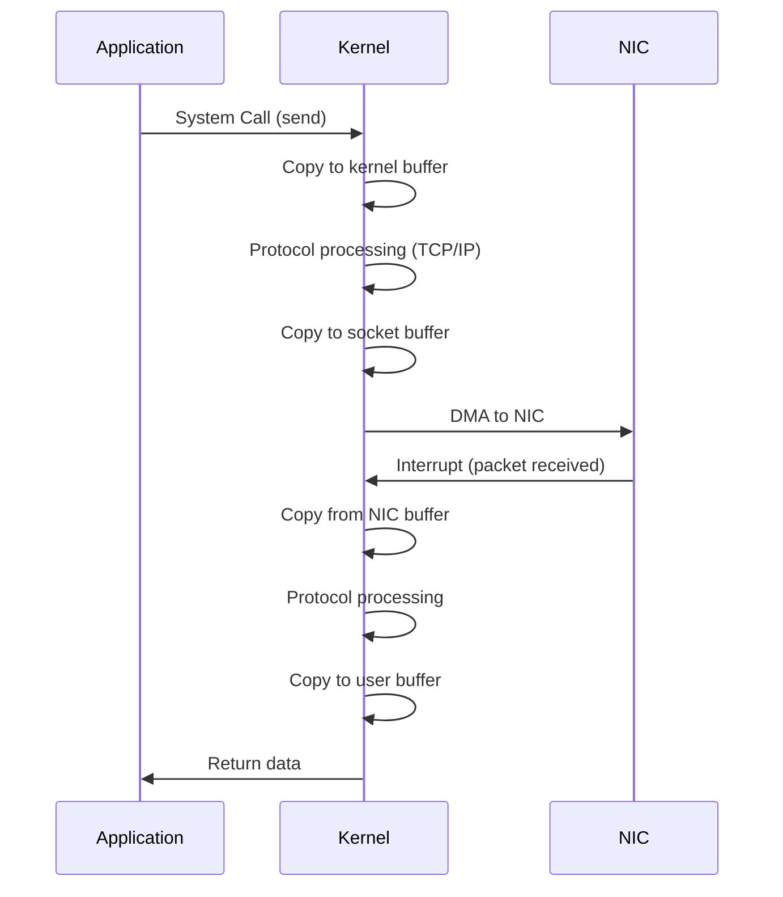

# Kernel Bypass

> Accelerating network performance by bypassing the operating system kernel

---

## 🎯 Purpose

Kernel bypass technologies eliminate the overhead of the operating system's network stack, enabling:
- **Ultra-low latency** (sub-microsecond)
- **High throughput** (line rate, 10/40/100+ Gbps)
- **Deterministic performance** (low jitter)
- **CPU efficiency** (reduced context switches, copies)

## 🏃 The Problem: Traditional Kernel Networking



**Bottlenecks:**
1. **Context switches** between user and kernel space
2. **Data copies** between buffers
3. **Interrupt handling** overhead
4. **Kernel processing** latency

## 🚀 Kernel Bypass Solutions

### DPDK (Data Plane Development Kit)

**Developer**: Intel (originally), now Linux Foundation

**Architecture:**
```
┌─────────────────────────────────────────────────────────┐
│                    User Space Application                  │
├─────────────────────────────────────────────────────────┤
│  DPDK Libraries                                            │
│  ┌──────────────┐  ┌──────────────┐  ┌───────────────┐  │
│  │ Poll Mode    │  │ Memory Pool  │  │ Packet Buffer │  │
│  │   Drivers    │  │   Manager    │  │    Management │  │
│  └──────────────┘  └──────────────┘  └───────────────┘  │
└─────────────────────────────────────────────────────────┘
         ▲
         │ Direct Access
         ▼
┌─────────────────────────────────────────────────────────┐
│                    NIC (with DPDK support)                 │
│  ┌───────────────────────────────────────────────────┐  │
│  │                   Huge Pages                         │  │
│  └───────────────────────────────────────────────────┘  │
└─────────────────────────────────────────────────────────┘
```

**Key Components:**
- **Poll Mode Drivers (PMD)**: Replace interrupt-driven NIC drivers
- **Huge Pages**: Reduce TLB misses, improve memory access
- **Memory Pools**: Pre-allocated packet buffers
- **Zero-copy**: Direct access to packet data
- **NUMA-aware**: Optimize for multi-socket systems

**Use Cases:**
- Network Function Virtualization (NFV)
- Software Defined Networking (SDN)
- High Frequency Trading (HFT)
- Telecommunications
- Load balancers, firewalls, routers

**Performance:**

| Metric | Kernel Stack | DPDK |
|--------|--------------|------|
| Latency | ~50-100 μs | ~1-5 μs |
| Throughput | ~10-20 Gbps | Line rate (100+ Gbps) |
| CPU Usage | High | Optimized |
| Jitter | Variable | Deterministic |

**Example Code (Packet Reception):**
```c
// DPDK packet reception loop
while (1) {
    // Receive packets from NIC
    uint16_t nb_rx = rte_eth_rx_burst(port_id, queue_id, 
                                      &rx_pkts[0], BURST_SIZE);
    
    // Process each packet
    for (int i = 0; i < nb_rx; i++) {
        struct rte_mbuf *m = rx_pkts[i];
        struct rte_ether_hdr *eth_hdr = rte_pktmbuf_mtod(m, struct rte_ether_hdr *);
        
        // Process Ethernet frame
        if (eth_hdr->ether_type == rte_cpu_to_be_16(RTE_ETHER_TYPE_IPV4)) {
            struct rte_ipv4_hdr *ip_hdr = (struct rte_ipv4_hdr *)(eth_hdr + 1);
            // Process IPv4 packet
        }
    }
    
    // Free packets
    for (int i = 0; i < nb_rx; i++) {
        rte_pktmbuf_free(rx_pkts[i]);
    }
}
```

**CLI Setup Example:**
```bash
# Bind NIC to DPDK-compatible driver
sudo dpdk-devbind.py --bind=vfio-pci 0000:01:00.0

# Run DPDK application
sudo ./my_dpdk_app --lcore 0-3 --master lcore 0 --pci-whitelist 0000:01:00.0
```

### RDMA (Remote Direct Memory Access)

**Purpose**: Enable direct memory access between computers without CPU involvement

**Types:**
- **InfiniBand**: Native RDMA protocol
- **RoCE** (RDMA over Converged Ethernet): RDMA over Ethernet
- **iWARP** (Internet Wide Area RDMA Protocol): RDMA over TCP/IP

**Architecture:**
```
┌──────────────────┐       ┌──────────────────┐
│   Application     │       │   Application     │
├──────────────────┤       ├──────────────────┤
│   User Space      │       │   User Space      │
├──────────────────┤       ├──────────────────┤
│   RDMA Libraries  │◄─────►│   RDMA Libraries  │
│   (libibverbs)    │  RDMA │   (libibverbs)    │
├──────────────────┤  Write │   ND         │
│   RNIC Driver     │◄─────►│   RNIC Driver     │
├──────────────────┤       ├──────────────────┤
│   NIC (RNIC)      │       │   NIC (RNIC)      │
└──────────────────┘       └──────────────────┘
```

**Key Concepts:**
- **RNIC** (RDMA Network Interface Card): Hardware that supports RDMA
- **Queue Pair (QP)**: Communication channel between two RNICs
- **Memory Region (MR)**: Registered memory for RDMA access
- **Protection Domain (PD)**: Container for resources
- **Completion Queue (CQ)**: Notifications for completed operations

**Verbs API:**

| Verb | Description |
|------|-------------|
| `ibv_post_send` | Post send request |
| `ibv_post_recv` | Post receive request |
| `ibv_poll_cq` | Poll completion queue |
| `ibv_reg_mr` | Register memory region |
| `ibv_create_qp` | Create queue pair |

**Performance:**
- **Latency**: ~1-2 μs (InfiniBand), ~2-5 μs (RoCE)
- **Throughput**: Line rate (up to 400 Gbps+)
- **CPU Usage**: Near zero for data transfer

**Use Cases:**
- High Performance Computing (HPC)
- Distributed databases
- High Frequency Trading (HFT)
- Distributed file systems (Lustre, GPFS)
- Machine Learning training

### Solarflare OpenOnload

**Developer**: Solarflare Communications

**Purpose**: Accelerate TCP/UDP applications without code changes

**Architecture:**
- Kernel module that intercepts socket calls
- Offloads TCP/IP processing to NIC
- Provides accelerated socket API

**Features:**
- **Zero-copy** data path
- **Hardware offload** of TCP/IP processing
- **Low latency** (~1-2 μs)
- **Drop-in replacement** for standard sockets

**Performance Comparison:**

| Stack | Latency | Throughput | CPU Usage |
|-------|---------|------------|-----------|
| Linux Kernel | ~50-100 μs | ~10-20 Gbps | High |
| DPDK | ~1-5 μs | Line rate | Medium |
| OpenOnload | ~1-2 μs | Line rate | Low |
| RDMA | ~1-2 μs | Line rate | Near zero |

## 📊 Comparison: Kernel Bypass Technologies

| Technology | Approach | Latency | Throughput | Ease of Use | Hardware Requirements |
|------------|----------|---------|------------|-------------|-------------------------|
| DPDK | Poll mode drivers | 1-5 μs | Line rate | Moderate | DPDK-compatible NIC |
| RDMA (InfiniBand) | Hardware offload | 1-2 μs | Line rate | Complex | InfiniBand RNIC |
| RDMA (RoCE) | Hardware offload | 2-5 μs | Line rate | Complex | RoCE-capable NIC |
| RDMA (iWARP) | Software + NIC | 5-10 μs | Line rate | Complex | iWARP-capable NIC |
| OpenOnload | Kernel module | 1-2 μs | Line rate | Easy | Solarflare NIC |
| Kernel Bypass | Custom | Varies | Varies | Complex | NIC-specific |

## 🎯 Use Cases by Industry

### Financial Services (HFT)
- **Requirements**: Sub-microsecond latency, deterministic performance
- **Technologies**: DPDK, RDMA, OpenOnload, FPGA
- **Use Cases**:
  - Order matching engines
  - Market data feeds
  - Risk management systems
  - Colocation services

**Example HFT Stack:**
```
┌─────────────────────────────────────────┐
│           Trading Application            │
├─────────────────────────────────────────┤
│           DPDK / OpenOnload              │
├─────────────────────────────────────────┤
│           Kernel (minimal)               │
├─────────────────────────────────────────┤
│           FPGA (optional)                 │
├─────────────────────────────────────────┤
│           NIC (Solarflare / Mellanox)     │
└─────────────────────────────────────────┘
```

### Telecommunications (NFV/SDN)
- **Requirements**: High throughput, flexible processing
- **Technologies**: DPDK, SR-IOV, VPP
- **Use Cases**:
  - Virtual routers
  - Firewalls
  - Load balancers
  - Deep packet inspection
  - 5G mobile core

**Example NFV Stack:**
```
┌─────────────────────────────────────────┐
│           Virtual Network Functions      │
│  ┌─────────┐  ┌─────────┐  ┌─────────┐  │
│  │  vRouter │  │ vFirewall│  │  vLoad   │  │
│  │         │  │         │  │ Balancer │  │
│  └─────────┘  └─────────┘  └─────────┘  │
├─────────────────────────────────────────┤
│           DPDK / VPP                     │
├─────────────────────────────────────────┤
│           Linux Kernel                    │
├─────────────────────────────────────────┤
│           Physical NIC                    │
└─────────────────────────────────────────┘
```

### Cloud & Data Centers
- **Requirements**: Scale, efficiency, multi-tenancy
- **Technologies**: DPDK, RDMA (RoCE), SR-IOV
- **Use Cases**:
  - Cloud networking
  - Storage networks
  - Distributed databases
  - Container networking

## 🔧 Getting Started with DPDK

### Installation

**Prerequisites:**
- Linux (Ubuntu 20.04/22.04 recommended)
- Supported NIC (Intel, Mellanox, etc.)
- Huge pages enabled
- Appropriate permissions

**Steps:**
```bash
# 1. Install dependencies
sudo apt update
sudo apt install -y build-essential meson ninja-build pyelftools

# 2. Download DPDK
wget https://fast.dpdk.org/rel/dpdk-23.11.tar.xz
tar xf dpdk-23.11.tar.xz
cd dpdk-23.11

# 3. Build DPDK
meson setup build
ninja -C build

# 4. Load kernel modules
sudo modprobe vfio
sudo modprobe vfio_pci

# 5. Bind NIC to DPDK
sudo dpdk-devbind.py --bind=vfio-pci 0000:01:00.0

# 6. Verify
lspci | grep -i ethernet
```

### Simple DPDK Application

**`main.c`:**
```c
#include <stdio.h>
#include <string.h>
#include <rte_eal.h>
#include <rte_ethdev.h>

int main(int argc, char **argv) {
    int ret;
    
    // Initialize EAL
    ret = rte_eal_init(argc, argv);
    if (ret < 0) {
        rte_exit(EXIT_FAILURE, "EAL initialization failed\n");
    }
    
    // Get port count
    uint16_t port_count = rte_eth_dev_count_avail();
    printf("Available ports: %u\n", port_count);
    
    // Configure port
    uint16_t port_id = 0;
    struct rte_eth_conf port_conf = {};
    ret = rte_eth_dev_configure(port_id, 1, 1, &port_conf);
    if (ret < 0) {
        rte_exit(EXIT_FAILURE, "Port configuration failed\n");
    }
    
    // Setup RX queue
    ret = rte_eth_rx_queue_setup(port_id, 0, 1024, 
                                  rte_eth_dev_socket_id(port_id),
                                  NULL, NULL);
    if (ret < 0) {
        rte_exit(EXIT_FAILURE, "RX queue setup failed\n");
    }
    
    // Setup TX queue
    ret = rte_eth_tx_queue_setup(port_id, 0, 1024, 
                                  rte_eth_dev_socket_id(port_id),
                                  NULL);
    if (ret < 0) {
        rte_exit(EXIT_FAILURE, "TX queue setup failed\n");
    }
    
    // Start port
    ret = rte_eth_dev_start(port_id);
    if (ret < 0) {
        rte_exit(EXIT_FAILURE, "Port start failed\n");
    }
    
    printf("DPDK application running...\n");
    
    // Main loop would go here
    
    return 0;
}
```

**Compile & Run:**
```bash
# Compile with DPDK compiler
gcc -o myapp main.c -I/path/to/dpdk/include -L/path/to/dpdk/lib -ldpdk

# Run
sudo ./myapp --lcore 0 --master lcore 0 --pci-whitelist 0000:01:00.0
```

## 🎯 Key Takeaways

1. **Kernel bypass eliminates OS overhead** for maximum performance
2. **DPDK** is the most popular solution for NFV, SDN, and HFT
3. **RDMA** provides zero-copy, CPU-bypass data transfers
4. **OpenOnload** accelerates TCP/UDP without code changes
5. **Trade-offs**: Performance vs. complexity vs. compatibility
6. **Use cases**: HFT, NFV, telecom, cloud, storage, ML

## 🔗 Further Reading

- [DPDK Official Site](https://www.dpdk.org/)
- [DPDK Documentation](https://doc.dpdk.org/)
- [RDMA CM User Guide](https://www.mellanox.com/page/rdma_cm)
- [InfiniBand Architecture](https://www.infinibandta.org/)
- [OpenOnload Documentation](https://www.solarflare.com/openonload-application-acceleration/)
- [High Performance Networking Tutorials](https://fast.dpdk.org/)
- [RFC 5040: RDMA Protocol Extensions](https://tools.ietf.org/html/rfc5040)
