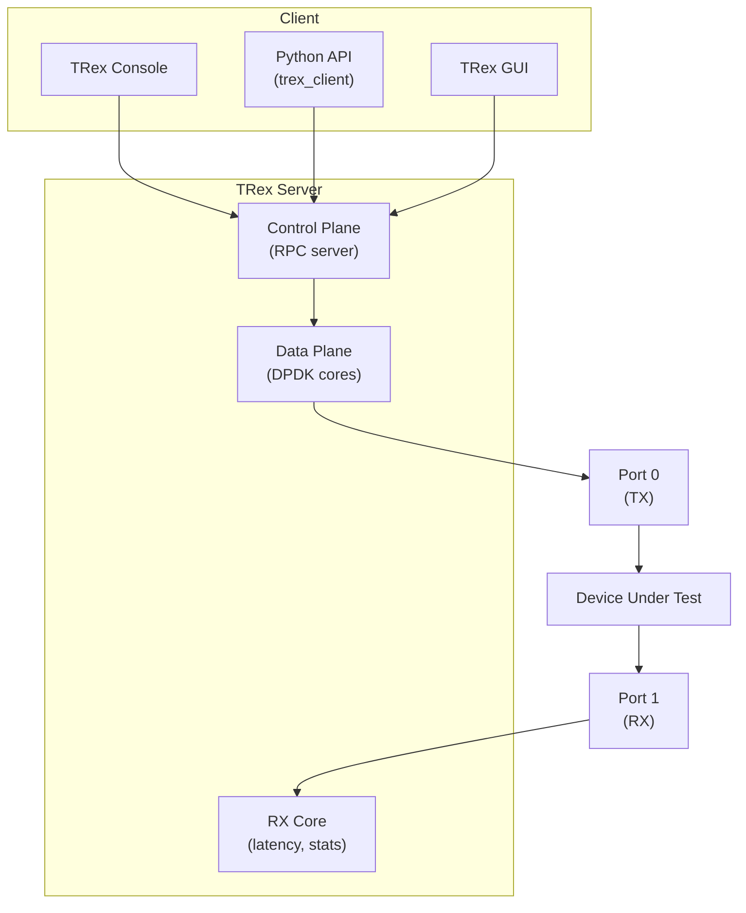

# Cisco TRex — Traffic Generator

> High-performance, open-source traffic generator based on DPDK

---

## 🎯 What is TRex?

**TRex** is a Cisco open-source traffic generator that leverages DPDK for wire-speed packet generation. It can generate both stateless (L2/L3) and stateful (L4-L7) traffic, making it the go-to tool for NFV performance testing, NIC validation, and network benchmarking.

| Feature | Detail |
|---------|--------|
| Developer | Cisco Systems (open source) |
| Engine | DPDK-based |
| Max throughput | 200+ Gbps (hardware dependent) |
| Modes | Stateless, Stateful (ASTF) |
| Protocols | TCP, UDP, HTTP, DNS, custom |
| API | Python (Scapy-based), REST |
| Supported NICs | Intel (i40e, ice, ixgbe), Mellanox, Broadcom |

## 📐 Architecture



### Core allocation

```
Core 0:       Control plane (RPC, management)
Core 1:       RX core (latency measurement, flow stats)
Cores 2-N:    Data plane (packet generation, one thread per core)
```

Each data plane core owns a set of flows and generates packets independently — no locking, no shared state.

## 📦 Installation

### Prerequisites

```bash
# Hugepages (required by DPDK)
echo 1024 > /sys/kernel/mm/hugepages/hugepages-2048kB/nr_hugepages
mkdir -p /mnt/huge
mount -t hugetlbfs nodev /mnt/huge

# Bind NICs to DPDK driver
dpdk-devbind --bind=vfio-pci 0000:03:00.0
dpdk-devbind --bind=vfio-pci 0000:03:00.1
```

### Download and run

```bash
# Download latest release
wget https://trex-tgn.cisco.com/trex/release/latest
tar xzf latest

cd v3.x/

# Run TRex server (stateless mode)
sudo ./t-rex-64 -i --stl

# In another terminal, connect console
./trex-console
```

### Configuration file

```yaml
# /etc/trex_cfg.yaml
- port_limit: 2
  version: 2
  interfaces: ["03:00.0", "03:00.1"]
  port_info:
    - ip: 1.1.1.1
      default_gw: 2.2.2.2
    - ip: 2.2.2.2
      default_gw: 1.1.1.1
  platform:
    master_thread_id: 0
    latency_thread_id: 1
    dual_if:
      - socket: 0
        threads: [2, 3, 4, 5]
```

## 🔄 Stateless Mode (STL)

Stateless mode generates L2/L3 streams at wire speed. Each stream is defined by a packet template + transmission mode.

### Console basics

```bash
# In trex-console
trex> start -f stl/udp_1pkt_simple.py -m 10gbps -p 0
trex> stats
trex> streams -p 0
trex> update -m 50% -p 0
trex> stop -p 0
```

### Python API — Simple UDP stream

```python
from trex_stl_lib.api import *

class STLS1(object):
    def create_stream(self):
        pkt = Ether() / IP(src="10.0.0.1", dst="10.0.0.2") / \
              UDP(sport=1025, dport=12) / ('x' * 64)

        return STLStream(
            packet=STLPktBuilder(pkt=pkt),
            mode=STLTXCont(pps=1000000)  # 1 Mpps continuous
        )

    def get_streams(self, tunables, **kwargs):
        return [self.create_stream()]

def register():
    return STLS1()
```

### Traffic profiles

| Mode | Class | Description |
|------|-------|-------------|
| Continuous | `STLTXCont` | Send forever at given rate |
| Burst | `STLTXSingleBurst` | Send N packets then stop |
| Multi-burst | `STLTXMultiBurst` | Repeated bursts with gaps |

### Field Engine — Dynamic packet fields

```python
# Vary source IP across a range
pkt = Ether() / IP(src="10.0.0.1", dst="10.0.0.2") / UDP()

vm = STLScVmRaw([
    STLVmFlowVar(name="src",
                 min_value="10.0.0.1",
                 max_value="10.0.0.254",
                 size=4, op="inc"),
    STLVmWrFlowVar(fv_name="src", pkt_offset="IP.src"),
    STLVmFixIpv4(offset="IP"),
])

stream = STLStream(
    packet=STLPktBuilder(pkt=pkt, vm=vm),
    mode=STLTXCont(pps=5000000)
)
```

### PCAP replay

```python
# Replay a PCAP file at wire speed
stream = STLStream(
    packet=STLPktBuilder(pkt="capture.pcap"),
    mode=STLTXCont(pps=100000)
)
```

## 🔄 Advanced Stateful Mode (ASTF)

ASTF generates real TCP/UDP sessions with proper handshakes, data transfer, and teardown.

### TCP profile example

```python
from trex.astf.api import *

class Prof1():
    def create_profile(self):
        # Client side: connect, send request, receive response
        prog_c = ASTFProgram()
        prog_c.connect()
        prog_c.send("GET /index.html HTTP/1.1\r\nHost: example.com\r\n\r\n")
        prog_c.recv(1)

        # Server side: accept, receive request, send response
        prog_s = ASTFProgram()
        prog_s.accept()
        prog_s.recv(1)
        prog_s.send("HTTP/1.1 200 OK\r\nContent-Length: 18\r\n\r\nTRex ASTF response")

        ip_gen = ASTFIPGenDist(
            ip_range=["10.0.0.1", "10.0.0.254"],
            distribution="seq"
        )
        ip_gen_s = ASTFIPGenDist(
            ip_range=["48.0.0.1", "48.0.0.254"],
            distribution="seq"
        )

        template = ASTFTemplate(
            client_template=ASTFTCPClientTemplate(
                program=prog_c,
                ip_gen=ASTFIPGenGlobal(ip_offset="0.0.0.0"),
                cps=1000  # 1000 connections per second
            ),
            server_template=ASTFTCPServerTemplate(program=prog_s)
        )

        return ASTFProfile(default_ip_gen=ASTFIPGen(
            glob=ASTFIPGenGlobal(ip_offset="0.0.0.0"),
            dist_client=ip_gen,
            dist_server=ip_gen_s
        ), templates=[template])

def register():
    return Prof1()
```

## 📊 Measuring Performance

### Key metrics

| Metric | Description | How to read |
|--------|-------------|-------------|
| TX pps | Packets per second transmitted | Generator capability |
| RX pps | Packets per second received | DUT forwarding rate |
| TX bps | Bits per second transmitted | Bandwidth utilization |
| Drop rate | TX - RX difference | DUT packet loss |
| Latency (avg/max/jitter) | Per-flow latency | DUT processing delay |

### Latency measurement

```python
# Add latency stream (uses dedicated RX core)
lat_stream = STLStream(
    packet=STLPktBuilder(pkt=pkt),
    mode=STLTXCont(pps=1000),
    flow_stats=STLFlowLatencyStats(pg_id=1)
)
```

### Python automation example

```python
from trex_stl_lib.api import *

c = STLClient(server='127.0.0.1')
c.connect()
c.reset()

c.add_streams([stream, lat_stream], ports=[0])
c.start(ports=[0], mult="10gbps", duration=60)
c.wait_on_traffic()

stats = c.get_stats()
print(f"TX: {stats[0]['opackets']} pkts")
print(f"RX: {stats[1]['ipackets']} pkts")
print(f"Drop: {stats[0]['opackets'] - stats[1]['ipackets']} pkts")

lat = stats['latency'][1]['latency']
print(f"Avg latency: {lat['average']} us")
print(f"Max latency: {lat['total_max']} us")
print(f"Jitter: {lat['jitter']} us")

c.disconnect()
```

## 🏗️ Common Test Topologies

### Loopback (single machine)

```
Port 0 (TX) ──── cable ──── Port 1 (RX)
```

### DUT in the middle

```
TRex Port 0 ──── DUT Port A ──── DUT Port B ──── TRex Port 1
     (TX)                                              (RX)
```

### With router/switch

```
TRex Port 0 ──── Switch/Router ──── TRex Port 1
     (TX)        (DUT)                   (RX)
```

## ⚡ Performance Tuning

```bash
# Isolate CPU cores for TRex
# In /etc/trex_cfg.yaml, pin to NUMA-local cores

# Check NUMA topology
lscpu | grep NUMA
cat /sys/class/net/eth0/device/numa_node

# Use 1G hugepages for better TLB performance
echo 4 > /sys/kernel/mm/hugepages/hugepages-1048576kB/nr_hugepages

# Disable CPU frequency scaling
for cpu in /sys/devices/system/cpu/cpu*/cpufreq/scaling_governor; do
    echo performance > $cpu
done

# Verify NIC driver binding
dpdk-devbind --status
```

## 🆚 TRex vs Other Traffic Generators

| Tool | Type | Speed | Stateful | Cost |
|------|------|-------|----------|------|
| **TRex** | DPDK software | 200+ Gbps | Yes (ASTF) | Free |
| **Ixia/Keysight** | Hardware | 400+ Gbps | Yes | $$$$$ |
| **Spirent** | Hardware | 400+ Gbps | Yes | $$$$$ |
| **pktgen-dpdk** | DPDK software | 100+ Gbps | No | Free |
| **iperf3** | Socket-based | ~40 Gbps | TCP only | Free |
| **MoonGen** | DPDK/Lua | 100+ Gbps | No | Free |

## 🔗 Related Topics

- [Kernel Bypass](../02-high-performance/kernel-bypass.md) — DPDK fundamentals
- [Benchmarks & Tools](../02-high-performance/benchmarks.md) — Other testing tools
- [SR-IOV](../04-vm-networking/sriov.md) — Hardware offloading for NFV
