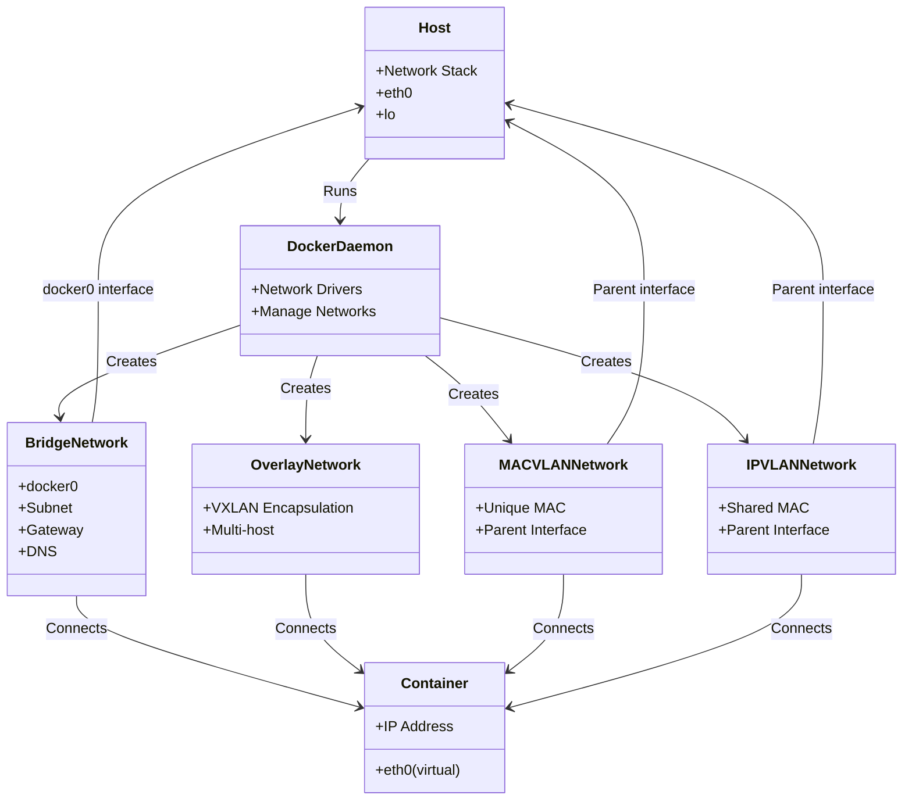

# Docker Networking

> Understanding Docker's network models and how containers communicate

---

## 🎯 Purpose

Docker networking enables communication between containers, between containers and the host, and between containers and the outside world. Understanding Docker networking is essential for:
- Deploying multi-container applications
- Securing container communications
- Optimizing performance
- Troubleshooting connectivity issues

## 🌐 Docker Network Models

Docker provides **5 built-in network drivers**, each suited for different use cases:

| Driver | Description | Use Case | Default |
|--------|-------------|----------|---------|
| **bridge** | Default driver, creates private internal network | Single-host container communication | ✅ Yes |
| **host** | Removes network isolation, uses host's network stack | High performance, minimal isolation | ❌ No |
| **none** | No networking, container has no network access | Complete network isolation | ❌ No |
| **overlay** | Creates distributed network across multiple Docker hosts | Multi-host communication (Swarm) | ❌ No |
| **macvlan** | Assigns MAC address to each container | Direct connection to physical network | ❌ No |
| **ipvlan** | Shares IP address space with host | Multiple containers on same network | ❌ No |

## 🏗️ Bridge Network (Default)

### How It Works

When Docker is installed, it creates a default `bridge` network named `docker0`. Each container connected to this network gets its own IP address from a private subnet.

```
┌─────────────────────────────────────────────────────────────┐
│                         Host Machine                            │
├─────────────────────────────────────────────────────────────┤
│                                                             │
│  ┌─────────────────┐    ┌─────────────────┐    ┌─────────┐  │
│  │    Container A   │    │    Container B   │    │   Host  │  │
│  │   172.17.0.2    │    │   172.17.0.3    │    │  eth0   │  │
│  └────────┬────────┘    └────────┬────────┘    └────┬────┘  │
│           │                     │                │         │
│           └─────────────────────┼────────────────┘         │
│                             │    docker0 (bridge)        │
│                             │    172.17.0.1/16           │
│                             ▼                                │
│  ┌─────────────────────────────────────────────────────────┐  │
│  │                    Physical Network                          │  │
│  └─────────────────────────────────────────────────────────┘  │
└─────────────────────────────────────────────────────────────┘
```

### Default Bridge Network

```bash
# List all networks
docker network ls

# Output:
NETWORK ID     NAME      DRIVER    SCOPE
1234abcd5678   bridge    bridge    local
5678cd90ab12   host      host      local
9012ef34cd56   none      null      local
```

```bash
# Inspect the default bridge network
docker network inspect bridge

# Output:
[
    {
        "Name": "bridge",
        "Id": "1234abcd5678",
        "Created": "2024-01-01T00:00:00.000000Z",
        "Scope": "local",
        "Driver": "bridge",
        "EnableIPv6": false,
        "IPv4Subnet": "172.17.0.0/16",
        "IPv4Gateway": "172.17.0.1",
        "Containers": {},
        "Options": {},
        "Labels": {}
    }
]
```

### Creating Custom Bridge Networks

**Best Practice**: Create custom bridge networks for your applications instead of using the default bridge.

```bash
# Create a custom bridge network
docker network create my-network --driver bridge --subnet 192.168.100.0/24 --gateway 192.168.100.1

# List networks
docker network ls

# Connect a container to the network
docker run --name my-container --network my-network -d nginx

# Connect an existing container to a network
docker network connect my-network my-container
```

### Bridge Network Features

| Feature | Description |
|---------|-------------|
| **IP Address Assignment** | Automatic via DHCP |
| **DNS Resolution** | Containers can resolve each other by name |
| **NAT** | Containers can access external networks |
| **Port Mapping** | Expose container ports to host via `-p` |
| **Isolation** | Containers on different networks cannot communicate (unless explicitly connected) |

### DNS Resolution

Docker provides **built-in DNS resolution** for containers on the same network:

```bash
# Start containers on same network
docker run --name web --network my-network -d nginx
docker run --name db --network my-network -d mysql

# From web container, ping db by name
docker exec -it web ping db
# Output: PING db (192.168.100.2) 56(84) bytes of data.
```

**DNS Names:**
- Container name (e.g., `web`, `db`)
- Container ID (full or short)
- Service name (in Swarm mode)

### Port Mapping

Expose container ports to the host machine:

```bash
# Map host port 8080 to container port 80
docker run --name web -p 8080:80 -d nginx

# Map specific host IP and port
docker run --name web -p 192.168.1.100:8080:80 -d nginx

# Map multiple ports
docker run --name web -p 8080:80 -p 8443:443 -d nginx

# Map UDP port
docker run --name dns -p 5353:53/udp -d my-dns-server

# Map all ports (not recommended for security)
docker run --name web -P -d nginx
```

**Port Mapping Syntax:**
- `-p <host_port>:<container_port>` - Specific host port
- `-p <host_ip>:<host_port>:<container_port>` - Specific host IP and port
- `-p <container_port>` - Dynamic host port (random)
- `-P` - Publish all exposed ports

### Network Isolation

Containers on different networks **cannot communicate** with each other by default:

```bash
# Create two networks
docker network create network-a
docker network create network-b

# Start containers on different networks
docker run --name a1 --network network-a -d nginx
docker run --name b1 --network network-b -d nginx

# Try to ping from a1 to b1 (will fail)
docker exec -it a1 ping b1
# Output: ping: bad address 'b1'
```

**Solution**: Connect containers to multiple networks or use a shared network.

## 🚀 Host Network

### How It Works

The `host` network driver **removes network isolation** between the container and the host. The container uses the host's network stack directly.

```
┌─────────────────────────────────────────────────────────────┐
│                         Host Machine                            │
├─────────────────────────────────────────────────────────────┤
│                                                             │
│  ┌─────────────────┐                                         │
│  │    Container     │                                         │
│  │   (Host Mode)    │                                         │
│  └────────┬────────┘                                         │
│           │                                                   │
│           ▼ (Shares host's network namespace)                 │
│  ┌─────────────────┐                                         │
│  │   Host's        │                                         │
│  │   Network Stack │                                         │
│  │   (eth0, eth1)  │                                         │
│  └────────┬────────┘                                         │
│           │                                                   │
│           ▼                                                   │
│  ┌─────────────────────────────────────────────────────────┐  │
│  │                    Physical Network                          │  │
│  └─────────────────────────────────────────────────────────┘  │
└─────────────────────────────────────────────────────────────┘
```

### Usage

```bash
# Run container with host network
docker run --name my-container --network host -d nginx

# Container can now bind to host ports directly
docker run --name web --network host -d nginx  # Binds to port 80 on host
```

### Pros and Cons

| Pros | Cons |
|------|------|
| ✅ **Best performance** (no NAT, no isolation) | ❌ **No network isolation** (security risk) |
| ✅ **Full access** to host's network interfaces | ❌ **Port conflicts** (can't run multiple containers on same port) |
| ✅ **Multicast support** | ❌ **Harder to manage** (manual port management) |
| ✅ **Simpler configuration** | ❌ **Limited flexibility** |

### Use Cases

- High-performance applications (HFT, gaming servers)
- Applications that need multicast
- Development/testing environments
- Running a single container per host

## 🔒 None Network

### How It Works

The `none` network driver **disables all networking** for the container. The container has no network interfaces and cannot communicate with anything.

```bash
# Run container with no networking
docker run --name isolated --network none -d alpine sleep infinity

# Check network interfaces
docker exec -it isolated ip a
# Output: Only loopback interface (lo) may be present
```

### Use Cases

- Complete network isolation for security
- Batch processing jobs that don't need networking
- Testing network-independent code
- Maximum security environments

## 🌍 Overlay Network

### How It Works

The `overlay` network driver enables **multi-host communication** by creating a distributed network that spans multiple Docker hosts. It's primarily used with **Docker Swarm**.

```
┌─────────────────────┐       ┌─────────────────────┐
│      Docker Host 1   │       │      Docker Host 2   │
├─────────────────────┤       ├─────────────────────┤
│                     │       │                     │
│  ┌───────────────┐  │       │  ┌───────────────┐  │
│  │   Container A  │  │       │  │   Container B  │  │
│  │   10.1.0.2    │  │       │  │   10.1.0.3    │  │
│  └───────┬───────┘  │       │  └───────┬───────┘  │
│          │          │       │          │          │
│          ▼          │       │          ▼          │
│  ┌───────────────┐  │◄──────►│  ┌───────────────┐  │
│  │ Overlay Network│  │       │  │ Overlay Network│  │
│  │ 10.1.0.0/24    │  │       │  │ 10.1.0.0/24    │  │
│  └───────┬───────┘  │       │  └───────┬───────┘  │
│          │          │       │          │          │
│          ▼          │       │          ▼          │
│  ┌─────────────────┐│       │  ┌─────────────────┐│
│  │ Physical Network ││       │  │ Physical Network ││
│  └─────────────────┘│       │  └─────────────────┘│
└─────────────────────┘       └─────────────────────┘
        │                         │
        └─────────────────────────┘
              Encapsulation (VXLAN)
```

### Overlay Network with VXLAN

Overlay networks use **VXLAN (Virtual Extensible LAN)** encapsulation:

```
Ethernet Frame:
+----------------+----------------+------------+----------------+---------+------------+
| Dest MAC (host)│ Source MAC    | 802.1Q    | VXLAN Header  | Inner  | Payload    |
|                | (host)        | Tag (opt.) | (VNI, etc.)   | MAC    |            |
+----------------+----------------+------------+----------------+---------+------------+

VXLAN Header (8 bytes):
+--------+--------+--------+--------+
| Flags |Reserved|  VNI   |Reserved|
| (8b)  | (24b)  | (24b)  | (8b)   |
+--------+--------+--------+--------+
```

- **VNI (VXLAN Network Identifier)**: 24-bit identifier for the overlay network
- **Outer MAC**: Host's physical MAC addresses
- **Inner MAC**: Container's virtual MAC addresses

### Creating Overlay Networks

```bash
# Initialize Swarm (required for overlay)
docker swarm init

# Create overlay network
docker network create my-overlay --driver overlay --attachable

# Attachable allows standalone containers to connect
# (not just Swarm services)

# List networks
docker network ls

# Create a service on the overlay network
docker service create --name web --network my-overlay -p 80:80 nginx
```

### Overlay Network Features

| Feature | Description |
|---------|-------------|
| **Multi-host communication** | Containers on different hosts can communicate |
| **Automatic DNS resolution** | Services can resolve each other by name |
| **Load balancing** | Built-in load balancing for services |
| **Encryption** | Optional encryption (IPSec) |
| **VXLAN encapsulation** | Uses VXLAN for tunneling |

### Use Cases

- Docker Swarm clusters
- Multi-host container deployments
- Microservices architecture
- Distributed applications

## 🔗 MACVLAN Network

### How It Works

The `macvlan` network driver assigns a **unique MAC address** to each container, making them appear as physical devices on the network.

```
┌─────────────────────────────────────────────────────────────┐
│                         Host Machine                            │
├─────────────────────────────────────────────────────────────┤
│                                                             │
│  ┌─────────────────┐    ┌─────────────────┐                 │
│  │    Container A   │    │    Container B   │                 │
│  │   MAC: AA:AA    │    │   MAC: BB:BB    │                 │
│  │   IP: 10.0.0.2  │    │   IP: 10.0.0.3  │                 │
│  └────────┬────────┘    └────────┬────────┘                 │
│           │                     │                            │
│           └─────────────────────┼────────────────┘           │
│                             │                                │
│  ┌──────────────────────────┐   │                                │
│  │       MACVLAN Bridge     │   │                                │
│  │      (Parent Interface)   │   │                                │
│  └──────────────┬───────────┘   │                                │
│                 │               │                                │
│                 ▼               ▼                                │
│  ┌─────────────────────────────────────────────────────────┐  │
│  │                    Physical Network (eth0)                   │  │
│  └─────────────────────────────────────────────────────────┘  │
└─────────────────────────────────────────────────────────────┘
```

### MACVLAN Modes

| Mode | Description | Use Case |
|------|-------------|----------|
| **bridge** | Containers share parent interface's MAC | Default mode |
| **vepa** | Traffic to parent goes to external switch | External switch processing |
| **private** | Containers cannot communicate with each other | Isolation |
| **passthru** | First container gets parent's MAC | Single container per interface |

### Creating MACVLAN Networks

```bash
# Create MACVLAN network on physical interface eth0
docker network create my-macvlan --driver macvlan --subnet 192.168.1.0/24 --gateway 192.168.1.1 -o parent=eth0

# Run container with MACVLAN
docker run --name my-container --network my-macvlan -d nginx

# Check container IP and MAC
docker exec -it my-container ip a
```

### Pros and Cons

| Pros | Cons |
|------|------|
| ✅ **Direct network access** | ❌ **MAC address exhaustion** (limited by switch) |
| ✅ **Better performance** (no NAT) | ❌ **Requires switch support** (for VLAN tagging) |
| ✅ **Containers appear as physical devices** | ❌ **Complex configuration** |
| ✅ **Supports VLAN tagging** | ❌ **Port conflicts** (MAC addresses must be unique) |

### Use Cases

- Direct connection to physical network
- Legacy applications that need to see real MAC addresses
- VLAN trunking
- Network monitoring tools

## 🔗 IPVLAN Network

### How It Works

The `ipvlan` network driver is similar to MACVLAN but **shares the same MAC address** among all containers, using different IP addresses. It uses **Linux kernel's IPVLAN driver**.

```
┌─────────────────────────────────────────────────────────────┐
│                         Host Machine                            │
├─────────────────────────────────────────────────────────────┤
│                                                             │
│  ┌─────────────────┐    ┌─────────────────┐                 │
│  │    Container A   │    │    Container B   │                 │
│  │   MAC: AA:AA    │    │   MAC: AA:AA    │                 │
│  │   IP: 10.0.0.2  │    │   IP: 10.0.0.3  │                 │
│  └────────┬────────┘    └────────┬────────┘                 │
│           │                     │                            │
│           └─────────────────────┼────────────────┘           │
│                             │                                │
│  ┌──────────────────────────┐   │                                │
│  │        IPVLAN Interface   │   │                                │
│  │      (Parent Interface)   │   │                                │
│  └──────────────┬───────────┘   │                                │
│                 │               │                                │
│                 ▼               ▼                                │
│  ┌─────────────────────────────────────────────────────────┐  │
│  │                    Physical Network (eth0)                   │  │
│  └─────────────────────────────────────────────────────────┘  │
└─────────────────────────────────────────────────────────────┘
```

### IPVLAN Modes

| Mode | Description | Use Case |
|------|-------------|----------|
| **L2** | Layer 2 mode, shares MAC | Default mode |
| **L3** | Layer 3 mode, routes based on IP | Routing between containers |
| **L3S** | Layer 3 mode with symmetric routing | Complex routing |

### Creating IPVLAN Networks

```bash
# Create IPVLAN network (L2 mode)
docker network create my-ipvlan --driver ipvlan --subnet 192.168.1.0/24 --gateway 192.168.1.1 -o parent=eth0 -o ipvlan_mode=l2

# Run containers
docker run --name c1 --network my-ipvlan --ip 192.168.1.2 -d nginx
docker run --name c2 --network my-ipvlan --ip 192.168.1.3 -d nginx
```

### IPVLAN vs MACVLAN

| Feature | IPVLAN | MACVLAN |
|---------|--------|---------|
| MAC Address | Shared | Unique per container |
| Performance | Similar | Similar |
| MAC Exhaustion | ❌ No | ✅ Yes |
| Configuration | Simpler | More complex |
| VLAN Support | ✅ Yes | ✅ Yes |
| Use Case | Multiple IPs on one MAC | Multiple MACs on one interface |

## 🛠️ Docker Network CLI Commands

### Network Management

```bash
# List all networks
docker network ls

# Inspect a network
docker network inspect <network_name_or_id>

# Create a network
docker network create <name> [options]

# Remove a network
docker network rm <name>

# Connect container to network
docker network connect <network> <container>

# Disconnect container from network
docker network disconnect <network> <container>

# Prune unused networks
docker network prune
```

### Network Options

```bash
# Create bridge network with custom subnet
docker network create my-bridge --driver bridge --subnet 192.168.100.0/24 --gateway 192.168.100.1

# Create overlay network with encryption
docker network create my-overlay --driver overlay --opt encrypted

# Create MACVLAN with VLAN tag
docker network create my-macvlan --driver macvlan --subnet 192.168.1.0/24 --gateway 192.168.1.1 -o parent=eth0.100

# Create IPVLAN in L3 mode
docker network create my-ipvlan --driver ipvlan --subnet 10.0.0.0/24 -o parent=eth0 -o ipvlan_mode=l3
```

### Inspecting Networks

```bash
# Show network details
docker network inspect bridge

# Show containers on a network
docker network inspect my-network | jq '.[0].Containers'

# Show IP addresses
docker network inspect my-network | jq '.[0].IPAM.Config'
```

## 🖼️ Docker Network Architecture Diagram



## 🌐 Docker Networking in Practice

### Scenario 1: Multi-Container Web Application

```
┌─────────────────────────────────────────────────────────────┐
│                         Docker Host                              │
├─────────────────────────────────────────────────────────────┤
│                                                             │
│  ┌───────────────────────────────────────────────────────┐  │
│  │                    my-app-network                       │  │
│  │  Subnet: 192.168.100.0/24, Gateway: 192.168.100.1          │  │
│  │                                                           │  │
│  │  ┌──────────────┐    ┌──────────────┐    ┌──────────┐ │  │
│  │  │   Web Server  │    │  App Server   │    │   DB     │ │  │
│  │  │   nginx      │    │   Node.js     │    │  MySQL   │ │  │
│  │  │  192.168.100.2│   │  192.168.100.3│   │192.168.100.4│ │  │
│  │  └──────────────┘    └──────────────┘    └──────────┘ │  │
│  │                                                           │  │
│  └───────────────────────────────────────────────────────┘  │
│                                                             │
│  Port Mapping:                                               │
│  Host:80 → Web:80                                           │
│  Host:3000 → App:3000                                       │
│                                                             │
└─────────────────────────────────────────────────────────────┘
```

**Commands:**
```bash
# Create network
docker network create my-app-network --subnet 192.168.100.0/24

# Run database
docker run --name db --network my-app-network --ip 192.168.100.4 -e MYSQL_ROOT_PASSWORD=pass -d mysql

# Run app server
docker run --name app --network my-app-network --ip 192.168.100.3 -d my-app

# Run web server with port mapping
docker run --name web --network my-app-network --ip 192.168.100.2 -p 80:80 -d nginx

# Test connectivity
docker exec -it web ping db
docker exec -it web curl http://app:3000
```

### Scenario 2: Load Balanced Services

```
┌─────────────────────────────────────────────────────────────┐
│                         Docker Host                              │
├─────────────────────────────────────────────────────────────┤
│                                                             │
│  Port 80 (Host)                                              │
│       ▲                                                    │
│       │  Load Balancing (Round Robin)                        │
│       ├───► Web 1 (192.168.100.2:80)                        │
│       ├───► Web 2 (192.168.100.3:80)                        │
│       └───► Web 3 (192.168.100.4:80)                        │
│                                                             │
│  All containers on same network: my-web-network              │
│                                                             │
└─────────────────────────────────────────────────────────────┘
```

**Commands:**
```bash
# Create network
docker network create my-web-network

# Run web servers
docker run --name web1 --network my-web-network -d nginx
docker run --name web2 --network my-web-network -d nginx
docker run --name web3 --network my-web-network -d nginx

# Run load balancer with port mapping
docker run --name lb --network my-web-network -p 80:80 -d my-load-balancer
```

### Scenario 3: Isolated Networks for Security

```
┌─────────────────────────────────────────────────────────────┐
│                         Docker Host                              │
├─────────────────────────────────────────────────────────────┤
│                                                             │
│  ┌──────────────────┐    ┌──────────────────┐                │
│  │  Frontend Network │    │  Backend Network  │                │
│  │  192.168.1.0/24  │    │  192.168.2.0/24  │                │
│  │                  │    │                  │                │
│  │  ┌────────────┐ │    │  ┌────────────┐  │                │
│  │  │  Web Server │◄┼────┼─►│   DB Server │  │                │
│  │  │   nginx    │ │    │  │   MySQL    │  │                │
│  │  └────────────┘ │    │  └────────────┘  │                │
│  │                  │    │                  │                │
│  └──────────────────┘    └──────────────────┘                │
│                                                             │
│  Web Server connected to both networks                        │
│  DB Server only on backend network                           │
│                                                             │
└─────────────────────────────────────────────────────────────┘
```

**Commands:**
```bash
# Create networks
docker network create frontend-network --subnet 192.168.1.0/24
docker network create backend-network --subnet 192.168.2.0/24

# Run DB on backend network only
docker run --name db --network backend-network -e MYSQL_ROOT_PASSWORD=pass -d mysql

# Run web on both networks
docker run --name web --network frontend-network --network backend-network -p 80:80 -d nginx

# Web can access DB, but external can only access web on port 80
```

## 🔐 Security Considerations

### Network Isolation Best Practices

1. **Use separate networks** for different tiers (frontend, backend, database)
2. **Limit network access** using firewall rules
3. **Use internal networks** for backend services (no external access)
4. **Avoid host network mode** for untrusted containers
5. **Use user-defined bridge networks** instead of default bridge
6. **Disable inter-container communication** (Docker 1.13+) with `--icc=false`
7. **Use network policies** in Swarm mode

### Docker Network Security Features

```bash
# Disable inter-container communication on default bridge
# (Not recommended - use custom networks instead)

# Enable iptables isolation (default)
dockerd --iptables=true

# Drop all incoming traffic to containers
dockerd --ip-forward=false

# Use user-defined networks for isolation
docker network create --internal my-private-network
```

### Internal Networks

**Internal networks** are not attached to a physical interface and have no external connectivity:

```bash
# Create internal network
docker network create my-internal --internal

# Run containers
docker run --name db --network my-internal -d mysql

# Container can only communicate with other containers on same network
# Cannot access external networks or internet
```

## 📊 Performance Considerations

### Performance Comparison

| Network Driver | Throughput | Latency | CPU Overhead | Use Case |
|----------------|------------|---------|--------------|----------|
| **host** | ⭐⭐⭐⭐⭐ (Best) | ⭐⭐⭐⭐⭐ (Best) | ⭐⭐⭐⭐ (Low) | Single container per host |
| **macvlan** | ⭐⭐⭐⭐ | ⭐⭐⭐⭐⭐ | ⭐⭐⭐ | Direct physical access |
| **ipvlan** | ⭐⭐⭐⭐ | ⭐⭐⭐⭐ | ⭐⭐⭐ | Multiple IPs on one MAC |
| **overlay** | ⭐⭐⭐ | ⭐⭐⭐ | ⭐⭐ | Multi-host communication |
| **bridge** | ⭐⭐⭐ | ⭐⭐⭐ | ⭐⭐⭐ | Default, single-host |
| **none** | N/A | N/A | ⭐ | Complete isolation |

### Optimizing Docker Networking

1. **Use host mode** for maximum performance (when isolation is not needed)
2. **Use MACVLAN/IPVLAN** for direct network access
3. **Minimize port mappings** (each adds overhead)
4. **Use custom bridge networks** for better DNS and isolation
5. **Limit containers per network** to reduce broadcast traffic
6. **Use `--network-alias`** for DNS round-robin load balancing
7. **Tune MTU** for overlay networks (default 1450)

```bash
# Custom MTU for overlay
docker network create my-overlay --driver overlay --opt mtu=1500

# Multiple network aliases
docker run --name web --network my-network --network-alias web1 --network-alias web2 -d nginx
```

## 🛠️ Troubleshooting Docker Networking

### Common Issues

| Issue | Symptom | Solution |
|-------|---------|----------|
| **Cannot connect to container** | Connection refused | Check port mapping, container running |
| **DNS resolution fails** | Container can't resolve other containers | Use custom network, check DNS settings |
| **No internet access** | Container can't reach external sites | Check gateway, NAT, firewall |
| **Containers can't communicate** | Connection refused between containers | Check networks, firewall rules |
| **Port already in use** | Error on container start | Use different host port, stop other container |

### Troubleshooting Commands

```bash
# Check container IP address
docker inspect <container> | jq '.[0].NetworkSettings.IPAddress'

# Check container networks
docker inspect <container> | jq '.[0].NetworkSettings.Networks'

# Check network connectivity from container
docker exec -it <container> ping <other_container>
docker exec -it <container> curl -v http://<service>

# Check DNS resolution
docker exec -it <container> nslookup <hostname>
docker exec -it <container> cat /etc/resolv.conf

# Check routes
docker exec -it <container> ip route

# Check iptables rules (host)
sudo iptables -t nat -L -n -v
sudo iptables -t filter -L -n -v

# Check Docker network daemon logs
journalctl -u docker.service -f

# Restart Docker daemon
sudo systemctl restart docker
```

### Debugging DNS Issues

Docker's built-in DNS server (`dnsmasq`) runs inside each container:

```bash
# Check DNS configuration
docker exec -it <container> cat /etc/resolv.conf
# Should show: nameserver 127.0.0.11 (Docker's internal DNS)

# Test DNS resolution
docker exec -it <container> nslookup google.com
docker exec -it <container> dig google.com

# Check Docker DNS server logs
# (Docker DNS runs at 127.0.0.11:53)
```

### Network Namespaces

Each container has its own network namespace. You can inspect it:

```bash
# Find container's network namespace
docker inspect <container> | jq '.[0].NetworkSettings.SandboxKey'
# Output: /var/run/docker/netns/<container_id>

# List all network namespaces
sudo ls /var/run/docker/netns/

# Inspect namespace
sudo nsenter --net=/var/run/docker/netns/<container_id> ip a
sudo nsenter --net=/var/run/docker/netns/<container_id> ip route
sudo nsenter --net=/var/run/docker/netns/<container_id> iptables -L
```

## 🎯 Key Takeaways

1. **Bridge network** is the default, good for most single-host scenarios
2. **Host network** offers best performance but no isolation
3. **Overlay network** enables multi-host communication (Swarm)
4. **MACVLAN/IPVLAN** provide direct network access
5. **None network** provides complete isolation
6. **Custom networks** offer better DNS and isolation than default bridge
7. **Port mapping** exposes container ports to host
8. **DNS resolution** works automatically on custom networks
9. **Network isolation** is key for security
10. **Always use custom networks** for production deployments

## 🔗 Further Reading

- [Docker Networking Documentation](https://docs.docker.com/network/)
- [Docker Networking Tutorial](https://docs.docker.com/network/network-tutorial-standalone/)
- [Docker Networking with Swarm](https://docs.docker.com/network/network-tutorial-overlay/)
- [Understanding Docker Networking Drivers](https://success.docker.com/article/networking)
- [Docker Networking Best Practices](https://medium.com/@lucjugery/docker-networking-best-practices-31f4699221e4)
- [VXLAN Deep Dive](https://cummulusnetworks.com/blog/vxlan-deep-dive/)
- [MACVLAN vs IPVLAN](https://blog.scottlowe.org/2016/01/27/using-macvlan-networks-in-docker/)
