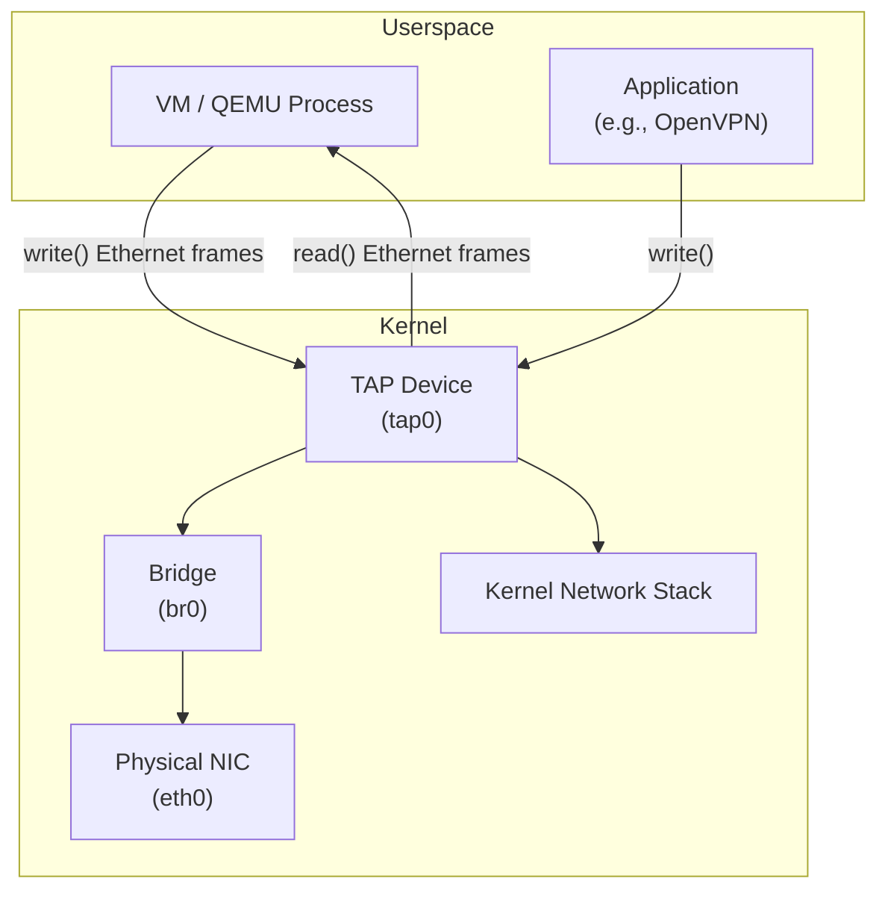
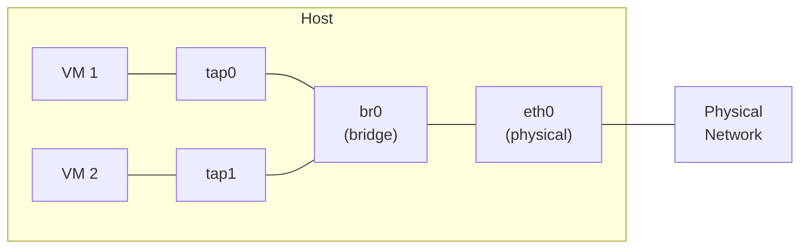
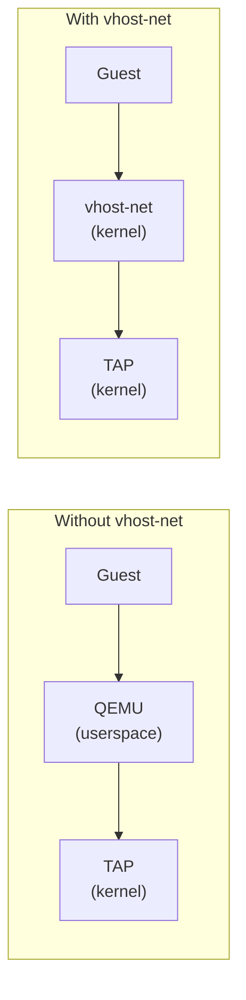

# TAP Interfaces in Linux

> Virtual network interfaces that operate at Layer 2 (Ethernet frames)

---

## 🎯 What is a TAP Interface?

A **TAP** (Network TAP) interface is a software-defined Layer 2 network device. It allows userspace programs to read and write raw Ethernet frames. TAP interfaces are the foundation of VM networking — hypervisors like QEMU/KVM use them to connect virtual machines to the host network stack.

There is also **TUN** (Network TUNnel), which operates at Layer 3 (IP packets). The key difference:

| Feature | TUN | TAP |
|---------|-----|-----|
| Layer | 3 (IP) | 2 (Ethernet) |
| Handles | IP packets | Ethernet frames |
| Has MAC address | No | Yes |
| Use case | VPN tunnels, routing | VM networking, bridging |
| Device path | `/dev/net/tun` | `/dev/net/tun` (same device, different mode) |

## 🔧 How TAP Interfaces Work



When a VM sends a packet:

1. QEMU writes an Ethernet frame to the TAP file descriptor
2. The kernel receives the frame on the TAP device
3. The frame enters the kernel network stack (bridging, routing, iptables)
4. The frame is forwarded to the physical NIC or another TAP device

When a packet arrives for the VM:

1. The physical NIC receives the frame
2. The bridge forwards it to the appropriate TAP device
3. The kernel queues the frame on the TAP device
4. QEMU reads the frame via `read()` on the file descriptor

## 📦 Creating and Managing TAP Interfaces

### Using `ip` commands

```bash
# Create a TAP interface
sudo ip tuntap add dev tap0 mode tap

# Bring it up
sudo ip link set tap0 up

# Assign an IP (optional, usually bridged instead)
sudo ip addr add 192.168.100.1/24 dev tap0

# Delete a TAP interface
sudo ip tuntap del dev tap0 mode tap

# List all TUN/TAP interfaces
ip tuntap show
```

### Assign to a specific user (for QEMU without root)

```bash
# Create TAP owned by user 'qemu'
sudo ip tuntap add dev tap0 mode tap user qemu

# Or by group
sudo ip tuntap add dev tap0 mode tap group kvm
```

### Persistent vs Transient TAP

```bash
# Persistent: survives process exit
sudo ip tuntap add dev tap0 mode tap

# Transient: created by QEMU, destroyed when VM stops
# (QEMU uses -netdev tap,id=net0,ifname=tap0,script=no,downscript=no)
```

## 🌉 Bridging TAP Interfaces

The most common setup — bridge TAP to physical NIC so VMs get real network access:

```bash
# Create a bridge
sudo ip link add br0 type bridge

# Add physical NIC to bridge
sudo ip link set eth0 master br0

# Add TAP interface to bridge
sudo ip link set tap0 master br0

# Bring everything up
sudo ip link set br0 up
sudo ip link set tap0 up

# Move IP from eth0 to br0
sudo ip addr del 192.168.1.10/24 dev eth0
sudo ip addr add 192.168.1.10/24 dev br0
sudo ip route add default via 192.168.1.1 dev br0
```



## 🚀 TAP with QEMU/KVM

### Basic QEMU with TAP

```bash
# Start VM with TAP networking
qemu-system-x86_64 \
    -enable-kvm \
    -m 2048 \
    -drive file=vm.qcow2,format=qcow2 \
    -netdev tap,id=mynet,ifname=tap0,script=no,downscript=no \
    -device virtio-net-pci,netdev=mynet,mac=52:54:00:12:34:56
```

### Using libvirt

```xml
<!-- In domain XML -->
<interface type='bridge'>
    <mac address='52:54:00:12:34:56'/>
    <source bridge='br0'/>
    <model type='virtio'/>
    <!-- libvirt auto-creates/destroys TAP interfaces -->
</interface>
```

### QEMU helper script (auto bridge)

```bash
# /etc/qemu-ifup (default script)
#!/bin/bash
switch=br0
ip link set $1 up
ip link set $1 master $switch
```

## 🔬 TAP Internals

### The `/dev/net/tun` Device

```c
// Opening a TAP device programmatically
#include <linux/if_tun.h>
#include <net/if.h>
#include <fcntl.h>
#include <sys/ioctl.h>

int tun_alloc(char *dev) {
    struct ifreq ifr;
    int fd, err;

    fd = open("/dev/net/tun", O_RDWR);

    memset(&ifr, 0, sizeof(ifr));
    ifr.ifr_flags = IFF_TAP | IFF_NO_PI;  // TAP mode, no packet info header
    strncpy(ifr.ifr_name, dev, IFNAMSIZ);

    err = ioctl(fd, TUNSETIFF, (void *)&ifr);
    if (err < 0) { close(fd); return err; }

    strcpy(dev, ifr.ifr_name);
    return fd;
}

// Now read/write Ethernet frames on fd
// write(fd, frame, frame_len);  // inject frame into kernel
// read(fd, buf, sizeof(buf));   // receive frame from kernel
```

### Key flags

| Flag | Description |
|------|-------------|
| `IFF_TUN` | TUN device (Layer 3) |
| `IFF_TAP` | TAP device (Layer 2) |
| `IFF_NO_PI` | No extra packet info header |
| `IFF_MULTI_QUEUE` | Multi-queue support (kernel 3.8+) |
| `IFF_VNET_HDR` | Virtio-net header for offloading |

### Multi-queue TAP

Modern VMs use multiple queues for performance:

```bash
# QEMU with multi-queue TAP
qemu-system-x86_64 \
    -netdev tap,id=mynet,ifname=tap0,script=no,queues=4 \
    -device virtio-net-pci,netdev=mynet,mq=on,vectors=10
```

## ⚡ Performance Considerations

| Approach | Throughput | Latency | Use Case |
|----------|-----------|---------|----------|
| TAP + bridge | Good | Medium | General VM networking |
| TAP + macvtap | Better | Lower | Direct NIC attachment |
| TAP + vhost-net | Best (kernel) | Low | Production KVM |
| SR-IOV passthrough | Wire speed | Lowest | NFV, DPDK workloads |

### vhost-net acceleration

```bash
# Enable vhost-net (moves TAP processing to kernel thread)
qemu-system-x86_64 \
    -netdev tap,id=mynet,ifname=tap0,script=no,vhost=on \
    -device virtio-net-pci,netdev=mynet
```

With vhost-net, the data path bypasses QEMU userspace:



### macvtap (TAP + macvlan combined)

```bash
# Create macvtap directly attached to physical NIC
sudo ip link add link eth0 name macvtap0 type macvtap mode bridge

# Use with QEMU
qemu-system-x86_64 \
    -netdev tap,id=mynet,fd=3 3<>/dev/tap$(cat /sys/class/net/macvtap0/ifindex) \
    -device virtio-net-pci,netdev=mynet
```

## 🐛 Troubleshooting

```bash
# Check TAP interface exists and is UP
ip link show tap0

# Check bridge membership
bridge link show

# Capture traffic on TAP interface
tcpdump -i tap0 -nn

# Check if vhost-net module is loaded
lsmod | grep vhost_net

# Verify TAP permissions
ls -la /dev/net/tun
# Should be: crw-rw-rw- 1 root root 10, 200

# Check for packet drops
cat /sys/class/net/tap0/statistics/rx_dropped
cat /sys/class/net/tap0/statistics/tx_dropped
```

## 🔗 Related Topics

- [Virtual Switches](virtual-switches.md) — OVS and Linux bridge
- [Virtio Networking](virtio.md) — Frontend/backend architecture
- [SR-IOV](sriov.md) — Hardware-accelerated alternative
- [VM Packet Walk](vm-packet-walk.md) — Full packet path through the stack
