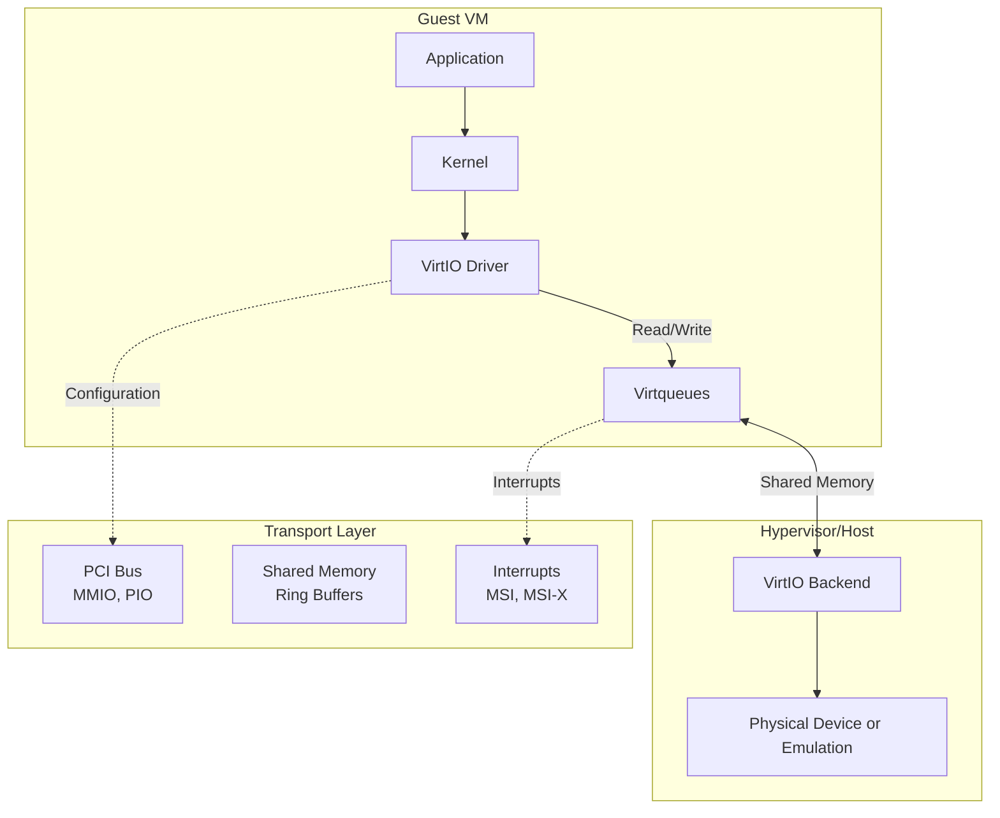
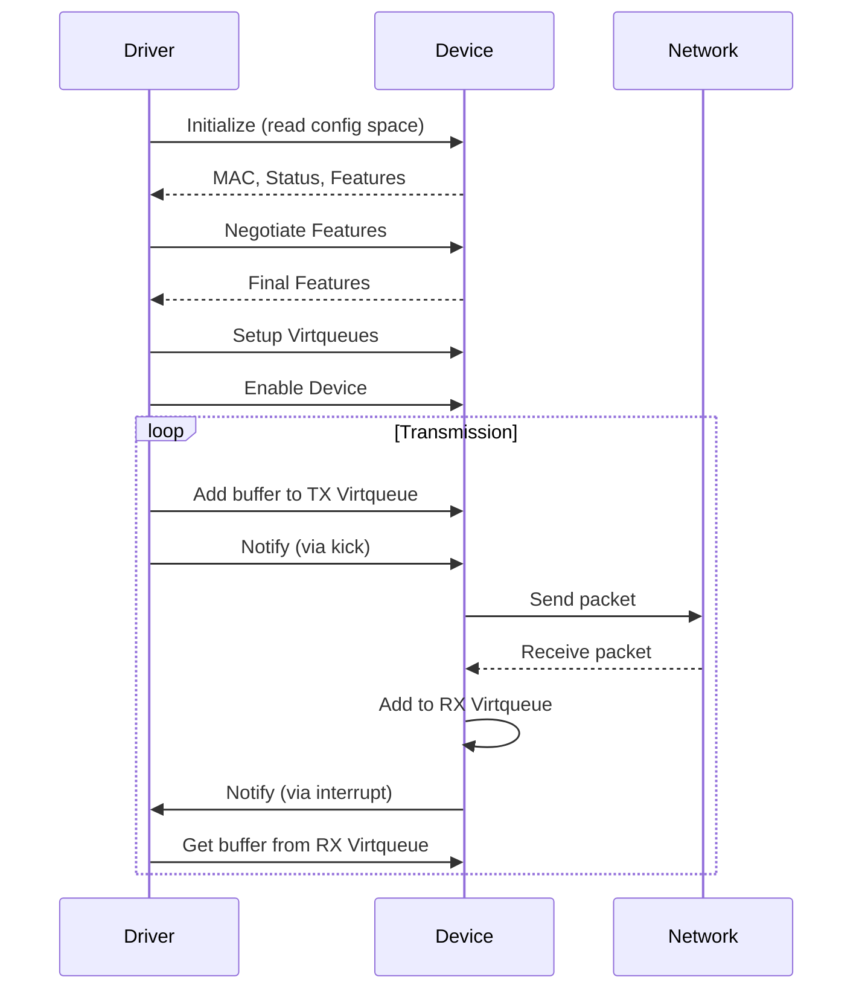
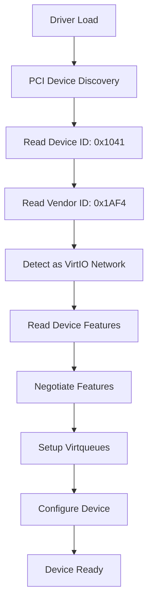
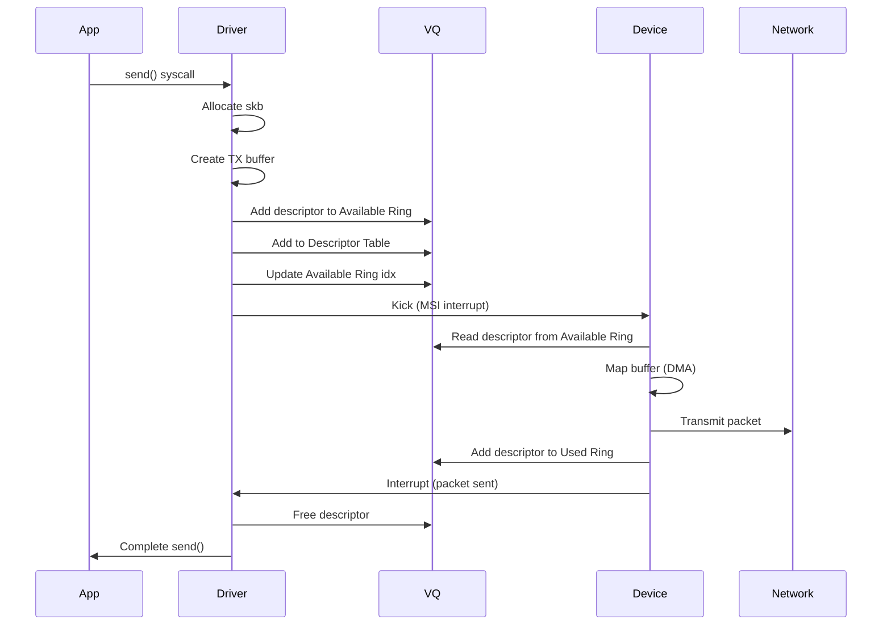
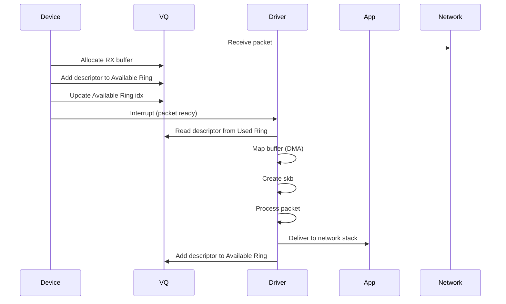
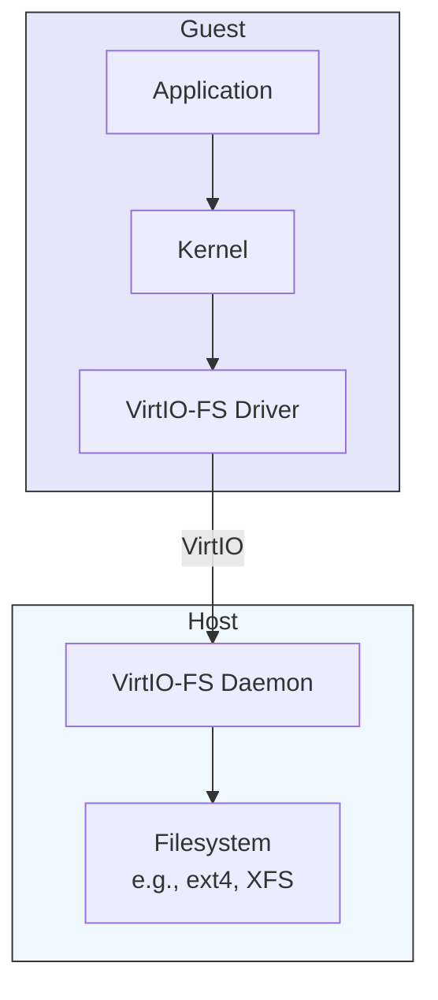
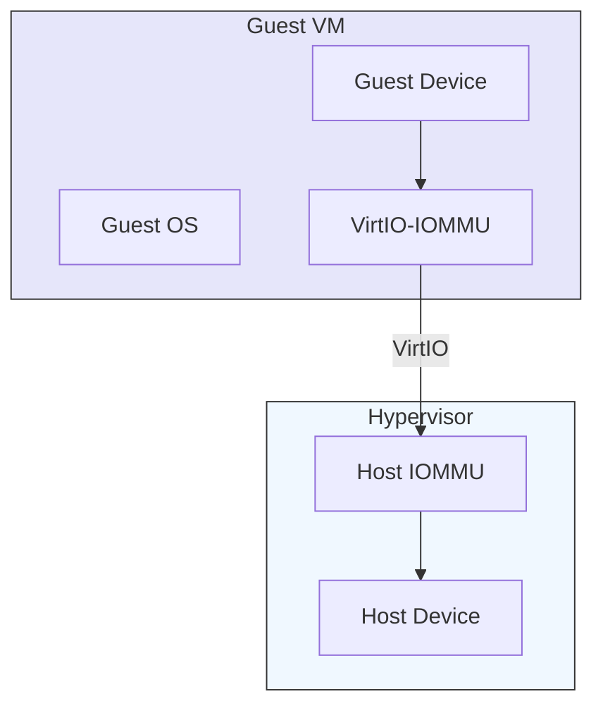

# VirtIO: Virtualization I/O

> **Purpose**: Understand VirtIO, the standardized I/O virtualization framework that provides high-performance, para-virtualized device drivers for virtual machines, enabling near-native performance for network and storage operations in virtualized environments.

---

## 📋 Overview

**VirtIO** is a **virtualization standard** that defines a common interface for virtual devices, allowing guest operating systems to communicate efficiently with the hypervisor. It provides **para-virtualized (PV) drivers** that are aware they're running in a virtual environment, enabling much higher performance than emulated devices.

### The Virtualization I/O Problem

Traditional virtualization approaches have performance challenges:

```mermaid
graph TD
    subgraph Emulation[Full Device Emulation]
        Guest[Guest OS] --> EmulatedDev[Emulated Device\nSoftware]
        EmulatedDev --> Hypervisor[Hypervisor\nSoftware]
        Hypervisor --> PhysicalDev[Physical Device\nHardware]
        
        style Emulation fill:#fdd,stroke:#333
    end
    
    subgraph ParaVirtualization[Para-Virtualization (VirtIO)]
        Guest2[Guest OS] --> VD[VirtIO Driver\nGuest]
        VD --> VH[VirtIO Hypervisor\nHost]
        VH --> PhysicalDev2[Physical Device\nHardware]
        
        style ParaVirtualization fill:#dfd,stroke:#333
    end
```

| Approach | Performance | CPU Usage | Complexity | Example |
|----------|-------------|----------|------------|---------|
| **Full Emulation** | ⭐ Low | ⭐⭐⭐⭐ High | ⭐⭐⭐ High | QEMU device emulation |
| **Pass-through** | ⭐⭐⭐⭐⭐ High | ⭐ Low | ⭐⭐ Medium | PCI pass-through, SR-IOV |
| **Para-virtualization** | ⭐⭐⭐⭐ High | ⭐⭐ Medium | ⭐⭐⭐ Medium | **VirtIO** |

### What is VirtIO?

**VirtIO** is:
1. **A specification**: Defines a standard interface for virtual devices
2. **A set of drivers**: Guest OS drivers that use the VirtIO interface
3. **A device model**: Standard device types (network, block, console, etc.)
4. **A transport**: How data is exchanged between guest and host (PCI, MMIO)

**VirtIO Goals**:
- ✅ **High performance**: Near-native I/O performance
- ✅ **Portability**: Works across hypervisors (KVM, Xen, VMware, Hyper-V, etc.)
- ✅ **Simplicity**: Simple, well-defined interface
- ✅ **Extensibility**: Support for new device types
- ✅ **Standardization**: Open standard (OASIS VirtIO specification)

### VirtIO Architecture



### VirtIO Components

| Component | Location | Purpose |
|-----------|----------|---------|
| **Frontend Driver** | Guest OS | Device driver that uses VirtIO interface |
| **Backend Device** | Host/Hypervisor | Implements the actual device functionality |
| **Virtqueues** | Shared Memory | Ring buffers for data exchange |
| **Configuration Space** | PCI MMIO | Device configuration and discovery |
| **Notify Mechanism** | Interrupts | Signal data availability |

---

## 🏗️ VirtIO Specification

### VirtIO Standardization

The VirtIO specification is developed by the **OASIS Open** standards body:

| Version | Date | Key Features |
|---------|------|---------------|
| **VirtIO 1.0** | Feb 2016 | Initial specification |
| **VirtIO 1.1** | Feb 2019 | Packed virtqueues, new device types |
| **VirtIO 1.2** | Oct 2021 | Additional device types, enhancements |

**Specification Documents**:
- [VirtIO 1.2 Specification](https://docs.oasis-open.org/virtio/virtio/v1.2/virtio-v1.2.pdf)
- [VirtIO Device Types](https://docs.oasis-open.org/virtio/virtio/v1.2/virtio-v1.2.html)
- [VirtIO GitHub](https://github.com/oasis-tcs/virtio-spec)

### VirtIO Device Types

| Device Type ID | Device Type | Description | Use Case |
|----------------|-------------|-------------|----------|
| 1 | Network | Virtual network interface | VM networking |
| 2 | Block | Virtual disk/block device | VM storage |
| 3 | Console | Serial console | Debugging, management |
| 4 | Entropy | Random number generator | Cryptographic operations |
| 5 | Memory Balloon | Memory management | Dynamic memory allocation |
| 6 | I/O Memory | Memory access | PCI device passthrough |
| 7 | RPC | Remote procedure call | Guest-host communication |
| 8 | SCSI | SCSI host controller | SCSI device access |
| 9 | 9P Transport | Plan 9 file system | Shared filesystem |
| 10 | MAC address filter | MAC filtering | Network filtering |
| 11 | Input | Input devices | Keyboard, mouse |
| 12 | Signal | POSIX signals | Signal delivery |
| 13 | Memory | Memory sharing | Inter-VM shared memory |
| 16 | GPU | GPU device | GPU acceleration |
| 17 | Timer/Clock | Timer device | High-resolution timers |
| 18 | Input (legacy) | Legacy input | Older input devices |
| 19 | Sound | Audio device | Sound card emulation |
| 20 | Memory balloon (legacy) | Legacy memory balloon | Older memory management |
| 21 | Network (legacy) | Legacy network | Older network devices |

### VirtIO Network Device (Type 1)

The **VirtIO Network Device** is the most commonly used VirtIO device type.

#### Network Device Features

| Feature | Description | Negotiable |
|---------|-------------|------------|
| **MAC Address** | Device MAC address | ❌ Fixed |
| **Status** | Link status (up/down) | ❌ Fixed |
| **MTU** | Maximum Transmission Unit | ✅ Yes |
| **Speed/Duplex** | Link speed and duplex | ✅ Yes |
| **VLAN Filtering** | Filter VLAN tags | ✅ Yes |
| **Mac Filtering** | Filter MAC addresses | ✅ Yes |
| **Tuning** | TX/RX queue sizes | ✅ Yes |
| **Offloads** | Checksum, TSO, GSO, etc. | ✅ Yes |
| **MQ (Multi-Queue)** | Multiple TX/RX queues | ✅ Yes |
| **Ctrl VQ** | Control virtqueue | ✅ Yes |

#### Network Device Operation



**Virtqueue Structure**:

Each virtqueue is a **ring buffer** with three components:
1. **Descriptor Table**: Array of buffer descriptors
2. **Available Ring**: Buffers available for device to use (TX) or driver to use (RX)
3. **Used Ring**: Buffers used by device (RX) or driver (TX)

```
Descriptor Table:
+----------------+----------------+----------------+
| addr (64-bit)  | len (32-bit)   | flags (16-bit) |
|                |                | next (16-bit)  |
+----------------+----------------+----------------+

Available Ring:
+----------------+----------------+
| flags (16-bit) | idx (16-bit)   |
| id (16-bit)    | reserved (16)  |
+----------------+----------------+

Used Ring:
+----------------+----------------+
| id (32-bit)    | len (32-bit)   |
+----------------+----------------+
```

**Descriptor Flags**:
- `VIRTQ_DESC_F_NEXT` (1): Chained descriptor
- `VIRTQ_DESC_F_WRITE` (2): Device writes only (RX)
- `VIRTQ_DESC_F_INDIRECT` (4): Indirect descriptor

### VirtIO Block Device (Type 2)

The **VirtIO Block Device** provides virtual disk/block storage.

#### Block Device Features

| Feature | Description | Negotiable |
|---------|-------------|------------|
| **Capacity** | Disk size in sectors | ❌ Fixed |
| **Sector Size** | Size of each sector | ✅ Yes |
| **Max Segments** | Max segments per request | ✅ Yes |
| **Max Segment Size** | Max size of each segment | ✅ Yes |
| **Total Segments** | Max total segments | ✅ Yes |
| **Geometry** | Cylinder/head/sector | ✅ Yes |
| **Read-only** | Device is read-only | ❌ Fixed |
| **BLK_SIZE** | Block size | ✅ Yes |
| **Topology** | Device topology info | ✅ Yes |
| **Write Cache** | Write-back cache control | ✅ Yes |
| **Discard** | Support discard/write zeroes | ✅ Yes |
| **Writeback** | Flush cache | ✅ Yes |

#### Block Device Operation

```
VirtIO Block Request:
+------------------+------------------+------------------+
| Type (1 byte)    | Reserved (3)     | Sector (64-bit)  |
+------------------+------------------+------------------+
| Sector Count (32-bit)              | Reserved (12)    |
+------------------------------------+------------------+

Request Types:
- VIRTIO_BLK_T_IN = 0 (Read)
- VIRTIO_BLK_T_OUT = 1 (Write)
- VIRTIO_BLK_T_FLUSH = 4 (Flush)
- VIRTIO_BLK_T_DISCARD = 11 (Discard)
- VIRTIO_BLK_T_WRITE_ZEROES = 13 (Write Zeroes)
```

### VirtIO Transports

VirtIO defines **transport mechanisms** for how data is exchanged between guest and host:

| Transport | Description | Use Case | Performance |
|-----------|-------------|----------|-------------|
| **PCI** | Standard PCI bus | Most common | ⭐⭐⭐⭐⭐ |
| **MMIO** | Memory-mapped I/O | Simpler devices | ⭐⭐⭐⭐ |
| **Channel I/O** | IBM s390 channel | IBM mainframes | ⭐⭐⭐ |
| **CCW** | IBM s390 CCW | IBM mainframes | ⭐⭐⭐ |

**PCI Transport**:
- Most common transport for VirtIO
- Uses standard PCI configuration space
- Supports MSI and MSI-X interrupts
- Works with PCIe devices

**Configuration Space Layout**:
```
+------------------+------------------+------------------+
| Device ID (16)   | Vendor ID (16)   |                  |
+------------------+------------------+------------------+
| Command (16)     | Status (16)      |                  |
+------------------+------------------+------------------+
| Class Code (8)   | Subclass (8)     | Prog IF (8)      |
+------------------+------------------+------------------+
| BIST (8)         | Header Type (8)  | Latency Timer    |
| Cache Line Size  |                  |                  |
+------------------+------------------+------------------+
| BARs (Base Address Registers)       |                  |
+------------------+------------------+------------------+
| Capabilities Pointer                |                  |
+------------------+------------------+------------------+
| VirtIO Specific:                                       |
|   Device Features (32-bit)                             |
|   Guest Features (32-bit)                              |
|   Device Config (variable)                             |
+------------------+------------------+------------------+
```

---

## 🎯 VirtIO Networking Deep Dive

### VirtIO Network Device (virtio-net)

The **virtio-net** device is the most widely used VirtIO device, providing virtual network interfaces to guest VMs.

#### Device Initialization



**Feature Negotiation**:

```c
// Feature bits (32-bit)
#define VIRTIO_NET_F_CSUM          0  // Host handles csum
#define VIRTIO_NET_F_GUEST_CSUM     1  // Guest handles csum
#define VIRTIO_NET_F_MTU           3  // MTU in config
#define VIRTIO_NET_F_MAC           5  // Host provides MAC
#define VIRTIO_NET_F_GSO           6  // Guest handles TSO
#define VIRTIO_NET_F_GUEST_TSO4    7  // Guest handles IPv4 TSO
#define VIRTIO_NET_F_GUEST_TSO6    8  // Guest handles IPv6 TSO
#define VIRTIO_NET_F_GUEST_ECN      9  // Guest handles ECN
#define VIRTIO_NET_F_GUEST_UFO     10  // Guest handles UFO
#define VIRTIO_NET_F_HOST_TSO4     11  // Host handles IPv4 TSO
#define VIRTIO_NET_F_HOST_TSO6     12  // Host handles IPv6 TSO
#define VIRTIO_NET_F_HOST_ECN      13  // Host handles ECN
#define VIRTIO_NET_F_HOST_UFO     14  // Host handles UFO
#define VIRTIO_NET_F_MRG_RXBUF     15  // Mergeable receive buffers
#define VIRTIO_NET_F_STATUS        16  // Status field available
#define VIRTIO_NET_F_CTRL_VQ      17  // Control virtqueue
#define VIRTIO_NET_F_CTRL_RX       18  // Control channel RX mode
#define VIRTIO_NET_F_CTRL_VLAN     19  // Control channel VLAN
#define VIRTIO_NET_F_CTRL_RX_EXTRA 20  // Extra RX mode control
#define VIRTIO_NET_F_GUEST_ANNOUNCE 21  // Guest announces queue sizes
#define VIRTIO_NET_F_MQ            22  // Multi-queue
#define VIRTIO_NET_F_CTRL_MAC_ADDR 23  // MAC address filtering
```

#### Network Device Configuration

The **configuration space** for virtio-net contains:

```c
struct virtio_net_config {
    /* MAC address (6 bytes) */
    uint8_t mac[6];
    
    /* Status (16 bits) */
    uint16_t status;
    
    /* Max virtqueue pairs (16 bits) */
    uint16_t max_virtqueue_pairs;
    
    /* MTU (16 bits, if VIRTIO_NET_F_MTU negotiated) */
    uint16_t mtu;
    
    /* Speed (32 bits, if VIRTIO_NET_F_SPEED_DUPLEX negotiated) */
    uint32_t speed;
    
    /* Duplex (8 bits) */
    uint8_t duplex;
};

/* Status flags */
#define VIRTIO_NET_S_LINK_UP     1
#define VIRTIO_NET_S_ANNOUNCE    2
```

#### Multi-Queue Support

**Multi-Queue (MQ)** allows using multiple TX/RX virtqueues for better performance:

```
With MQ:
- Multiple RX virtqueues (one per CPU core)
- Multiple TX virtqueues (one per CPU core)
- Reduces lock contention
- Improves scalability
- Better CPU affinity

Without MQ:
- Single RX virtqueue
- Single TX virtqueue
- Lock contention on high traffic
- Poor scalability
```

**MQ Configuration**:
```bash
# QEMU command-line for MQ
qemu-system-x86_64 \
    -device virtio-net-pci,netdev=net0,mq=on,vectors=6 \
    -netdev user,id=net0
```

**Driver Configuration (Linux)**:
```bash
# Enable multi-queue in guest
ethtool -L eth0 combined 4

# Check queue count
ethtool -l eth0
```

#### Offloading Features

VirtIO network devices support various offloading features to improve performance:

| Offload | Description | Feature Bit | Performance Impact |
|---------|-------------|-------------|---------------------|
| **Checksum Offload** | Guest or host computes checksums | VIRTIO_NET_F_CSUM, VIRTIO_NET_F_GUEST_CSUM | Reduces CPU usage |
| **TSO (TCP Segmentation Offload)** | Guest segments large TCP packets | VIRTIO_NET_F_GSO, VIRTIO_NET_F_GUEST_TSO4/6 | Reduces CPU, improves throughput |
| **UFO (UDP Fragmentation Offload)** | Guest fragments large UDP packets | VIRTIO_NET_F_GUEST_UFO | Reduces CPU |
| **GSO (Generic Segmentation Offload)** | Generic segmentation | VIRTIO_NET_F_GSO | Flexible offload |
| **ECN (Explicit Congestion Notification)** | ECN support | VIRTIO_NET_F_GUEST_ECN, VIRTIO_NET_F_HOST_ECN | Better congestion control |

**Offload Configuration (QEMU)**:
```bash
qemu-system-x86_64 \
    -device virtio-net-pci,netdev=net0 \
    csum=on,gso=on,tso4=on,tso6=on,ecn=on,uf o=on
```

#### Virtqueue Operation

**TX (Transmit) Path**:



**RX (Receive) Path**:



### Performance Optimization

#### Packed Virtqueues

**Packed Virtqueues** (VirtIO 1.1+) are an optimization that reduces memory usage and improves performance:

| Feature | Split Virtqueues | Packed Virtqueues |
|---------|-------------------|-------------------|
| **Memory Usage** | Higher (3 rings per VQ) | Lower (1 ring per VQ) |
| **Cache Efficiency** | Lower (more cache misses) | Higher (better locality) |
| **Descriptor Format** | Separate available/used rings | Single ring with flags |
| **Complexity** | Simple | More complex |
| **Performance** | Good | Better |

**Packed Virtqueue Descriptor**:
```
+----------------+----------------+----------------+
| id (16-bit)    | len (16-bit)   | flags (16-bit) |
+----------------+----------------+----------------+

Flags:
- VIRTQ_DESC_F_NEXT (1): Chained descriptor
- VIRTQ_DESC_F_WRITE (2): Device writes only
- VIRTQ_DESC_F_INDIRECT (4): Indirect descriptor

Descriptor Chain:
[Desc 0] -> [Desc 1] -> [Desc 2] -> ... -> [Desc N]
Each descriptor has NEXT flag set (except last)
```

**Enable Packed Virtqueues (QEMU)**:
```bash
qemu-system-x86_64 \
    -device virtio-net-pci,packed=on,netdev=net0
```

**Enable Packed Virtqueues (Guest)**:
```bash
# Linux kernel 5.0+
# Packed virtqueues are negotiated automatically
# Check if enabled
cat /sys/module/virtio_net/parameters/packed
```

#### In-Order Virtqueues

**In-Order Virtqueues** ensure that packets are processed in order, which is important for some protocols:

```bash
qemu-system-x86_64 \
    -device virtio-net-pci,in_order=on,netdev=net0
```

#### Event Index

**Event Index** reduces the number of interrupts by tracking where the driver/device last processed:

```bash
qemu-system-x86_64 \
    -device virtio-net-pci,event_idx=on,netdev=net0
```

#### Mergeable RX Buffers

**Mergeable RX Buffers** allows the host to merge multiple RX buffers into a single packet:

```bash
qemu-system-x86_64 \
    -device virtio-net-pci,mergeable_rxbuf=on,netdev=net0
```

#### Vhost Acceleration

**vhost** is a Linux kernel module that accelerates VirtIO by moving the virtqueue processing from userspace (QEMU) to kernel space:

```
+----------------+----------------+----------------+
| Guest VM       | QEMU           | Kernel         |
+----------------+----------------+----------------+
| VirtIO Driver  | Userspace      | vhost-net      |
|                |                | Kernel Module  |
+----------------+----------------+----------------+
| Virtqueues     | QEMU Manages   | Kernel Manages |
|                | (Slow)         | (Fast)         |
+----------------+----------------+----------------+

Without vhost:
- QEMU handles all virtqueue operations
- Context switches between guest and QEMU
- High overhead

With vhost:
- Kernel handles virtqueue operations
- Reduced context switches
- Near-native performance
```

**vhost Configuration**:
```bash
# Load vhost modules
sudo modprobe vhost
sudo modprobe vhost_net

# Check modules
lsmod | grep vhost

# QEMU with vhost
qemu-system-x86_64 \
    -device virtio-net-pci,netdev=net0 \
    -netdev tap,id=net0,vhost=on,script=no,downscript=no
```

**vhost vs vhost-user**:
- **vhost**: Kernel-based acceleration for Linux hosts
- **vhost-user**: Userspace-based acceleration for DPDK, OVS-DPDK, etc.

**vhost-user Configuration (DPDK)**:
```bash
# Start QEMU with vhost-user
qemu-system-x86_64 \
    -chardev socket,id=char0,path=/var/run/openvswitch/vhostqem u-1 \
    -netdev vhost-user,id=net0,chardev=char0 \
    -device virtio-net-pci,netdev=net0

# Start OVS with DPDK
ovs-vsctl add-port br0 dpdkvhostuser0 \
    -- set interface dpdkvhostuser0 type=dpdkvhostuser \
    -- set interface dpdkvhostuser0 options:vhost-server-path=/var/run/openvswitch/vhostqemu-1
```

#### DPDK with VirtIO

**DPDK** (Data Plane Development Kit) provides high-performance packet processing with VirtIO:

```
+----------------+----------------+----------------+
| Guest VM       | DPDK App       | Kernel         |
+----------------+----------------+----------------+
| DPDK Poll Mode | Userspace      | vhost-user     |
| Driver         |                | Kernel Module  |
+----------------+----------------+----------------+

- DPDK app polls virtqueues directly
- No kernel networking stack involved
- Zero-copy between guest and host
- Line-rate performance
```

**DPDK Configuration**:
```bash
# Load DPDK modules
sudo modprobe uio
sudo modprobe vfio
sudo modprobe vfio-pci

# Bind NIC to DPDK
sudo dpdk-devbind.py -b vfio-pci 0000:01:00.0

# Run DPDK testpmd with VirtIO
sudo ./testpmd -l 0-3 -n 4 \
    -a 0000:01:00.0 \
    --vdev eth_vhost0,iface=/tmp/sock0 \
    -- -i
```

---

## 🎯 VirtIO vs Other Virtualization I/O Approaches

### Comparison Table

| Approach | Performance | CPU Overhead | Complexity | Use Case |
|----------|-------------|--------------|------------|----------|
| **Full Emulation** | ⭐ Low | ⭐⭐⭐⭐ High | ⭐⭐⭐ High | Legacy, compatibility |
| **VirtIO** | ⭐⭐⭐⭐ High | ⭐⭐ Medium | ⭐⭐ Medium | General purpose, high performance |
| **SR-IOV** | ⭐⭐⭐⭐⭐ Very High | ⭐ Low | ⭐⭐⭐ Medium | Low-latency, high-throughput |
| **PCI Pass-through** | ⭐⭐⭐⭐⭐ Very High | ⭐ Low | ⭐ Low | Dedicated device access |
| **vhost** | ⭐⭐⭐⭐⭐ Very High | ⭐ Low | ⭐⭐ Medium | Linux hosts, high performance |
| **vhost-user** | ⭐⭐⭐⭐⭐ Very High | ⭐ Low | ⭐⭐⭐ High | DPDK, OVS-DPDK |

### VirtIO vs SR-IOV

| Feature | VirtIO | SR-IOV |
|---------|--------|--------|
| **Performance** | ⭐⭐⭐⭐ High | ⭐⭐⭐⭐⭐ Very High |
| **Sharing** | ✅ Shared device | ❌ Dedicated VF per VM |
| **Flexibility** | ✅ High (software) | ⚠️ Limited (hardware) |
| **Live Migration** | ✅ Supported | ❌ Not supported |
| **Resource Usage** | ⭐⭐ Medium | ⭐⭐⭐ High (many VFs) |
| **Complexity** | ⭐⭐ Medium | ⭐⭐⭐ High |
| **Hardware Support** | ✅ Software-only | ❌ Requires NIC support |
| **Queue Count** | Flexible (1-16+) | Fixed by hardware |

**Use Cases**:
- **VirtIO**: General purpose, live migration, most workloads
- **SR-IOV**: High-performance, low-latency, static workloads
- **Both**: Use SR-IOV for high-performance VFs + VirtIO for management

### VirtIO vs PCI Pass-through

| Feature | VirtIO | PCI Pass-through |
|---------|--------|-----------------|
| **Performance** | ⭐⭐⭐⭐ High | ⭐⭐⭐⭐⭐ Native |
| **Isolation** | ✅ Software isolation | ✅ Hardware isolation |
| **Flexibility** | ✅ High | ❌ Limited |
| **Live Migration** | ✅ Supported | ❌ Not supported |
| **Resource Sharing** | ✅ Shared | ❌ Dedicated |
| **Hardware Support** | ✅ Software-only | ❌ Requires IOMMU |
| **Security** | ✅ Good | ⚠️ Requires IOMMU/ACS |

**Use Cases**:
- **VirtIO**: Most workloads, live migration required
- **PCI Pass-through**: Highest performance, dedicated devices, no migration

---

## 🔧 VirtIO Configuration Examples

### QEMU/KVM Configuration

**Basic VirtIO Network Configuration**:
```bash
qemu-system-x86_64 \
    -m 4G \
    -smp 4 \
    -drive file=ubuntu.qcow2,format=qcow2,if=virtio \
    -netdev user,id=net0 \
    -device virtio-net-pci,netdev=net0
```

**Advanced VirtIO Network Configuration**:
```bash
qemu-system-x86_64 \
    -m 8G \
    -smp 8 \
    -drive file=ubuntu.qcow2,format=qcow2,if=virtio \
    -netdev tap,id=net0,ifname=tap0,script=no,downscript=no \
    -device virtio-net-pci,netdev=net0 \
        mq=on,vectors=10 \
        csum=on,gso=on,tso4=on,tso6=on,ecn=on,ufo=on \
        mergeable_rxbuf=on \
        event_idx=on \
        packed=on \
        in_order=on
```

**VirtIO with vhost**:
```bash
qemu-system-x86_64 \
    -device virtio-net-pci,netdev=net0 \
    -netdev tap,id=net0,ifname=tap0,vhost=on,script=no,downscript=no
```

**VirtIO with SR-IOV (VFIO)**:
```bash
# First, pass through a VF to the guest
qemu-system-x86_64 \
    -device vfio-pci,host=0000:01:10.0 \
    -device virtio-net-pci,netdev=net0
```

### Libvirt Configuration

**Libvirt XML for VirtIO Network**:
```xml
<interface type='network'>
  <mac address='52:54:00:12:34:56'/>
  <source network='default'/>
  <model type='virtio'/>
  <driver queues='4'/> <!-- Multi-queue -->
  <mtu size='9000'/>
</interface>
```

**Libvirt XML with vhost**:
```xml
<interface type='network'>
  <mac address='52:54:00:12:34:56'/>
  <source network='default'/>
  <model type='virtio'/>
  <driver queues='4' vhost='on'/>
</interface>
```

**Libvirt XML with SR-IOV (VFIO)**:
```xml
<interface type='hostdev' managed='yes'>
  <mac address='52:54:00:12:34:56'/>
  <source>
    <address type='pci' domain='0x0000' bus='0x01' slot='0x10' function='0x0'/>
  </source>
  <model type='virtio'/>
</interface>
```

### Guest OS Configuration

**Linux Kernel Modules**:
```bash
# Load VirtIO modules
sudo modprobe virtio
sudo modprobe virtio_pci
sudo modprobe virtio_net
sudo modprobe virtio_blk
sudo modprobe virtio_console

# Check loaded modules
lsmod | grep virtio
```

**Kernel Boot Parameters**:
```bash
# Enable VirtIO drivers in initramfs
# For Ubuntu/Debian
sudo update-initramfs -u

# Boot parameters for VirtIO
GRUB_CMDLINE_LINUX="root=/dev/vda1 ro virtio_pci.disable_legacy=1"
```

**Check VirtIO Devices**:
```bash
# List VirtIO devices
lspci | grep -i virtio

# Check network interface
ip link show
ethtool -i eth0

# Check block devices
lsblk
ls /dev/vd*

# Check VirtIO features
ethtool -k eth0
```

**Tune VirtIO Performance (Linux)**:
```bash
# Increase RX/TX ring sizes
sudo ethtool -G eth0 rx 4096 tx 4096

# Enable multi-queue
sudo ethtool -L eth0 combined 8

# Enable offloading
sudo ethtool -K eth0 tx on rx on sg on tso on gso on gro on

# Check current settings
ethtool -g eth0
ethtool -l eth0
ethtool -k eth0
```

### Hypervisor Configuration

**Enable vhost in Linux Kernel**:
```bash
# Check vhost support
grep -E 'CONFIG_VHOST_NET|CONFIG_VHOST' /proc/config.gz

# Load vhost modules
sudo modprobe vhost
sudo modprobe vhost_net

# Make persistent
sudo echo 'vhost' >> /etc/modules
sudo echo 'vhost_net' >> /etc/modules
```

**vhost Threads**:
```bash
# Check vhost threads
ps aux | grep vhost

# Set vhost threads (per CPU)
for i in $(seq 0 $(nproc --all -1)); do
    echo "Setting vhost thread $i"
done
```

---

## 📊 Performance Comparison

### Throughput Comparison

| Device Type | Max Throughput | CPU Usage | Latency |
|-------------|----------------|-----------|---------|
| **Emulated (e1000)** | ~100 Mbps | ⭐⭐⭐⭐ High | ⭐ High |
| **VirtIO (no vhost)** | ~1-5 Gbps | ⭐⭐ Medium | ⭐⭐ Medium |
| **VirtIO + vhost** | ~10-40 Gbps | ⭐ Low | ⭐⭐ Low |
| **VirtIO + vhost-user + DPDK** | ~40-100 Gbps | ⭐ Low | ⭐ Very Low |
| **SR-IOV** | ~10-80 Gbps | ⭐ Very Low | ⭐ Very Low |
| **PCI Pass-through** | Line rate | ⭐ Very Low | ⭐ Very Low |

### Latency Comparison

| Device Type | P50 Latency | P99 Latency | P99.9 Latency |
|-------------|-------------|-------------|---------------|
| **Emulated (e1000)** | ~50-100μs | ~500μs | ~1-2ms |
| **VirtIO (no vhost)** | ~20-50μs | ~200-500μs | ~500-1000μs |
| **VirtIO + vhost** | ~10-20μs | ~100-200μs | ~200-500μs |
| **VirtIO + vhost-user + DPDK** | ~5-10μs | ~50-100μs | ~100-200μs |
| **SR-IOV** | ~3-8μs | ~20-50μs | ~50-100μs |
| **PCI Pass-through** | ~2-5μs | ~10-30μs | ~30-80μs |
| **Physical NIC** | ~1-3μs | ~5-20μs | ~20-50μs |

### CPU Usage Comparison

| Device Type | CPU per Gbps | Context Switches |
|-------------|--------------|------------------|
| **Emulated (e1000)** | ~20-30% | ⭐⭐⭐⭐ High |
| **VirtIO (no vhost)** | ~5-10% | ⭐⭐ Medium |
| **VirtIO + vhost** | ~1-3% | ⭐ Low |
| **VirtIO + vhost-user + DPDK** | ~0.5-1% | ⭐ Very Low |
| **SR-IOV** | ~0.1-0.5% | ⭐ Very Low |
| **PCI Pass-through** | ~0.1% | ⭐ Very Low |

---

## 🛡️ VirtIO Security

### Security Considerations

| Concern | Risk | Mitigation |
|---------|------|------------|
| **Shared Memory Attacks** | Guest accesses host memory | IOMMU, memory isolation |
| **Virtqueue Overflows** | Buffer overflow in virtqueue | Bounds checking, input validation |
| **Interrupt Storms** | Guest floods host with interrupts | Rate limiting, coalescing |
| **Device Emulation Bugs** | Bugs in VirtIO implementation | Use latest versions, security patches |
| **Side-Channel Attacks** | Timing attacks, cache attacks | Constant-time operations, cache isolation |
| **Denial of Service** | Guest consumes host resources | Resource limits, QoS |

### Security Best Practices

✅ **Use IOMMU**:
- Intel VT-d or AMD-Vi
- Isolates DMA from devices
- Prevents memory access from unauthorized devices

**Enable IOMMU (Linux)**:
```bash
# Check IOMMU support
sudo dmesg | grep -i iommu
sudo lspci -vvv | grep -i iommu

# Enable IOMMU in kernel
# Intel: intel_iommu=on
# AMD: amd_iommu=on
# ARM: iommu.passthrough=on

# Check IOMMU groups
dmesg | grep -i iommu
ls /sys/kernel/iommu_groups/
```

✅ **Enable ACS (Access Control Services)**:
- Prevents peer-to-peer DMA between devices
- Required for secure PCI pass-through

**Check ACS Support**:
```bash
# Check if ACS is enabled
sudo dmesg | grep -i acs
sudo lspci -vvv | grep -i acs
```

✅ **Use VFIO for Device Isolation**:
- VFIO provides secure device access
- Isolates devices from guest OS

**VFIO Configuration**:
```bash
# Load VFIO modules
sudo modprobe vfio
sudo modprobe vfio_pci

# Check VFIO groups
ls /sys/kernel/iommu_groups/
```

✅ **Limit Guest Resources**:
- Set CPU, memory, and I/O limits
- Use cgroups for resource control

**Resource Limits (QEMU)**:
```bash
qemu-system-x86_64 \
    -cpu host,check=off \
    -smp 4,maxcpus=8 \
    -m 4G,slots=8,maxmem=8G \
    -object memory-backend-file,id=mem,size=4G,mem-path=/dev/shm \
    -numa node,memdev=mem
```

✅ **Use Secure Boot**:
- Ensure guest OS boots with verified signatures
- Prevents malicious kernel loading

✅ **Network Isolation**:
- Use separate virtual networks for different VMs
- Apply firewall rules at the hypervisor
- Use network namespaces

✅ **Monitor and Audit**:
- Monitor VirtIO device activity
- Log virtqueue operations
- Audit guest access to devices

---

## 🔍 Troubleshooting VirtIO

### Common Issues

| Issue | Symptom | Possible Cause | Solution |
|-------|---------|----------------|----------|
| **No Network Connectivity** | VM can't access network | Missing driver, wrong config | Check driver, verify config |
| **Slow Performance** | Low throughput, high CPU | Missing offloading, no vhost | Enable vhost, check offloading |
| **Packet Drops** | Packets lost | MTU issues, queue overflow | Check MTU, increase queue sizes |
| **Driver Not Loaded** | No VirtIO device detected | Missing kernel module | Load virtio_pci module |
| **Vhost Not Working** | Performance not improved | vhost module not loaded | Load vhost_net module |
| **Multi-Queue Not Working** | Only one queue used | MQ not enabled or supported | Enable MQ in QEMU and guest |

### Troubleshooting Commands (Linux Guest)

```bash
# Check VirtIO modules
lsmod | grep virtio

# Check network interfaces
ip link show
ethtool -i eth0

# Check VirtIO features
ethtool -k eth0

# Check ring sizes
ethtool -g eth0

# Check multi-queue
ethtool -l eth0

# Check statistics
ethtool -S eth0

# Check dmesg for VirtIO messages
dmesg | grep -i virtio

# Check kernel ring buffer
cat /proc/net/dev
```

### Troubleshooting Commands (Host)

```bash
# Check QEMU process
ps aux | grep qemu

# Check vhost modules
lsmod | grep vhost

# Check vhost threads
ps aux | grep vhost

# Check kernel messages
dmesg | grep -i vhost
dmesg | grep -i virtio

# Check network interfaces
ip link show
brctl show

# Check tap interfaces
ip tuntap show
```

### Troubleshooting Multi-Queue

```bash
# Check if MQ is supported in QEMU
qemu-system-x86_64 -device virtio-net-pci,? | grep mq

# Check if MQ is enabled in guest
ethtool -l eth0

# Check if guest has enough CPUs
nproc

# Check if queues are balanced
cat /proc/interrupts | grep eth0

# Tune multi-queue
sudo ethtool -L eth0 combined 8
```

### Troubleshooting vhost

```bash
# Check if vhost modules are loaded
lsmod | grep vhost

# Check if vhost is enabled in QEMU
ps aux | grep qemu | grep vhost

# Check vhost statistics
cat /sys/kernel/debug/vhost/0/stats

# Check if vhost-net is loaded
lsmod | grep vhost_net

# Reload vhost modules
sudo rmmod vhost_net
sudo modprobe vhost_net
```

---

## 📈 VirtIO Best Practices

### Design Best Practices

✅ **Use VirtIO for Most Workloads**:
- VirtIO provides best balance of performance and flexibility
- Works with live migration
- Supported by all major hypervisors

✅ **Use SR-IOV for High-Performance Workloads**:
- NFV (Network Function Virtualization)
- High-frequency trading
- Low-latency applications

✅ **Use PCI Pass-through for Dedicated Devices**:
- GPU acceleration
- High-performance storage
- Specialized hardware

✅ **Enable vhost for Linux Hosts**:
- Significant performance improvement
- Reduced CPU overhead
- Lower latency

✅ **Use Multi-Queue for Multi-Core VMs**:
- One queue per vCPU
- Reduces lock contention
- Improves scalability

### Performance Best Practices

✅ **Enable All Offloading Features**:
- Checksum offload (TX/RX)
- TSO (TCP Segmentation Offload)
- GSO (Generic Segmentation Offload)
- UFO (UDP Fragmentation Offload)
- ECN (Explicit Congestion Notification)

✅ **Tune Virtqueue Sizes**:
- RX queue size: 1024-4096 (depending on traffic)
- TX queue size: 1024-4096
- Adjust based on workload

✅ **Enable Packed Virtqueues**:
- Reduces memory usage
- Improves cache efficiency
- Better performance on modern hardware

✅ **Use Jumbo Frames**:
- MTU 9000 for internal networks
- Reduces overhead
- Improves throughput

✅ **Enable Event Index**:
- Reduces interrupt overhead
- Improves performance

### Security Best Practices

✅ **Enable IOMMU**:
- Intel VT-d or AMD-Vi
- Isolates device DMA
- Required for secure PCI pass-through

✅ **Enable ACS**:
- Prevents peer-to-peer DMA
- Required for secure multi-device pass-through

✅ **Use VFIO for Device Access**:
- Secure device isolation
- Prevents direct device access

✅ **Limit Guest Resources**:
- CPU limits
- Memory limits
- I/O limits
- Network bandwidth limits

✅ **Monitor VirtIO Activity**:
- Monitor virtqueue operations
- Log errors and warnings
- Set up alerts for anomalies

---

## 🔮 Future of VirtIO

### Emerging VirtIO Technologies

| Technology | Description | Status |
|------------|-------------|--------|
| **VirtIO 2.0** | Next-generation VirtIO specification | Development |
| **VirtIO-FS** | VirtIO Filesystem | Production (Linux 5.4+) |
| **VirtIO-GPU** | VirtIO GPU Acceleration | Production (QXL, VirGL) |
| **VirtIO-Sound** | VirtIO Audio Devices | Production |
| **VirtIO-IOMMU** | VirtIO IOMMU Device | Development |
| **VirtIO-MEM** | VirtIO Memory Device | Production |
| **VirtIO-BLK with NVMe** | NVMe over VirtIO | Development |
| **VirtIO vsock** | VirtIO Sockets | Production (Linux, Windows) |

### VirtIO-FS (Shared Filesystem)

**VirtIO-FS** provides a high-performance shared filesystem between host and guest:



**VirtIO-FS Configuration**:
```bash
# Host side
sudo mkdir /var/lib/virtiofs
sudo virtiofsd --socket-path=/var/run/virtiofs.sock \
    --shared-dir=/var/lib/virtiofs \
    --cache=always \
    --daemonize

# Guest side (QEMU)
qemu-system-x86_64 \
    -device vhost-user-fs-pci,queue-size=1024,chardev=char0,tag=myfs \
    -chardev socket,id=char0,path=/var/run/virtiofs.sock
```

### VirtIO-GPU (GPU Acceleration)

**VirtIO-GPU** provides GPU acceleration for virtual machines:

| Mode | Description | Performance | Use Case |
|------|-------------|-------------|----------|
| **Basic Rendering** | 2D acceleration, basic 3D | ⭐⭐ Medium | Desktop, simple graphics |
| **VirGL** | OpenGL passthrough | ⭐⭐⭐⭐ High | OpenGL applications |
| **Venus** | Vulkan passthrough | ⭐⭐⭐⭐ High | Vulkan applications |
| **PCI Pass-through** | Full GPU pass-through | ⭐⭐⭐⭐⭐ Very High | High-performance GPU |

**VirtIO-GPU with VirGL**:
```bash
# Host side
sudo modprobe virgl
sudo virgl_test_server

# Guest side (QEMU)
qemu-system-x86_64 \
    -vga virtio \
    -display sdl,gl=on \
    -device virtio-gpu-pci
```

### VirtIO-IOMMU

**VirtIO-IOMMU** provides IOMMU functionality for nested virtualization:



**Use Cases**:
- Nested virtualization with device pass-through
- Secure device assignment to nested guests
- Cloud-native nested virtualization

---

## 📚 Further Reading

### Specifications

- [VirtIO 1.2 Specification](https://docs.oasis-open.org/virtio/virtio/v1.2/virtio-v1.2.pdf) - Official VirtIO spec
- [VirtIO Device Types](https://docs.oasis-open.org/virtio/virtio/v1.2/virtio-v1.2.html) - Device type registry
- [VirtIO GitHub](https://github.com/oasis-tcs/virtio-spec) - Specification source
- [OASIS VirtIO TC](https://www.oasis-open.org/committees/tc_home.php?wg_abbrev=virtio) - VirtIO Technical Committee

### Books

- **"The Definitive Guide to Linux Virtualization"** by Daniel J. Barrett, et al. (includes VirtIO)
- **"Virtual Machines and Operating Systems"** by Daniel P. Bovet, Marco Cesati (includes para-virtualization)
- **"Understanding the Linux Kernel"** by Daniel P. Bovet, Marco Cesati (includes VirtIO drivers)
- **"KVM Book"** by Qing Lin, et al. (includes VirtIO configuration)

### RFCs and Standards

- [VirtIO 1.0 Standard](https://docs.oasis-open.org/virtio/virtio/v1.0/virtio-v1.0.pdf) - Initial specification
- [VirtIO 1.1 Standard](https://docs.oasis-open.org/virtio/virtio/v1.1/virtio-v1.1.pdf) - Packed virtqueues, new features
- [VirtIO 1.2 Standard](https://docs.oasis-open.org/virtio/virtio/v1.2/virtio-v1.2.pdf) - Latest specification

### Documentation

- [QEMU VirtIO Documentation](https://www.qemu.org/docs/master/system/invocation.html#hxtool-4) - QEMU VirtIO options
- [Linux Kernel VirtIO Documentation](https://www.kernel.org/doc/html/latest/driver-api/virtio.html) - Kernel VirtIO API
- [Libvirt VirtIO Documentation](https://libvirt.org/drvvirtio.html) - Libvirt VirtIO support
- [DPDK VirtIO Documentation](https://doc.dpdk.org/guides/nics/virtio.html) - DPDK VirtIO PMD
- [KVM VirtIO Documentation](https://www.linux-kvm.org/page/Virtio) - KVM VirtIO guide

### Communities and Forums

- [VirtIO Mailing List](https://lists.oasis-open.org/arch/list/virtio-dev@lists.oasis-open.org/) - VirtIO development
- [QEMU Mailing List](https://lists.nongnu.org/mailman/listinfo/qemu-devel) - QEMU development
- [KVM Mailing List](https://lists.linuxfoundation.org/mailman/listinfo/kvm) - KVM development
- [r/virtualization on Reddit](https://www.reddit.com/r/virtualization/) - Virtualization discussions
- [Stack Overflow - VirtIO](https://stackoverflow.com/questions/tagged/virtio) - VirtIO Q&A

### Courses

- [Linux Virtualization and Cloud](https://www.udemy.com/course/linux-virtualization-and-cloud/) - Udemy
- [KVM Virtualization](https://www.pluralsight.com/courses/kvm-virtualization-getting-started) - Pluralsight
- [QEMU/KVM Virtualization](https://www.coursera.org/) - Various platforms
- [DPDK Fundamentals](https://www.intel.com/content/www/us/en/developer/topic-technology/open/dpdk-training.html) - Intel DPDK training

### Tools

- **QEMU**: Virtual machine emulator with VirtIO support
- **KVM**: Kernel-based Virtual Machine (Linux kernel module)
- **Libvirt**: Virtualization management toolkit
- **virsh**: Libvirt command-line tool
- **virt-manager**: Graphical virtualization management
- **DPDK**: Data Plane Development Kit with VirtIO PMD
- **OVS-DPDK**: Open vSwitch with DPDK acceleration
- **Wireshark**: Packet capture for debugging VirtIO network issues
- **tcpdump**: Command-line packet capture

---

## 📝 Summary

### Key Takeaways

1. **VirtIO solves the I/O performance problem** in virtualization by providing para-virtualized drivers that are aware they're running in a VM, enabling near-native performance.

2. **Standardized interface** across hypervisors (KVM, Xen, VMware, Hyper-V, etc.) ensures portability and consistency.

3. **VirtIO Network Device (virtio-net)** is the most common VirtIO device, providing high-performance virtual networking with features like:
   - Multi-queue support
   - Offloading (checksum, TSO, GSO)
   - vhost acceleration
   - Packed virtqueues

4. **Performance optimization** is achieved through:
   - vhost (kernel-based acceleration)
   - vhost-user (userspace acceleration for DPDK)
   - Multi-queue
   - Offloading
   - Packed virtqueues

5. **Security considerations** include:
   - IOMMU for DMA isolation
   - ACS for peer-to-peer isolation
   - VFIO for secure device access
   - Resource limits

6. **VirtIO vs Alternatives**:
   - **VirtIO**: Best for general purpose, live migration, most workloads
   - **SR-IOV**: Best for high-performance, low-latency, static workloads
   - **PCI Pass-through**: Best for highest performance, dedicated devices

7. **Evolving ecosystem** with new device types (FS, GPU, IOMMU, etc.) and continuous performance improvements.

### Quick Reference

| Task | Command/Configuration |
|------|---------------------|
| **Check VirtIO devices** | `lspci | grep -i virtio` |
| **Check VirtIO features** | `ethtool -k eth0` |
| **Enable vhost** | `modprobe vhost_net` |
| **Enable multi-queue** | `ethtool -L eth0 combined 4` |
| **QEMU VirtIO network** | `-device virtio-net-pci,netdev=net0` |
| **Libvirt VirtIO network** | `<model type='virtio'/>` |
| **DPDK VirtIO PMD** | `-a 0000:01:00.0 --vdev eth_vhost0` |

**VirtIO is the foundation of modern virtualization I/O**, providing the performance, flexibility, and portability needed for cloud computing, NFV, and enterprise virtualization. Understanding VirtIO is essential for optimizing virtual machine performance, especially for network-intensive workloads.
