# Service Mesh

> **Purpose**: Manage service-to-service communication in microservices architectures, providing reliable, secure, and observable communication between services.

---

## 📋 Overview

A **Service Mesh** is a dedicated infrastructure layer for handling service-to-service communication. It provides a transparent and language-independent way to flexibly and reliably route requests through the complex topology of services that comprise a modern, cloud-native application.

### What is a Service Mesh?

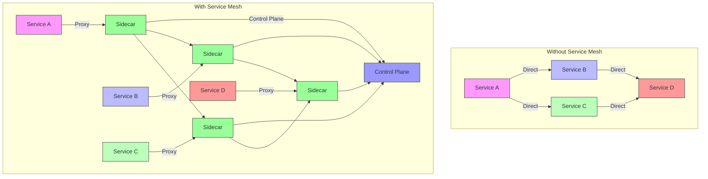

### Key Concepts

| Concept | Description |
|---------|-------------|
| **Sidecar Proxy** | Proxy deployed alongside each service instance |
| **Control Plane** | Central management for proxies (configuration, discovery) |
| **Data Plane** | Actual proxy instances handling traffic |
| **Service Discovery** | Finding and locating services dynamically |
| **Load Balancing** | Distributing traffic across service instances |
| **Circuit Breaking** | Preventing cascading failures |
| **Retry & Timeout** | Handling transient failures |
| **mTLS** | Mutual TLS for service-to-service authentication |
| **Observability** | Metrics, logs, traces for debugging |
| **Traffic Management** | A/B testing, canary deployments, blue-green |

### Service Mesh vs Traditional Approaches

| Feature | Service Mesh | API Gateway | Load Balancer | Client Library |
|---------|--------------|-------------|---------------|-----------------|
| **Service Discovery** | ✅ Built-in | ❌ Limited | ❌ No | ✅ Client-side |
| **Load Balancing** | ✅ Per-service | ✅ Global | ✅ Basic | ✅ Client-side |
| **mTLS** | ✅ Built-in | ❌ Limited | ❌ No | ❌ No |
| **Circuit Breaking** | ✅ Built-in | ❌ Limited | ❌ No | ✅ Client-side |
| **Retry/Timeout** | ✅ Built-in | ❌ Limited | ❌ No | ✅ Client-side |
| **Observability** | ✅ Comprehensive | ✅ Good | ❌ Limited | ❌ Limited |
| **Language Independent** | ✅ Yes | ✅ Yes | ✅ Yes | ❌ No |
| **Transparency** | ✅ No code changes | ✅ No code changes | ✅ No code changes | ❌ Code changes |
| **Complexity** | Medium (infra) | Low | Low | High (per client) |

---

## 🏗️ Service Mesh Architecture

### Logical Architecture

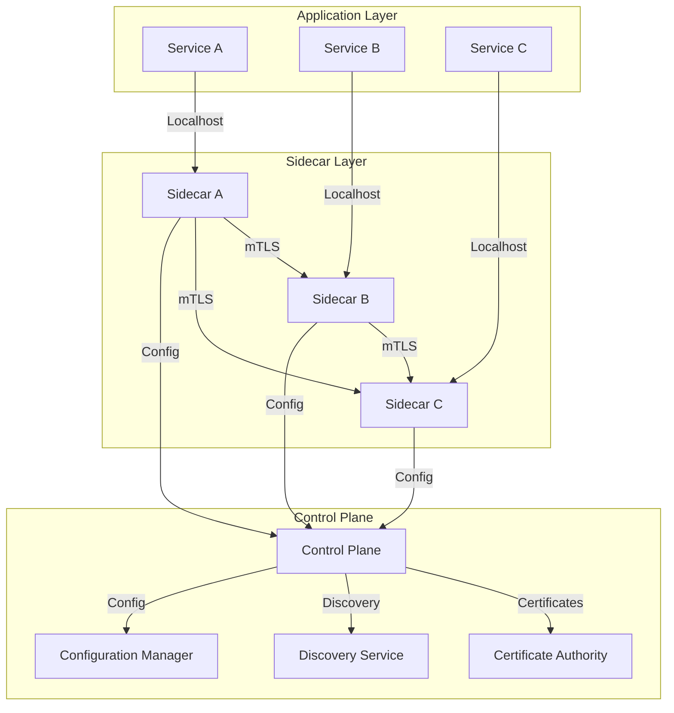

### Data Plane Architecture

The **data plane** consists of the proxy instances (sidecars) that handle the actual traffic.

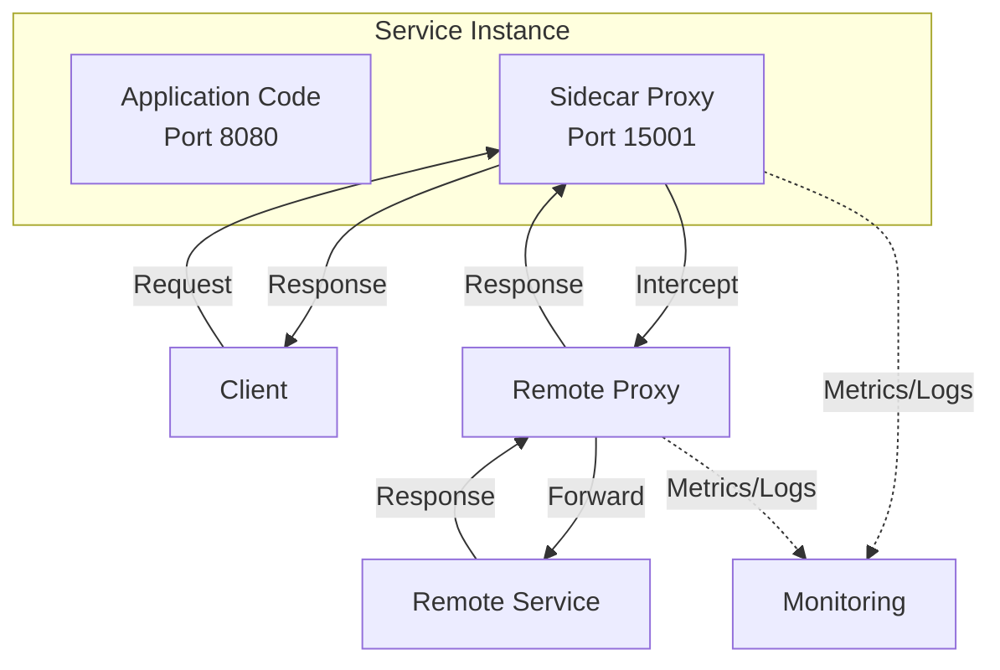

**Proxy Responsibilities**:
- **Inbound**: Listen for incoming requests, authenticate, route to local service
- **Outbound**: Intercept outgoing requests, load balance, retry, circuit break
- **Security**: Enforce mTLS, rate limiting, authorization
- **Observability**: Collect metrics, logs, traces

### Control Plane Architecture

The **control plane** manages and configures the data plane proxies.

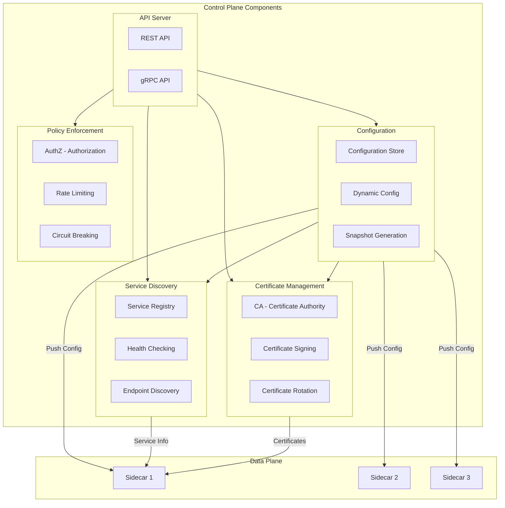

---

## 🎯 Service Mesh Features

### Traffic Management

Service meshes provide advanced traffic control capabilities:

| Feature | Description | Use Case |
|---------|-------------|----------|
| **A/B Testing** | Route traffic to different versions | Testing new features |
| **Canary Deployments** | Gradually roll out new versions | Safe deployments |
| **Blue-Green** | Instant switch between versions | Zero-downtime deployments |
| **Circuit Breaking** | Stop traffic to failing services | Prevent cascading failures |
| **Retry** | Automatically retry failed requests | Handle transient failures |
| **Timeout** | Fail fast for slow responses | Improve response times |
| **Load Balancing** | Distribute traffic across instances | High availability |

#### Traffic Routing Patterns

```mermaid
flowchart TB
    subgraph Patterns[Routing Patterns]
        direction TB
        
        subgraph A-B[A/B Testing]
            In[Ingress]
            In -->|50%| V1[Version 1]
            In -->|50%| V2[Version 2]
        end
        
        subgraph Canary[Canary]
            In2[Ingress]
            In2 -->|95%| Stable[Stable Version]
            In2 -->|5%| Canary[Canary Version]
        end
        
        subgraph BlueGreen[Blue-Green]
            In3[Ingress]
            In3 -->|Active| Blue[Blue Environment]
            In3 -.->|Standby| Green[Green Environment]
        end
        
        subgraph Circuit[Circuit Breaker]
            In4[Ingress]
            In4 --> CB[Circuit Breaker]
            CB -->|Healthy| Service[Service]
            CB -->|Open| Fallback[Fallback Response]
        end
    end
```

**Example: Canary Deployment with Istio**:
```yaml
apiVersion: networking.istio.io/v1alpha3
kind: VirtualService
metadata:
  name: my-service
spec:
  hosts:
  - my-service
  http:
  - route:
    - destination:
        host: my-service
        subset: v1
      weight: 95
    - destination:
        host: my-service
        subset: v2
      weight: 5
```

### Security

#### mTLS (Mutual TLS)

mTLS ensures that both client and server authenticate each other using TLS certificates.

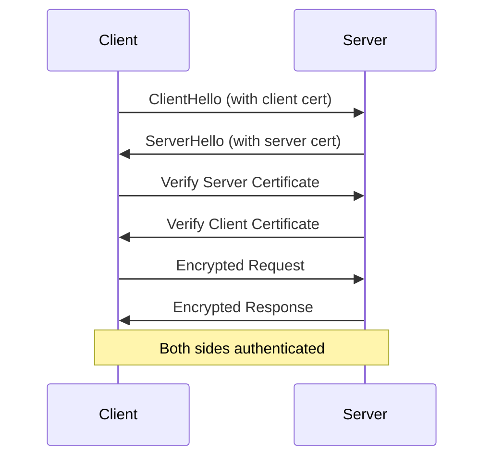

**mTLS Modes**:


| Mode | Description | When to Use |
|------|-------------|-------------|
| **STRICT** | Always use mTLS | Production, internal services |
| **PERMISSIVE** | Accept both mTLS and plain text | Migration period |
| **DISABLE** | No mTLS | Public APIs, testing |

**Istio mTLS Configuration**:
```yaml
apiVersion: security.istio.io/v1beta1
kind: PeerAuthentication
metadata:
  name: default
  namespace: my-namespace
spec:
  mtls:
    mode: STRICT
```

#### Authorization Policies

```yaml
apiVersion: security.istio.io/v1beta1
kind: AuthorizationPolicy
metadata:
  name: deny-all
  namespace: my-namespace
spec:
  {}  # Deny all by default
---
apiVersion: security.istio.io/v1beta1
kind: AuthorizationPolicy
metadata:
  name: allow-frontend
  namespace: my-namespace
spec:
  action: ALLOW
  rules:
  - from:
    - source:
        principals: ["cluster.local/ns/default/sa/frontend"]
    to:
    - operation:
        methods: ["GET"]
        paths: ["/api/*"]
```

#### Rate Limiting

```yaml
apiVersion: networking.istio.io/v1alpha3
kind: EnvoyFilter
metadata:
  name: rate-limit
spec:
  workloadSelector:
    labels:
      app: my-service
  configPatches:
  - applyTo: HTTP_FILTER
    match:
      context: SIDECAR_INBOUND
      listener:
        filterChain:
          filter:
            name: "envoy.filters.network.http_connection_manager"
    patch:
      operation: INSERT_BEFORE
      value:
        name: envoy.filters.http.local_ratelimit
        typed_config:
          "@type": type.googleapis.com/envoy.extensions.filters.http.local_ratelimit.v3.LocalRateLimit
          stat_prefix: http_local_rate_limiter
          token_bucket:
            max_tokens: 100
            tokens_per_fill: 100
            fill_interval: 60s
```

### Observability

#### Metrics

Service meshes provide comprehensive metrics out of the box:

| Metric | Description | Use Case |
|--------|-------------|----------|
| **Request Count** | Total number of requests | Traffic volume |
| **Request Duration** | Time taken for requests | Performance monitoring |
| **Request Size** | Size of requests | Capacity planning |
| **Response Size** | Size of responses | Capacity planning |
| **Error Rate** | Percentage of failed requests | Reliability monitoring |
| **Latency Percentiles** | P50, P90, P99 latencies | SLA compliance |
| **Connection Count** | Active connections | Resource monitoring |

**Prometheus Metrics Example**:
```promql
# Request rate
rate(istio_requests_total{reporter="destination"}[5m])

# Error rate
rate(istio_requests_total{reporter="destination", response_code=~"5.."}[5m])

# P99 latency
histogram_quantile(0.99, sum(rate(istio_request_duration_milliseconds_bucket[5m])) by (le))
```

#### Distributed Tracing

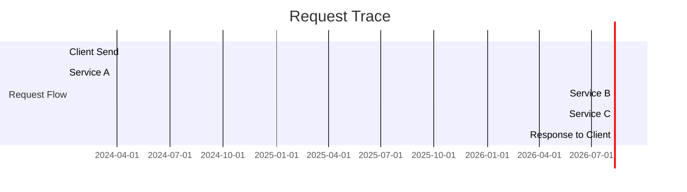

**Tracing with Jaeger**:
```yaml
# Istio tracing configuration
apiVersion: telemetry.istio.io/v1alpha1
kind: Telemetry
metadata:
  name: mesh-default
spec:
  tracing:
  - providers:
    - name: jaeger
    randomSamplingPercentage: 100
```

#### Logging

**Access Logs**:
```json
{
  "timestamp": "2024-01-01T10:00:00Z",
  "method": "GET",
  "path": "/api/users/123",
  "status": 200,
  "duration": "45ms",
  "source": "10.0.0.1",
  "destination": "my-service.my-namespace.svc.cluster.local",
  "user_agent": "curl/7.68.0",
  "request_id": "abc123",
  "x_forwarded_for": "203.0.113.1"
}
```

### Resilience

#### Circuit Breaking

```yaml
apiVersion: networking.istio.io/v1alpha3
kind: DestinationRule
metadata:
  name: my-service
spec:
  host: my-service
  trafficPolicy:
    connectionPool:
      tcp:
        maxConnections: 100
      http:
        http2MaxRequests: 1000
        maxRequestsPerConnection: 10
    outlierDetection:
      consecutiveErrors: 5
      interval: 10s
      baseEjectionTime: 30s
      maxEjectionPercent: 50
```

**Circuit Breaker States**:
```mermaid
stateDiagram-v2
    [*] --> Closed: Initial State
    Closed --> Open: Failure threshold exceeded
    Open --> Half-Open: After timeout
    Half-Open --> Closed: Success in half-open
    Half-Open --> Open: Failure in half-open
    
    Closed: Requests flow normally
    Open: Requests fail fast
    Half-Open: Limited requests allowed
```

#### Retry and Timeout

```yaml
apiVersion: networking.istio.io/v1alpha3
kind: VirtualService
metadata:
  name: my-service
spec:
  hosts:
  - my-service
  http:
  - route:
    - destination:
        host: my-service
    retries:
      attempts: 3
      perTryTimeout: 2s
      retryOn: gateway-error,connect-failure,refused-stream
    timeout: 10s
```

---

## 🆚 Service Mesh Comparison

### Istio

**Istio** is an open-source service mesh developed by Google, IBM, and Lyft. It's the most feature-rich and widely adopted service mesh.

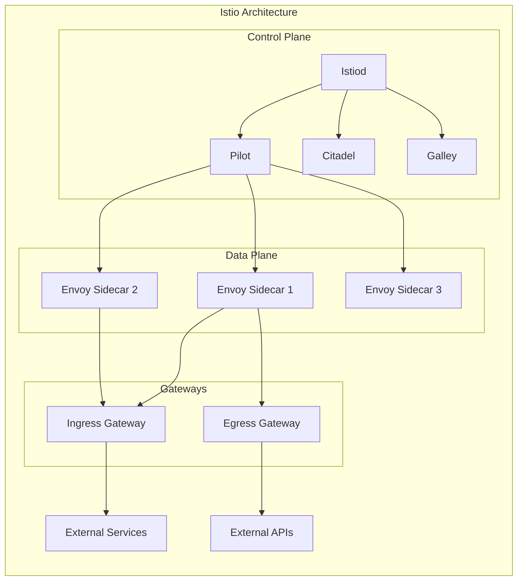

**Istio Components**:


| Component | Purpose |
|-----------|---------|
| **Istiod** | Unified control plane (Pilot + Citadel + Galley) |
| **Pilot** | Service discovery and configuration distribution |
| **Citadel** | Certificate authority and security management |
| **Galley** | Configuration validation and distribution |
| **Envoy** | High-performance proxy (data plane) |
| **Ingress Gateway** | Manages inbound traffic |
| **Egress Gateway** | Manages outbound traffic |
| **Sidecar Injector** | Automatically injects sidecars into pods |

**Istio Features**:
- ✅ Traffic management (A/B, canary, blue-green)
- ✅ Security (mTLS, RBAC, rate limiting)
- ✅ Observability (metrics, tracing, logging)
- ✅ Resilience (circuit breaking, retries, timeouts)
- ✅ Policy enforcement
- ✅ Multi-cluster support
- ✅ Kubernetes and non-Kubernetes support

**Istio Installation**:
```bash
# Install Istio CLI
curl -L https://istio.io/downloadIstio | sh -
cd istio-*
export PATH=$PWD/bin:$PATH

# Install Istio on Kubernetes
istioctl install --set profile=demo -y

# Enable sidecar injection
kubectl label namespace default istio-injection=enabled

# Deploy sample application
kubectl apply -f samples/bookinfo/platform/kube/bookinfo.yaml
kubectl apply -f samples/bookinfo/networking/bookinfo-gateway.yaml

# Access dashboard
istioctl dashboard prometheus
istioctl dashboard grafana
istioctl dashboard jaeger
istioctl dashboard kiali
```

**Istio Configuration Example**:
```yaml
# Gateway
apiVersion: networking.istio.io/v1alpha3
kind: Gateway
metadata:
  name: bookinfo-gateway
spec:
  selector:
    istio: ingressgateway
  servers:
  - port:
      number: 80
      name: http
      protocol: HTTP
    hosts:
    - "bookinfo.example.com"
---
# VirtualService
apiVersion: networking.istio.io/v1alpha3
kind: VirtualService
metadata:
  name: bookinfo
spec:
  hosts:
  - "bookinfo.example.com"
  gateways:
  - bookinfo-gateway
  http:
  - route:
    - destination:
        host: productpage
        port:
          number: 9080
```

**Istio Pros and Cons**:


| Pros | Cons |
|------|------|
| ✅ Most feature-rich | ❌ Complex to install and configure |
| ✅ Large community | ❌ High resource usage |
| ✅ Enterprise support | ❌ Steep learning curve |
| ✅ Extensive documentation | ❌ Many moving parts |
| ✅ Multi-cluster support | ❌ Frequent breaking changes |
| ✅ Integration with many tools | ❌ Overkill for simple use cases |

---

### Linkerd

**Linkerd** is a lightweight, ultra-simple service mesh focused on simplicity and performance.

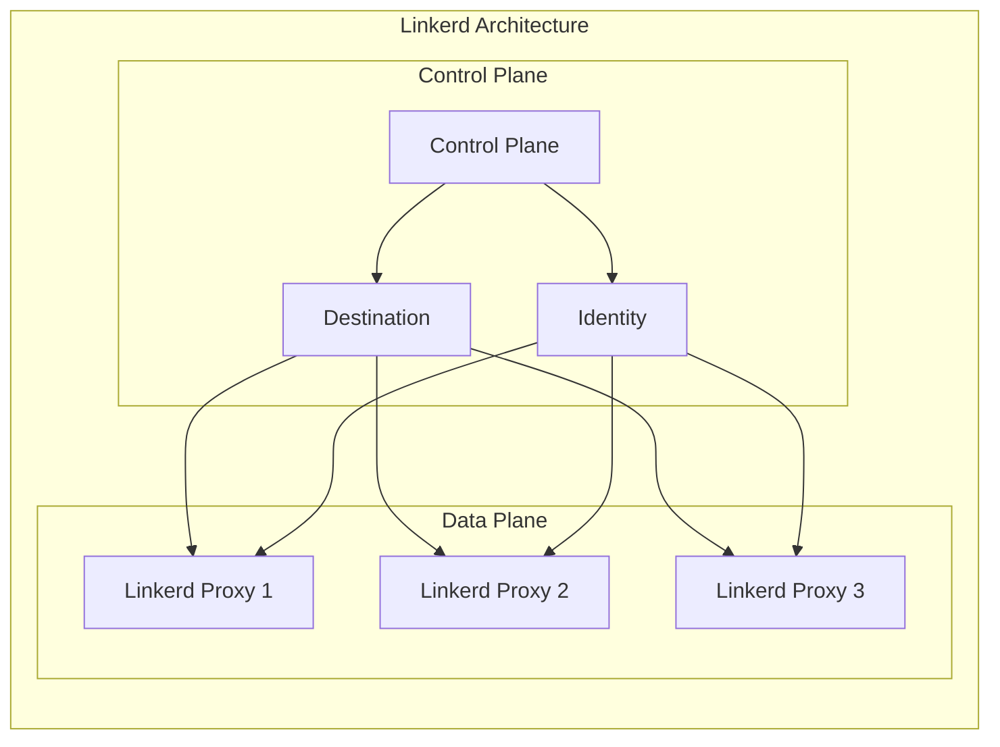

**Linkerd Components**:


| Component | Purpose |
|-----------|---------|
| **Control Plane** | Manages proxy configuration |
| **Destination** | Service discovery and load balancing |
| **Identity** | Manages mTLS certificates |
| **Linkerd Proxy** | Lightweight Rust-based proxy (data plane) |
| **Tap** | CLI for introspecting traffic |
| **Viz** | Web-based dashboard for observability |

**Linkerd Features**:
- ✅ Ultra-lightweight and fast
- ✅ Automatic mTLS
- ✅ Service discovery and load balancing
- ✅ Metrics and observability
- ✅ Distributed tracing
- ✅ Retries and timeouts
- ✅ Circuit breaking (via destination service)
- ✅ Kubernetes-native

**Linkerd Installation**:
```bash
# Install Linkerd CLI
curl -sL https://run.linkerd.io/install | sh

# Install Linkerd on Kubernetes
linkerd check --pre
linkerd install | kubectl apply -f -

# Install Viz extension
linkerd viz install | kubectl apply -f -

# Inject Linkerd into namespace
kubectl annotate namespace default config.linkerd.io/admission-webhook=disabled

# Deploy sample application
kubectl apply -f https://run.linkerd.io/flanks/emojivoto.yml

# Access dashboard
linkerd viz dashboard
```

**Linkerd Pros and Cons**:


| Pros | Cons |
|------|------|
| ✅ Very simple to install and use | ❌ Fewer features than Istio |
| ✅ Lightweight and fast | ❌ Limited traffic management |
| ✅ Automatic mTLS | ❌ No advanced routing (A/B, canary) |
| ✅ Great performance | ❌ Limited policy enforcement |
| ✅ Kubernetes-native | ❌ No non-Kubernetes support |
| ✅ Good for beginners | ❌ Smaller community |
| ✅ Production-ready | ❌ Less enterprise adoption |

---

### Consul Connect

**Consul Connect** is a service mesh solution from HashiCorp, built on top of their Consul service discovery and configuration management tool.

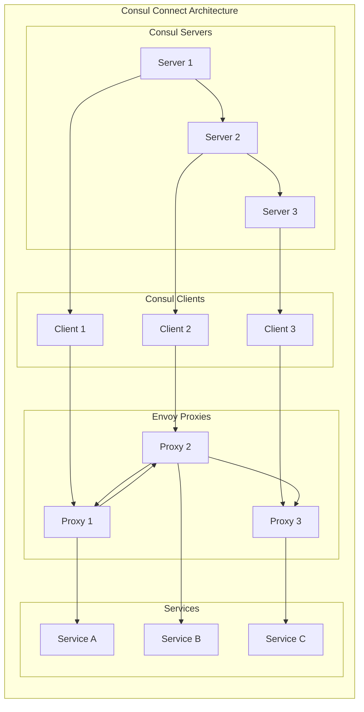

**Consul Connect Components**:


| Component | Purpose |
|-----------|---------|
| **Consul Servers** | Store configuration and service catalog |
| **Consul Clients** | Run on each node, forward requests to servers |
| **Envoy Proxy** | Data plane proxy (or built-in Connect proxy) |
| **CA** | Certificate authority for mTLS |
| **Intention** | Defines which services can communicate |

**Consul Connect Features**:
- ✅ Service discovery
- ✅ Health checking
- ✅ mTLS
- ✅ Authorization policies (intentions)
- ✅ Multi-datacenter support
- ✅ Kubernetes and non-Kubernetes support
- ✅ Integration with Consul ecosystem

**Consul Connect Installation**:
```bash
# Install Consul
curl -fsSL https://apt.releases.hashicorp.com/gpg | sudo apt-key add -
sudo apt-add-repository "deb [arch=amd64] https://apt.releases.hashicorp.com $(lsb_release -cs) main"
sudo apt-get update && sudo apt-get install consul

# Install Consul Connect
consul connect envoy -sidecar-for my-service | kubectl apply -f -

# Configure intentions (allow traffic)
cat > intentions.hcl << EOF
kind = "service-intentions"
name = "web-to-api"
sources = ["name: web"]
destinations = ["name: api"]
EOF
consul intention create -config-file intentions.hcl

# Enable mTLS
consul tls certs create -dc dc1
```

**Consul Connect Pros and Cons**:


| Pros | Cons |
|------|------|
| ✅ Integration with HashiCorp ecosystem | ❌ Complex setup |
| ✅ Multi-datacenter support | ❌ Less Kubernetes-native |
| ✅ Non-Kubernetes support | ❌ Smaller community than Istio |
| ✅ Built-in service discovery | ❌ Fewer features than Istio |
| ✅ Simple intention-based policies | ❌ Envoy dependency |
| ✅ Production-ready | ❌ Less active development |

---

### AWS App Mesh

**AWS App Mesh** is a service mesh for AWS cloud services, supporting Kubernetes, ECS, and EC2.

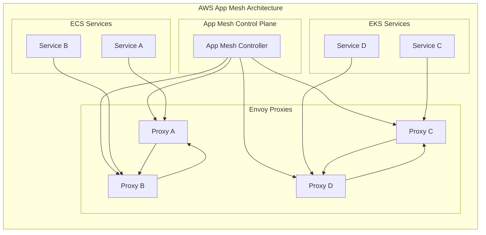

**AWS App Mesh Features**:
- ✅ Native AWS integration
- ✅ Support for ECS, EKS, EC2
- ✅ Traffic management (A/B, canary)
- ✅ Service discovery
- ✅ mTLS
- ✅ Observability (CloudWatch integration)
- ✅ Circuit breaking
- ✅ Retries and timeouts

**AWS App Mesh Configuration**:
```yaml
# VirtualNode for Service A
apiVersion: appmesh.k8s.aws/v1beta2
kind: VirtualNode
metadata:
  name: service-a-vn
spec:
  podSelector:
    matchLabels:
      app: service-a
  listeners:
  - portMapping:
      port: 8080
      protocol: http
  serviceDiscovery:
    dns:
      hostname: service-a.default.svc.cluster.local
---
# VirtualRouter
apiVersion: appmesh.k8s.aws/v1beta2
kind: VirtualRouter
metadata:
  name: service-a-vr
spec:
  listeners:
  - portMapping:
      port: 8080
      protocol: http
  routes:
  - name: service-a-route
    httpRoute:
      match:
        prefix: /
      action:
        weightedTargets:
        - virtualNodeRef:
            name: service-a-vn
          weight: 1
---
# VirtualService
apiVersion: appmesh.k8s.aws/v1beta2
kind: VirtualService
metadata:
  name: service-a-vs
spec:
  awsName: service-a.default.svc.cluster.local
  provider:
    virtualRouter:
      virtualRouterRef:
        name: service-a-vr
```

**AWS App Mesh Pros and Cons**:


| Pros | Cons |
|------|------|
| ✅ Native AWS integration | ❌ AWS-only |
| ✅ Good for AWS-centric workloads | ❌ Vendor lock-in |
| ✅ Managed control plane | ❌ Limited features |
| ✅ Easy setup for AWS services | ❌ Less flexible |
| ✅ CloudWatch integration | ❌ Smaller community |
| ✅ Production-ready | ❌ Less mature than Istio |

---

## 📊 Service Mesh Feature Matrix

| Feature | Istio | Linkerd | Consul Connect | AWS App Mesh | Open Service Mesh |
|---------|-------|---------|----------------|--------------|-------------------|
| **Traffic Management** | ✅✅✅✅✅ | ✅✅ | ✅✅✅ | ✅✅✅ | ✅✅✅ |
| **A/B Testing** | ✅ | ❌ | ✅ | ✅ | ✅ |
| **Canary Deployments** | ✅ | ❌ | ✅ | ✅ | ✅ |
| **Circuit Breaking** | ✅ | ✅ | ✅ | ✅ | ✅ |
| **Retry & Timeout** | ✅ | ✅ | ✅ | ✅ | ✅ |
| **Load Balancing** | ✅ | ✅ | ✅ | ✅ | ✅ |
| **mTLS** | ✅ | ✅ | ✅ | ✅ | ✅ |
| **Authorization Policies** | ✅ | ❌ | ✅ | ✅ | ✅ |
| **Rate Limiting** | ✅ | ❌ | ✅ | ✅ | ❌ |
| **Metrics** | ✅ | ✅ | ✅ | ✅ | ✅ |
| **Distributed Tracing** | ✅ | ✅ | ✅ | ✅ | ✅ |
| **Logging** | ✅ | ✅ | ✅ | ✅ | ✅ |
| **Kubernetes Support** | ✅ | ✅ | ✅ | ✅ | ✅ |
| **Non-Kubernetes Support** | ✅ | ❌ | ✅ | ❌ | ❌ |
| **Multi-Cluster** | ✅ | ✅ | ✅ | ❌ | ❌ |
| **Multi-Cloud** | ✅ | ✅ | ✅ | ❌ | ✅ |
| **Ease of Installation** | ⭐⭐ | ⭐⭐⭐⭐⭐ | ⭐⭐⭐ | ⭐⭐⭐⭐ | ⭐⭐⭐⭐ |
| **Performance** | ⭐⭐⭐⭐ | ⭐⭐⭐⭐⭐ | ⭐⭐⭐ | ⭐⭐⭐⭐ | ⭐⭐⭐⭐ |
| **Community Size** | ⭐⭐⭐⭐⭐ | ⭐⭐⭐ | ⭐⭐⭐ | ⭐⭐ | ⭐⭐⭐ |
| **Enterprise Support** | ✅ | ✅ | ✅ | ✅ | ❌ |

---

## 🎯 When to Use a Service Mesh

### Use Cases for Service Mesh

| Scenario | Service Mesh Help? | Why |
|----------|-------------------|-----|
| **Microservices Architecture** | ✅ Yes | Complex service-to-service communication |
| **Multiple Teams Own Services** | ✅ Yes | Standardize communication patterns |
| **Need mTLS Everywhere** | ✅ Yes | Built-in mTLS without code changes |
| **Complex Traffic Routing** | ✅ Yes | A/B testing, canary, blue-green |
| **Observability Challenges** | ✅ Yes | Built-in metrics, tracing, logging |
| **Multi-Cluster Deployments** | ✅ Yes | Unified communication across clusters |
| **Legacy Monolith** | ❌ No | Overkill, adds complexity |
| **Simple Applications** | ❌ No | Unnecessary overhead |
| **Few Services** | ❌ No | Can use simpler solutions |
| **Non-Containerized Apps** | ⚠️ Maybe | Limited support for non-container workloads |

### Alternatives to Service Mesh

| Solution | When to Use | Pros | Cons |
|----------|-------------|------|------|
| **API Gateway** | North-south traffic, public APIs | Simple, well-understood | No service-to-service features |
| **Ingress Controller** | Kubernetes ingress | Lightweight, focused | No east-west traffic management |
| **Service Discovery** | Finding services | Simple, effective | No traffic management |
| **Client Libraries** | Application-level control | Precise control | Code changes required, language-specific |
| **Load Balancer** | Distributing traffic | Simple, effective | No advanced features |

### Decision Flowchart

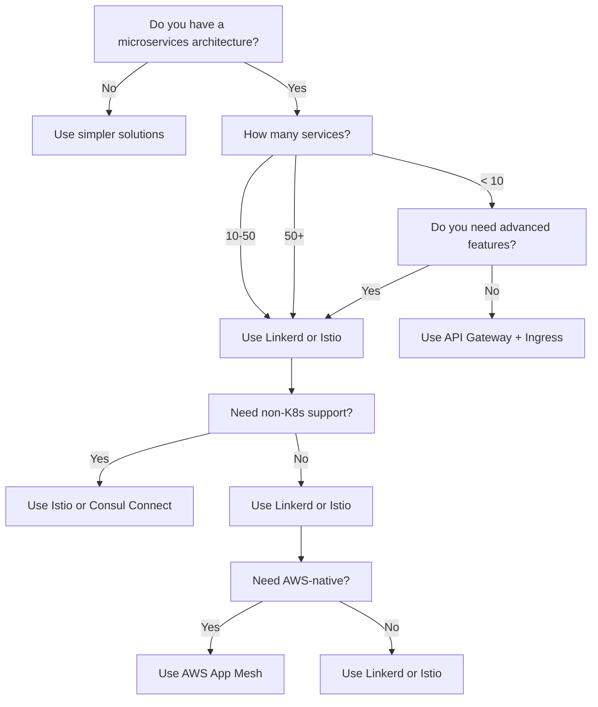

---

## 🚀 Getting Started with Service Mesh

### Prerequisites

✅ **Kubernetes Cluster** (or other supported platform)
✅ **Helm** (for installation)
✅ **Basic understanding of containers and microservices**
✅ **Monitoring tools** (Prometheus, Grafana)
✅ **Tracing tools** (Jaeger, Zipkin)

### Step 1: Install Kubernetes Cluster

**Minikube (Local Development)**:
```bash
# Install Minikube
curl -LO https://storage.googleapis.com/minikube/releases/latest/minikube-linux-amd64
sudo install minikube-linux-amd64 /usr/local/bin/minikube

# Start cluster
minikube start --driver=docker --cpus=4 --memory=8g

# Verify
kubectl get nodes
```

**Kind (Local Development)**:
```bash
# Install Kind
curl -Lo ./kind https://kind.sigs.k8s.io/dl/v0.18.0/kind-linux-amd64
chmod +x ./kind
sudo mv ./kind /usr/local/bin/kind

# Create cluster
kind create cluster --name service-mesh

# Verify
kubectl cluster-info
```

**EKS (Production AWS)**:
```bash
# Install eksctl
curl --silent --location "https://github.com/weaveworks/eksctl/releases/latest/download/eksctl_$(uname -s)_amd64.tar.gz" | tar xz -C /tmp
sudo mv /tmp/eksctl /usr/local/bin

# Create cluster
eksctl create cluster --name my-cluster --region us-west-2 --nodegroup-name workers --node-type t3.medium --nodes 3

# Verify
kubectl get nodes
```

### Step 2: Install Service Mesh

#### Install Linkerd (Recommended for Beginners)

```bash
# Install Linkerd CLI
curl -sL https://run.linkerd.io/install | sh

# Install Linkerd on cluster
linkerd check --pre
linkerd install | kubectl apply -f -

# Wait for control plane to be ready
kubectl -n linkerd rollout status deploy/linkerd-destination
kubectl -n linkerd rollout status deploy/linkerd-identity
kubectl -n linkerd rollout status deploy/linkerd-proxy-injector

# Install Viz extension
linkerd viz install | kubectl apply -f -

# Enable automatic injection
kubectl annotate namespace default config.linkerd.io/admission-webhook=disabled

# Verify installation
linkerd check
```

#### Install Istio (Advanced Features)

```bash
# Install Istio CLI
curl -L https://istio.io/downloadIstio | sh -
cd istio-*
export PATH=$PWD/bin:$PATH

# Install Istio with demo profile
istioctl install --set profile=demo -y

# Enable sidecar injection
kubectl label namespace default istio-injection=enabled

# Install addons (Kiali, Prometheus, Grafana, Jaeger)
kubectl apply -f samples/addons

# Wait for addons to be ready
kubectl rollout status deployment -n istio-system kiali

# Verify installation
istioctl verify-install
```

### Step 3: Deploy Sample Application

**Bookinfo (Istio)**:
```bash
# Deploy Bookinfo
kubectl apply -f samples/bookinfo/platform/kube/bookinfo.yaml

# Deploy Gateway
kubectl apply -f samples/bookinfo/networking/bookinfo-gateway.yaml

# Verify deployment
kubectl get pods
kubectl get svc

# Access application
kubectl get svc istio-ingressgateway -n istio-system
# Get EXTERNAL-IP and ports
```

**Emojivoto (Linkerd)**:
```bash
# Deploy Emojivoto
kubectl apply -f https://run.linkerd.io/flanks/emojivoto.yml

# Verify deployment
kubectl get pods
kubectl get svc

# Access application
kubectl port-forward svc/web-svc 8080:80 &
# Open http://localhost:8080 in browser
```

### Step 4: Enable Automatic Sidecar Injection

**Linkerd**:
```bash
# Enable injection for namespace
kubectl annotate namespace default config.linkerd.io/admission-webhook=disabled

# Verify injection
kubectl get pods
# Should see pods with 2/2 containers (app + proxy)
```

**Istio**:
```bash
# Enable injection for namespace
kubectl label namespace default istio-injection=enabled

# Verify injection
kubectl get pods
# Should see pods with 2/2 containers (app + istio-proxy)
```

### Step 5: Configure Traffic Management

**Istio Example: Canary Deployment**:
```yaml
# Create v2 deployment
apiVersion: apps/v1
kind: Deployment
metadata:
  name: productpage-v2
spec:
  replicas: 1
  selector:
    matchLabels:
      app: productpage
      version: v2
  template:
    metadata:
      labels:
        app: productpage
        version: v2
    spec:
      containers:
      - name: productpage
        image: docker.io/istio/examples-bookinfo-productpage-v2:1.16.2
        imagePullPolicy: IfNotPresent
        ports:
        - containerPort: 9080
---
# Update VirtualService for canary
apiVersion: networking.istio.io/v1alpha3
kind: VirtualService
metadata:
  name: productpage
spec:
  hosts:
  - productpage
  http:
  - route:
    - destination:
        host: productpage
        subset: v1
      weight: 90
    - destination:
        host: productpage
        subset: v2
      weight: 10
---
# Create DestinationRule for subsets
apiVersion: networking.istio.io/v1alpha3
kind: DestinationRule
metadata:
  name: productpage
spec:
  host: productpage
  subsets:
  - name: v1
    labels:
      version: v1
  - name: v2
    labels:
      version: v2
```

**Apply Configuration**:
```bash
kubectl apply -f canary.yaml

# Check traffic distribution
istioctl analyze sleep
```

### Step 6: Enable mTLS

**Istio**:
```yaml
apiVersion: security.istio.io/v1beta1
kind: PeerAuthentication
metadata:
  name: default
  namespace: default
spec:
  mtls:
    mode: STRICT
```

**Linkerd**:
```bash
# Linkerd enables mTLS by default for meshed services
# Verify mTLS
linkerd check --proxy
```

### Step 7: Access Dashboards

**Istio**:
```bash
# Access Kiali dashboard
istioctl dashboard kiali

# Access Prometheus
istioctl dashboard prometheus

# Access Grafana
istioctl dashboard grafana

# Access Jaeger
istioctl dashboard jaeger
```

**Linkerd**:
```bash
# Access Linkerd dashboard
linkerd viz dashboard

# Access metrics
linkerd metrics dashboard

# Access tap (traffic introspection)
linkerd tap deploy/web
```

---

## 🔧 Service Mesh Configuration Examples

### Common Configuration Tasks

#### Service Discovery

```yaml
# Kubernetes Service
apiVersion: v1
kind: Service
metadata:
  name: my-service
spec:
  selector:
    app: my-app
  ports:
  - protocol: TCP
    port: 80
    targetPort: 8080
```

#### Traffic Routing

```yaml
# Istio VirtualService
apiVersion: networking.istio.io/v1alpha3
kind: VirtualService
metadata:
  name: my-service
spec:
  hosts:
  - my-service
  http:
  - match:
    - uri:
        prefix: /api
    route:
    - destination:
        host: my-service
        port:
          number: 80
```

#### Load Balancing

```yaml
# Istio DestinationRule
apiVersion: networking.istio.io/v1alpha3
kind: DestinationRule
metadata:
  name: my-service
spec:
  host: my-service
  trafficPolicy:
    loadBalancer:
      simple: ROUND_ROBIN
    outlierDetection:
      consecutiveErrors: 5
      interval: 10s
      baseEjectionTime: 30s
```

#### Circuit Breaking

```yaml
# Istio DestinationRule with Circuit Breaking
apiVersion: networking.istio.io/v1alpha3
kind: DestinationRule
metadata:
  name: my-service
spec:
  host: my-service
  trafficPolicy:
    connectionPool:
      tcp:
        maxConnections: 100
      http:
        http2MaxRequests: 1000
        maxRequestsPerConnection: 10
    outlierDetection:
      consecutive5xxErrors: 5
      interval: 5s
      baseEjectionTime: 30s
      maxEjectionPercent: 50
```

#### Retry and Timeout

```yaml
# Istio VirtualService with Retry
apiVersion: networking.istio.io/v1alpha3
kind: VirtualService
metadata:
  name: my-service
spec:
  hosts:
  - my-service
  http:
  - route:
    - destination:
        host: my-service
    retries:
      attempts: 3
      perTryTimeout: 2s
      retryOn: gateway-error,connect-failure,refused-stream
    timeout: 10s
```

#### mTLS

```yaml
# Istio PeerAuthentication
apiVersion: security.istio.io/v1beta1
kind: PeerAuthentication
metadata:
  name: default
  namespace: default
spec:
  mtls:
    mode: STRICT
---
# Istio AuthorizationPolicy
apiVersion: security.istio.io/v1beta1
kind: AuthorizationPolicy
metadata:
  name: allow-frontend
  namespace: default
spec:
  action: ALLOW
  rules:
  - from:
    - source:
        principals: ["cluster.local/ns/default/sa/frontend"]
    to:
    - operation:
        methods: ["GET"]
        paths: ["/api/*"]
```

#### Rate Limiting

```yaml
# Istio EnvoyFilter for Rate Limiting
apiVersion: networking.istio.io/v1alpha3
kind: EnvoyFilter
metadata:
  name: rate-limit
spec:
  workloadSelector:
    labels:
      app: my-service
  configPatches:
  - applyTo: HTTP_FILTER
    match:
      context: SIDECAR_INBOUND
      listener:
        filterChain:
          filter:
            name: "envoy.filters.network.http_connection_manager"
    patch:
      operation: INSERT_BEFORE
      value:
        name: envoy.filters.http.local_ratelimit
        typed_config:
          "@type": type.googleapis.com/envoy.extensions.filters.http.local_ratelimit.v3.LocalRateLimit
          stat_prefix: http_local_rate_limiter
          token_bucket:
            max_tokens: 100
            tokens_per_fill: 100
            fill_interval: 60s
```

---

## 🛠️ Service Mesh Troubleshooting

### Common Issues and Solutions

| Issue | Symptom | Possible Cause | Solution |
|-------|---------|----------------|----------|
| **Pods stuck in Init** | Pods stay in Init:0/1 | Sidecar injection failed | Check injection webhook, labels, annotations |
| **No traffic between services** | Services can't communicate | Missing sidecar, mTLS issues | Verify sidecar injection, check mTLS mode |
| **503 Service Unavailable** | HTTP 503 errors | No healthy endpoints | Check service discovery, health checks |
| **Connection refused** | Connection refused errors | Wrong port, service not running | Verify service ports, check pod logs |
| **High latency** | Slow responses | Sidecar overhead, network issues | Check metrics, optimize configuration |
| **High memory usage** | OOM kills, high memory | Too many proxies, large config | Reduce proxy count, optimize config |
| **Certificate errors** | mTLS handshake failures | Expired certificates, CA issues | Check CA, rotate certificates |

### Debugging Commands

**Check Sidecar Injection**:
```bash
# Check if sidecar is injected
kubectl get pods
kubectl describe pod <pod-name> | grep -i sidecar

# Check pod containers
kubectl get pod <pod-name> -o jsonpath='{.spec.containers[*].name}'
```

**Check Proxy Logs**:
```bash
# Istio proxy logs
kubectl logs <pod-name> -c istio-proxy

# Linkerd proxy logs
kubectl logs <pod-name> -c linkerd-proxy

# Increase log level
kubectl exec <pod-name> -c istio-proxy -- curl -X POST localhost:15000/logging?level=debug
```

**Check Service Discovery**:
```bash
# Check Istio service entries
istioctl proxy-config endpoints <pod-name> -n default

# Check Linkerd service discovery
linkerd edges deploy/<deployment-name>
```

**Check mTLS**:
```bash
# Check Istio mTLS status
istioctl authn tls-check <pod-name>

# Check Linkerd mTLS
linkerd check --proxy
linkerd identity deploy/<deployment-name>
```

**Check Metrics**:
```bash
# Query Prometheus
kubectl port-forward svc/prometheus -n istio-system 9090:9090 &
# Open http://localhost:9090

# Check Linkerd metrics
linkerd metrics deploy/<deployment-name>
```

**Check Traffic**:
```bash
# Istio: Check traffic with Kiali
istioctl dashboard kiali

# Linkerd: Check traffic with tap
linkerd tap deploy/<deployment-name>

# Check proxy stats
kubectl exec <pod-name> -c istio-proxy -- curl localhost:15000/stats
kubectl exec <pod-name> -c linkerd-proxy -- curl localhost:4143/stats
```

### Performance Tuning

**Reduce Proxy Resource Usage**:
```yaml
# Limit proxy resources
resources:
  limits:
    cpu: 500m
    memory: 256Mi
  requests:
    cpu: 100m
    memory: 128Mi
```

**Optimize Proxy Configuration**:
```yaml
# Istio: Reduce concurrency
apiVersion: networking.istio.io/v1alpha3
kind: EnvoyFilter
metadata:
  name: optimize-proxy
spec:
  workloadSelector:
    labels:
      app: my-app
  configPatches:
  - applyTo: NETWORK_FILTER
    match:
      context: SIDECAR_INBOUND
      listener:
        portNumber: 80
        filterChain:
          filter:
            name: "envoy.filters.network.http_connection_manager"
    patch:
      operation: MERGE
      value:
        max_pending_requests: 100
        max_concurrent_streams: 100
```

**Limit Sidecar Injection**:
```bash
# Disable injection for specific namespaces
kubectl annotate namespace my-namespace sidecar.istio.io/inject=false

# Disable injection for specific pods
kubectl annotate pod my-pod sidecar.istio.io/inject=false
```

---

## 📈 Service Mesh Best Practices

### Deployment Best Practices

✅ **Start Small**:
- Begin with a single namespace or application
- Gradually expand to other services
- Test thoroughly before production

✅ **Use Namespace Isolation**:
- Deploy service mesh in dedicated namespaces
- Use network policies to isolate control plane
- Separate production and development meshes

✅ **Monitor Resource Usage**:
- Monitor proxy CPU and memory usage
- Set appropriate resource limits
- Scale control plane based on load

✅ **Enable Automatic Injection**:
- Use admission webhooks for automatic sidecar injection
- Label namespaces for injection
- Override for specific pods when needed

✅ **Use Separate Ingress Gateways**:
- Deploy dedicated ingress gateways
- Separate internal and external traffic
- Use different gateways for different environments

### Security Best Practices

✅ **Enable mTLS**:
- Use STRICT mode for production
- Use PERMISSIVE mode during migration
- Rotate certificates regularly

✅ **Use Authorization Policies**:
- Define clear authorization rules
- Use least-privilege access
- Regularly audit policies

✅ **Secure Control Plane**:
- Restrict access to control plane components
- Use RBAC for control plane access
- Enable audit logging

✅ **Rotate Certificates**:
- Set short certificate lifetimes
- Automate certificate rotation
- Monitor certificate expiration

✅ **Network Policies**:
- Restrict pod-to-pod communication
- Use Calico or Cilium for network policies
- Enforce zero-trust principles

### Observability Best Practices

✅ **Centralized Monitoring**:
- Deploy Prometheus for metrics collection
- Use Grafana for visualization
- Set up alerts for critical metrics

✅ **Distributed Tracing**:
- Deploy Jaeger or Zipkin for tracing
- Enable tracing for all services
- Use trace sampling for high-volume services

✅ **Centralized Logging**:
- Deploy ELK or Loki for log aggregation
- Standardize log formats
- Use structured logging

✅ **Service Level Objectives (SLOs)**:
- Define clear SLOs for services
- Monitor SLO compliance
- Set up alerts for SLO violations

✅ **Dashboarding**:
- Create dashboards for each service
- Create global mesh dashboards
- Include business metrics alongside technical metrics

### Performance Best Practices

✅ **Right-Size Proxies**:
- Set appropriate resource limits for proxies
- Monitor and adjust based on actual usage
- Consider horizontal pod autoscaling for proxies

✅ **Optimize Configuration**:
- Reduce unnecessary filter chains
- Optimize routing rules
- Use efficient load balancing algorithms

✅ **Use Locality-Aware Routing**:
- Prefer local endpoints when possible
- Reduce cross-zone/cross-region traffic
- Use topology-aware routing

✅ **Enable Protocol Sniffing**:
- Let proxies automatically detect protocols
- Reduce manual configuration
- Improve compatibility

✅ **Tune Timeouts and Retries**:
- Set appropriate timeouts based on service characteristics
- Configure intelligent retry policies
- Use circuit breaking to prevent cascading failures

### Operational Best Practices

✅ **Version Control Configuration**:
- Store all configuration in version control
- Use GitOps for configuration management
- Review configuration changes before applying

✅ **Test Configuration Changes**:
- Test in staging before production
- Use canary deployments for configuration changes
- Automate testing of configuration

✅ **Backup and Restore**:
- Regularly backup control plane state
- Test restore procedures
- Document recovery procedures

✅ **Upgrade Regularly**:
- Stay up-to-date with service mesh versions
- Test upgrades in staging first
- Follow vendor upgrade guides

✅ **Document Architecture**:
- Document service mesh architecture
- Document traffic flows
- Document security policies

---

## 🔮 Future of Service Mesh

### Emerging Trends

| Trend | Description | Impact |
|-------|-------------|--------|
| **Ambient Mesh** | Service mesh without sidecars | Reduced overhead, easier adoption |
| **eBPF-based Service Mesh** | Kernel-level service mesh | Lower latency, higher performance |
| **Wasm Plugins** | WebAssembly for proxy extensibility | Custom logic without recompiling |
| **Multi-Mesh Federation** | Connecting multiple service meshes | Hybrid cloud, multi-cloud |
| **Serverless Integration** | Service mesh for serverless workloads | Better observability, security |
| **AI/ML for Traffic Management** | AI-driven traffic routing | Optimized performance, automatic anomaly detection |
| **Service Mesh as a Service** | Managed service mesh offerings | Easier adoption, reduced operations |

### Ambient Mesh

**Ambient Mesh** is a new approach to service mesh that eliminates the need for sidecar proxies by using the underlying network infrastructure (like eBPF or kernel modules) to provide service mesh functionality.

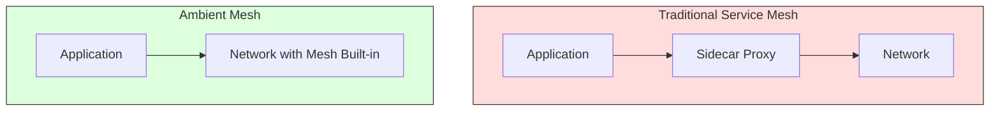

**Ambient Mesh Benefits**:
- ✅ No sidecar injection needed
- ✅ Reduced resource overhead
- ✅ Simpler architecture
- ✅ Better performance
- ✅ Easier to adopt

**Ambient Mesh Challenges**:
- ⚠️ Requires kernel modules or eBPF
- ⚠️ Platform-specific implementations
- ⚠️ Limited functionality compared to sidecar-based meshes

### Istio Ambient Mesh

Istio's implementation of ambient mesh uses eBPF to provide service mesh functionality without sidecars:

```bash
# Enable ambient mesh in Istio
istioctl x ambient enable

# Add workload to mesh
istioctl x workload group add my-namespace

# Verify workload is in mesh
istioctl x workload group get my-namespace
```

### eBPF-based Service Mesh

**eBPF (Extended Berkeley Packet Filter)** allows running user-defined code in the Linux kernel, enabling service mesh functionality at the network level.

| Project | Description | Status |
|---------|-------------|--------|
| **Cilium** | eBPF-based networking, security, and observability | ✅ Production |
| **Pixie** | eBPF-based observability (acquired by New Relic) | ✅ Production |
| **BumbleBee** | eBPF-based service mesh from Microsoft | 🔬 Experimental |
| **eBPF Service Mesh** | Generic eBPF-based service mesh | 🔬 Research |

**Cilium as a Service Mesh**:
```yaml
# Cilium NetworkPolicy
apiVersion: "cilium.io/v2"
kind: CiliumNetworkPolicy
metadata:
  name: allow-frontend-to-api
spec:
  endpointSelector:
    matchLabels:
      app: frontend
  egress:
  - toEndpoints:
    - matchLabels:
        app: api
    toPorts:
    - ports:
      - port: "80"
        protocol: TCP
```

---

## 📚 Further Reading

### Official Documentation

- [Istio Documentation](https://istio.io/latest/docs/) - Complete Istio docs
- [Linkerd Documentation](https://linkerd.io/2.13/docs/) - Linkerd documentation
- [Consul Connect Documentation](https://www.consul.io/docs/connect) - Consul Connect docs
- [AWS App Mesh Documentation](https://docs.aws.amazon.com/app-mesh/latest/userguide/) - AWS App Mesh docs
- [Open Service Mesh Documentation](https://docs.openservicemesh.io/) - OSM docs

### Books

- **"Istio: Up and Running"** by Lee Calcote and Zack Butcher
- **"Service Mesh Patterns"** by Lee Calcote
- **"Cloud Native Patterns"** by Cornelia Davis (includes service mesh)
- **"Kubernetes: Up and Running"** by Kelsey Hightower (includes service mesh)
- **"Designing Distributed Systems"** by Brendan Burns (includes service mesh patterns)

### Courses

- [Istio Fundamentals](https://www.udemy.com/course/istio-fundamentals/) - Udemy
- [Linkerd: Service Mesh for Kubernetes](https://www.udemy.com/course/linkerd-service-mesh/) - Udemy
- [Service Mesh with Istio](https://www.coursera.org/learn/service-mesh-istio) - Coursera
- [Kubernetes Service Mesh](https://www.pluralsight.com/courses/kubernetes-service-mesh) - Pluralsight

### Communities and Forums

- [Istio Community](https://istio.io/latest/community/) - Istio user and developer community
- [Linkerd Slack](https://linkerd.io/2.13/community/join-slack/) - Linkerd community Slack
- [Service Mesh Interface (SMI)](https://smi-spec.io/) - Standard interface for service meshes
- [Service Mesh Forum](https://servicemesh.forum/) - Service mesh discussions
- [CNCF Service Mesh Working Group](https://github.com/cncf/tag-network) - Cloud Native Computing Foundation
- [r/serviceMesh on Reddit](https://www.reddit.com/r/serviceMesh/) - Service mesh discussions

### Research Papers

- [Service Mesh: A New Paradigm for Service Communication](https://arxiv.org/abs/2004.09761)
- [The Service Mesh Era](https://www.usenix.org/conference/srecon19asia/presentation/liu)
- [Envoy Proxy: A High Performance Distributed Proxy](https://www.envoyproxy.io/docs/envoy/latest/introduction/architectural_overview/other_proxies)
- [Sidecar Proxies: A New Approach to Network Programming](https://www.usenix.org/conference/nsdi19/presentation/liu)

### Blogs and Articles

- [Istio Blog](https://istio.io/latest/blog/) - Official Istio blog
- [Linkerd Blog](https://linkerd.io/2.13/blog/) - Official Linkerd blog
- [Buoyant Blog](https://buoyant.io/blog) - Linkerd creators' blog
- [Service Mesh Hub](https://servicemesh.hub/) - Service mesh news and articles
- [InfoQ Service Mesh](https://www.infoq.com/servicemesh/) - InfoQ service mesh content

---

## 📝 Summary

Service meshes provide a **powerful, transparent way to manage service-to-service communication** in microservices architectures. They handle the complex networking, security, and observability concerns that arise when moving from monolithic applications to distributed systems.

### Key Takeaways

1. **Service meshes decouple application code from networking concerns** - services don't need to know about discovery, load balancing, retries, etc.

2. **The sidecar proxy pattern is the foundation** - each service instance gets its own proxy that handles all communication

3. **Control plane manages the data plane** - configuration, discovery, and certificates are managed centrally

4. **Service meshes provide a rich set of features**:
   - Traffic management (A/B, canary, blue-green)
   - Security (mTLS, authorization, rate limiting)
   - Observability (metrics, tracing, logging)
   - Resilience (circuit breaking, retries, timeouts)

5. **Istio is the most feature-rich but complex** - good for large, complex deployments
6. **Linkerd is the simplest and fastest** - good for beginners and performance-sensitive deployments
7. **Consul Connect integrates with HashiCorp ecosystem** - good for multi-datacenter deployments
8. **AWS App Mesh is AWS-native** - good for AWS-centric workloads

### Choosing a Service Mesh

| Requirement | Best Choice |
|-------------|--------------|
| **Most features, large community** | Istio |
| **Simplicity, performance** | Linkerd |
| **HashiCorp ecosystem** | Consul Connect |
| **AWS-native** | AWS App Mesh |
| **Multi-cloud** | Istio or Linkerd |
| **Non-Kubernetes** | Consul Connect |
| **Beginner-friendly** | Linkerd |

### When NOT to Use a Service Mesh

❌ **Simple applications with few services** - overkill, adds complexity
❌ **Monolithic applications** - no service-to-service communication
❌ **Legacy systems that can't be modified** - may not support sidecar injection
❌ **Resource-constrained environments** - proxies add overhead
❌ **Teams without Kubernetes expertise** - steep learning curve

**Remember**: A service mesh is a **powerful tool** for managing microservices complexity, but it adds its own complexity. Start small, understand the value, and gradually expand its use.
