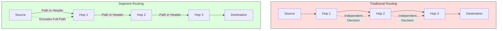
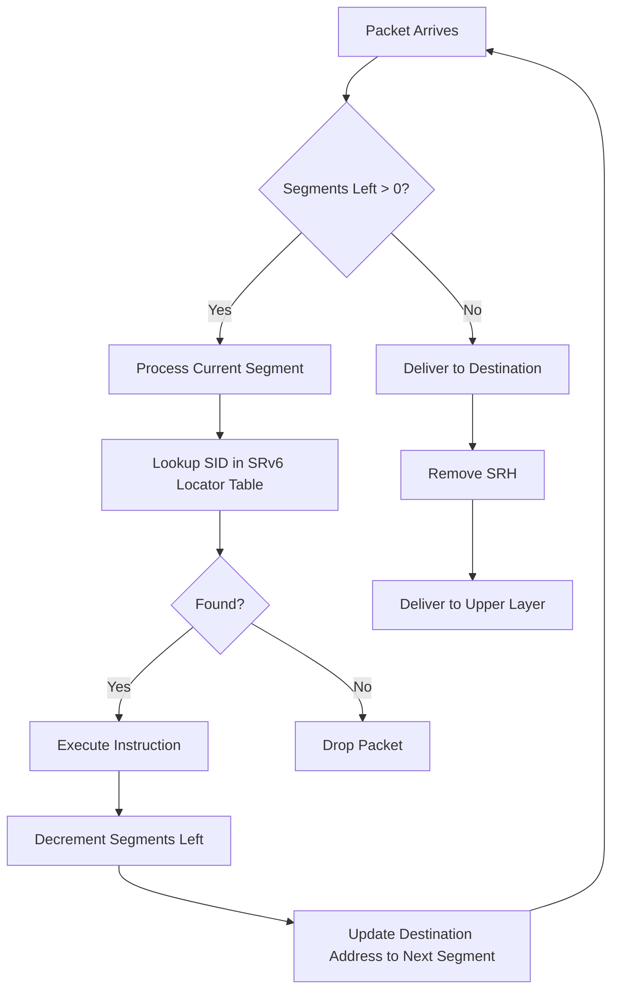
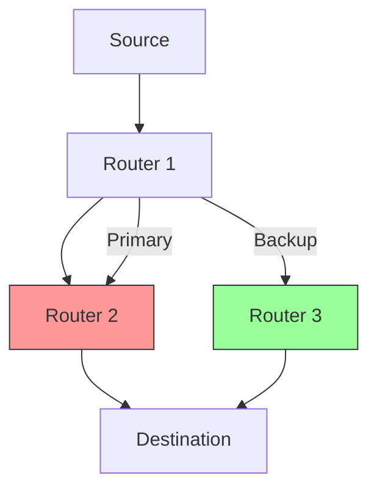
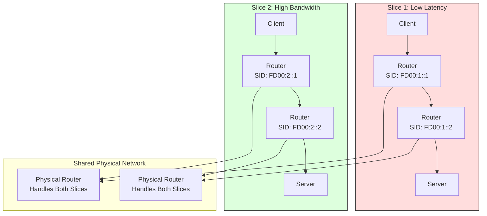
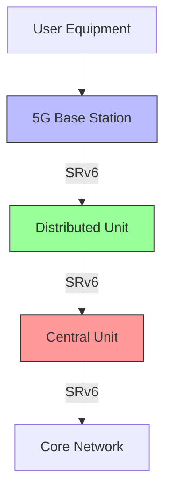
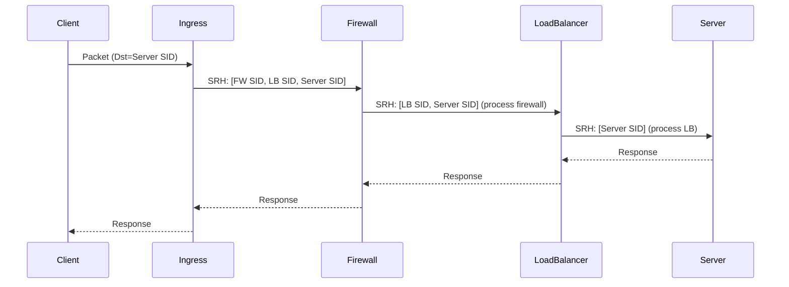

# Segment Routing IPv6 (SRv6)

> **Purpose**: Enable advanced traffic engineering, service chaining, and network programming using IPv6 extension headers for Segment Routing.

---

## 📋 Overview

**Segment Routing IPv6 (SRv6)** is a next-generation source-routing architecture that leverages IPv6 extension headers to enable explicit path control, network programming, and advanced traffic engineering. SRv6 extends the **Segment Routing (SR)** architecture to IPv6, providing a scalable, flexible, and programmable data plane.

### What is Segment Routing?

**Segment Routing** is a source-based routing paradigm where the **source node** specifies the path through the network by encoding it in the packet header. This is in contrast to traditional destination-based routing where each hop makes independent forwarding decisions.



### SRv6 vs SR-MPLS

| Feature | SRv6 | SR-MPLS |
|---------|------|---------|
| **Data Plane** | IPv6 Extension Headers | MPLS Labels |
| **Underlay** | Native IPv6 | MPLS |
| **Programmability** | ✅ High (IPv6 addresses as instructions) | Medium (Label stacks) |
| **Service Chaining** | ✅ Yes | ✅ Yes |
| **Traffic Engineering** | ✅ Yes | ✅ Yes |
| **Multi-tenancy** | ✅ Yes (via IPv6 addressing) | ✅ Yes (via labels) |
| **Deployment** | Greenfield or brownfield | Requires MPLS infrastructure |
| **Hardware Support** | Growing | Mature |
| **Standardization** | IETF Drafts / RFCs | RFC 8660+ |

### Why SRv6?

| Benefit | Description |
|---------|-------------|
| **Simplified Control Plane** | No need for LDP or RSVP-TE |
| **Native IPv6** | Works with existing IPv6 infrastructure |
| **Programmable Data Plane** | IPv6 addresses encode network functions |
| **Service Chaining** | Insert services (firewalls, load balancers) at any point |
| **Traffic Engineering** | Explicit paths, SLA guarantees |
| **Fast Reroute** | Local repair without control plane involvement |
| **Scalability** | No state in transit nodes |
| **Multi-vendor** | Standardized, interoperable |

---

## 🏗️ SRv6 Architecture

### SRv6 Data Plane

SRv6 uses **IPv6 Extension Headers** to encode the segment list. The key extension header is the **Segment Routing Header (SRH)**.

#### IPv6 Packet Format with SRH

```
+----------------+----------------+----------------+
| IPv6 Header   | Extension      | Upper-Layer    |
| (40 bytes)    | Headers        | Header + Data  |
+----------------+----------------+----------------+

IPv6 Header:
+----------------+----------------+----------------+
| Version (4)   | Traffic Class  | Flow Label     |
+----------------+----------------+----------------+
| Payload Length | Next Header    | Hop Limit      |
+----------------+----------------+----------------+
| Source Address |                               |
+----------------+----------------+----------------+
| Destination Address |                           |
+----------------+----------------+----------------+
```

### Segment Routing Header (SRH)

The **SRH** (RFC 8754) is an IPv6 Extension Header that contains the segment list.

```
+----------------+----------------+----------------+
| Next Header    | Hdr Ext Len    | Routing Type   |
+----------------+----------------+----------------+
| Segments Left  | Last Entry     | Flags          |
+----------------+----------------+----------------+
| Tag            |                                |
+----------------+----------------+----------------+
| Segment List[0]| Segment List[1]| ...            |
+----------------+----------------+----------------+
| TLVs (optional)|                                |
+----------------+----------------+----------------+

SRH Fields:
- Next Header (8 bits): Type of next header (e.g., TCP=6, UDP=17, IPv6=41)
- Hdr Ext Len (8 bits): Length of SRH in 8-byte units (minus first 8 bytes)
- Routing Type (16 bits): Type of routing header (SRH = 4)
- Segments Left (8 bits): Number of segments remaining to process
- Last Entry (8 bits): Index of the last segment in the list
- Flags (8 bits): Control flags (e.g., protected flag)
- Tag (16 bits): Opaque tag for correlation/debugging
- Segment List: Array of 128-bit IPv6 addresses (segments)
- TLVs: Optional Type-Length-Value fields
```

**Hdr Ext Len Calculation**:
```
Hdr Ext Len = (SRH Length - 8) / 8
For 3 segments: (8 + 3*16 - 8) / 8 = 40 / 8 = 5
```

### Segments

A **segment** is an IPv6 address that represents an instruction to be executed on the packet. Segments are processed from **right to left** (last to first).

**Segment Types**:

| Segment Type | IPv6 Address Format | Instruction |
|--------------|---------------------|-------------|
| **Node Segment** | `LOCAL::n` or `FD00::n` | Process at this node |
| **Adjacency Segment** | `LOCAL::adj` or `FD00::adj` | Forward to specific adjacency |
| **Prefix Segment** | Global IPv6 prefix | Forward based on prefix |
| **Binding Segment** | Special encoding | Execute service function |

**Segment Encoding**:
- **Node SID**: `LOCAL::FF:FE00:n` where `n` is the node ID
- **Adjacency SID**: `LOCAL::FF:FE00:adj` where `adj` is the adjacency ID
- **Prefix SID**: Global IPv6 address with locator and function

### SRv6 Segment Types (RFC 8986)

| Type | Function | SID Format | Behavior |
|------|----------|------------|----------|
| **End** | Endpoint function | `LOCAL::FF:FE00:0` | Deliver to application/upper layer |
| **End.X** | Endpoint with L3 cross-connect | `LOCAL::FF:FE00:1` | Forward to next segment |
| **End.T** | Endpoint with L2 cross-connect | `LOCAL::FF:FE00:2` | Forward at Layer 2 |
| **End.DX4** | Endpoint with IPv4 decapsulation | `LOCAL::FF:FE00:4` | Decapsulate IPv4 |
| **End.DX6** | Endpoint with IPv6 decapsulation | `LOCAL::FF:FE00:5` | Decapsulate IPv6 |
| **End.DT4** | Endpoint with IPv4 decaps + L3 cross-connect | `LOCAL::FF:FE00:6` | Decaps + Forward IPv4 |
| **End.DT6** | Endpoint with IPv6 decaps + L3 cross-connect | `LOCAL::FF:FE00:7` | Decaps + Forward IPv6 |
| **End.B6** | Endpoint with IPv6 encapsulation | `LOCAL::FF:FE00:8` | Encapsulate in IPv6 |
| **End.BM** | Endpoint with MAC insertion | `LOCAL::FF:FE00:9` | Insert MAC addresses |

### SRv6 Packet Processing



**Segment Processing Example**:

```
Packet: Dst=S3, SRH=[S1, S2, S3], Segments Left=3

1. Router receives packet, sees Dst=S3
2. Looks up S3 in SRv6 Locator Table
3. Finds S3 is a valid SID on this node
4. Executes instruction for S3 (e.g., End.X)
5. Decrements Segments Left to 2
6. Updates Dst to S2 (next segment)
7. Forwards packet to next hop toward S2

At S2:
1. Receives packet, sees Dst=S2
2. Looks up S2, executes instruction
3. Decrements Segments Left to 1
4. Updates Dst to S1
5. Forwards packet

At S1:
1. Receives packet, sees Dst=S1
2. Looks up S1, executes instruction
3. Decrements Segments Left to 0
4. Delivers to final destination
```

---

## 🎯 SRv6 Use Cases

### 1. Traffic Engineering

**Explicit Path Control**: SRv6 allows specifying exact paths through the network, enabling:
- **Low-latency paths** for critical applications
- **Bandwidth-guaranteed paths** for high-priority traffic
- **Avoidance of congestion** or failed links

```mermaid
graph TD
    A[Source] -->|SRH: [S1,S2,S3]| B[S1: Router 1]
    B -->|Forward to S2| C[S2: Router 2]
    C -->|Forward to S3| D[S3: Router 3]
    D --> E[Destination]
    
    A -- Traditional Path --> F[Router 4]
    F --> G[Router 5]
    G --> E
    
    style A fill:#bbf,stroke:#333
    style E fill:#bfb,stroke:#333
```

**Advantages over RSVP-TE**:
- No state in transit nodes
- No signaling protocol needed
- Source-based path control
- Easier to manage and scale

### 2. Service Chaining

**Service Function Chaining (SFC)**: Insert network services (firewalls, load balancers, NAT) at specific points in the path.

```mermaid
graph TD
    A[Client] -->|SRH: [FW, LB, Server]| B[Firewall\nSID: FD00::1]
    B -->|Process + Forward| C[Load Balancer\nSID: FD00::2]
    C -->|Process + Forward| D[Server\nSID: FD00::3]
    D --> A
    
    style B fill:#f99,stroke:#333
    style C fill:#9f9,stroke:#333
    style D fill:#99f,stroke:#333
```

**Service Functions**:
- Firewall (FW)
- Load Balancer (LB)
- NAT / NAPT
- Deep Packet Inspection (DPI)
- VPN Gateway
- QoS Marking

### 3. VPN Services

**SRv6 VPN**: Provide Layer 2 and Layer 3 VPN services without MPLS.

| VPN Type | SRv6 Implementation | Use Case |
|----------|---------------------|----------|
| **L3VPN** | End.DT6 function | IPv6 VPN |
| **L2VPN** | End.DT4 + End.T | Ethernet VPN |
| **EVPN** | End.DT6 with VNI | Data Center Interconnect |

**SRv6 EVPN**:
- Uses SRv6 to provide Ethernet VPN services
- Combines benefits of EVPN with SRv6
- No MPLS required
- Simplified control plane

### 4. Fast Reroute

**Local Repair**: When a link or node fails, traffic is rerouted locally without waiting for control plane convergence.



**Protection Types**:
- **Link Protection**: Protect against link failures
- **Node Protection**: Protect against node failures
- **SRLB (Segment Routing Local Block)**: Explicit backup paths

### 5. Network Slicing

**5G/Edge Network Slicing**: Create isolated virtual networks with different SLAs on shared infrastructure.



Each slice can have:
- Different SIDs
- Different traffic engineering policies
- Different QoS guarantees
- Different security policies

### 6. Mobile Backhaul

**5G Mobile Backhaul**: Use SRv6 for efficient transport of mobile traffic.



**Benefits for Mobile**:
- **Low latency** for real-time applications
- **Traffic engineering** for different service types
- **Service chaining** for UPF (User Plane Function) insertion
- **Fast reroute** for high availability

---

## 🔧 SRv6 Control Plane

### SRv6 Locator

An **SRv6 Locator** is a prefix allocated to a node or a set of nodes for Segment Routing.

**Locator Types**:

| Type | Description | Prefix Format |
|------|-------------|---------------|
| **Node Locator** | Identifies a specific node | `LOCAL::FF:FE00:n` or global prefix |
| **Adjacency Locator** | Identifies a specific adjacency | `LOCAL::FF:FE00:adj` |
| **Prefix Locator** | Identifies a network prefix | Global IPv6 prefix |

**Locator Structure**:
```
+----------------+----------------+----------------+
| Locator Prefix | Function       | Arguments      |
+----------------+----------------+----------------+
| 64 bits        | 16 bits        | 48 bits        |
+----------------+----------------+----------------+

Example: 2001:db8:1234:5678:9abc:def0:1234:5678
- Locator Prefix: 2001:db8:1234:5678:
- Function: 9abc:def0
- Arguments: 1234:5678
```

### SRv6 SID (Segment ID)

An **SID** is a specific instruction encoded in an IPv6 address.

**SID Allocation**:
- **Static**: Manually configured
- **Dynamic**: Allocated by control plane
- **Index-based**: SID = Locator + Index

**SID Types**:

| SID Type | Function | Encoding |
|----------|----------|----------|
| **Node SID** | Identifies a node | `Locator::n` |
| **Adjacency SID** | Identifies an adjacency | `Locator::adj` |
| **Prefix SID** | Identifies a prefix | Global IPv6 |
| **Binding SID** | Service function | Special encoding |

### IGP Extensions for SRv6

**IS-IS Extensions** (RFC 8986, RFC 9352):
- Advertise SRv6 Capabilities
- Advertise SRv6 Locators
- Advertise SID information

**OSPFv3 Extensions** (RFC 8986, RFC 9006):
- Opaque LSA for SRv6 information
- Advertise SRv6 Locators and SIDs

**BGP Extensions** (RFC 8986):
- Advertise SRv6 information via BGP-LS
- Enable inter-domain SRv6

### IS-IS SRv6 Configuration (Cisco IOS XR)

```bash
# Enable IS-IS
router isis 1
 net 49.0001.0000.0000.0001.00
 is-type level-2
 
 # Enable SRv6
 address-family ipv6 unicast
  segment-routing srv6
   locator MyLocator
    prefix 2001:db8:1234:5678::/64
    !
   !
  exit
 exit
```

### OSPFv3 SRv6 Configuration (Cisco IOS XR)

```bash
# Enable OSPFv3
router ospfv3 1
 router-id 1.1.1.1
 
 # Enable SRv6
 address-family ipv6 unicast
  segment-routing srv6
   locator MyLocator
    prefix 2001:db8:1234:5678::/64
    !
   !
  exit
 exit
```

### BGP-LS for SRv6 (Juniper JunOS)

```bash
protocols {
    bgp {
        group ibgp {
            type internal;
            local-address 192.0.2.1;
            neighbor 192.0.2.2;
            family inet6 {
                labeled-unicast;
            }
        }
    }
    
    isis {
        level 2 wide-metrics-only;
        reference-bandwidth 10g;
        
        segment-routing {
            srv6 {
                locator MyLocator {
                    prefix 2001:db8:1234:5678::/64;
                }
            }
        }
    }
}
```

---

## 🔄 SRv6 vs Traditional MPLS

### Comparison Table

| Feature | SRv6 | MPLS |
|---------|------|------|
| **Data Plane** | IPv6 Extension Headers | MPLS Labels |
| **Control Plane** | IGP/BGP with extensions | LDP/RSVP-TE |
| **Path Encoding** | IPv6 addresses | Label stacks |
| **Service Chaining** | Native (via SIDs) | Requires additional mechanisms |
| **Traffic Engineering** | Native | Requires RSVP-TE |
| **Fast Reroute** | Native (TI-LFA, etc.) | Requires RSVP-TE FRR |
| **Multi-tenancy** | Via IPv6 addressing | Via labels |
| **Hardware Support** | Growing | Mature |
| **Deployment** | Greenfield or brownfield | Requires MPLS infrastructure |
| **Scalability** | High (no state in transit) | Medium (label state) |
| **Standardization** | IETF (RFC 8754, 8986) | IETF (RFC 3031, 3209) |

### Migration Strategies

| Strategy | Description | Pros | Cons |
|----------|-------------|------|------|
| **Greenfield** | Deploy SRv6 in new network | Clean slate, full benefits | Requires new hardware |
| **Hybrid** | Run SRv6 alongside MPLS | Gradual migration | Operational complexity |
| **Interworking** | Translate between SRv6 and MPLS | Seamless integration | Translation overhead |

---

## 🛡️ SRv6 Security

### Security Considerations

| Concern | Risk | Mitigation |
|---------|------|------------|
| **Spoofed Packets** | Attacker injects packets with forged SRH | SID authentication, RPF checks |
| **Segment List Tampering** | Attacker modifies segment list | Integrity protection (IPsec, MAC) |
| **Resource Exhaustion** | Attacker sends many SRv6 packets | Rate limiting, ACLs |
| **Information Leakage** | SRH reveals network topology | Encryption, segment hiding |
| **Replay Attacks** | Attacker replays old packets | Sequence numbers, timestamps |

### Security Mechanisms

✅ **SID Authentication**:
- Use cryptographic SIDs
- Verify SID ownership before processing

✅ **RPF (Reverse Path Filtering)**:
- Check that packets arrive from expected interfaces
- Prevent spoofing attacks

✅ **IPsec**:
- Encrypt and authenticate SRv6 packets
- Use transport mode for end-to-end security

✅ **Segment Hiding**:
- Don't reveal full segment list to untrusted nodes
- Use hierarchical SIDs

✅ **Rate Limiting**:
- Limit SRv6 packet rate
- Prevent DoS attacks

---

## 📊 Performance & Scalability

### Performance Metrics

| Metric | SRv6 | MPLS | Notes |
|--------|------|------|-------|
| **Encapsulation Overhead** | ~40 bytes (SRH) | 4 bytes per label | SRv6 has higher base overhead |
| **Lookup Time** | Longest Prefix Match | Label swap (O(1)) | MPLS is faster |
| **Memory Usage** | Lower (no label state) | Higher (label tables) | SRv6 scales better |
| **CPU Usage** | Higher (IPv6 processing) | Lower (hardware-accelerated) | MPLS more mature |
| **Convergence** | Fast (source-based) | Fast (with FRR) | Both are fast |

### Scalability Considerations

| Aspect | SRv6 | MPLS |
|--------|------|------|
| **State in Transit Nodes** | None | Label tables |
| **State in Source Node** | Segment list | Label stack |
| **Max Path Length** | Limited by IPv6 MTU | Limited by label stack depth |
| **Hierarchical Addressing** | ✅ Yes (via locators) | ✅ Yes (via label blocks) |
| **Multi-domain** | ✅ Yes (with BGP-LS) | ✅ Yes (with inter-AS TE) |

### Hardware Acceleration

**SRv6 Offload**:
- **NIC Offload**: Some NICs support SRv6 extension header processing
- **NPU/DPU Offload**: Network Processing Units can accelerate SRv6
- **SmartNIC**: Offload SRv6 processing to NIC
- **eBPF/XDP**: Use kernel bypass for fast SRv6 processing

**Check Hardware Support**:
```bash
# Check if NIC supports SRv6
ethtool -k eth0 | grep seg6

# Check kernel SRv6 support
cat /proc/sys/net/ipv6/conf/all/seg6_enabled
```

---

## 🔧 Implementation Examples

### Example 1: Basic SRv6 Configuration (Linux)

**Enable SRv6 in Kernel**:
```bash
# Check if SRv6 is enabled
cat /proc/sys/net/ipv6/conf/all/seg6_enabled

# Enable SRv6 (if not enabled by default)
sudo sysctl -w net.ipv6.conf.all.seg6_enabled=1
sudo sysctl -w net.ipv6.conf.default.seg6_enabled=1

# Load SRv6 module
sudo modprobe seg6
```

**Create SRv6 Locator**:
```bash
# Add SRv6 locator (using iproute2)
sudo ip -6 route add local FD00:1234:5678:9ABC::/64 dev lo

# Verify
ip -6 route show local
```

### Example 2: SRv6 with FRR (Cisco-like CLI)

```bash
# Install FRR with SRv6 support
sudo apt install frr frr-pythontools

# Configure FRR
vtysh
 configure terminal
  !
  ! Enable SRv6
  segment-routing srv6
   locator MyLocator
    prefix FD00:1234:5678::/64
    !
   !
   ! Enable on interfaces
   interface eth0
    ipv6 address FD00:1234:5678::1/64
    ipv6 router isis 1
    segment-routing srv6 locator MyLocator
   exit
  !
  router isis 1
   net 49.0001.0000.0000.0001.00
   segment-routing srv6
    locator MyLocator
    !
  exit
  exit
 write
```

### Example 3: SRv6 Traffic Engineering (Cisco IOS XR)

```bash
# Configure SRv6
segment-routing
 srv6
  locators
   locator MyLocator
    prefix 2001:db8:1234:5678::/64
   !
  !
  encoding
   source-address 2001:db8:1234:5678::1
  !
 !
 # Create Traffic Engineering policy
 segment-routing
  traffic-engineering
   policies
    policy TE-Policy-1
     color 100
     endpoint-address 2001:db8:1234:5678::2
     !
     segment-list SL-1
      address 2001:db8:1234:5678::2
      address 2001:db8:1234:5678::3
      address 2001:db8:1234:5678::4
     !
    !
   !
  !
 !
 # Apply to interface
 interface GigabitEthernet0/0/0/0
  ipv6 address 2001:db8:1234:5678::1/64
  segment-routing ipv6 srv6 locator MyLocator
  segment-routing traffic-engineering
   policy TE-Policy-1
  !
 !
 commit
```

### Example 4: SRv6 Service Chaining



**Configuration (Conceptual)**:
```bash
# Ingress Router
segment-routing srv6
 locator IngressLocator
  prefix 2001:db8:1::/64
  
  service-function Firewall
   sid FD00:1::1
   behavior End.X
  !
  service-function LoadBalancer
   sid FD00:1::2
   behavior End.X
  !
  service-function Server
   sid FD00:1::3
   behavior End
  !
 !
 # Firewall
 segment-routing srv6
  locator FirewallLocator
   prefix FD00:1::1/128
   behavior End.X
   service-chain FirewallSF
    next FD00:1::2
   !
 !
 # Load Balancer
 segment-routing srv6
  locator LBLocator
   prefix FD00:1::2/128
   behavior End.X
   service-chain LBSF
    next FD00:1::3
   !
```

---

## 🔍 Troubleshooting SRv6

### Common Issues

| Issue | Symptom | Possible Cause | Solution |
|-------|---------|----------------|----------|
| **SRH Not Processed** | Packets not following SR path | SRv6 not enabled, SID not configured | Enable SRv6, configure SIDs |
| **Segment Not Found** | Packets dropped | SID not in locator table | Add SID to locator table |
| **MTU Issues** | Packets fragmented or dropped | SRH exceeds MTU | Reduce path length, use jumbo frames |
| **Loop Detection** | Packets looping | Segments Left not decremented | Check SRH processing |
| **Hardware Offload Not Working** | High CPU usage | NIC doesn't support SRv6 | Check NIC capabilities, use software processing |

### Troubleshooting Commands (Linux)

```bash
# Check SRv6 is enabled
cat /proc/sys/net/ipv6/conf/all/seg6_enabled

# Check SRv6 statistics
cat /proc/net/snmp6 | grep seg6

# Check SRv6 routes
ip -6 route show
ip -6 route show table local

# Check SRv6 counters
cat /proc/net/seg6_stats

# Capture SRv6 packets
tcpdump -i eth0 -nn -v ip6 proto 43
```

### Troubleshooting Commands (Cisco IOS XR)

```bash
# Check SRv6 configuration
show segment-routing srv6
show segment-routing srv6 locators
show segment-routing srv6 sid

# Check SRv6 adjacencies
show segment-routing srv6 adjacencies

# Check SRv6 traffic
show segment-routing srv6 traffic

# Debug SRv6
debug segment-routing srv6
```

---

## 📈 SRv6 Best Practices

### Design Best Practices

✅ **Use Hierarchical Locators**:
- Allocate locators hierarchically for scalability
- Use different prefixes for different regions/domains

✅ **Limit Segment List Length**:
- Keep segment lists short (< 10 segments recommended)
- Consider path MTU implications

✅ **Use Binding SIDs for Services**:
- Use Binding SIDs for complex service functions
- Reduce segment list length

✅ **Enable Fast Reroute**:
- Configure TI-LFA (Topology-Independent Loop-Free Alternate)
- Protect against link and node failures

✅ **Plan for Migration**:
- Start with non-critical traffic
- Use hybrid mode during transition
- Test interworking with existing protocols

### Operational Best Practices

✅ **Monitor SRv6 Traffic**:
- Monitor SRH processing statistics
- Track segment list lengths
- Monitor for MTU issues

✅ **Validate SID Configuration**:
- Ensure all SIDs are properly configured
- Verify SID reachability
- Check SID ownership

✅ **Use SID Aliasing**:
- Support multiple SIDs for the same function
- Enable gradual migration

✅ **Enable Logging**:
- Log SRv6 processing errors
- Log SID lookup failures
- Log fast reroute events

✅ **Document SID Allocation**:
- Document SID ranges and their purposes
- Maintain SID allocation plan
- Document service chains

---

## 🔮 Future of SRv6

### Emerging Use Cases

| Use Case | Description | Status |
|----------|-------------|--------|
| **SRv6 over IPv4** | Encapsulate SRv6 in IPv4 | Draft (RFC 9009) |
| **SRv6 Mobile User Plane** | 5G user plane with SRv6 | 3GPP Standards |
| **SRv6 for IoT** | Lightweight SRv6 for IoT | Research |
| **SRv6 in Data Centers** | Replace overlay networks | Early Adoption |
| **SRv6 for Cloud** | Cloud-native networking | Early Adoption |
| **SRv6 in SDN** | SDN control with SRv6 | Research |

### SRv6 over IPv4 (SRv6 over IPv4 Encapsulation)

**RFC 9009** defines how to encapsulate SRv6 packets in IPv4 for networks that don't have native IPv6.

```
+----------------+----------------+----------------+
| IPv4 Header    | UDP Header     | SRv6 Packet    |
+----------------+----------------+----------------+
| Source: 192.0.2.1 | Dest: 192.0.2.2 | UDP Port: 4100 |
+----------------+----------------+----------------+
```

**Configuration (Linux)**:
```bash
# Enable SRv6 over IPv4
sudo sysctl -w net.ipv6.conf.all.seg6_encap_ipv4=1

# Add encapsulation rule
sudo ip -6 route add encap seg6 seg6mode encap src 192.0.2.1 dst 192.0.2.2 udp-port 4100 FD00::1
```

### SRv6 in 5G Networks

**5G Standards**:
- **3GPP TS 23.501**: System Architecture for 5G
- **3GPP TS 29.244**: Interface between the Control Plane and the User Plane
- **3GPP TS 38.401**: NG-RAN Architecture

**SRv6 in 5G User Plane**:
- Replace GTP-U with SRv6
- Enable service chaining for UPF
- Support network slicing
- Provide traffic engineering

### SRv6 in Cloud Native Networking

**Cloud Native SRv6**:
- Use SRv6 for service mesh
- Replace overlay networks (VXLAN, GRE)
- Enable multi-cloud connectivity
- Support Kubernetes networking

---

## 📚 Further Reading

### RFCs and Drafts

| RFC/Draft | Title | Status | Year |
|-----------|-------|--------|------|
| [RFC 8754](https://tools.ietf.org/html/rfc8754) | IPv6 Segment Routing Header | Standard | 2020 |
| [RFC 8986](https://tools.ietf.org/html/rfc8986) | Segment Routing over IPv6 | Standard | 2021 |
| [RFC 9006](https://tools.ietf.org/html/rfc9006) | OSPFv3 Extensions for Segment Routing | Standard | 2021 |
| [RFC 9352](https://tools.ietf.org/html/rfc9352) | IS-IS Extensions for Segment Routing | Standard | 2023 |
| [RFC 9009](https://tools.ietf.org/html/rfc9009) | Encapsulation for SRv6 over IPv4 | Standard | 2021 |
| [draft-ietf-6man-segment-routing-header](https://datatracker.ietf.org/doc/html/draft-ietf-6man-segment-routing-header) | SRH Updates | Draft | Latest |
| [draft-ietf-srv6-network-programming](https://datatracker.ietf.org/doc/html/draft-ietf-srv6-network-programming) | SRv6 Network Programming | Draft | Latest |

### Books

- **"Segment Routing in IP and Optical Networks"** by Clarence Filsfils, et al.
- **"SRv6: Segment Routing over IPv6"** - IETF Working Group Documents
- **"Network Programming with SRv6"** - Various authors
- **"IPv6 in Practice: A Unify Communication Technology"** by Qiongling Li, et al. (includes SRv6)

### Courses

- [SRv6 Fundamentals](https://www.cisco.com/c/en/us/training-events/training-certifications/training/segment-routing-srv6-fundamentals.html) - Cisco
- [Segment Routing with SRv6](https://www.juniper.net/us/en/training/courses/advanced-junos-service-provider-routing-srv6) - Juniper
- [SRv6 Deep Dive](https://www.internet2.edu/blogs/detail/17261) - Internet2
- [SRv6 for Service Providers](https://www.coursera.org/) - Various platforms

### Communities and Forums

- [SRv6 Working Group](https://datatracker.ietf.org/wg/srv6/about/) - IETF Working Group
- [Segment Routing Mailing List](https://mailarchive.ietf.org/arch/search/?email_list=srv6) - IETF SRv6 Discussions
- [SRv6 Facebook Group](https://www.facebook.com/groups/srv6/) - SRv6 Community
- [r/SegmentRouting on Reddit](https://www.reddit.com/r/SegmentRouting/) - SRv6 Discussions
- [Segment Routing User Group](https://www.segmentrouting.net/) - Vendor-neutral community

### Vendors Supporting SRv6

| Vendor | Platform | Support | Notes |
|--------|----------|---------|-------|
| **Cisco** | IOS XR, IOS XE, NX-OS | ✅ Full | Industry leader |
| **Juniper** | JunOS | ✅ Full | Strong support |
| **Huawei** | VRP | ✅ Full | Comprehensive |
| **Nokia** | SR OS | ✅ Full | Service Router OS |
| **HPE/Aruba** | Comware, VX | ✅ Partial | Growing support |
| **Linux** | Kernel 4.10+ | ✅ Full | Open-source |
| **FRR** | FRRouting | ✅ Full | Open-source |
| **BIRD** | BIRD | ⚠️ Partial | Growing support |

### Tools

- **SRv6 Manager**: Open-source SRv6 controller
- **SRv6 Lab**: Testbed for SRv6 experimentation
- **GNS3/EVE-NG**: Network emulators with SRv6 support
- **Wireshark**: SRv6 packet capture and analysis
- **tcpdump**: Command-line SRv6 packet capture
- **Scapy**: Python library for SRv6 packet crafting

---

## 📝 Summary

### Key Takeaways

1. **SRv6 is a game-changer**: It brings source-based routing to IPv6, enabling explicit path control, service chaining, and network programming without the complexity of MPLS.

2. **Segment Routing Header (SRH)**: The SRH is an IPv6 Extension Header that contains the segment list, allowing the source to specify the exact path through the network.

3. **SIDs are instructions**: Each Segment ID (SID) is an IPv6 address that encodes an instruction to be executed on the packet (e.g., forward, process, decapsulate).

4. **No state in transit**: SRv6 doesn't require any state in transit nodes, making it highly scalable and simple to deploy.

5. **Rich functionality**: SRv6 supports traffic engineering, service chaining, VPN services, fast reroute, network slicing, and mobile backhaul.

6. **Smooth migration**: SRv6 can be deployed in greenfield networks or gradually migrated to in existing networks, with interworking with MPLS.

7. **Growing ecosystem**: Major vendors (Cisco, Juniper, Huawei, Nokia) support SRv6, and it's being standardized in the IETF.

### SRv6 vs Traditional Routing

| Aspect | Traditional Routing | SRv6 |
|--------|---------------------|------|
| **Control** | Hop-by-hop | Source-based |
| **State** | In every router | Only in source |
| **Flexibility** | Limited | High |
| **Complexity** | Low | Medium |
| **Scalability** | Medium | High |
| **Features** | Basic forwarding | Traffic engineering, service chaining, etc. |

**SRv6 represents the future of networking**, combining the simplicity and scalability of IPv6 with the power and flexibility of Segment Routing. As networks become more programmable and service-oriented, SRv6 is poised to play a major role in the next generation of network architectures.
