# Tunneling Protocols

> **Purpose**: Enable encapsulation of network traffic within other protocols to establish secure, flexible communication paths across diverse network environments.

---

## 📋 Overview

**Tunneling protocols** encapsulate one network protocol within another, allowing data to be transmitted across networks that might not natively support the original protocol. This enables secure communication, protocol translation, and bypassing of network restrictions.

### What is Tunneling?

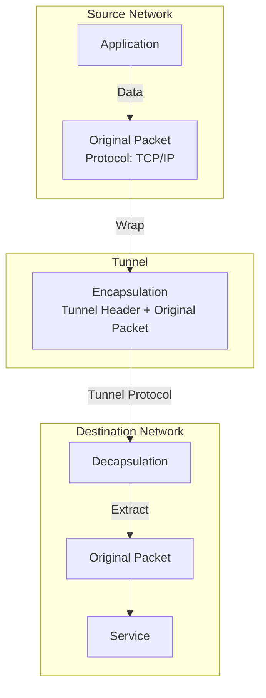

### Why Use Tunneling?

| Use Case | Description | Example Protocols |
|----------|-------------|------------------|
| **VPN Connectivity** | Secure remote access over public networks | IPSec, WireGuard, OpenVPN |
| **Protocol Translation** | Run non-supported protocols over supported ones | 6to4, Teredo (IPv6 over IPv4) |
| **Bypassing Restrictions** | Access blocked services | SSH tunneling, HTTP tunneling |
| **Multi-Protocol Transport** | Carry multiple protocols over single transport | VXLAN, GRE, IPIP |
| **Cloud Connectivity** | Connect on-premises to cloud | VXLAN, WireGuard, IPSec |
| **Network Segmentation** | Isolate traffic within overlays | VXLAN, Geneve, GRE |
| **Load Balancing** | Distribute traffic across paths | ECMP, Anycast |
| **Legacy Protocol Support** | Run old protocols over modern networks | PPTP, L2TP |

### Tunneling Classification

```mermaid
flowchart TD
    A[Tunneling Protocols] --> B{Encapsulation Layer}
    
    B -->|Layer 2| C[Data Link Tunneling]
    B -->|Layer 3| D[Network Tunneling]
    B -->|Layer 4| E[Transport Tunneling]
    B -->|Layer 7| F[Application Tunneling]
    
    C --> C1[VXLAN - Virtual eXtensible LAN]
    C --> C2[GRE - Generic Routing Encapsulation]
    C --> C3[L2TP - Layer 2 Tunneling Protocol]
    C --> C4[PPTP - Point-to-Point Tunneling Protocol]
    C --> C5[MAC-in-MAC]
    C --> C6[Q-in-Q - 802.1QinQ]
    
    D --> D1[IPIP - IP in IP]
    D --> D2[IPSec - IP Security (Tunnel Mode)]
    D --> D3[6to4 - IPv6 over IPv4]
    D --> D4[4in6 - IPv4 over IPv6]
    D --> D5[Teredo - IPv6 over UDP]
    
    E --> E1[SSH - Secure Shell Tunneling]
    E --> E2[HTTP CONNECT - Proxy Tunneling]
    E --> E3[TLS/SSL - Transport Layer Security]
    
    F --> F1[SOCKS - Socket Secure]
    F --> F2[HTTPS - HTTP Secure]
```

---

## 🌐 Layer 2 Tunneling Protocols

Layer 2 tunneling protocols encapsulate **Ethernet frames** or **MAC addresses** within another protocol, creating virtual LANs that span across physical networks.

### VXLAN (Virtual eXtensible LAN)

**VXLAN** (RFC 7348) is a network virtualization technology that extends Layer 2 networks over Layer 3 infrastructure using MAC-in-UDP encapsulation.

#### VXLAN Overview

| Feature | Description |
|---------|-------------|
| **RFC** | RFC 7348 |
| **Encapsulation** | MAC-in-UDP |
| **Header Size** | 50-58 bytes |
| **Identifier** | 24-bit VXLAN Network Identifier (VNI) |
| **Max VNIs** | 16,777,216 (2^24) |
| **Transport** | UDP (port 4789 by default) |
| **MTU** | Minimum 1550 bytes (1500 + 50 overhead) |

#### VXLAN Frame Format

```
+------------------+------------------+------------------+------------------+
|  Outer Ethernet  |   Outer IP       |    UDP           |    VXLAN         |
|   Header (14)    |   Header (20)    |   Header (8)     |    Header (8)    |
+------------------+------------------+------------------+------------------+
| VXLAN Flags (8)  |  Reserved (24)   |  VNI (24)        |  Reserved (8)    |
+------------------+------------------+------------------+------------------+
|  Inner Ethernet  |       Payload                       |       FCS        |
|   Header (14)    |       (46-1500)                     |       (4)        |
+------------------+------------------+------------------+------------------+

Total Overhead: 50-58 bytes
```

**VXLAN Header Fields**:
- **Flags (8 bits)**: Reserved, must be 0
- **Reserved (24 bits)**: Must be 0
- **VNI (24 bits)**: VXLAN Network Identifier (0-16,777,215)
- **Reserved (8 bits)**: Must be 0

#### VXLAN Architecture

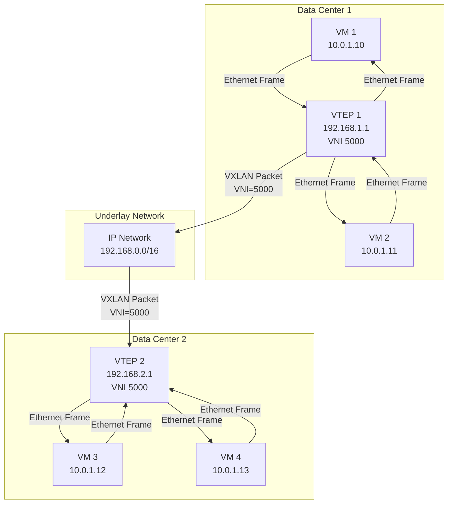

**VTEP (VXLAN Tunnel Endpoint)**:
- Terminates VXLAN tunnels
- Performs encapsulation/decapsulation
- Learns MAC addresses (via BGP EVPN or flooding)
- Can be a physical switch or software (Linux, hypervisor)

#### VXLAN Address Learning

| Method | Description | Pros | Cons |
|--------|-------------|------|------|
| **Flood & Learn** | Flood unknown frames, learn from source | Simple, no control plane | Broadcast/multicast flood, scale issues |
| **BGP EVPN** | Use BGP for MAC/IP advertisement | Scalable, efficient | Complex setup, BGP knowledge required |
| **Controller-based** | Central controller distributes mappings | Centralized control | Single point of failure |

**BGP EVPN Address Families**:
- **L2VPN EVPN**: MAC/IP advertisement
- **L3VPN EVPN**: IP prefix advertisement
- **EVPN Route Types**: Type 2 (MAC/IP), Type 3 (Inclusive Multicast), Type 5 (IP Prefix)

#### VXLAN Use Cases

| Use Case | Description | VNI Usage |
|----------|-------------|------------|
| **Multi-tenant Cloud** | Isolate tenants on shared infrastructure | One VNI per tenant |
| **Data Center Interconnect** | Extend L2 networks across DCs | Same VNI across DCs |
| **Overlay Networks** | Create virtual networks on physical | Multiple VNIs |
| **Network Segmentation** | Separate traffic types (storage, VM, etc.) | Different VNIs per type |
| **VM Mobility** | Live migrate VMs across hosts/DC | Maintain VNI during migration |
| **Container Networking** | Pod networking in Kubernetes | One VNI per namespace |

#### VXLAN Configuration (Linux)

**Install VXLAN support**:
```bash
# Check kernel module
lsmod | grep vxlan

# Load module if not loaded
sudo modprobe vxlan

# Check if supported
cat /proc/net/if_inet6 | grep vxlan
```

**Create VTEP Interface**:
```bash
# Create VTEP on physical interface eth0
sudo ip link add vxlan5000 type vxlan \
    id 5000 \
    dev eth0 \
    dstport 4789 \
    nolearning \
    proxy

# Bring up interface
sudo ip link set vxlan5000 up

# Add IP address (optional for L3 mode)
sudo ip addr add 10.0.1.1/24 dev vxlan5000

# Verify
ip link show vxlan5000
ip -d link show vxlan5000
```

**Add Remote VTEP**:
```bash
# Add remote VTEP (VTEP 2 at 192.168.2.1)
sudo bridge fdb add dev vxlan5000 dst 192.168.2.1 lladdr aa:bb:cc:dd:ee:ff

# Permanent configuration (add to /etc/network/interfaces)
auto vxlan5000
iface vxlan5000 inet static
    address 10.0.1.1
    netmask 255.255.255.0
    vxlan-id 5000
    vxlan-dev eth0
    vxlan-local-tunnelip 192.168.1.1
    vxlan-remote-tunnelip 192.168.2.1
```

**Configure VXLAN with BGP EVPN (FRR)**:
```bash
# Install FRR
sudo apt install frr

# Configure FRR
cat >> /etc/frr/frr.conf << EOF
!
router bgp 65001
 bgp router-id 192.168.1.1
 neighbor 192.168.2.1 remote-as 65002
 !
 address-family ipv4 unicast
  network 192.168.1.0/24
 exit-address-family
 !
 address-family l2vpn evpn
  neighbor 192.168.2.1 activate
  advertise-all-vni
 exit-address-family
!
EOF

# Restart FRR
sudo systemctl restart frr

# Verify BGP EVPN neighbors
sudo vtysh
show bgp l2vpn evpn summary
```

#### VXLAN in Kubernetes

**Calico with VXLAN**:
```yaml
# Calico IPPool with VXLAN encapsulation
apiVersion: projectcalico.org/v3
kind: IPPool
metadata:
  name: default-ipv4-ippool
spec:
  cidr: 192.168.0.0/16
  ipipMode: Never
  natOutgoing: true
  nodeSelector: all()
  vxlanMode: Always
  vxlanPort: 4789
```

**Flannel VXLAN**:
```yaml
# Flannel configuration
apiVersion: v1
kind: ConfigMap
metadata:
  name: kube-flannel-cfg
  namespace: kube-system
data:
  net-conf.json: |
    {
      "Network": "10.244.0.0/16",
      "Backend": {
        "Type": "vxlan",
        "Port": 4789,
        "VNI": 1,
        "GBP": false,
        "DirectRouting": false
      }
    }
```

#### VXLAN Performance Considerations

| Consideration | Recommendation | Impact |
|---------------|----------------|--------|
| **MTU Size** | Set to 1550+ bytes | Prevents fragmentation |
| **Jumbo Frames** | Enable if supported | Reduces overhead |
| **Hardware Offload** | Use NICs with VXLAN offload | Reduces CPU usage |
| **VNI Allocation** | Plan VNI range carefully | Avoid conflicts |
| **BUM Traffic** | Use BGP EVPN for large scale | Reduces flood traffic |
| **Encapsulation** | Consider Geneve for extensibility | Future-proofing |

**MTU Calculation**:
```
VXLAN MTU = Underlay MTU - Outer Ethernet (14) - Outer IP (20) - UDP (8) - VXLAN (8)
VXLAN MTU = Underlay MTU - 50 bytes

For 1500 byte underlay MTU:
VXLAN MTU = 1500 - 50 = 1450 bytes

For 9000 byte jumbo frames:
VXLAN MTU = 9000 - 50 = 8950 bytes
```

### Geneve (Generic Network Virtualization Encapsulation)

**Geneve** (RFC 8926) is a next-generation encapsulation protocol designed to be flexible and extensible for network virtualization.

#### Geneve Overview

| Feature | Description |
|---------|-------------|
| **RFC** | RFC 8926 |
| **Encapsulation** | Flexible TLV-based header |
| **Header Size** | Variable (minimum 8 bytes) |
| **Transport** | UDP (port 6081 by default) |
| **Extensibility** | TLV (Type-Length-Value) options |
| **Compatibility** | Designed to replace VXLAN, NVGRE, STT |

#### Geneve Frame Format

```
+------------------+------------------+------------------+------------------+
|  Outer Ethernet  |   Outer IP       |    UDP           |    Geneve        |
|   Header (14)    |   Header (20)    |   Header (8)     |    Header        |
+------------------+------------------+------------------+------------------+
| Ver (2)          | Opt Len (6)      | OAM (1)          | Critical (1)     |
|                  |                  | Reserved (8)     |                  |
+------------------+------------------+------------------+------------------+
| Protocol Type (16)                 | Reserved (8)     | TLV Options (var)|
+------------------+------------------+------------------+------------------+
|  Inner Ethernet  |       Payload                       |       FCS        |
|   Header (14)    |       (46-1500)                     |       (4)        |
+------------------+------------------+------------------+------------------+
```

**Geneve Header Fields**:
- **Version (2 bits)**: Geneve version (currently 0)
- **Options Length (6 bits)**: Length of TLV options in 4-byte units
- **OAM (1 bit)**: Operations, Administration, and Maintenance
- **Critical (1 bit)**: Critical options flag
- **Protocol Type (16 bits)**: Inner protocol type (e.g., 0x6558 for Ethernet)
- **TLV Options**: Variable-length type-length-value options

#### Geneve vs VXLAN

| Feature | Geneve | VXLAN |
|---------|--------|-------|
| **Flexibility** | ✅ High (TLV options) | ❌ Fixed format |
| **Header Size** | Variable | Fixed (8 bytes) |
| **Extensibility** | ✅ Easy to extend | ❌ Requires new version |
| **OAM Support** | ✅ Built-in | ❌ Not built-in |
| **Adoption** | Growing | ✅ Wide |
| **Hardware Support** | Limited | ✅ Wide |
| **Standard** | RFC 8926 | RFC 7348 |

#### Geneve Use Cases

| Use Case | Description | Benefit |
|----------|-------------|---------|
| **Multi-tenant Overlays** | Flexible tenant isolation | Custom metadata in TLV |
| **Network Function Virtualization** | Insert network functions | Chaining via TLV |
| **Service Chaining** | Direct traffic through services | Path information in TLV |
| **Advanced Telemetry** | Collect detailed metrics | OAM options |
| **Future-proof Design** | Accommodate new requirements | Extensible header |

#### Geneve Configuration (Linux)

```bash
# Create Geneve interface
sudo ip link add geneve100 type geneve \
    id 100 \
    remote 192.168.2.1 \
    dev eth0 \
    dstport 6081 \
    udp_csum \
    ttl 64

# Bring up interface
sudo ip link set geneve100 up

# Verify
ip -d link show geneve100

# Delete interface
sudo ip link del geneve100
```

### GRE (Generic Routing Encapsulation)

**GRE** (RFC 2784, RFC 2890) is a simple tunneling protocol that encapsulates network layer protocols inside IP tunnels.

#### GRE Overview

| Feature | Description |
|---------|-------------|
| **RFC** | RFC 2784, RFC 2890 |
| **Encapsulation** | Protocol 47 (IP protocol number) |
| **Header Size** | 24 bytes (base) + optional fields |
| **Max Payload** | 65,535 - 24 = 65,511 bytes |
| **Transport** | Direct IP encapsulation (no UDP/TCP) |
| **Protocol ID** | 0x2F (47) |

#### GRE Packet Format

```
+------------------+------------------+------------------+
|   Outer IP       |    GRE           |    Payload       |
|   Header (20)    |   Header (24)    |    (variable)    |
+------------------+------------------+------------------+

GRE Header:
+---------+---------+------------------+------------------+
| C (1)   | R (1)   | K (1) | S (1)   | Recur (3)        |
| Flags (5)         | Ver (3)          |                  |
+---------+---------+------------------+------------------+
| Protocol Type (16)                   | Checksum (16)    |
+--------------------------------------+------------------+
| Key (32)                             | Seq Number (32)  |
+--------------------------------------+------------------+

Optional fields (if flags set):
- Checksum: 16-bit checksum
- Offset: Offset from GRE header to payload
- Key: 32-bit key for tunnel identification
- Sequence Number: 32-bit sequence number
```

**GRE Header Flags**:
- **C (Checksum)**: Checksum present
- **R (Routing)**: Routing present (deprecated)
- **K (Key)**: Key present
- **S (Sequence)**: Sequence number present
- **Recur (Recursion Control)**: 3-bit recursion control
- **Flags**: 5-bit flags
- **Ver (Version)**: GRE version (currently 0)

#### GRE Types

| Type | Protocol | Description |
|------|----------|-------------|
| 0x0000 | Reserved | Reserved |
| 0x0800 | IPv4 | IPv4 payload |
| 0x86DD | IPv6 | IPv6 payload |
| 0x0806 | ARP | ARP payload |
| 0x8035 | RARP | Reverse ARP |
| 0x809B | AppleTalk | AppleTalk |
| 0x0800 | PPTP | Point-to-Point Tunneling Protocol |

#### GRE Architecture

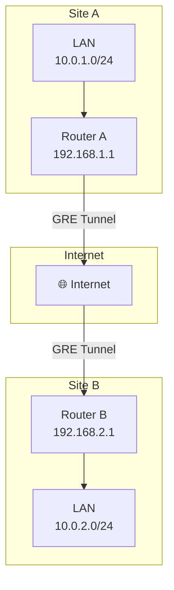

#### GRE Configuration (Linux)

```bash
# Create GRE tunnel
sudo ip tunnel add gre1 mode gre \
    remote 192.168.2.1 \
    local 192.168.1.1 \
    ttl 255

# Bring up tunnel
sudo ip link set gre1 up

# Add IP address
sudo ip addr add 10.0.0.1/30 dev gre1

# Add route through tunnel
sudo ip route add 10.0.2.0/24 dev gre1

# Verify
ip tunnel show gre1
ip addr show gre1
ip route show

# Test connectivity
ping 10.0.0.2
```

**Persistent Configuration**:
```bash
# Create tunnel at boot (add to /etc/network/interfaces)
auto gre1
iface gre1 inet tunnel
    address 10.0.0.1
    netmask 255.255.255.252
    mode gre
    remote 192.168.2.1
    local 192.168.1.1
    ttl 255
    up ip route add 10.0.2.0/24 dev gre1
```

#### GRE Keepalive

```bash
# Enable keepalive on GRE tunnel
sudo ip tunnel change gre1 ttl 255 key 12345

# Check keepalive status
cat /proc/net/ip_tunnels | grep gre1

# Configure keepalive (using gretap)
sudo ip link add gretap1 type gretap \
    remote 192.168.2.1 \
    local 192.168.1.1 \
    encap gre \
    ttl 255
```

#### GRE vs IPIP

| Feature | GRE | IPIP |
|---------|-----|------|
| **Protocol** | Protocol 47 | Protocol 4 (IP-in-IP) |
| **Header Size** | 24+ bytes | 20 bytes (IP header only) |
| **Flexibility** | ✅ Supports multiple protocols | ❌ IPv4 only |
| **Checksum** | ✅ Optional | ❌ No (IP checksum recalculated) |
| **Key/Sequence** | ✅ Optional | ❌ No |
| **MTU** | Lower (24+ byte overhead) | Higher (20 byte overhead) |
| **Use Case** | Multi-protocol, VPN | Simple IP tunneling |

#### GRE Use Cases

| Use Case | Description | Example |
|----------|-------------|---------|
| **Site-to-Site VPN** | Connect remote networks | GRE over IPSec |
| **Protocol Translation** | Tunnel non-IP protocols over IP | IPv6 over GRE |
| **VPN Backbone** | Create VPN infrastructure | MPLS over GRE |
| **Testing** | Simulate network topologies | Lab environments |
| **Legacy Support** | Tunnel old protocols | AppleTalk, IPX |
| **Simple Tunneling** | Basic IP tunneling | Quick point-to-point |

### IPIP (IP in IP)

**IPIP** (RFC 2003) is a simple tunneling protocol that encapsulates IP packets within IP packets.

#### IPIP Overview

| Feature | Description |
|---------|-------------|
| **RFC** | RFC 2003 |
| **Protocol** | IP Protocol 4 |
| **Encapsulation** | IP-in-IP |
| **Header Size** | 20 bytes (outer IP header) |
| **MTU** | Original MTU - 20 bytes |

#### IPIP Packet Format

```
+----------------+----------------+
|  Outer IP      |    Inner IP    |
|  Header (20)   |    Packet      |
+----------------+----------------+

Total Overhead: 20 bytes
```

#### IPIP Configuration (Linux)

```bash
# Create IPIP tunnel
sudo ip tunnel add ipip1 mode ipip \
    remote 192.168.2.1 \
    local 192.168.1.1 \
    ttl 255

# Bring up tunnel
sudo ip link set ipip1 up

# Add IP address
sudo ip addr add 10.0.0.1/30 dev ipip1

# Add route
sudo ip route add 10.0.2.0/24 dev ipip1

# Verify
ip tunnel show ipip1
ip addr show ipip1

# Test
ping 10.0.0.2
```

### MAC-in-MAC (MAC-in-MAC)

**MAC-in-MAC** is a Layer 2 tunneling protocol that encapsulates Ethernet frames within Ethernet frames, used primarily in data center networking.

#### MAC-in-MAC Frame Format

```
+------------------+------------------+------------------+
|  Outer Ethernet  |  MAC-in-MAC      |  Inner Ethernet  |
|   Header (14)    |    Header        |   Header (14)    |
+------------------+------------------+------------------+

MAC-in-MAC Header:
+------------------+------------------+------------------+
|  I-SID (24)      |    Reserved      |   B-DA (48)      |
+------------------+------------------+------------------+
|  B-SA (48)       |  Payload (46-1500)                  |
+------------------+-------------------------------------+
```

- **I-SID (I-Component Service ID)**: 24-bit identifier for the service
- **B-DA (Backbone Destination Address)**: 48-bit backbone MAC
- **B-SA (Backbone Source Address)**: 48-bit backbone MAC

#### MAC-in-MAC Use Cases

| Use Case | Description |
|----------|-------------|
| **Data Center Bridging** | Extend L2 networks across switches |
| **Provider Backbone Bridge** | PBB (IEEE 802.1ah) |
| **Multi-tenant Isolation** | Isolate tenants using I-SID |
| **Scalable L2 Networks** | Overcome MAC table limits |

### Q-in-Q (802.1QinQ)

**Q-in-Q** (IEEE 802.1ad) encapsulates Ethernet frames with an additional VLAN tag, enabling service providers to offer VLAN services to customers.

#### Q-in-Q Frame Format

```
+------------------+------------------+------------------+------------------+
|  Outer Ethernet  |  Outer VLAN      |  Inner Ethernet  |  Inner VLAN      |
|   Header (6)     |    Tag (4)       |   Header (6)     |    Tag (4)       |
+------------------+------------------+------------------+------------------+
|  Payload (46-1500)                  | FCS (4)                             |
+-------------------------------------+-------------------------------------+

Total Overhead: 8 bytes (2 VLAN tags)
```

- **Outer VLAN Tag (S-TAG)**: Service provider VLAN
- **Inner VLAN Tag (C-TAG)**: Customer VLAN

#### Q-in-Q Use Cases

| Use Case | Description |
|----------|-------------|
| **Service Provider Networks** | Offer VLAN services to customers |
| **VLAN Extension** | Extend customer VLANs across provider network |
| **Multi-tenant Networks** | Isolate customer traffic |
| **Metro Ethernet** | Carrier Ethernet services |

---

## 🌍 Layer 3 Tunneling Protocols

Layer 3 tunneling protocols encapsulate **IP packets** within another protocol, enabling IP communication across diverse network environments.

### IPSec Tunnel Mode

**IPSec in Tunnel Mode** encapsulates entire IP packets within IPSec headers (ESP or AH), providing confidentiality, integrity, and authentication.

#### IPSec Tunnel Mode Packet Format

```
+----------------+----------------+----------------+----------------+
|  New IP        |    ESP/AH      |   Original IP  |     Data       |
|  Header        |    Header      |    Packet      |  (Encrypted)   |
+----------------+----------------+----------------+----------------+

Overhead:
- ESP: 20-32 bytes (IP header + ESP header + padding)
- AH: 24-36 bytes (IP header + AH header)
```

#### IPSec Tunnel Mode vs Transport Mode

| Feature | Tunnel Mode | Transport Mode |
|---------|-------------|----------------|
| **Encapsulation** | Entire IP packet | IP payload only |
| **Header Preservation** | ❌ New IP header | ✅ Original IP header |
| **NAT Traversal** | ✅ Works with NAT-T | ❌ May not work |
| **Use Case** | Gateway-to-gateway, site-to-site | Host-to-host |
| **Overhead** | Higher | Lower |

### 6to4 (IPv6 over IPv4)

**6to4** (RFC 3056) is a transition mechanism for transmitting IPv6 packets over IPv4 networks.

#### 6to4 Overview

| Feature | Description |
|---------|-------------|
| **RFC** | RFC 3056 |
| **Prefix** | 2002::/16 |
| **Encapsulation** | IPv6 in IPv4 (protocol 41) |
| **Address Format** | 2002:WWXX:YYZZ::/48 |
| **Relay Router** | Public 6to4 relay |

**Address Format**:
```
IPv6: 2002:WWXX:YYZZ:subnet:host
     
Where:
- 2002::/16 = 6to4 prefix
- WWXX:YYZZ = IPv4 address in hex (e.g., 192.0.2.1 = C000:0201)
- subnet = 16-bit subnet ID
- host = 64-bit host address
```

#### 6to4 Architecture

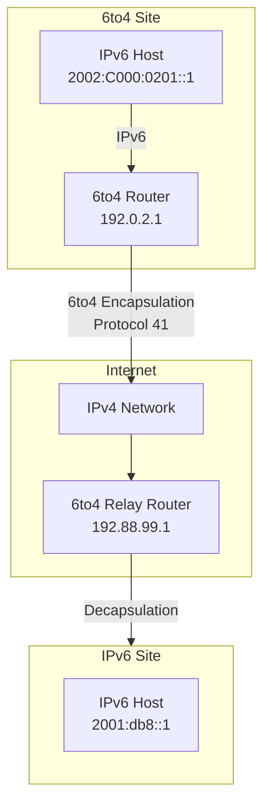

#### 6to4 Configuration (Linux)

```bash
# Create 6to4 tunnel
sudo ip tunnel add 6to4tun mode sit \
    remote any \
    local 192.0.2.1 \
    ttl 255

# Bring up tunnel
sudo ip link set 6to4tun up

# Add 6to4 address
sudo ip addr add 2002:C000:0201::1/16 dev 6to4tun

# Add default route through 6to4 relay
sudo ip route add ::/0 via 2002:C058:6301:: dev 6to4tun

# Verify
ip tunnel show 6to4tun
ip -6 addr show 6to4tun
ip -6 route show
```

#### 6to4 Relay Configuration

```bash
# Create relay tunnel
sudo ip tunnel add relay6to4 mode sit \
    remote any \
    local 192.88.99.1 \
    ttl 255

# Bring up tunnel
sudo ip link set relay6to4 up

# Add relay address
sudo ip addr add 2002:59C8:6301::1/16 dev relay6to4

# Enable forwarding
sudo sysctl -w net.ipv6.conf.all.forwarding=1
sudo sysctl -w net.ipv4.conf.all.forwarding=1

# Add route to 6to4 prefix
sudo ip route add 2002::/16 dev relay6to4
```

### 4in6 (IPv4 over IPv6)

**4in6** encapsulates IPv4 packets within IPv6 packets, enabling IPv4 connectivity over IPv6 networks.

#### 4in6 Configuration (Linux)

```bash
# Create 4in6 tunnel
sudo ip -6 tunnel add 4in6tun mode ip6ip6 \
    remote 2001:db8::1 \
    local 2001:db8::2 \
    ttl 255

# Bring up tunnel
sudo ip link set 4in6tun up

# Add IPv4 address
sudo ip addr add 192.0.2.1/30 dev 4in6tun

# Add route
sudo ip route add 192.0.2.0/24 dev 4in6tun

# Enable forwarding
sudo sysctl -w net.ipv4.conf.all.forwarding=1
```

### Teredo (IPv6 over UDP)

**Teredo** (RFC 4380) is a transition mechanism that tunnels IPv6 packets over UDP through IPv4 NATs.

#### Teredo Overview

| Feature | Description |
|---------|-------------|
| **RFC** | RFC 4380 |
| **Transport** | UDP (port 3544) |
| **Prefix** | 2001::/32 |
| **NAT Traversal** | ✅ Works through NATs |
| **Address Format** | 2001:0000:XXXX:XXXX:... |

**Teredo Address Format**:
```
2001:0000:Server IPv4:Flags:Obscured IPv4:Port:Obscured Client IPv4

Where:
- 2001::/32 = Teredo prefix
- Next 32 bits = Server IPv4 address
- Flags = 16-bit flags
- Next 32 bits = Obscured client IPv4 address
- Next 16 bits = Obscured port
```

#### Teredo Components

| Component | Description |
|-----------|-------------|
| **Teredo Client** | End host with Teredo tunneling |
| **Teredo Server** | Well-known server for initial configuration |
| **Teredo Relay** | Forwards Teredo traffic to IPv6 Internet |
| **Teredo Peer** | Another Teredo client for P2P communication |

#### Teredo Architecture

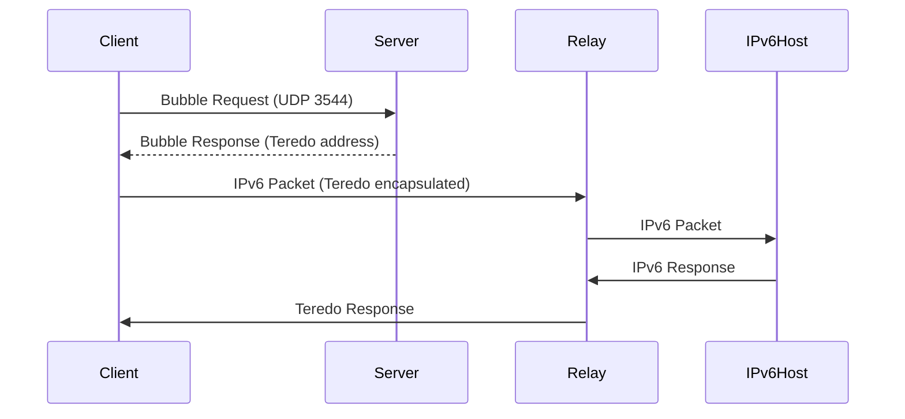

#### Teredo Configuration (Windows)

```powershell
# Enable Teredo
netsh interface ipv6 set teredo client

# Check Teredo status
netsh interface ipv6 show teredo state

# Set Teredo server
netsh interface ipv6 set teredo server=win1901.ipv6.microsoft.com

# Disable Teredo
netsh interface ipv6 set teredo disabled
```

#### Teredo Configuration (Linux)

```bash
# Install Miredo (Teredo client)
sudo apt install miredo

# Configure Miredo
cat > /etc/miredo/miredo.conf << EOF
ServerAddress = teredo.ipv6.microsoft.com
ServerPort = 3544
ServerName = teredo.ipv6.microsoft.com
RelayServerAddress = win1901.ipv6.microsoft.com
RelayServerPort = 3544
RelayServerName = win1901.ipv6.microsoft.com
EOF

# Start Miredo
sudo systemctl start miredo
sudo systemctl enable miredo

# Check Teredo interface
ip -6 addr show teredo
```

### SIT (Simple Internet Transition)

**SIT** (RFC 2473) is a simple IPv6-over-IPv4 tunneling mechanism.

#### SIT Configuration (Linux)

```bash
# Create SIT tunnel
sudo ip tunnel add sit1 mode sit \
    remote 192.0.2.2 \
    local 192.0.2.1 \
    ttl 255

# Bring up tunnel
sudo ip link set sit1 up

# Add IPv6 address
sudo ip addr add 2001:db8::1/64 dev sit1

# Add route
sudo ip -6 route add 2001:db8::/64 dev sit1

# Enable forwarding
sudo sysctl -w net.ipv6.conf.all.forwarding=1
```

---

## 🔌 Layer 4 Tunneling Protocols

Layer 4 tunneling protocols operate at the transport layer, typically using TCP or UDP to encapsulate other protocols.

### SSH Tunneling

**SSH tunneling** uses the SSH protocol to create secure tunnels for other protocols.

#### SSH Tunnel Types

| Type | Description | Command | Use Case |
|------|-------------|---------|----------|
| **Local Port Forwarding** | Forward local port to remote | `-L` | Access remote services |
| **Remote Port Forwarding** | Forward remote port to local | `-R` | Expose local services |
| **Dynamic Port Forwarding** | SOCKS proxy | `-D` | General proxy |

#### SSH Local Port Forwarding

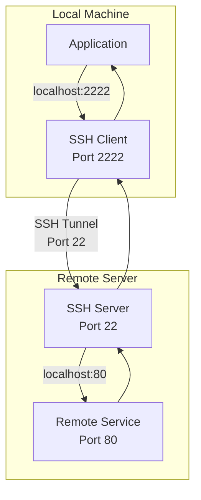

**Command**:
```bash
# Forward local port 2222 to remote service on port 80
ssh -L 2222:localhost:80 user@remote-server

# Forward local port 2222 to remote host internal-service:80
ssh -L 2222:internal-service:80 user@bastion-server

# Forward with specific local address
ssh -L 0.0.0.0:2222:localhost:80 user@remote-server
```

#### SSH Remote Port Forwarding

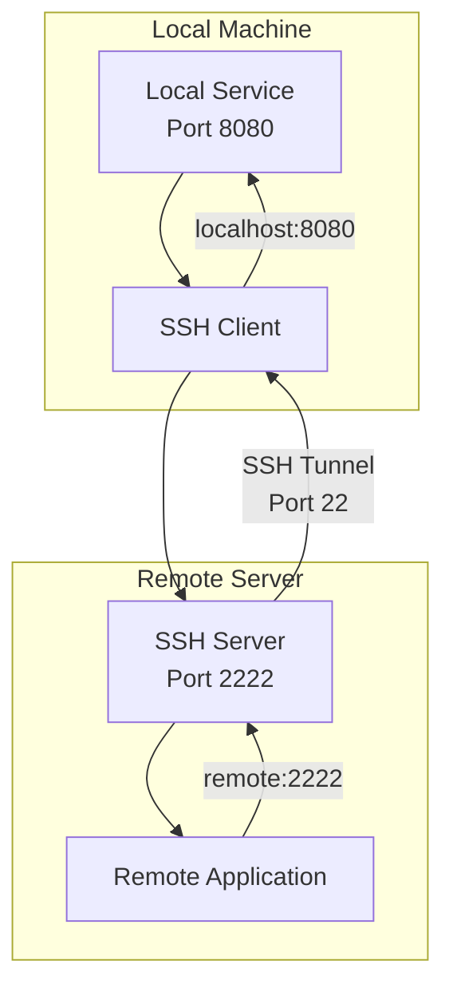

**Command**:
```bash
# Forward remote port 2222 to local service on port 8080
ssh -R 2222:localhost:8080 user@remote-server

# Forward remote port to different local host
ssh -R 2222:other-host:8080 user@remote-server
```

#### SSH Dynamic Port Forwarding (SOCKS Proxy)

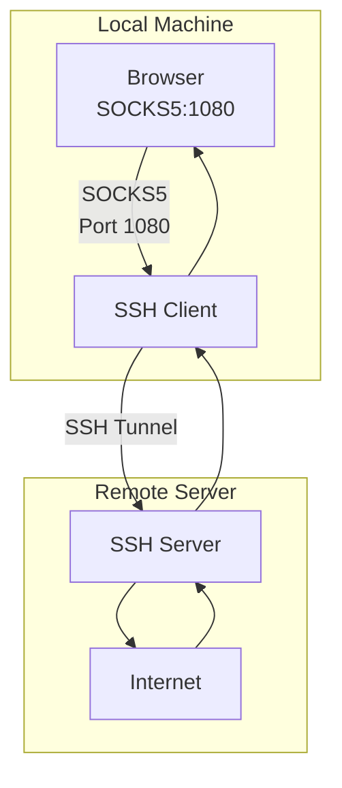

**Command**:
```bash
# Create SOCKS proxy on local port 1080
ssh -D 1080 user@remote-server

# Configure browser to use SOCKS5 proxy at localhost:1080
```

#### SSH Tunnel Configuration File

```bash
# ~/.ssh/config
Host bastion
    HostName bastion.example.com
    User myuser
    IdentityFile ~/.ssh/bastion_key
    LocalForward 2222 localhost:80
    RemoteForward 2223 localhost:8080
    DynamicForward 1080
```

#### SSH Tunnel with Authentication

```bash
# Use key-based authentication
ssh -i ~/.ssh/mykey.pem -L 2222:localhost:80 user@remote-server

# Use specific cipher
ssh -c aes256-gcm@openssh.com -L 2222:localhost:80 user@remote-server

# Background the SSH process
ssh -f -N -L 2222:localhost:80 user@remote-server

# Kill all SSH tunnels
pkill -f ssh
```

### HTTP Tunneling (CONNECT Method)

**HTTP CONNECT** is a method for establishing network tunnels through HTTP proxies.

#### HTTP CONNECT Request

```http
CONNECT example.com:443 HTTP/1.1
Host: example.com:443
Proxy-Connection: keep-alive

HTTP/1.1 200 Connection Established
```

#### HTTP CONNECT Sequence

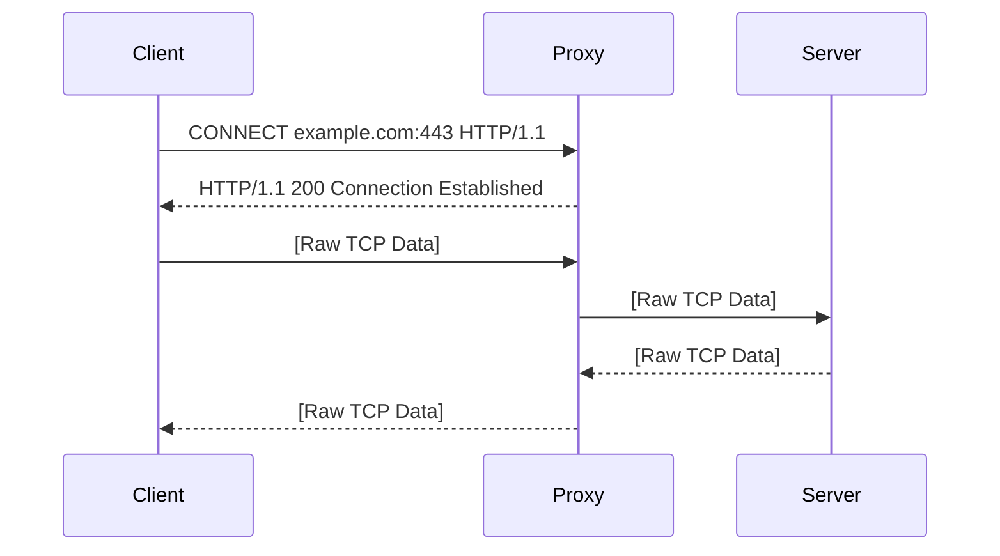

#### HTTP CONNECT Use Cases

| Use Case | Description | Example |
|----------|-------------|---------|
| **HTTPS Proxy** | Proxy HTTPS traffic through firewall | Corporate proxies |
| **Bypassing Firewalls** | Access blocked services | Web filtering bypass |
| **SSH through Proxy** | SSH through HTTP proxy | `ssh -o ProxyCommand='nc -X connect -x proxy:8080 %h %p'` |
| **Access Internal Services** | Reach internal resources from external | Remote access |

### TLS/SSL Tunneling

**TLS/SSL tunneling** encapsulates arbitrary data within TLS/SSL connections, providing encryption and authentication.

#### TLS Tunneling Architecture

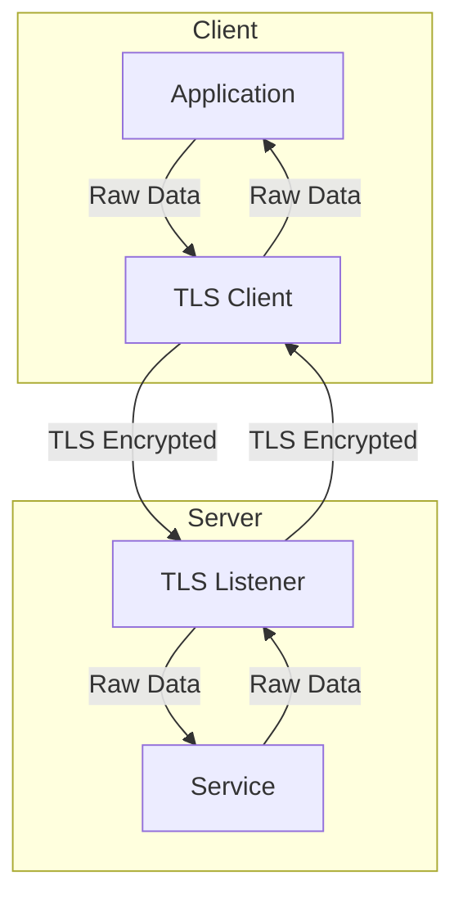

#### TLS Tunneling with Stunnel

```bash
# Install stunnel
sudo apt install stunnel4

# Client configuration (/etc/stunnel/stunnel.conf)
[my-tunnel]
client = yes
accept = 127.0.0.1:2222
connect = remote-server:443

# Server configuration (/etc/stunnel/stunnel.conf)
[my-tunnel]
accept = 0.0.0.0:443
connect = 127.0.0.1:80
cert = /etc/stunnel/stunnel.pem
key = /etc/stunnel/stunnel-key.pem

# Start stunnel
sudo systemctl start stunnel4
sudo systemctl enable stunnel4
```

---

## 🎭 Application Layer Tunneling

### SOCKS Proxy

**SOCKS** (Socket Secure) is a protocol for routing network traffic through a proxy server.

#### SOCKS Versions

| Version | Description | Port | Features |
|---------|-------------|------|----------|
| **SOCKS4** | Basic SOCKS | 1080 | IPv4, TCP only |
| **SOCKS4a** | SOCKS4 with DNS | 1080 | IPv4, TCP, DNS resolution |
| **SOCKS5** | Modern SOCKS | 1080 | IPv4/IPv6, TCP/UDP, authentication |

#### SOCKS5 Protocol Flow

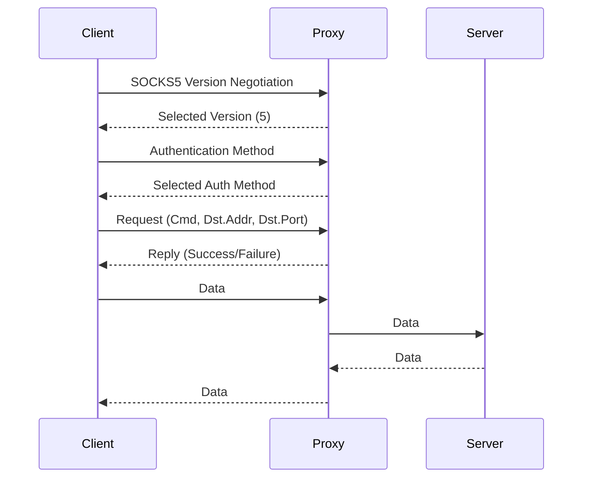

#### SOCKS5 Commands

| Command | Code | Description |
|---------|------|-------------|
| CONNECT | 0x01 | Establish TCP connection |
| BIND | 0x02 | Receive incoming connection |
| UDP ASSOCIATE | 0x03 | Establish UDP relay |

#### SOCKS5 Authentication Methods

| Method | Code | Description |
|--------|------|-------------|
| NO AUTHENTICATION | 0x00 | No authentication |
| GSSAPI | 0x01 | GSSAPI authentication |
| USERNAME/PASSWORD | 0x02 | Username/password auth |
| IANA ASSIGNED | 0x03-0x7F | IANA registered methods |
| PRIVATE METHODS | 0x80-0xFE | Private/Experimental |
| NO ACCEPTABLE METHODS | 0xFF | No acceptable methods |

#### SOCKS5 with Dante

```bash
# Install Dante (SOCKS server)
sudo apt install dante-server

# Configuration (/etc/dante/sockd.conf)
logoutput: syslog
user.privileged: root
user.unprivileged: nobody

internal: 127.0.0.1 port = 1080

socks.method: username
socks.username: myuser
socks.password: mypassword

clientmethod: none
client pass {
    from: 0.0.0.0/0 to: 0.0.0.0/0
    log: connect disconnect error
}

# Start Dante
sudo systemctl start sockd
sudo systemctl enable sockd
```

#### SOCKS5 Client Configuration

**Linux (with proxychains)**:
```bash
# Install proxychains
sudo apt install proxychains

# Configuration (/etc/proxychains4.conf)
strict_chain
proxy_dns

[ProxyList]
socks5 127.0.0.1 1080 myuser mypassword

# Use with curl
proxychains curl https://example.com

# Use with ssh
proxychains ssh user@remote-server
```

**Browser Configuration**:
- Firefox: Settings > Network Settings > Manual proxy configuration
- Chrome: `chrome://settings/?search=proxy` or use extension
- System: Environment variables `http_proxy`, `https_proxy`, `socks_proxy`

### HTTPS Proxy

**HTTPS proxies** intercept and forward HTTPS traffic using the CONNECT method.

#### HTTPS Proxy with Squid

```bash
# Install Squid
sudo apt install squid

# Configure SSL bumping (/etc/squid/squid.conf)
http_port 3128
https_port 3129 intercept ssl-bump \
    cert=/etc/squid/ssl/squid.pem \
    key=/etc/squid/ssl/squid.key \
    generate-host-certificates=on \
    dynamic_cert_mem_cache_size=4MB

ssl_bump server-first all

# Generate SSL certificate
sudo mkdir -p /etc/squid/ssl
sudo openssl req -new -newkey rsa:2048 -days 365 -nodes -x509 \
    -keyout /etc/squid/ssl/squid.key \
    -out /etc/squid/ssl/squid.pem \
    -subj "/CN=squid-proxy"

# Set permissions
sudo chown proxy:proxy /etc/squid/ssl/squid.*
sudo chmod 600 /etc/squid/ssl/squid.key

# Restart Squid
sudo systemctl restart squid
```

### HTTP/2 Tunneling

**HTTP/2** can be used for tunneling other protocols, including gRPC and WebSockets.

#### HTTP/2 Connection Flow

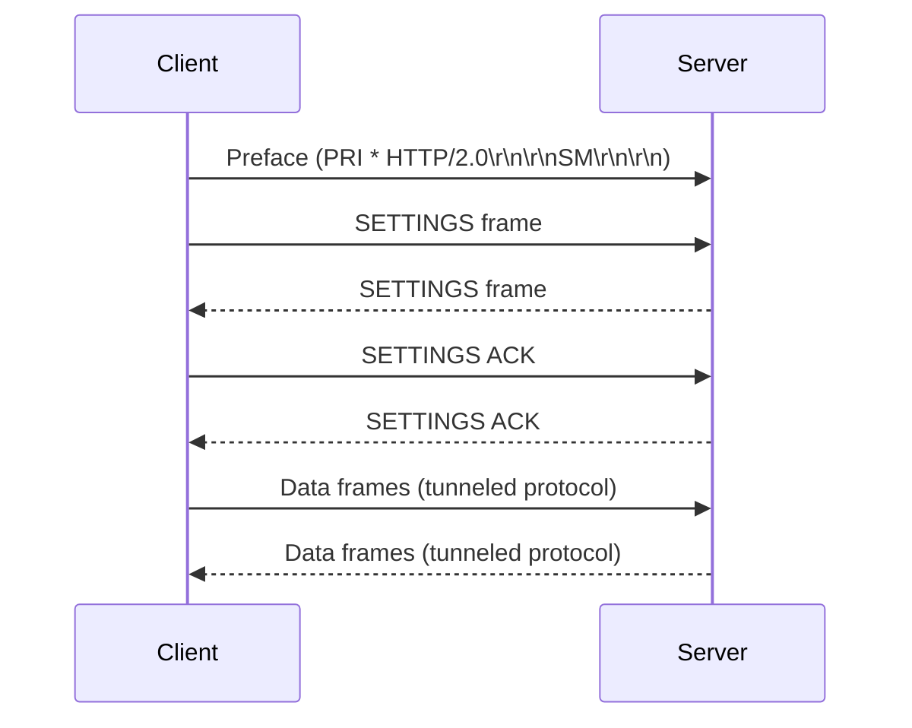

#### gRPC over HTTP/2

gRPC uses HTTP/2 as its transport protocol, effectively tunneling RPC calls:

```bash
# gRPC client in Python
import grpc

channel = grpc.insecure_channel('localhost:50051')
stub = my_service_pb2_grpc.MyServiceStub(channel)
response = stub.MyMethod(request)
```

---

## 🔄 Tunneling Protocol Comparison

### Performance Comparison

| Protocol | Overhead (bytes) | Encryption | NAT Traversal | Performance | Complexity |
|----------|-----------------|------------|---------------|-------------|------------|
| **VXLAN** | 50-58 | ❌ No | ✅ Yes | ⭐⭐⭐⭐ | ⭐⭐⭐ |
| **GRE** | 24+ | ❌ No | ✅ Yes | ⭐⭐⭐⭐⭐ | ⭐⭐ |
| **IPIP** | 20 | ❌ No | ❌ No | ⭐⭐⭐⭐⭐ | ⭐ |
| **Geneve** | Variable | ❌ No | ✅ Yes | ⭐⭐⭐⭐ | ⭐⭐⭐⭐ |
| **IPSec** | 20-50+ | ✅ Yes | ✅ Yes | ⭐⭐⭐ | ⭐⭐⭐⭐ |
| **WireGuard** | 40-60 | ✅ Yes | ✅ Yes | ⭐⭐⭐⭐⭐ | ⭐⭐ |
| **OpenVPN** | 20-100+ | ✅ Yes | ✅ Yes | ⭐⭐⭐ | ⭐⭐⭐⭐ |
| **SSH** | 20-50 | ✅ Yes | ✅ Yes | ⭐⭐⭐ | ⭐⭐ |
| **SOCKS5** | Variable | ❌ No | ✅ Yes | ⭐⭐⭐⭐ | ⭐ |
| **HTTPS CONNECT** | Variable | ✅ Yes (TLS) | ✅ Yes | ⭐⭐⭐⭐ | ⭐⭐ |

### Feature Comparison

| Feature | VXLAN | GRE | IPIP | Geneve | IPSec | WireGuard | OpenVPN | SSH |
|---------|-------|-----|------|--------|-------|----------|---------|-----|
| **Layer** | L2 | L3 | L3 | L2/L3 | L3 | L3 | L2/L3 | L7 |
| **Encapsulation** | MAC-in-UDP | IP-in-IP | IP-in-IP | Flexible | ESP/AH | UDP | TLS/SSL | SSH |
| **Encryption** | ❌ No | ❌ No | ❌ No | ❌ No | ✅ Yes | ✅ Yes | ✅ Yes | ✅ Yes |
| **Authentication** | ❌ No | ❌ No | ❌ No | ❌ No | ✅ Yes | ✅ Yes | ✅ Yes | ✅ Yes |
| **Multicast Support** | ✅ Yes | ❌ No | ❌ No | ✅ Yes | ❌ No | ❌ No | ❌ No | ❌ No |
| **Jumbo Frames** | ✅ Yes | ✅ Yes | ✅ Yes | ✅ Yes | ✅ Yes | ✅ Yes | ❌ No | ❌ No |
| **Hardware Offload** | ✅ Yes | ✅ Yes | ✅ Yes | Limited | ✅ Yes | Limited | ❌ No | ❌ No |
| **Dynamic Routing** | ✅ Yes | ✅ Yes | ✅ Yes | ✅ Yes | ✅ Yes | ✅ Yes | ❌ No | ❌ No |
| **MTU Considerations** | High | Medium | Medium | Medium | High | Low | Medium | Low |

### Use Case Comparison

| Use Case | Best Protocol | Alternatives | Why |
|----------|---------------|--------------|-----|
| **Data Center Overlay** | VXLAN, Geneve | GRE | Scalable, hardware support |
| **Site-to-Site VPN** | IPSec, WireGuard | GRE, OpenVPN | Secure, proven |
| **Remote Access VPN** | WireGuard, OpenVPN | IPSec, SSH | Secure, firewall-friendly |
| **IPv6 Transition** | 6to4, Teredo | SIT | NAT traversal |
| **Cloud Connectivity** | VXLAN, WireGuard | IPSec, GRE | Performance, scalability |
| **Container Networking** | VXLAN, Geneve | GRE | Kubernetes support |
| **Simple Tunneling** | GRE, IPIP | VXLAN | Low overhead |
| **SSH Access** | SSH | HTTPS CONNECT | Built-in encryption |
| **Web Proxy** | HTTPS CONNECT | SOCKS5 | Firewall-friendly |

---

## 🛠️ Tunneling Protocol Selection Guide

### Decision Tree

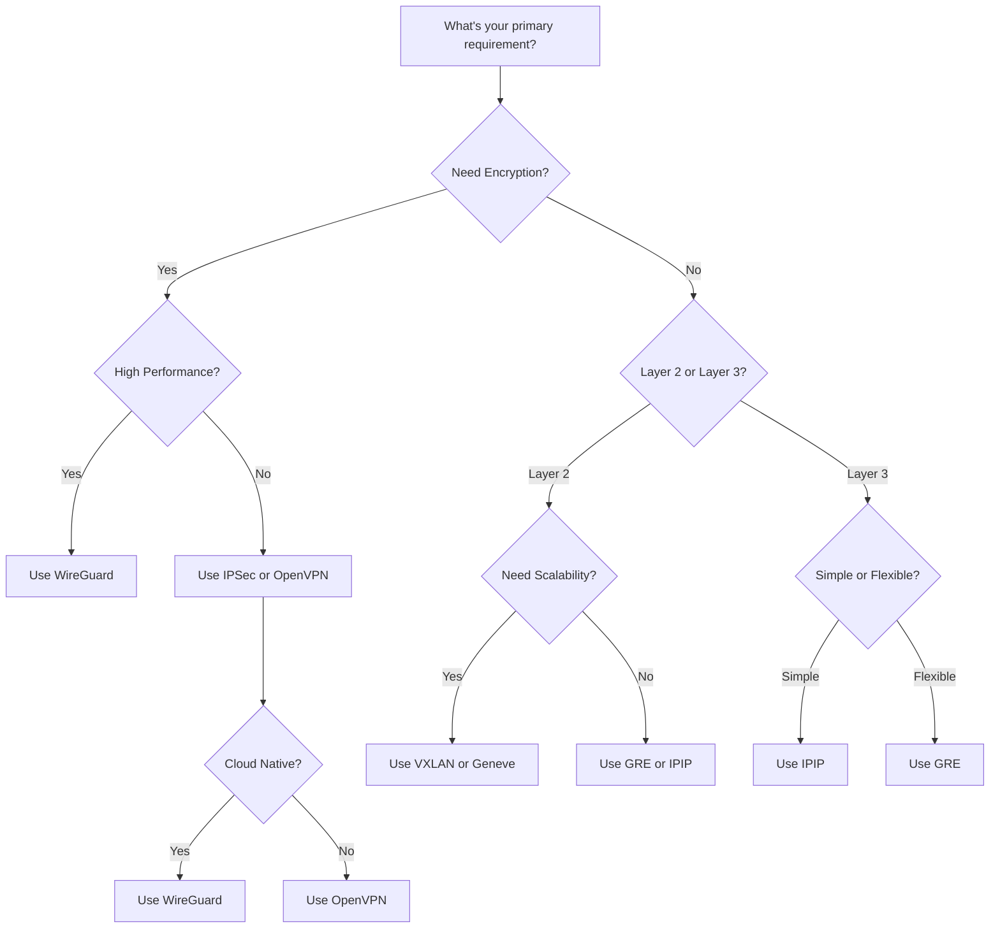

### Quick Recommendations

| Scenario | Recommended Protocol | Configuration Complexity | Performance |
|----------|---------------------|--------------------------|-------------|
| **Cloud-native overlay** | VXLAN | Medium | ⭐⭐⭐⭐ |
| **High-performance VPN** | WireGuard | Low | ⭐⭐⭐⭐⭐ |
| **Enterprise VPN** | IPSec | High | ⭐⭐⭐⭐ |
| **Cross-platform VPN** | OpenVPN | Medium | ⭐⭐⭐ |
| **Simple site-to-site** | GRE | Low | ⭐⭐⭐⭐⭐ |
| **Multi-tenant cloud** | Geneve | Medium | ⭐⭐⭐⭐ |
| **IPv6 transition** | 6to4 or Teredo | Medium | ⭐⭐⭐ |
| **SSH access** | SSH tunneling | Low | ⭐⭐⭐ |
| **Web proxy** | HTTPS CONNECT | Low | ⭐⭐⭐⭐ |
| **Debugging/Testing** | GRE or IPIP | Low | ⭐⭐⭐⭐⭐ |

---

## 🔧 Implementation Examples

### Example 1: VXLAN Overlay Network (Kubernetes)

**Using Calico with VXLAN**:
```yaml
# Install Calico with VXLAN
kubectl apply -f https://docs.projectcalico.org/manifests/calico.yaml

# Configure IPPool for VXLAN
cat <<EOF | calicoctl apply -f -
apiVersion: projectcalico.org/v3
kind: IPPool
metadata:
  name: default-ipv4-ippool
spec:
  cidr: 192.168.0.0/16
  ipipMode: Never
  natOutgoing: true
  nodeSelector: all()
  vxlanMode: Always
  vxlanPort: 4789
EOF

# Verify VXLAN tunnels
calicoctl get nodes -o wide
```

### Example 2: WireGuard VPN Server

```bash
# Server configuration
cat > /etc/wireguard/wg0.conf << EOF
[Interface]
PrivateKey = <server-private-key>
Address = 10.0.0.1/24
ListenPort = 51820
PostUp = iptables -A FORWARD -i wg0 -j ACCEPT; iptables -t nat -A POSTROUTING -o eth0 -j MASQUERADE
PostDown = iptables -D FORWARD -i wg0 -j ACCEPT; iptables -t nat -D POSTROUTING -o eth0 -j MASQUERADE

[Peer]
PublicKey = <client-public-key>
AllowedIPs = 10.0.0.2/32
EOF

# Client configuration
cat > /etc/wireguard/wg0.conf << EOF
[Interface]
PrivateKey = <client-private-key>
Address = 10.0.0.2/24
DNS = 8.8.8.8

[Peer]
PublicKey = <server-public-key>
Endpoint = server.example.com:51820
AllowedIPs = 0.0.0.0/0
PersistentKeepalive = 25
EOF
```

### Example 3: GRE Tunnel for Site-to-Site

```bash
# Site A
sudo ip tunnel add gre1 mode gre remote 192.0.2.2 local 192.0.2.1 ttl 255
sudo ip addr add 10.0.0.1/30 dev gre1
sudo ip link set gre1 up
sudo ip route add 10.0.2.0/24 dev gre1

# Site B
sudo ip tunnel add gre1 mode gre remote 192.0.2.1 local 192.0.2.2 ttl 255
sudo ip addr add 10.0.0.2/30 dev gre1
sudo ip link set gre1 up
sudo ip route add 10.0.1.0/24 dev gre1
```

### Example 4: SSH SOCKS Proxy

```bash
# Start SSH SOCKS proxy
ssh -D 1080 -N -f user@bastion-server

# Configure proxychains
cat > ~/.proxychains/proxychains.conf << EOF
strict_chain
proxy_dns

[ProxyList]
socks5 127.0.0.1 1080
EOF

# Use with curl
proxychains curl https://internal-service.example.com
```

### Example 5: VXLAN with BGP EVPN (Advanced)

```bash
# Linux VTEP with FRR BGP
sudo ip link add vxlan100 type vxlan \
    id 100 \
    dev eth0 \
    dstport 4789 \
    nolearning

sudo ip link set vxlan100 up
sudo ip addr add 10.0.1.1/24 dev vxlan100

# FRR configuration
cat >> /etc/frr/frr.conf << EOF
router bgp 65001
 bgp router-id 192.168.1.1
 neighbor 192.168.2.1 remote-as 65002
 !
 address-family l2vpn evpn
  neighbor 192.168.2.1 activate
  advertise-all-vni
 exit-address-family
EOF

sudo systemctl restart frr
```

---

## 🛡️ Security Considerations

### Tunneling Security Risks

| Risk | Description | Mitigation |
|------|-------------|------------|
| **Encapsulation Bypass** | Tunnels can bypass firewalls | Filter tunnel protocols at perimeter |
| **Data Leakage** | Sensitive data exposed in tunnels | Use encryption (IPSec, WireGuard) |
| **Tunnel Hijacking** | Attacker intercepts tunnel traffic | Use authentication (mTLS, PSK) |
| **Denial of Service** | Flooding tunnels with traffic | Rate limiting, QoS |
| **Protocol Downgrade** | Forcing weaker encryption | Enforce strong protocols |
| **Tunnel Endpoint Compromise** | Compromised tunnel endpoint | Harden endpoints, monitor |
| **Misconfiguration** | Incorrect tunnel configuration | Audit configurations, testing |
| **Man-in-the-Middle** | Intercepting tunnel traffic | Use certificate validation |

### Security Best Practices

✅ **Use Encryption**:
- Always use encrypted tunneling protocols (IPSec, WireGuard, OpenVPN) for sensitive data
- Avoid unencrypted protocols (GRE, IPIP, VXLAN) for external tunnels
- Use TLS 1.2+ for application-layer tunneling

✅ **Authenticate Tunnels**:
- Use pre-shared keys (PSK) for IPSec
- Use public key authentication for WireGuard
- Use certificates for OpenVPN
- Use mTLS for service-to-service tunnels

✅ **Filter Tunnel Protocols**:
- Block unnecessary tunnel protocols at firewall
- Allow only required tunnel protocols (e.g., UDP 4789 for VXLAN, UDP 51820 for WireGuard)
- Rate limit tunnel traffic

✅ **Segment Tunnel Networks**:
- Use separate VNIs for different tenants/applications
- Isolate tunnel traffic with VLANs or VRFs
- Apply least-privilege access to tunnel endpoints

✅ **Monitor Tunnel Traffic**:
- Monitor tunnel bandwidth and connections
- Log tunnel establishment and teardown
- Alert on unusual tunnel activity

✅ **Hardening Tunnel Endpoints**:
- Keep tunnel endpoint software updated
- Disable unnecessary services on tunnel endpoints
- Use dedicated hosts for tunnel endpoints
- Enable audit logging on tunnel endpoints

✅ **Secure Key Management**:
- Rotate tunnel keys regularly
- Use strong key generation (cryptographically secure RNG)
- Store keys securely (HSM, encrypted storage)
- Revoke compromised keys immediately

### Protocol-Specific Security

**VXLAN Security**:
- Use BGP EVPN instead of flood-and-learn for large deployments
- Filter VXLAN traffic at network boundaries
- Use MAC learning limits to prevent MAC table exhaustion
- Enable VTEP authentication if available

**GRE Security**:
- Use GRE over IPSec for encryption
- Filter GRE traffic (protocol 47) at firewalls
- Use GRE keys for tunnel identification
- Limit GRE tunnel endpoints

**IPSec Security**:
- Use IKEv2 instead of IKEv1
- Use strong encryption (AES-256-GCM)
- Use strong DH groups (ECDH P-384 or higher)
- Use certificate-based authentication
- Enable perfect forward secrecy

**WireGuard Security**:
- Use ChaCha20-Poly1305 (modern, fast, secure)
- Rotate keys periodically
- Use wg-quick for automatic key management
- Restrict AllowedIPs to specific ranges

**SSH Security**:
- Disable password authentication
- Use strong key algorithms (ed25519, ecdsa)
- Rotate SSH host keys periodically
- Use SSH certificate authorities for large deployments

---

## 📊 Performance Optimization

### Tunnel Performance Factors

| Factor | Impact | Optimization |
|--------|--------|--------------|
| **MTU Size** | Larger MTU = less overhead | Set MTU to maximum supported |
| **Encryption** | Encryption = CPU overhead | Use hardware acceleration |
| **Protocol Overhead** | More headers = more bytes | Choose protocol with least overhead |
| **Network Latency** | High latency = poor performance | Use nearby tunnel endpoints |
| **CPU Usage** | High CPU = bottleneck | Optimize configuration, use faster ciphers |
| **Memory Usage** | High memory = swapping | Limit connections, tune buffers |
| **Concurrent Connections** | More connections = more overhead | Limit connections, use connection pooling |

### MTU Optimization

**MTU Calculation for Tunneling**:
```
Tunnel MTU = Underlay MTU - Tunnel Overhead

Examples:
- VXLAN: Underlay MTU 1500 - 50 = 1450
- GRE: Underlay MTU 1500 - 24 = 1476
- IPIP: Underlay MTU 1500 - 20 = 1480
- IPSec: Underlay MTU 1500 - 50-100 = 1400-1450
- WireGuard: Underlay MTU 1500 - 60 = 1440
```

**Jumbo Frames**:
```
For 9000 byte jumbo frames:
- VXLAN: 9000 - 50 = 8950
- GRE: 9000 - 24 = 8976
- IPIP: 9000 - 20 = 8980
```

**Fragmentation**:
- Avoid fragmentation by setting appropriate MTU
- Use PMTUD (Path MTU Discovery) when possible
- Test with `ping -M do -s <size> <destination>`

### Hardware Offload

| Offload Type | Description | Supported Protocols | Hardware |
|--------------|-------------|-------------------|----------|
| **Checksum Offload** | Offload checksum calculation | GRE, IPIP, VXLAN | Most NICs |
| **Segmentation Offload** | Offload TCP segmentation | All | Most NICs |
| **Encryption Offload** | Offload encryption | IPSec, TLS | Intel QAT, NICs |
| **Large Send Offload** | Offload large packet handling | All | Most NICs |
| **VXLAN Offload** | Offload VXLAN encapsulation | VXLAN | Modern NICs |

**Check Hardware Offload Support**:
```bash
# Check NIC capabilities
ethtool -k eth0 | grep -E 'tx-checksum|rx-checksum|tso|gso|gro'

# Check VXLAN offload
ethtool -k eth0 | grep vxlan

# Check encryption offload
grep -E 'aes|sha|crypto' /proc/cpuinfo
lspci | grep -i crypto
```

### Performance Tuning

**Linux Kernel Tuning**:
```bash
# Increase UDP buffer sizes (for VXLAN, WireGuard, etc.)
sudo sysctl -w net.core.rmem_max=16777216
sudo sysctl -w net.core.wmem_max=16777216
sudo sysctl -w net.core.rmem_default=262144
sudo sysctl -w net.core.wmem_default=262144

# Increase UDP max size
sudo sysctl -w net.ipv4.udp_mem=4096 87380 16777216

# Enable UDP ECN
sudo sysctl -w net.ipv4.udp_ecn=1

# Increase connection tracking
sudo sysctl -w net.nf_conntrack_max=1048576
sudo sysctl -w net.netfilter.nf_conntrack_buckets=65536
```

**VXLAN-Specific Tuning**:
```bash
# Increase VXLAN socket buffer size
sudo sysctl -w net.core.rmem_max=8388608
sudo sysctl -w net.core.wmem_max=8388608

# Increase VTEP table size
sudo sysctl -w net.ipv4.neigh.default.gc_thresh1=4096
sudo sysctl -w net.ipv4.neigh.default.gc_thresh2=8192
sudo sysctl -w net.ipv4.neigh.default.gc_thresh3=16384
```

**IPSec-Specific Tuning**:
```bash
# Enable AES-NI hardware acceleration
sudo modprobe aesni_intel

# Use hardware-accelerated algorithms
# In strongSwan
charon {
    plugins {
        aesni {
            enabled = yes
        }
    }
}

# Parallel processing
charon {
    threads = 16
}
```

### Load Balancing Tunnels

**ECMP (Equal-Cost Multi-Path)**:
```bash
# Add multiple routes with same metric
sudo ip route add 10.0.0.0/24 dev tunnel1 metric 100
sudo ip route add 10.0.0.0/24 dev tunnel2 metric 100

# Verify ECMP
ip route show 10.0.0.0/24
```

**Bonding Multiple Tunnels**:
```bash
# Create bond interface
sudo ip link add bond0 type bond mode active-backup

# Add tunnels to bond
sudo ip link set tunnel1 master bond0
sudo ip link set tunnel2 master bond0

# Bring up bond
sudo ip link set bond0 up
sudo ip addr add 10.0.0.1/24 dev bond0
```

---

## 🔍 Troubleshooting Tunneling Protocols

### Common Issues and Solutions

| Issue | Symptom | Possible Cause | Solution |
|-------|---------|----------------|----------|
| **Tunnel Down** | No connectivity | Configuration error, network issue | Check config, test connectivity |
| **Fragmentation** | Large packets fail | MTU too large | Reduce MTU, enable PMTUD |
| **Slow Performance** | High latency/low throughput | Encryption overhead, network issues | Optimize config, check network |
| **Connection Drops** | Frequent disconnections | Timeout, keepalive issue | Adjust timeouts, enable keepalive |
| **Authentication Failure** | Auth errors | Wrong keys/certificates | Verify credentials |
| **Encapsulation Failure** | Packets not encapsulated | Protocol mismatch, MTU | Check protocol, reduce MTU |
| **Routing Issues** | Packets not reaching destination | Missing routes | Check routing tables |
| **Firewall Blocking** | No traffic through tunnel | Firewall rules | Check firewall, allow protocol |

### VXLAN Troubleshooting

```bash
# Check VTEP interface
ip link show vxlan5000
ip -d link show vxlan5000

# Check VXLAN statistics
cat /proc/net/vxlan/vxlan5000

# Check FDB (Forwarding Database)
bridge fdb show dev vxlan5000

# Check connectivity to remote VTEP
ping 192.168.2.1

# Check VXLAN traffic
tcpdump -i vxlan5000 -n udp port 4789

# Check BGP EVPN status (if using BGP)
vtysh
show bgp l2vpn evpn summary
show bgp l2vpn evpn neighbors
```

**Common VXLAN Issues**:
- **No traffic**: Check VTEP configuration, remote VTEP reachability
- **MAC learning failures**: Check BGP EVPN configuration, flood-and-learn limits
- **MTU issues**: Check underlay MTU, reduce VXLAN MTU
- **Multicast issues**: Check multicast routing, IGMP snooping
- **Performance issues**: Check hardware offload, CPU usage

### GRE Troubleshooting

```bash
# Check GRE tunnel
ip tunnel show gre1
ip link show gre1

# Check GRE traffic
tcpdump -i gre1 -n proto gre

# Check underlying connectivity
ping 192.168.2.1

# Check GRE kernel module
lsmod | grep gre

# Check GRE statistics
cat /proc/net/ip_tunnels | grep gre1
```

**Common GRE Issues**:
- **Tunnel not coming up**: Check local/remote addresses, network connectivity
- **Key mismatch**: Verify GRE keys match on both ends
- **MTU issues**: Reduce MTU (account for 24+ byte overhead)
- **Firewall blocking**: Check for protocol 47 filtering
- **Keepalive failures**: Enable keepalive, check network stability

### IPSec Troubleshooting

```bash
# Check IPSec status
sudo ipsec status
sudo ipsec statusall

# Check security associations
sudo ip xfrm state
sudo ip xfrm policy

# Check IKE daemon logs
sudo journalctl -u strongswan -f

# Check kernel logs
sudo dmesg | grep -i ipsec

# Check IKE/ESP traffic
tcpdump -i eth0 -n proto esp
tcpdump -i eth0 -n udp port 500
tcpdump -i eth0 -n udp port 4500

# Test IKE connectivity
sudo ipsec start
sudo ipsec up my-tunnel
```

**Common IPSec Issues**:
- **NO_PROPOSAL_CHOOSEN**: No matching SA proposal (check algorithms)
- **AUTHENTICATION_FAILED**: Wrong PSK or certificate
- **TS_UNACCEPTABLE**: Traffic selector mismatch
- **NAT issues**: Enable NAT traversal, check UDP 4500
- **MTU issues**: Reduce MTU, enable PMTUD

### WireGuard Troubleshooting

```bash
# Check WireGuard interface
sudo wg show wg0
sudo wg show all dump

# Check interface
ip link show wg0
ip addr show wg0

# Check routing
ip route show

# Check firewall
sudo iptables -L -v -n

# Check for handshake issues
sudo wg show wg0 | grep -i handshake

# Check UDP traffic
sudo tcpdump -i eth0 -n udp port 51820

# Enable verbose logging
sudo wg-quick down wg0
sudo wg-quick up wg0 --verbose
```

**Common WireGuard Issues**:
- **No handshake**: Check firewall, NAT, endpoint IP
- **Handshake did not complete**: Network connectivity issues
- **Invalid key**: Wrong public/private key
- **MTU issues**: Set MTU lower (e.g., 1420)
- **NAT traversal**: Check UDP hole punching, firewall

### SSH Tunnel Troubleshooting

```bash
# Check SSH connection
ssh -v -L 2222:localhost:80 user@remote-server

# Check SSH server logs
sudo tail -f /var/log/auth.log | grep ssh

# Check if port is listening
ss -tulnp | grep 2222
netstat -tulnp | grep 2222

# Test SSH connectivity
ssh user@remote-server echo test

# Check firewall
sudo iptables -L -v -n | grep 22
```

**Common SSH Tunnel Issues**:
- **Permission denied**: Check SSH keys, user permissions
- **Connection refused**: Check SSH server is running, port is open
- **Port already in use**: Check for existing processes on local port
- **Firewall blocking**: Check firewall rules on both ends
- **Authentication failures**: Verify SSH keys, check server config

---

## 📚 Further Reading

### RFCs and Standards

| RFC | Title | Protocol | Year |
|-----|-------|----------|------|
| [RFC 7348](https://tools.ietf.org/html/rfc7348) | Virtual eXtensible Local Area Network (VXLAN) | VXLAN | 2014 |
| [RFC 8926](https://tools.ietf.org/html/rfc8926) | Generic Network Virtualization Encapsulation (Geneve) | Geneve | 2020 |
| [RFC 2784](https://tools.ietf.org/html/rfc2784) | Generic Routing Encapsulation (GRE) | GRE | 2000 |
| [RFC 2890](https://tools.ietf.org/html/rfc2890) | Key and Sequence Number Extensions to GRE | GRE | 2000 |
| [RFC 2003](https://tools.ietf.org/html/rfc2003) | IP Encapsulation within IP | IPIP | 1996 |
| [RFC 2401](https://tools.ietf.org/html/rfc2401) | Security Architecture for the Internet Protocol | IPSec | 1998 |
| [RFC 2406](https://tools.ietf.org/html/rfc2406) | IP Encapsulating Security Payload (ESP) | IPSec | 1998 |
| [RFC 2409](https://tools.ietf.org/html/rfc2409) | The Internet Key Exchange (IKE) | IPSec | 1998 |
| [RFC 4380](https://tools.ietf.org/html/rfc4380) | Teredo: Tunneling IPv6 over UDP through Network Address Translations (NATs) | Teredo | 2006 |
| [RFC 3056](https://tools.ietf.org/html/rfc3056) | Connection of IPv6 Domains via IPv4 Clouds | 6to4 | 2001 |
| [RFC 1918](https://tools.ietf.org/html/rfc1918) | Address Allocation for Private Internets | Private addressing | 1996 |
| [RFC 1928](https://tools.ietf.org/html/rfc1928) | SOCKS Protocol Version 5 | SOCKS5 | 1996 |

### Books

- **"Tunneling: Protocols, Design, and Implementation"** by O'Reilly Media
- **"VPN Complete Guide"** by O'Reilly Media (includes tunneling)
- **"Network Security: Private Communication in a Public World"** by Charlie Kaufman, Radia Perlman, Mike Speciner
- **"TCP/IP Illustrated, Volume 1"** by W. Richard Stevens (includes encapsulation)
- **"Internetworking with TCP/IP Vol. 1"** by Douglas E. Comer (includes tunneling)
- **"Computer Networking: A Top-Down Approach"** by Kurose and Ross

### Documentation

- [Linux Networking Documentation](https://www.kernel.org/doc/html/latest/networking/index.html) - Linux tunneling
- [StrongSwan Documentation](https://docs.strongswan.org/) - IPSec
- [WireGuard Documentation](https://www.wireguard.com/) - WireGuard
- [OpenVPN Documentation](https://openvpn.net/community-resources/) - OpenVPN
- [VXLAN Linux Documentation](https://www.kernel.org/doc/html/latest/networking/vxlan.html) - VXLAN in Linux
- [Cumulus Networks - VXLAN](https://docs.cumulusnetworks.com/) - VXLAN in data centers
- [Juniper - GRE](https://www.juniper.net/documentation/) - GRE configuration
- [Cisco - Tunneling](https://www.cisco.com/c/en/us/support/docs/ip/generic-routing-encapsulation-gre/116542-config-gre.html) - GRE and other tunneling

### Communities and Forums

- [Linux Networking Mailing List](https://lore.kernel.org/netdev/) - Linux networking discussions
- [WireGuard Mailing List](https://lists.zx2c4.com/mailman/listinfo/wireguard) - WireGuard discussions
- [StrongSwan User Mailing List](https://lists.strongswan.org/mailman/listinfo/users) - IPSec discussions
- [Server Fault - Tunneling](https://serverfault.com/questions/tagged/tunneling) - Tunneling Q&A
- [Stack Overflow - Tunneling](https://stackoverflow.com/questions/tagged/tunneling) - Tunneling Q&A
- [r/networking on Reddit](https://www.reddit.com/r/networking/) - Networking discussions
- [Packet Pushers - Tunneling](https://packetpushers.net/) - Networking podcasts and articles

### Courses

- [Linux Foundation - Networking](https://training.linuxfoundation.org/resources/linux-networking/) - Linux networking
- [Udemy - Tunneling Protocols](https://www.udemy.com/topic/tunneling/) - Various tunneling courses
- [Pluralsight - Network Tunneling](https://www.pluralsight.com/) - Tunneling courses
- [Coursera - Computer Networking](https://www.coursera.org/learn/computer-networking) - Networking fundamentals
- [CBT Nuggets - VPN and Tunneling](https://www.cbtnuggets.com/) - VPN and tunneling videos

### Tools

- **Wireshark**: Protocol analyzer for troubleshooting tunneling
- **tcpdump**: Command-line packet capture
- **Traceroute/mtr**: Path analysis
- **Ping**: Connectivity testing
- **Iperf3**: Performance testing
- **netstat/ss**: Socket statistics
- **iproute2**: Linux networking tools
- **strongSwan**: IPSec implementation
- **WireGuard**: Modern VPN tunnel
- **OpenVPN**: SSL/TLS VPN

---

## 📝 Summary

Tunneling protocols are **essential tools for network engineers**, enabling the encapsulation of one protocol within another to achieve secure, flexible, and scalable network communication. The choice of tunneling protocol depends on your specific requirements:

### Key Takeaways

1. **Understand the layer**: Different tunneling protocols operate at different OSI layers (L2, L3, L4, L7), each with different use cases and characteristics.

2. **Performance vs Security**: Unencrypted tunnels (VXLAN, GRE, IPIP) offer better performance but no security. Encrypted tunnels (IPSec, WireGuard, OpenVPN) provide security at the cost of performance overhead.

3. **Overhead matters**: Each tunneling protocol adds overhead (headers, encryption). Consider MTU implications and hardware offload capabilities.

4. **Use case specific**: Choose the protocol that best fits your use case:
   - **Data center overlays**: VXLAN, Geneve
   - **Site-to-site VPN**: IPSec, WireGuard, GRE over IPSec
   - **Remote access**: WireGuard, OpenVPN, SSH
   - **IPv6 transition**: 6to4, Teredo, SIT
   - **Simple tunneling**: GRE, IPIP
   - **Web access**: HTTPS CONNECT, SOCKS5

5. **Modern trends**: WireGuard is revolutionizing VPN tunneling with its simplicity and performance. Geneve is emerging as a more flexible alternative to VXLAN.

6. **Security first**: Always consider security implications. Use encryption for external tunnels, authenticate tunnel endpoints, and filter unnecessary tunnel protocols.

7. **Performance optimization**: Tune MTU, enable hardware offload, use ECMP for load balancing, and monitor tunnel performance.

### Quick Protocol Selection Guide

| Requirement | Best Choice | Alternatives |
|-------------|-------------|--------------|
| **High-performance data center overlay** | VXLAN | Geneve, GRE |
| **Secure site-to-site VPN** | WireGuard | IPSec, OpenVPN |
| **Secure remote access VPN** | WireGuard | OpenVPN, IPSec |
| **Simple, fast tunneling** | GRE | IPIP |
| **Flexible, future-proof overlay** | Geneve | VXLAN |
| **IPv6 over IPv4** | 6to4, Teredo | SIT |
| **SSH-based tunneling** | SSH | HTTPS CONNECT |
| **Web proxy** | HTTPS CONNECT | SOCKS5 |

**Remember**: The best tunneling protocol is the one that **meets your requirements** while being **secure, performant, and maintainable**. Always test tunneling configurations in a non-production environment before deploying to production.
