# Virtual Private Networks (VPN)

> **Purpose**: Establish secure, encrypted connections over untrusted networks, enabling private communication between remote sites, users, and cloud resources.

---

## 📋 Overview

A **Virtual Private Network (VPN)** extends a private network across a public network, enabling users to send and receive data as if their computing devices were directly connected to the private network. VPNs use **encryption** and **tunneling protocols** to ensure confidentiality, integrity, and authentication of data transmitted over untrusted networks like the Internet.

### Key Concepts

| Concept | Description |
|---------|-------------|
| **Tunnel** | Logical point-to-point connection between two endpoints |
| **Encapsulation** | Wrapping original packets inside tunnel protocol headers |
| **Encryption** | Scrambling data to prevent eavesdropping (AES, ChaCha20) |
| **Authentication** | Verifying identity of parties (pre-shared keys, certificates, passwords) |
| **Integrity** | Ensuring data hasn't been tampered with (HMAC, digital signatures) |
| **Nat Traversal** | Techniques to work through NAT devices (NAT-T, UDP encapsulation) |

### VPN Types Comparison

| Type | Use Case | Protocol | Port | Encryption | Performance |
|------|----------|----------|------|------------|-------------|
| **Site-to-Site** | Connect offices/data centers | IPSec, WireGuard | Various | Strong | High |
| **Remote Access** | Remote workers to HQ | OpenVPN, WireGuard, IPSec | UDP 500/4500, 51820 | Strong | Medium-High |
| **SSL/TLS VPN** | Browser-based access | HTTPS | 443 | TLS | Medium |
| **Cloud VPN** | Connect to cloud providers | IPSec, WireGuard | Various | Strong | High |

---

## 🏗️ VPN Architectures

### Site-to-Site VPN

Connects two or more networks together over the Internet.

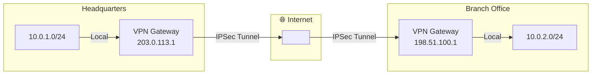

**Use Cases**:
- Connecting branch offices to headquarters
- Merging networks after acquisitions
- Secure communication between data centers
- Hybrid cloud connectivity

### Remote Access VPN

Allows individual users to connect to a private network from remote locations.

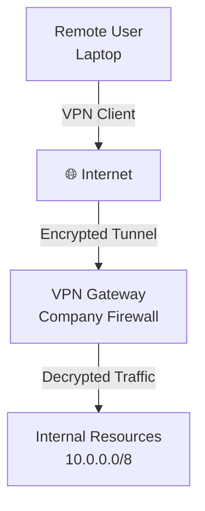

**Use Cases**:
- Remote employees accessing company resources
- Business travelers accessing internal systems
- Secure access from untrusted networks (coffee shops, hotels)

### Hub-and-Spoke VPN

Central hub connects to multiple spoke sites.

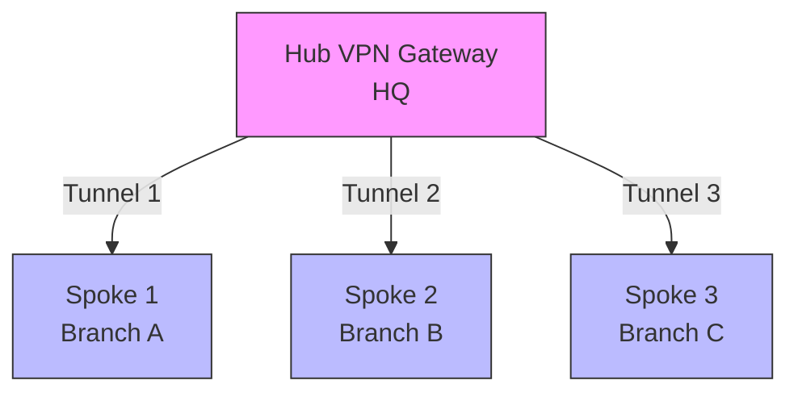

**Pros**: Centralized management, easier to implement
**Cons**: Hub is single point of failure, all traffic goes through hub

### Full Mesh VPN

Every site connects to every other site directly.

```mermaid
graph TD
    A[A]
    B[B]
    C[C]
    D[D]
    
    A --<--> B
    A --<--> C
    A --<--> D
    B --<--> C
    B --<--> D
    C --<--> D
```

**Pros**: Resilient, direct communication between sites
**Cons**: Complex to manage (O(n²) tunnels), high overhead

---

## 🔒 IPSec VPN

**Internet Protocol Security (IPSec)** is a suite of protocols for securing IP communications by authenticating and encrypting each IP packet of a communication session.

### IPSec Components

| Component | Purpose | Port/Protocol |
|-----------|---------|---------------|
| **IKE (Internet Key Exchange)** | Negotiates security associations (SA) | UDP 500 |
| **IKEv2** | Improved version with better NAT traversal | UDP 500, 4500 |
| **AH (Authentication Header)** | Provides authentication and integrity | Protocol 51 |
| **ESP (Encapsulating Security Payload)** | Provides encryption, authentication, integrity | Protocol 50 |
| **IPsec NAT-T** | NAT Traversal for UDP encapsulation | UDP 4500 |

### IPSec Modes

#### Transport Mode

Encrypts only the **payload** (data portion) of the IP packet. Original IP headers remain intact.

```
+----------------+----------------+----------------+
|  IP Header     |    ESP/AH      |     Data       |
|  (Original)    |    Header      |  (Encrypted)   |
+----------------+----------------+----------------+
```

**Use Cases**:
- Host-to-host communication
- When NAT is not involved
- Lower overhead (no additional IP header)

#### Tunnel Mode

Encrypts the **entire original IP packet** and adds a new IP header.

```
+----------------+----------------+----------------+----------------+
|  New IP        |    ESP/AH      |   Original IP  |     Data       |
|  Header        |    Header      |    Packet      |  (Encrypted)   |
+----------------+----------------+----------------+----------------+
```

**Use Cases**:
- Site-to-site VPNs
- Gateway-to-gateway communication
- When traversing NAT devices

### IPSec Protocol Stack

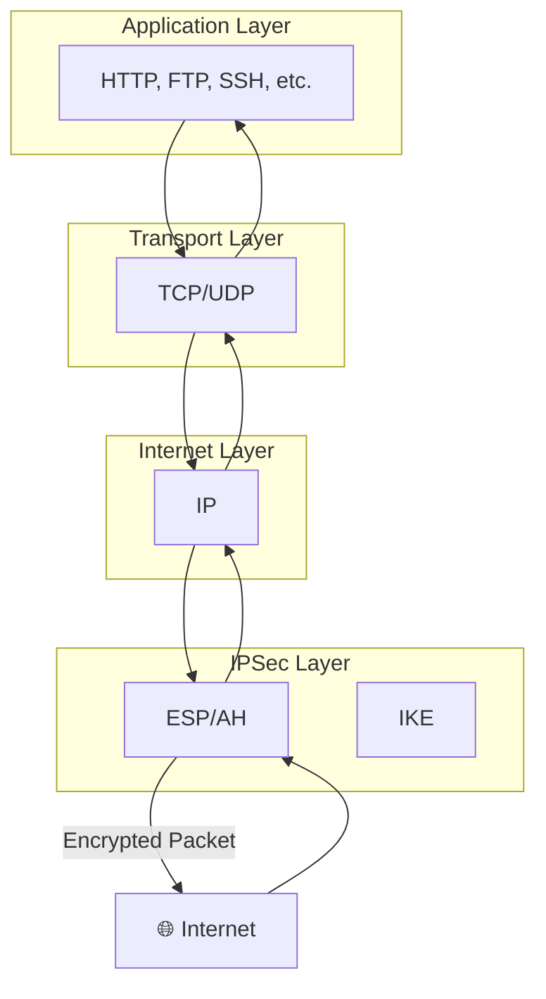

### IPSec Phase 1 and Phase 2

#### Phase 1: IKE SA (Security Association)

Establishes a secure channel for negotiating Phase 2 SAs.

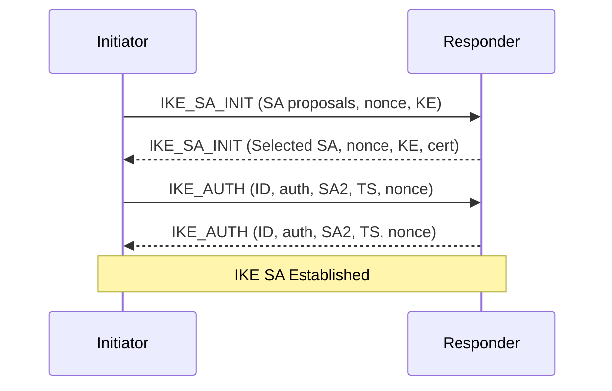

**Purpose**:
- Authenticate peers (pre-shared key, certificates)
- Negotiate IKE security parameters
- Establish encrypted channel for Phase 2

**Main Mode vs Aggressive Mode**:
- **Main Mode**: 6 messages, more secure, identity protection
- **Aggressive Mode**: 3 messages, faster, identity exposed

#### Phase 2: IPsec SA (Child SA)

Establishes SAs for actual data encryption.

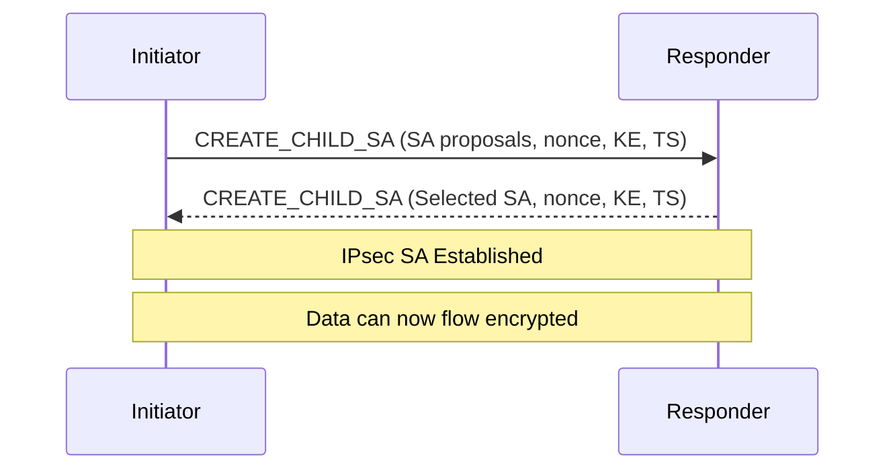

**Purpose**:
- Negotiate IPsec SAs (ESP/AH)
- Establish keys for data encryption
- Define traffic selectors (which traffic to encrypt)

### Security Associations (SA)

An SA is a set of security parameters agreed upon between two IPSec peers:

```
Security Association Database (SAD):
+----------------+----------------+----------------+-----------------+
|  SPI           |  Destination   |  Protocol      |  Algorithm      |
|  (Security     |  IP            |  (ESP/AH)      |  (AES-256-GCM)  |
|  Parameter     |                |                |                 |
|  Index)        |                |                |                 |
+----------------+----------------+----------------+-----------------+

Policy Database (SPD):
+----------------+----------------+----------------+-----------------+
|  Source IP     |  Destination   |  Protocol      |  Action         |
|                |  IP            |                |  (Encrypt/      |
|                |                |                |   Bypass/Drop)  |
+----------------+----------------+----------------+-----------------+
```

### IPSec Configuration Example (StrongSwan)

**Installation (Ubuntu/Debian)**:
```bash
# Install strongSwan
sudo apt update
sudo apt install -y strongswan strongswan-pki libcharon-extra-plugins

# Enable IP forwarding
sudo sysctl -w net.ipv4.ip_forward=1
sudo sysctl -w net.ipv4.conf.all.accept_redirects=0
sudo sysctl -w net.ipv4.conf.all.send_redirects=0
```

**Configuration (`/etc/ipsec.conf`)**:
```ini
config setup
    charondebug="ike 2, knl 2, cfg 2"
    uniqueids=no

conn %default
    ike=aes256-sha256-modp2048!
    esp=aes256-sha256-modp2048!
    keyingtries=0
    ikelifetime=1h
    lifetime=8h
    dpddelay=30
    dpdtimeout=120
    dpdaction=clear

conn site-to-site
    left=203.0.113.1
    leftsubnet=10.0.1.0/24
    right=198.51.100.1
    rightsubnet=10.0.2.0/24
    auto=start
    type=tunnel
    ikev2=insist
```

**Pre-Shared Key (`/etc/ipsec.secrets`)**:
```
203.0.113.1 198.51.100.1 : PSK "your_strong_preshared_key"
```

**Start and Verify**:
```bash
# Start strongSwan
sudo ipsec start

# Check status
sudo ipsec status

# Initiate connection
sudo ipsec up site-to-site

# Monitor connections
sudo ipsec statusall

# Check SA
sudo ip xfrm state
sudo ip xfrm policy
```

### Cloud Provider IPSec VPN

#### AWS Site-to-Site VPN

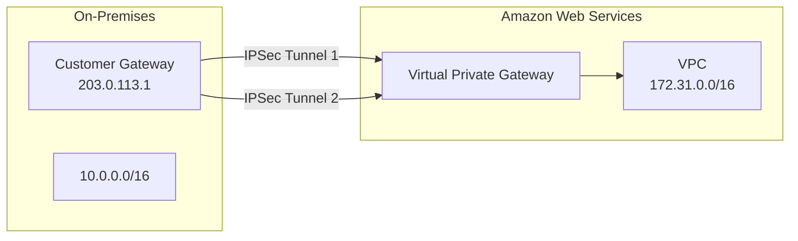

**Key Features**:
- Supports IKEv1 and IKEv2
- Static and dynamic routing (BGP)
- 2 tunnels per connection for redundancy
- Tunnel options: AWS managed or 3rd party

**AWS CLI Setup**:
```bash
# Create Customer Gateway
aws ec2 create-customer-gateway \
    --type ipsec.1 \
    --public-ip 203.0.113.1 \
    --bgp-asn 65000

# Create VPN Connection
aws ec2 create-vpn-connection \
    --customer-gateway-id cgw-12345678 \
    --vpn-gateway-id vgw-87654321 \
    --type ipsec.1 \
    --static-routes-only \
    --static-route 10.0.0.0/16

# Download configuration
aws ec2 describe-vpn-connections --vpn-connection-ids vpn-12345678
```

#### Azure VPN Gateway

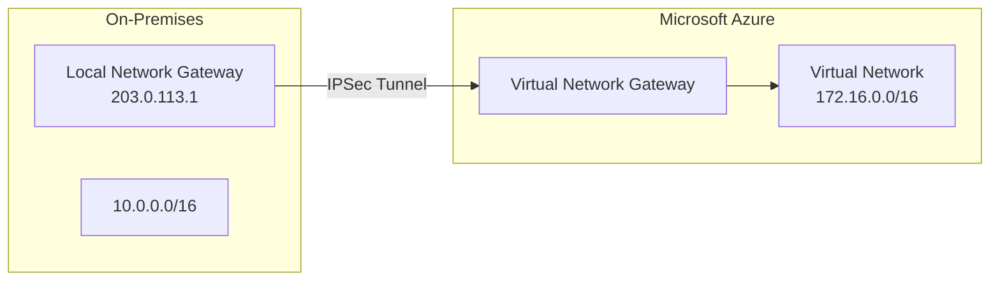

**Gateway Types**:
- **VPN Gateway**: IPSec/IKEv2 site-to-site
- **ExpressRoute Gateway**: Private dedicated connection
- **Basic, Standard, High Performance** SKUs

**Azure CLI Setup**:
```bash
# Create Local Network Gateway
az network local-gateway create \
    --gateway-ip-address 203.0.113.1 \
    --name myLocalGateway \
    --resource-group myResourceGroup \
    --local-address-prefixes 10.0.0.0/16

# Create Virtual Network Gateway
az network vnet-gateway create \
    --name myVPNGateway \
    --resource-group myResourceGroup \
    --vnet myVNet \
    --public-ip-address myPip \
    --gateway-type Vpn \
    --sku Standard \
    --vpn-type RouteBased

# Create Connection
az network vpn-connection create \
    --name myConnection \
    --resource-group myResourceGroup \
    --vnet-gateway1 myVPNGateway \
    --local-gateway2 myLocalGateway \
    --shared-key your_preshared_key
```

#### Google Cloud VPN

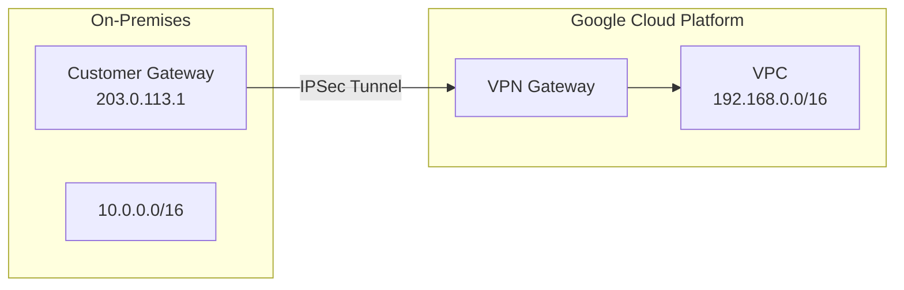

**Features**:
- Classic VPN (route-based) and HA VPN (high availability)
- IKEv1 and IKEv2 support
- Policy-based and route-based routing
- Cloud Router for BGP dynamic routing

**gcloud CLI Setup**:
```bash
# Create VPN Gateway
 gcloud compute vpn-gateways create my-vpn-gw \
     --region us-central1 \
     --network my-vpc

# Create Customer Gateway
gcloud compute external-vpn-gateways create my-ext-gw \
    --description "On-prem VPN gateway" \
    --interfaces 0=203.0.113.1

# Create VPN Tunnel
gcloud compute vpn-tunnels create my-tunnel \
    --region us-central1 \
    --peer-external-gateway my-ext-gw \
    --peer-external-gateway-interface 0 \
    --vpn-gateway my-vpn-gw \
    --shared-secret your_preshared_key \
    --ike-version 2

# Create forwarding rule for tunnel
gcloud compute forwarding-rules create my-tunnel-rule \
    --region us-central1 \
    --ip-protocol ESP \
    --address my-vpn-gw \
    --vpn-tunnel my-tunnel
```

---

## 🚀 WireGuard VPN

**WireGuard** is a modern, high-performance VPN that uses state-of-the-art cryptography. It aims to be simpler, faster, and more secure than IPSec.

### WireGuard Features

| Feature | Description |
|---------|-------------|
| **Protocol** | UDP-based (default port 51820) |
| **Encryption** | ChaCha20, Poly1305 (AEAD) |
| **Key Exchange** | Curve25519 (X25519) |
| **Hashing** | BLAKE2s |
| **Handshake** | Noise Protocol Framework |
| **Roaming** | Automatic IP address changes |
| **NAT Traversal** | Built-in UDP hole punching |

### WireGuard Architecture

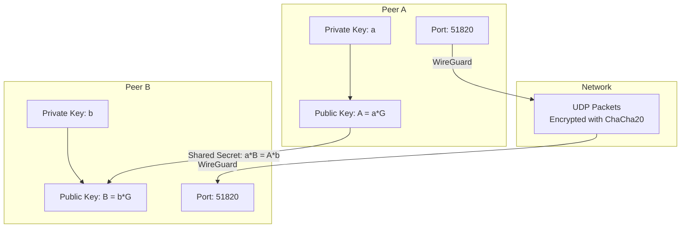

### WireGuard Configuration

Each peer has a configuration file (`/etc/wireguard/wg0.conf`):

```ini
[Interface]
# Local peer configuration
PrivateKey = <local_private_key>
Address = 10.0.0.1/24
ListenPort = 51820

# Optional: Enable NAT traversal
PostUp = iptables -A FORWARD -i %i -j ACCEPT; iptables -t nat -A POSTROUTING -o eth0 -j MASQUERADE
PostDown = iptables -D FORWARD -i %i -j ACCEPT; iptables -t nat -D POSTROUTING -o eth0 -j MASQUERADE

[Peer]
# Remote peer configuration
PublicKey = <remote_public_key>
AllowedIPs = 10.0.0.2/32
Endpoint = 203.0.113.1:51820
PersistentKeepalive = 25
```

### Key Generation

```bash
# Install WireGuard
# Ubuntu/Debian
sudo apt install wireguard resolvconf

# RHEL/CentOS
sudo dnf install wireguard-tools

# Generate private and public keys
umask 077
wg genkey | tee privatekey | wg pubkey > publickey

# View keys
cat privatekey  # Private key
cat publickey   # Public key
```

### Setup WireGuard Server

```bash
# Server configuration (/etc/wireguard/wg0.conf)
cat > /etc/wireguard/wg0.conf << EOF
[Interface]
PrivateKey = <server_private_key>
Address = 10.0.0.1/24
ListenPort = 51820
PostUp = iptables -A FORWARD -i wg0 -j ACCEPT; iptables -t nat -A POSTROUTING -o eth0 -j MASQUERADE
PostDown = iptables -D FORWARD -i wg0 -j ACCEPT; iptables -t nat -D POSTROUTING -o eth0 -j MASQUERADE

[Peer]
PublicKey = <client1_public_key>
AllowedIPs = 10.0.0.2/32

[Peer]
PublicKey = <client2_public_key>
AllowedIPs = 10.0.0.3/32
EOF

# Enable IP forwarding
sudo sysctl -w net.ipv4.ip_forward=1

# Start WireGuard
sudo systemctl enable wg-quick@wg0
sudo systemctl start wg-quick@wg0

# Check status
sudo wg show wg0
```

### Setup WireGuard Client

```bash
# Client configuration (/etc/wireguard/wg0.conf)
cat > /etc/wireguard/wg0.conf << EOF
[Interface]
PrivateKey = <client_private_key>
Address = 10.0.0.2/24
DNS = 8.8.8.8, 8.8.4.4

[Peer]
PublicKey = <server_public_key>
AllowedIPs = 0.0.0.0/0
Endpoint = server.public.ip:51820
PersistentKeepalive = 25
EOF

# Start WireGuard
sudo wg-quick up wg0

# Test connection
ping 10.0.0.1
curl ifconfig.me  # Should show server's IP
```

### WireGuard Advantages

✅ **Simpler Configuration**: Minimal config file (~10 lines vs IPSec's complexity)
✅ **Faster Performance**: Lower latency, higher throughput
✅ **Modern Cryptography**: Uses ChaCha20, Poly1305, Curve25519
✅ **Automatic Roaming**: Seamlessly handles IP changes
✅ **Small Attack Surface**: ~4,000 lines of code vs IPSec's ~400,000+
✅ **Cross-Platform**: Linux, Windows, macOS, iOS, Android, BSD

---

## 🔓 OpenVPN

**OpenVPN** is an open-source SSL/TLS VPN that uses the OpenSSL library for encryption. It's highly configurable and widely supported.

### OpenVPN Modes

| Mode | Description | Port | Protocol |
|------|-------------|------|----------|
| **TLS** | Certificate-based authentication | Any | TCP/UDP |
| **Static Key** | Pre-shared static key | Any | UDP |
| **Password** | Username/password authentication | Any | TCP/UDP |

### OpenVPN Topologies

#### Routing Mode (TUN)

Creates a **virtual IP router** - operates at Layer 3 (IP).

```
+--------+     +--------+     +----------+
| Client |-----| Server |-----| Internet |
|  tun0  |     |  tun0  |     |  eth0    |
|10.8.0.2|     |10.8.0.1|     +----------+
+--------+     +--------+
```

**Use Cases**:
- Remote access VPNs
- Site-to-site with different subnets
- When you need IP-level access

#### Bridging Mode (TAP)

Creates a **virtual Ethernet bridge** - operates at Layer 2 (Ethernet).

```
+--------+     +--------+     +----------+
| Client |-----| Server |-----| Internet |
|  tap0  |     |  tap0  |     |  eth0    |
+--------+     +--------+     +----------+
    |               |
    +----- Bridge ---+
```

**Use Cases**:
- When you need Layer 2 connectivity
- Running non-IP protocols
- Broadcast/multicast support

### OpenVPN Setup

#### PKI Infrastructure

```bash
# Install Easy-RSA for certificate management
sudo apt install easy-rsa

# Set up PKI directory
make-cadir ~/openvpn-ca
cd ~/openvpn-ca

# Configure vars
cat > vars << EOF
set_var EASYRSA_REQ_COUNTRY     "US"
set_var EASYRSA_REQ_PROVINCE    "California"
set_var EASYRSA_REQ_CITY        "San Francisco"
set_var EASYRSA_REQ_ORG         "Example Corp"
set_var EASYRSA_REQ_EMAIL       "admin@example.com"
set_var EASYRSA_REQ_OU          "IT"
set_var EASYRSA_ALGO            "ec"
set_var EASYRSA_DIGEST          "sha512"
EOF

# Initialize PKI
easyrsa init-pki

# Build CA
easyrsa build-ca

# Generate server certificate and key
easyrsa gen-req server nopass
easyrsa sign-req server server

# Generate client certificate and key
easyrsa gen-req client1 nopass
easyrsa sign-req client client1

# Generate Diffie-Hellman parameters
easyrsa gen-dh

# Generate TLS-auth key
openvpn --genkey --secret keys/ta.key
```

#### Server Configuration

**Install OpenVPN**:
```bash
sudo apt install openvpn
```

**Server config (`/etc/openvpn/server.conf`)**:
```ini
port 1194
proto udp
dev tun

# Certificates
ca ca.crt
cert server.crt
key server.key
crl-verify crl.pem

# DH parameters
dh dh.pem

# TLS authentication
tls-auth ta.key 0

# Network
server 10.8.0.0 255.255.255.0
ifconfig-pool-persist ipp.txt

# Routing
push "route 10.0.0.0 255.0.0.0"
push "redirect-gateway def1 bypass-dhcp"

# DNS
push "dhcp-option DNS 8.8.8.8"
push "dhcp-option DNS 8.8.4.4"

# Security
cipher AES-256-GCM
auth SHA512
keysize 256
tls-version-min 1.2
tls-cipher TLS-ECDHE-ECDSA-WITH-AES-256-GCM-SHA384:TLS-ECDHE-RSA-WITH-AES-256-GCM-SHA384

# Performance
comp-lzo no  # Disable compression (VORACLE vulnerability)
user nobody
group nogroup

# Logging
status openvpn-status.log
verb 3
```

**Enable IP Forwarding and NAT**:
```bash
# Enable IP forwarding
sudo sysctl -w net.ipv4.ip_forward=1

# Add NAT rule for VPN traffic
sudo iptables -t nat -A POSTROUTING -s 10.8.0.0/24 -o eth0 -j MASQUERADE

# Save iptables rules
sudo apt install iptables-persistent
sudo netfilter-persistent save
```

**Start OpenVPN Server**:
```bash
sudo systemctl enable openvpn@server
sudo systemctl start openvpn@server
```

#### Client Configuration

**Client config (`client.ovpn`)**:
```ini
client
dev tun
proto udp

remote server.public.ip 1194
resolv-retry infinite
nobind

# Certificates
ca ca.crt
cert client1.crt
key client1.key

# TLS authentication
tls-auth ta.key 1
key-direction 1

# Encryption
cipher AES-256-GCM
auth SHA512
keysize 256

# Logging
verb 3
```

**Connect with client**:
```bash
sudo openvpn --config client.ovpn
```

### OpenVPN over TCP vs UDP

| Feature | UDP | TCP |
|---------|-----|-----|
| **Speed** | Faster | Slower (retransmissions) |
| **Reliability** | Best-effort | Guaranteed delivery |
| **NAT Friendly** | May need NAT-T | Works through NAT |
| **Firewall Friendly** | May be blocked | Rarely blocked |
| **Use Case** | Most scenarios | Firewalled environments |

---

## 🌐 SSL/TLS VPN

SSL/TLS VPNs use the **HTTPS protocol** (port 443) to provide secure remote access. They're often called "clientless" VPNs because users can access them through a web browser without installing VPN client software.

### SSL VPN Types

| Type | Description | Pros | Cons |
|------|-------------|------|------|
| **Portal** | Web-based access to specific applications | No client install, easy to use | Limited to web apps |
| **Tunnel** | Full network access via browser plugin | Full access, no separate client | Requires plugin/extension |
| **Thin Client** | Java/Citrix-based access | Works on restricted systems | Performance overhead |

### How SSL VPN Works

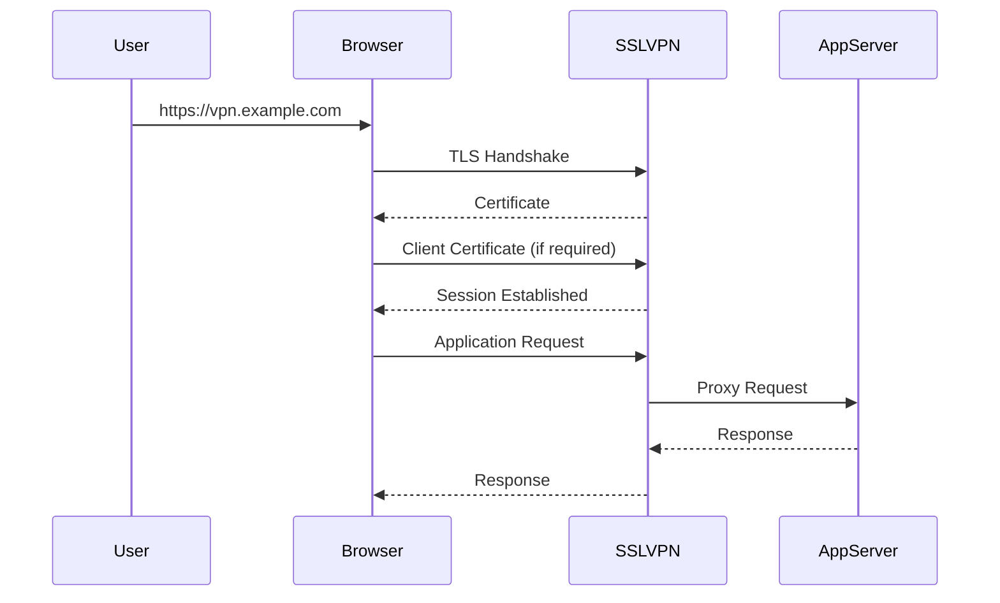

### SSL VPN Solutions

| Solution | Type | Open Source | Key Features |
|----------|------|-------------|--------------|
| **OpenVPN Access Server** | Tunnel | ✅ Yes | Full network access, web portal |
| **SoftEther VPN** | Tunnel/Portal | ✅ Yes | Multi-protocol, NAT traversal |
| **Pulse Connect Secure** | Portal/Tunnel | ❌ No | Enterprise, granular access control |
| **Cisco AnyConnect** | Tunnel | ❌ No | SSL/IPSec, endpoint security |
| **F5 BIG-IP APM** | Portal/Tunnel | ❌ No | Application delivery, SSO |
| **Fortinet FortiGate SSL VPN** | Portal/Tunnel | ❌ No | Integrated security features |

### OpenVPN Access Server Setup

```bash
# Add repository and install
wget -qO - https://as-repository.openvpn.net/as-repo-public.gpg | sudo apt-key add -
sudo echo "deb http://as-repository.openvpn.net/as/debian focal main" > /etc/apt/sources.list.d/openvpn-as.list
sudo apt update
sudo apt install -y openvpn-as

# Initialize
sudo ovpn-init

# Start service
sudo systemctl start openvpn-as
sudo systemctl enable openvpn-as

# Access web interface
# https://server.ip:943/admin
# Default login: openvpn / password
```

### SSL VPN Advantages

✅ **No Client Software**: Works through web browser
✅ **Firewall Friendly**: Uses port 443 (HTTPS)
✅ **Granular Access Control**: Per-application access
✅ **Easy Deployment**: Simple to set up and manage
✅ **Cross-Platform**: Works on any device with a browser

### SSL VPN Limitations

❌ **Performance**: Slower than dedicated VPN protocols
❌ **Limited Protocol Support**: Mainly HTTP/HTTPS applications
❌ **Browser Dependency**: Requires modern browser
❌ **Session-Based**: Not persistent like traditional VPNs

---

## 🔄 VPN Protocol Comparison

### Performance Comparison

| Protocol | Throughput | Latency | CPU Usage | NAT Traversal |
|----------|------------|---------|----------|---------------|
| **IPSec (AES-GCM)** | ⭐⭐⭐⭐ | ⭐⭐⭐⭐ | ⭐⭐⭐ | ✅ Yes |
| **WireGuard** | ⭐⭐⭐⭐⭐ | ⭐⭐⭐⭐⭐ | ⭐⭐ | ✅ Yes |
| **OpenVPN (UDP)** | ⭐⭐⭐⭐ | ⭐⭐⭐⭐ | ⭐⭐⭐⭐ | ✅ Yes (with config) |
| **OpenVPN (TCP)** | ⭐⭐⭐ | ⭐⭐⭐ | ⭐⭐⭐⭐⭐ | ✅ Yes |
| **SSL VPN** | ⭐⭐ | ⭐⭐⭐ | ⭐⭐⭐ | ✅ Yes |
| **L2TP/IPSec** | ⭐⭐⭐ | ⭐⭐⭐ | ⭐⭐⭐⭐ | ✅ Yes |
| **PPTP** | ⭐⭐ | ⭐⭐ | ⭐ | ✅ Yes |
| **SSTP** | ⭐⭐⭐ | ⭐⭐⭐ | ⭐⭐⭐⭐ | ✅ Yes |

### Security Comparison

| Protocol | Encryption | Authentication | Integrity | Key Exchange | Vulnerabilities |
|----------|------------|----------------|----------|--------------|----------------|
| **IPSec** | AES, 3DES | PSK, Certificates | HMAC-SHA | IKEv1/IKEv2 | DOSBleed, IKEv1 flaws |
| **WireGuard** | ChaCha20 | Public Keys | Poly1305 | Noise Protocol | Minimal attack surface |
| **OpenVPN** | AES, Blowfish | Certificates, PSK, Password | HMAC | TLS/DH | VORACLE (if compression enabled) |
| **SSL VPN** | AES (TLS) | Certificates, Password | HMAC (TLS) | TLS | Heartbleed, POODLE (if old TLS) |
| **L2TP/IPSec** | AES | PSK, Certificates | HMAC | IKE | Same as IPSec |
| **PPTP** | MPPE (RC4) | MS-CHAP, EAP | None | MPPE | MS-CHAPv2 vulnerabilities |
| **SSTP** | AES (SSL) | Certificates | HMAC (SSL) | SSL/TLS | Same as SSL/TLS |

### Use Case Recommendations

| Use Case | Recommended Protocol | Why |
|----------|---------------------|-----|
| **Site-to-Site VPN** | IPSec or WireGuard | High performance, proven reliability |
| **Remote Access (High Performance)** | WireGuard | Fast, simple, modern crypto |
| **Remote Access (Compatibility)** | OpenVPN | Widely supported, flexible |
| **Firewalled Environments** | SSL VPN or OpenVPN over TCP | Works through restrictive firewalls |
| **Cloud VPN (AWS)** | IPSec | Native support, BGP routing |
| **Cloud VPN (Azure)** | IPSec | Native support, ExpressRoute integration |
| **Cloud VPN (GCP)** | IPSec | Native support, Cloud Router |
| **Mobile Devices** | WireGuard or IPSec | Native support on iOS/Android |
| **IoT Devices** | WireGuard | Low overhead, simple config |
| **Legacy Systems** | OpenVPN | Broad compatibility |

---

## 🛡️ VPN Security Best Practices

### General Security

✅ **Use Strong Encryption**:
- AES-256-GCM or ChaCha20-Poly1305 (for WireGuard)
- Avoid weak algorithms: DES, 3DES, RC4, Blowfish

✅ **Use Strong Authentication**:
- Certificates (X.509) for server authentication
- Strong pre-shared keys (256+ bits) if using PSK
- Multi-factor authentication for user access

✅ **Use Perfect Forward Secrecy (PFS)**:
- IKEv2: Use DH groups 14-18 (ECDH)
- OpenVPN: Enable `tls-crypt` or `tls-auth`
- WireGuard: Built-in (Ephemeral keys via Noise Protocol)

✅ **Keep Software Updated**:
- Regularly update VPN software
- Patch known vulnerabilities promptly
- Monitor for security advisories

✅ **Use Strong Key Sizes**:
- RSA: 2048+ bits
- ECC: 256+ bits (P-256, Curve25519)
- DH: 2048+ bits (Group 14+)

### Network Security

✅ **Restrict Access**:
- Use firewall rules to limit VPN access to specific IPs
- Implement geo-blocking if applicable
- Rate limit connection attempts

✅ **Network Segmentation**:
- Place VPN servers in a DMZ
- Use internal firewalls to segment VPN traffic
- Apply least-privilege access to internal resources

✅ **Monitor and Log**:
- Log all VPN connections and disconnections
- Monitor for unusual activity patterns
- Set up alerts for failed authentication attempts

✅ **Use Split Tunneling Carefully**:
- Full tunnel (all traffic through VPN) is more secure
- Split tunnel only when necessary
- Ensure split tunnel traffic is still protected

### Configuration Security

✅ **Disable Weak Protocols**:
```bash
# IPSec: Disable weak protocols
# In strongSwan
charon {
    ike = aes256-sha256-modp2048,aes256gcm16-sha256-modp2048!
    esp = aes256-sha256-modp2048,aes256gcm16-sha256-modp2048!
    # Disable IKEv1
    ikev1 = no
}

# OpenVPN: Disable weak ciphers
cipher AES-256-GCM
auth SHA512
tls-cipher TLS-ECDHE-ECDSA-WITH-AES-256-GCM-SHA384:TLS-ECDHE-RSA-WITH-AES-256-GCM-SHA384
```

✅ **Use Strong Password Policies**:
- Minimum 12 characters
- Complexity requirements
- Regular password rotation
- Lockout after failed attempts

✅ **Certificate Management**:
- Short certificate lifetimes (1 year or less)
- Regular certificate rotation
- Revoke compromised certificates immediately
- Use CRL (Certificate Revocation List) or OCSP

### User Security

✅ **Educate Users**:
- Recognize phishing attempts
- Use strong, unique passwords
- Keep devices updated
- Don't share credentials

✅ **Endpoint Security**:
- Require up-to-date antivirus
- Check for jailbroken/rooted devices
- Verify endpoint compliance before allowing access
- Use endpoint detection and response (EDR)

✅ **Session Management**:
- Implement session timeouts
- Require re-authentication for sensitive operations
- Allow users to kill their own sessions
- Automatically disconnect idle sessions

---

## 📊 VPN Troubleshooting

### Common Issues and Solutions

| Issue | Symptom | Possible Cause | Solution |
|-------|---------|----------------|----------|
| **Connection Fails** | Can't establish connection | Firewall blocking | Check firewall rules, open required ports |
| **Authentication Fails** | Auth error messages | Wrong credentials | Verify username/password, certificates |
| **No Traffic** | Connected but no data flows | Routing issue | Check routes, NAT, IP forwarding |
| **Slow Performance** | High latency, low throughput | Encryption overhead | Use hardware acceleration, faster cipher |
| **Disconnections** | Connection drops frequently | NAT timeout | Enable keepalive, adjust timeout |
| **DNS Issues** | Can't resolve hostnames | DNS misconfiguration | Push correct DNS servers to clients |
| **MTU Issues** | Large packets fail | MTU too large | Reduce MTU, enable MSS clamping |

### IPSec Troubleshooting

```bash
# Check IKE/ESP status
sudo ipsec status
sudo ipsec statusall

# Check security associations
sudo ip xfrm state
sudo ip xfrm policy

# Check IKE daemon logs
sudo journalctl -u strongswan -f

# Check kernel logs
sudo dmesg | grep -i ipsec

# Check network connectivity
ping <peer-ip>
traceroute <peer-ip>

# Check firewall
sudo iptables -L -v -n
sudo ufw status
```

**Common IPSec Errors**:
- `NO_PROPOSAL_CHOOSEN`: No matching SA proposal
- `INVALID_ID_INFORMATION`: Authentication failed
- `AUTHENTICATION_FAILED`: Wrong PSK or certificate
- `TS_UNACCEPTABLE`: Traffic selector mismatch

### WireGuard Troubleshooting

```bash
# Check interface status
sudo wg show wg0

# Check interface details
sudo wg show all dump

# Check network interface
ip link show wg0
ip addr show wg0

# Check routing
ip route

# Check firewall
sudo iptables -L -v -n

# Check for handshake issues
sudo wg show wg0 | grep -i handshake

# Enable verbose logging
sudo wg-quick down wg0
sudo wg-quick up wg0 --verbose
```

**Common WireGuard Issues**:
- **No handshake**: Check firewall, NAT, endpoint IP
- **Handshake did not complete**: Network connectivity issues
- **Invalid key**: Wrong public/private key
- **MTU issues**: Set MTU lower (e.g., 1420)

### OpenVPN Troubleshooting

```bash
# Check service status
sudo systemctl status openvpn@server

# Check logs
sudo journalctl -u openvpn@server -f

# Check configuration syntax
sudo openvpn --config /etc/openvpn/server.conf --test

# Check client connection
sudo tail -f /var/log/syslog | grep openvpn

# Check client logs
cat /var/log/openvpn.log
```

**Common OpenVPN Errors**:
- `TLS Error: TLS key negotiation failed`: Certificate or key mismatch
- `VERIFY ERROR`: Certificate verification failed
- `ROUTE: route addition failed`: Routing conflict
- `Authenticate/Decrypt packet error`: Encryption mismatch

### Network Troubleshooting

```bash
# Check connectivity
ping <vpn-server-ip>
traceroute <vpn-server-ip>
mtr <vpn-server-ip>

# Check if port is open
nc -zv <vpn-server-ip> 51820  # WireGuard
nc -zv <vpn-server-ip> 500    # IKE
nc -zv <vpn-server-ip> 4500   # NAT-T
nc -zv <vpn-server-ip> 1194   # OpenVPN

# Check if VPN server is listening
sudo ss -tulnp | grep -E '51820|500|4500|1194'
sudo netstat -tulnp | grep -E '51820|500|4500|1194'

# Check NAT
sudo iptables -t nat -L -v -n

# Check IP forwarding
cat /proc/sys/net/ipv4/ip_forward
```

---

## 📈 Performance Optimization

### Hardware Acceleration

| Technology | Description | Supported Protocols | Platform |
|------------|-------------|---------------------|----------|
| **AES-NI** | Intel/AMD CPU instruction set | AES-GCM, AES-CBC | x86, x86_64 |
| **AVX/AVX2** | Vector instructions for crypto | ChaCha20, Poly1305 | x86, x86_64 |
| **Cryptographic Accelerators** | Dedicated hardware | IPSec, SSL/TLS | Specialized NICs |
| **DPDK** | Data Plane Development Kit | Custom implementations | x86, ARM |
| **QuickAssist** | Intel QAT | IPSec, SSL/TLS | Intel CPUs/NICs |

**Enable AES-NI (Linux)**:
```bash
# Check if AES-NI is available
cat /proc/cpuinfo | grep aes

# Load AES-NI module (usually built into kernel)
modprobe aesni_intel

# Verify it's being used
openssl speed -evp aes-256-gcm
```

### Protocol-Specific Optimizations

#### IPSec Optimization

```ini
# Use hardware-accelerated algorithms
charon {
    ike = aes256gcm16-sha256-modp2048!
    esp = aes256gcm16-sha256-modp2048!
    
    # Enable hardware acceleration
    plugins {
        aesni {
            enabled = yes
        }
        rdrand {
            enabled = yes
        }
    }
    
    # Parallel processing
    threads = 16
    
    # Rekeying
    ikelifetime = 1h
    lifetime = 8h
    rekeymargin = 9m
    rekeyfuzz = 100%
}
```

#### WireGuard Optimization

```bash
# Increase kernel parameters
sudo sysctl -w net.core.wmem_max=16777216
sudo sysctl -w net.core.rmem_max=16777216

# Use modern cipher (ChaCha20 is faster on most CPUs)
# WireGuard automatically uses ChaCha20-Poly1305

# Enable multiqueue for high traffic
sudo ethtool -L wg0 combined 4

# Use kernel bypass with DPDK for extreme performance
# (Requires custom implementation)
```

#### OpenVPN Optimization

```ini
# Use faster cipher
cipher AES-256-GCM
auth SHA1  # SHA1 is faster than SHA512 for integrity

# Disable compression (security risk and CPU overhead)
comp-lzo no

# Enable multi-threaded processing
tun-mtu 1500
mssfix 1450

# Use UDP for better performance
proto udp

# Enable keepalive
keepalive 10 120

# Parallel processing (OpenVPN 2.4+)
multithread
```

### Network Optimizations

✅ **MTU Tuning**:
```bash
# Test optimal MTU
ping <server-ip> -M do -s 1472  # Test 1500 byte MTU
ping <server-ip> -M do -s 1428  # Test 1460 byte MTU (for WireGuard)

# Set MTU in config
# WireGuard: MTU = 1420 (default)
# OpenVPN: tun-mtu 1400
# IPSec: Not directly configurable, but can adjust interface MTU
```

✅ **BGP for Dynamic Routing**:
```bash
# Example: StrongSwan with BGP
charon {
    plugins {
        eap-radius {
            # ...
        }
        vici {
            # ...
        }
    }
}

# Use BIRD or FRR for BGP routing
# This allows dynamic route exchange with cloud providers
```

✅ **Load Balancing**:
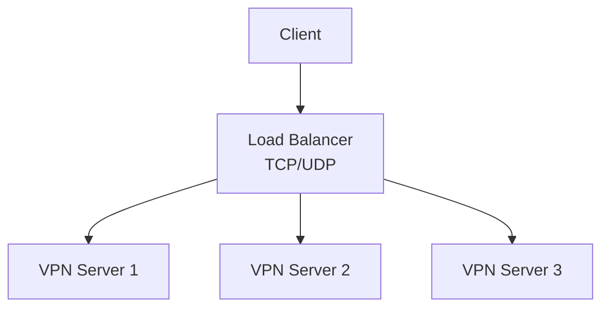

**Load Balancing Options**:
- **HAProxy**: For TCP-based VPNs (OpenVPN TCP, SSTP)
- **Keepalived**: For VRRP-based failover
- **AWS ELB**: For cloud-based VPNs
- **Nginx Stream**: For TCP/UDP load balancing

### Monitoring and Metrics

✅ **Monitor VPN Performance**:
```bash
# Check throughput
iftop -i wg0
iftop -i tun0

# Check connections
ss -s
netstat -s

# Check bandwidth
nload wg0
iptraf-ng

# Check CPU usage
htop
mpstat -P ALL 1
```

✅ **Set Up Monitoring**:
- **Prometheus + Grafana**: For metrics visualization
- **Zabbix**: For monitoring and alerting
- **LibreNMS**: For network monitoring
- **ELK Stack**: For log analysis

---

## 🔮 Future of VPNs

### Emerging VPN Technologies

| Technology | Description | Status |
|------------|-------------|--------|
| **WireGuard** | Next-gen VPN protocol | ✅ Production-ready |
| **OpenZiti** | Zero Trust networking | ✅ Available |
| **Nebula** | Certificate-based mesh VPN | ✅ Available |
| **Tailscale** | WireGuard-based mesh VPN | ✅ Available |
| **Cloudflare WARP** | Consumer-focused VPN | ✅ Available |
| **Zero Trust Network Access (ZTNA)** | BeyondCorp model | 🚀 Growing |
| **Quantum-Safe VPN** | Post-quantum cryptography | 🔬 Research |

### Zero Trust Networking

Traditional VPNs provide **network-level access** - once authenticated, users have broad access to internal resources. **Zero Trust** changes this model:

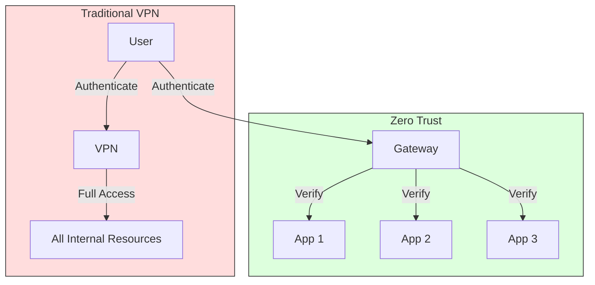

**Zero Trust Principles**:
- **Never trust, always verify**: Every access request is verified
- **Least privilege**: Grant only the minimum access needed
- **Micro-segmentation**: Divide network into small segments
- **Continuous authentication**: Verify identity continuously, not just at login

**Zero Trust Solutions**:
- **Cloudflare Access**: Identity-aware proxy
- **Tailscale**: WireGuard-based with ACLs
- **OpenZiti**: Identity-based networking
- **BeyondCorp**: Google's Zero Trust model

### Post-Quantum VPN

Quantum computers threaten current cryptographic algorithms. **Post-quantum cryptography** aims to develop algorithms that are secure against quantum attacks.

| Algorithm | Type | Security Level | Standardization |
|-----------|------|----------------|-----------------|
| **Kyber** | Key Encapsulation | NIST PQC Standard | ✅ Selected |
| **Dilithium** | Digital Signature | NIST PQC Standard | ✅ Selected |
| **SPHINCS+** | Digital Signature | NIST PQC Standard | ✅ Selected |
| **NTRU** | Encryption/Signature | Commercial | In progress |
| **Lattice-based** | Various | High | Research |

**Post-Quantum VPN Solutions**:
- **OpenQuantumSafe**: OpenVPN with post-quantum crypto
- **BoringTun**: WireGuard with post-quantum support (experimental)
- **Cloudflare Post-Quantum TLS**: In testing

---

## 🎯 Quick Start Guide

### Choose the Right VPN Protocol

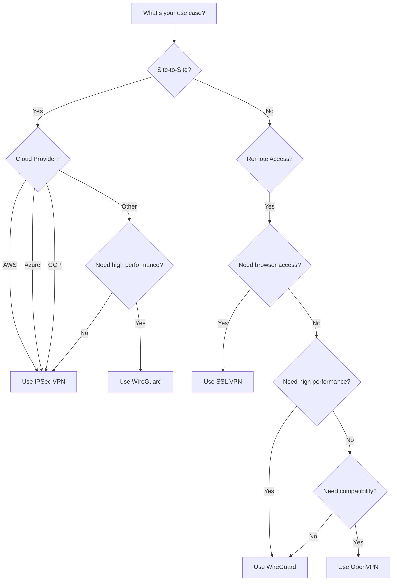

### Quick Setup Commands

#### WireGuard (Fastest Setup)
```bash
# Server
sudo apt install wireguard
wg genkey | tee /etc/wireguard/privatekey | wg pubkey > /etc/wireguard/publickey
cat > /etc/wireguard/wg0.conf << EOF
[Interface]
PrivateKey = $(cat /etc/wireguard/privatekey)
Address = 10.0.0.1/24
ListenPort = 51820
PostUp = iptables -A FORWARD -i %i -j ACCEPT; iptables -t nat -A POSTROUTING -o eth0 -j MASQUERADE
PostDown = iptables -D FORWARD -i %i -j ACCEPT; iptables -t nat -D POSTROUTING -o eth0 -j MASQUERADE
[Peer]
PublicKey = <client-public-key>
AllowedIPs = 10.0.0.2/32
EOF
sudo wg-quick up wg0

# Client
cat > /etc/wireguard/wg0.conf << EOF
[Interface]
PrivateKey = <client-private-key>
Address = 10.0.0.2/24
DNS = 8.8.8.8
[Peer]
PublicKey = <server-public-key>
Endpoint = <server-ip>:51820
AllowedIPs = 0.0.0.0/0
PersistentKeepalive = 25
EOF
sudo wg-quick up wg0
```

#### OpenVPN (Most Compatible)
```bash
# Server
sudo apt install openvpn easy-rsa
make-cadir ~/openvpn-ca && cd ~/openvpn-ca
easyrsa init-pki
easyrsa build-ca
EASYRSA_ALGO=ec easyrsa gen-req server nopass
EASYRSA_ALGO=ec easyrsa sign-req server server
EASYRSA_ALGO=ec easyrsa gen-dh
openvpn --genkey --secret keys/ta.key
cat > /etc/openvpn/server.conf << EOF
port 1194
proto udp
dev tun
ca ca.crt
cert server.crt
key server.key
dh dh.pem
tls-auth ta.key 0
cipher AES-256-GCM
auth SHA512
server 10.8.0.0 255.255.255.0
push "redirect-gateway def1"
push "dhcp-option DNS 8.8.8.8"
user nobody
group nogroup
keepalive 10 120
EOF
sudo systemctl start openvpn@server

# Client
cat > client.ovpn << EOF
client
dev tun
proto udp
remote <server-ip> 1194
resolv-retry infinite
nobind
ca ca.crt
cert client.crt
key client.key
tls-auth ta.key 1
cipher AES-256-GCM
auth SHA512
EOF
openvpn --config client.ovpn
```

---

## 📚 Further Reading

### Official Documentation

- [StrongSwan Documentation](https://docs.strongswan.org/) - IPSec VPN
- [WireGuard Documentation](https://www.wireguard.com/quickstart/) - WireGuard VPN
- [OpenVPN Documentation](https://openvpn.net/community-resources/) - OpenVPN
- [AWS Site-to-Site VPN](https://docs.aws.amazon.com/vpn/latest/s2svpn/what-is-vpn.html) - AWS VPN
- [Azure VPN Gateway](https://docs.microsoft.com/en-us/azure/vpn-gateway/) - Azure VPN
- [Google Cloud VPN](https://cloud.google.com/vpn/docs) - GCP VPN

### Books

- **"VPN Complete Guide"** by O'Reilly Media
- **"Network Security: Private Communication in a Public World"** by Charlie Kaufman, Radia Perlman, Mike Speciner
- **"Cryptography I"** by Nigel Smart (for cryptographic foundations)
- **"The Book of WireGuard"** (Community documentation)

### RFCs and Standards

| RFC | Title | Relevance |
|-----|-------|-----------|
| [RFC 2401](https://tools.ietf.org/html/rfc2401) | Security Architecture for the Internet Protocol | IPSec architecture |
| [RFC 2402](https://tools.ietf.org/html/rfc2402) | IP Authentication Header | AH protocol |
| [RFC 2406](https://tools.ietf.org/html/rfc2406) | IP Encapsulating Security Payload (ESP) | ESP protocol |
| [RFC 2409](https://tools.ietf.org/html/rfc2409) | The Internet Key Exchange (IKE) | IKEv1 |
| [RFC 4301](https://tools.ietf.org/html/rfc4301) | Security Architecture for the Internet Protocol | IPSec updated |
| [RFC 4303](https://tools.ietf.org/html/rfc4303) | IP Encapsulating Security Payload (ESP) | ESP updated |
| [RFC 5996](https://tools.ietf.org/html/rfc5996) | Internet Key Exchange Protocol Version 2 (IKEv2) | IKEv2 |
| [RFC 7519](https://tools.ietf.org/html/rfc7519) | JSON Web Token (JWT) | Modern auth |

### Communities and Forums

- [StrongSwan User Mailing List](https://lists.strongswan.org/mailman/listinfo/users)
- [WireGuard Mailing List](https://lists.zx2c4.com/mailman/listinfo/wireguard)
- [OpenVPN Community](https://community.openvpn.net/)
- [Server Fault - VPN Questions](https://serverfault.com/questions/tagged/vpn)
- [Stack Overflow - VPN Questions](https://stackoverflow.com/questions/tagged/vpn)
- [r/VPN on Reddit](https://www.reddit.com/r/VPN/)

### Courses

- [Practical Networking - VPNs](https://www.udemy.com/course/practical-networking/) - Udemy
- [VPN Mastery](https://www.udemy.com/course/vpn-mastery/) - Udemy
- [Network Security Specialization](https://www.coursera.org/specializations/network-security) - Coursera
- [Cybrary - VPN Fundamentals](https://www.cybrary.it/course/vpn/) - Cybrary

---

## 📝 Summary

VPNs are essential for secure communication over untrusted networks. The choice of VPN protocol depends on your specific use case:

| Need | Best Choice |
|------|-------------|
| **High performance site-to-site** | WireGuard |
| **Compatibility with existing infrastructure** | IPSec |
| **Browser-based access** | SSL VPN |
| **Cloud provider integration** | IPSec (native) |
| **Mobile devices** | WireGuard or IPSec |
| **Firewalled environments** | SSL VPN or OpenVPN over TCP |

**Key Takeaways**:
1. **WireGuard** is the future - simple, fast, and secure
2. **IPSec** is the standard for site-to-site and cloud VPNs
3. **OpenVPN** offers maximum flexibility and compatibility
4. **SSL VPN** provides easy web-based access
5. Always follow security best practices regardless of protocol
6. Monitor and maintain your VPN infrastructure regularly

**Remember**: The security of your VPN is only as strong as its weakest link - configuration, keys, certificates, and user practices all matter.
